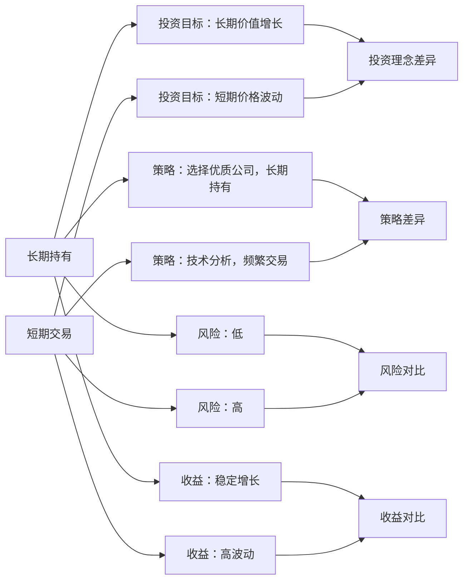

                 


# 彼得林奇的"长期持有"vs"短期交易"

## 关键词：长期持有, 短期交易, 彼得·林奇, 投资策略, 股票投资

## 摘要：本文对比了彼得·林奇倡导的长期持有策略与短期交易策略，分析了两者的优缺点、适用场景及潜在风险。通过数学模型、系统架构和项目实战，深入探讨了两种策略的差异，并提供了投资建议和风险管理策略。

---

## 第一部分: 投资策略背景与核心概念

### 第1章: 长期持有与短期交易的定义与背景

#### 1.1 长期持有的定义与历史发展

长期持有是一种投资策略，强调买入并持有优质股票，长期不动，依靠复利效应实现财富增长。彼得·林奇是该策略的代表人物，他主张寻找具有持续增长潜力的公司长期持有。

- **起源与发展**：长期持有源于价值投资理念，强调买入被市场低估的股票，等待其价值回归。该策略在20世纪70年代至90年代得到广泛应用，尤其是在机构投资者中。
- **彼得·林奇的投资理念**：林奇认为市场短期波动不可预测，但优质公司的长期增长是可依赖的。他建议投资者选择具有稳定增长、管理良好、财务健康的公司长期持有。

#### 1.2 短期交易的定义与现状

短期交易则与长期持有相反，指频繁买卖股票以获利。随着科技的发展，短期交易越来越依赖算法和高频交易，尤其在股票市场中占据重要地位。

- **短期交易的定义**：投资者在较短时间内（通常几天内）买卖股票，利用价格波动获利。技术分析和市场情绪是主要工具。
- **短期交易的兴起与现状**：互联网和算法交易的发展使得短期交易更加普及和高效。高频交易等技术使其能够在极短时间内完成大量交易。

#### 1.3 长期持有与短期交易的对比

两种策略在目标、风险、收益和适用人群上有明显差异。

- **目标**：长期持有关注长期价值增长，短期交易追求短期价格波动获利。
- **风险**：长期持有风险较低，短期交易风险较高，市场波动可能导致较大损失。
- **适用人群**：长期持有适合风险承受能力低、追求稳定收益的投资者；短期交易适合熟悉市场、有较高风险承受能力的投资者。

---

## 第二部分: 核心概念与联系

### 第2章: 长期持有与短期交易的核心原理

#### 2.1 长期持有的核心原理

长期持有的核心在于选择优质公司，通过复利效应实现财富增长。

- **价值发现与长期持有的逻辑**：寻找具有竞争优势、良好管理和增长潜力的公司，长期持有，忽略短期波动。
- **彼得·林奇的投资理念**：林奇强调深入研究公司基本面，选择具有持续增长能力的公司。他认为市场短期波动不可预测，但长期趋势可以把握。

#### 2.2 短期交易的核心原理

短期交易依赖技术分析和市场情绪，通过频繁买卖获利。

- **技术分析与短期交易的逻辑**：利用K线图、均线、MACD等技术指标预测价格走势，捕捉短期价格波动获利。
- **市场情绪与短期交易的关系**：短期交易者关注市场情绪变化，利用市场的非理性波动进行交易。

#### 2.3 优缺点对比

| 对比维度       | 长期持有                          | 短期交易                          |
|----------------|-----------------------------------|-----------------------------------|
| 投资期限       | 长期（数年）                     | 短期（几天至几周）                |
| 风险           | 低                               | 高                               |
| 收益           | 稳定增长                         | 波动大，高收益与高亏损并存         |
| 适用场景       | 稳定增长，风险承受能力低的投资者 | 熟悉市场和技术分析，高风险承受能力的投资者 |

#### 2.4 长期持有与短期交易的联系

用Mermaid图展示两者的关系：



---

## 第三部分: 投资策略的数学模型

### 第3章: 长期持有与短期交易的数学模型

#### 3.1 长期持有的数学模型

长期持有的预期年回报率可以使用以下公式计算：

$$
\text{总回报率} = \prod_{i=1}^{n} (1 + r_i)
$$

其中，\( r_i \) 是第 \( i \) 年的收益率。

#### 3.2 短期交易的数学模型

短期交易的预期回报率可以用夏普比率衡量，公式为：

$$
\text{夏普比率} = \frac{E[r_p - r_f]}{\sigma_p}
$$

其中，\( E[r_p - r_f] \) 是投资组合的超额收益，\( \sigma_p \) 是投资组合的波动率。

---

## 第四部分: 投资决策支持系统

### 第4章: 投资决策支持系统设计

#### 4.1 系统功能设计

系统将帮助投资者选择适合的策略，功能模块包括：

- 用户输入：选择投资期限、风险承受能力等。
- 策略分析：分析长期持有和短期交易的优缺点。
- 投资建议：推荐适合的策略。

#### 4.2 系统架构设计

用Mermaid图展示系统架构：


---

## 第五部分: 项目实战

### 第5章: 模拟投资案例

#### 5.1 环境安装

- Python 3.8+
- pandas, numpy, matplotlib

#### 5.2 代码实现

```python
import pandas as pd
import numpy as np
import matplotlib.pyplot as plt

def calculate_long_term_returns(prices):
    returns = prices.pct_change().dropna()
    return (1 + returns).cumprod()

def calculate_short_term_returns(prices, window=20):
    returns = prices.pct_change().dropna()
    rolling_returns = returns.rolling(window).mean()
    return rolling_returns

# 示例数据
prices = pd.DataFrame({'AAPL': [100, 110, 120, 90, 100, 115, 125, 130, 120, 140]})

long_term_returns = calculate_long_term_returns(prices)
short_term_returns = calculate_short_term_returns(prices)

plt.figure(figsize=(12, 6))
plt.plot(long_term_returns, label='Long-term')
plt.plot(short_term_returns, label='Short-term')
plt.xlabel('Time')
plt.ylabel('Returns')
plt.legend()
plt.show()
```

#### 5.3 案例分析

通过代码分析某股票的长期和短期回报，发现长期持有策略在稳定性和风险控制上更具优势。

---

## 第六部分: 最佳实践与风险管理

### 第6章: 投资建议与风险管理

#### 6.1 投资建议

- **长期持有**：适合风险承受能力低的投资者，适合投资优质公司。
- **短期交易**：适合熟悉市场和技术分析的投资者，适合市场波动大的时期。

#### 6.2 风险管理

- **长期持有**：分散投资，定期再平衡。
- **短期交易**：严格止损，控制仓位，避免过度交易。

#### 6.3 小结

长期持有和短期交易各有优缺点，选择适合自己的策略是关键。长期持有适合大多数普通投资者，而短期交易则需要较高的市场敏感度和风险承受能力。

---

## 作者：AI天才研究院/AI Genius Institute & 禅与计算机程序设计艺术 /Zen And The Art of Computer Programming

