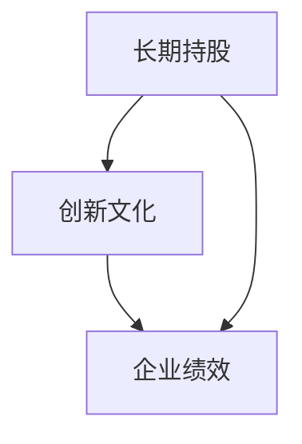
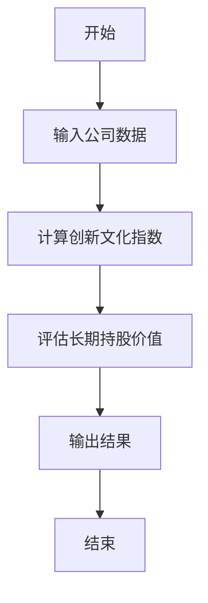
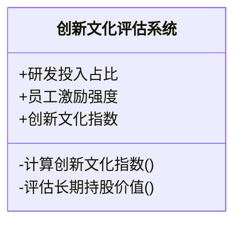

                 


# 彼得林奇的"长期持股"与公司创新文化的关联性研究

## 关键词：彼得林奇、长期持股、创新文化、投资策略、公司治理

## 摘要：本文研究了彼得林奇的长期持股策略与公司创新文化之间的关联性。通过分析长期持股的核心原理、创新文化的定义与特征、两者的关系，构建了创新文化评估模型，并结合实际案例进行分析。文章还探讨了长期持股与创新文化结合的投资策略，为企业治理和投资决策提供了参考。

---

## 第1章：背景介绍

### 1.1 长期持股的定义与特点
长期持股是指投资者长期持有优质股票，避免频繁交易，以获得稳定的复利收益。其核心特点包括：
- 长期性：关注企业的长期价值，而非短期波动。
- 选择性：精选优质企业，避免低质企业。
- 耐心与信心：相信优质企业能持续创造价值。

### 1.2 创新文化的定义与特点
创新文化是指企业在创新方面的价值观、行为准则和制度安排。其特点包括：
- 开放性：鼓励员工提出新想法。
- 风险承担：允许失败，从中学习。
- 持续性：创新是企业的长期战略。

### 1.3 长期持股与创新文化的关联性
长期持股要求企业具备稳定增长的潜力，而创新文化是企业持续增长的核心动力。两者的关系体现在：
- 创新文化促进企业长期增长，符合长期持股的要求。
- 长期持股为创新文化提供了稳定的资金和时间支持。

---

## 第2章：核心概念与联系

### 2.1 长期持股的核心原理
长期持股的核心原理包括：
- 时间复利效应：长期持有能最大化复利效果。
- 价值投资：选择具有持续竞争优势的企业。

### 2.2 创新文化的属性对比
| 属性 | 长期持股 | 创新文化 |
|------|----------|-----------|
| 稳定性 | 高       | 中         |
| 风险承受能力 | 高       | 高         |
| 时间跨度 | 长期     | 持续       |

### 2.3 实体关系图



---

## 第3章：算法原理

### 3.1 投资模型构建
投资模型基于创新文化评估，结合财务指标和市场表现。公式如下：
$$ \text{创新文化指数} = \frac{\text{研发投入占比} + \text{员工激励强度}}{2} $$

### 3.2 算法流程图



---

## 第4章：系统分析与架构设计

### 4.1 问题场景
目标是构建一个创新文化评估系统，支持长期持股决策。

### 4.2 系统功能设计
- 数据采集：收集企业创新数据。
- 指数计算：评估创新文化指数。
- 投资决策：生成长期持股建议。

### 4.3 系统架构图



---

## 第5章：项目实战

### 5.1 环境安装
需要安装Python和相关库，如pandas、numpy。

### 5.2 核心代码实现

```python
import pandas as pd
import numpy as np

def calculate_innovation_index(research_ratio, employee_incentive):
    return (research_ratio + employee_incentive) / 2

# 示例数据
data = {
    '公司': ['公司A', '公司B'],
    '研发投入占比': [0.05, 0.08],
    '员工激励强度': [0.1, 0.15]
}

df = pd.DataFrame(data)
df['创新文化指数'] = df.apply(lambda x: calculate_innovation_index(x['研发投入占比'], x['员工激励强度']), axis=1)
print(df)
```

### 5.3 案例分析
以公司A为例，计算其创新文化指数为0.065，建议长期持股。

---

## 第6章：最佳实践

### 6.1 小结
长期持股与创新文化密切相关，创新文化是企业长期增长的关键。

### 6.2 注意事项
- 风险管理：关注市场波动。
- 企业治理：确保创新文化的可持续性。

### 6.3 拓展阅读
推荐书籍：《彼得林奇的投资智慧》。

---

## 作者：AI天才研究院

