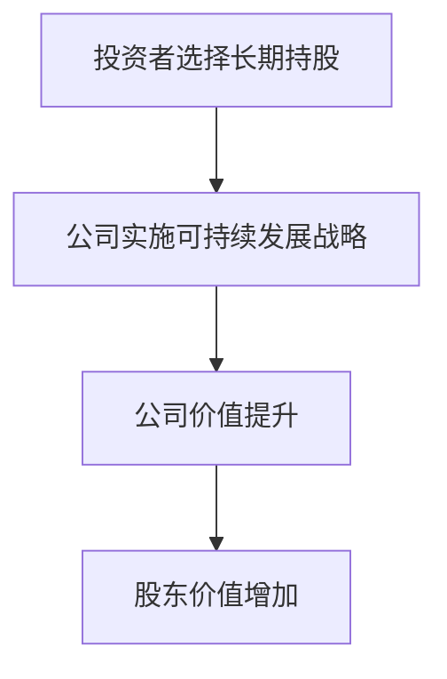
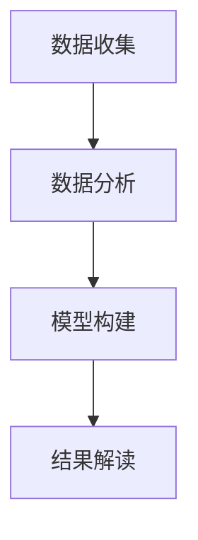
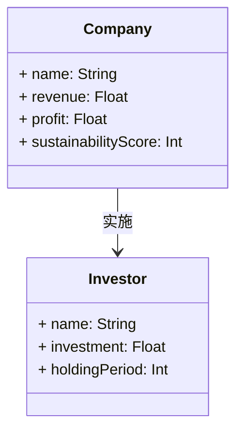
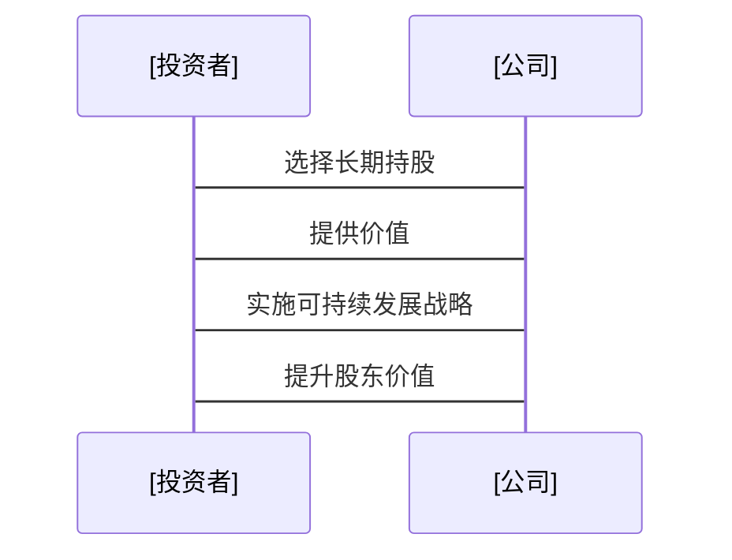

                 


# 彼得林奇的"长期持股"与公司可持续发展战略的关联性分析

> 关键词：长期持股, 可持续发展战略, 彼得·林奇, 投资策略, 企业价值

> 摘要：本文从彼得·林奇的长期持股策略出发，结合公司可持续发展战略的核心要素，深入分析两者的关联性。通过构建数学模型和算法原理，阐述长期持股策略如何通过企业价值的持续增长实现股东价值的最大化，同时为企业的可持续发展提供理论支持和实践指导。

---

## 第一部分: 背景介绍

### 第1章: 长期持股与可持续发展战略的背景

#### 1.1 长期持股的定义与特点
##### 1.1.1 长期持股的定义
长期持股是指投资者在较长的时间内持有某公司的股票，以分享公司长期成长带来的价值增值。这种策略强调对公司的深入了解和长期价值的挖掘，而非短期的价格波动。

##### 1.1.2 长期持股的核心特点
- **投资期限长**：通常以年为单位，关注公司的长期发展。
- **价值投资**：注重公司的基本面，如盈利能力、行业地位和管理团队。
- **低周转率**：减少交易次数，降低交易成本和税务负担。

##### 1.1.3 长期持股与短期投资的区别
- **目标**：长期持股注重价值创造，短期投资关注价格波动。
- **风险**：长期持股风险较低，短期投资风险较高且波动性强。
- **策略**：长期持股强调对公司和行业的深刻理解，短期投资注重技术分析和市场情绪。

#### 1.2 可持续发展战略的定义与特点
##### 1.2.1 可持续发展的定义
可持续发展是指在满足当代需求的同时，不损害后代满足其需求的能力。在企业层面，可持续发展强调经济、社会和环境的综合效益。

##### 1.2.2 可持续发展的核心要素
- **经济价值**：实现盈利的同时关注长期增长。
- **社会价值**：关注员工、客户和社区的福祉。
- **环境价值**：减少资源消耗和环境污染。

##### 1.2.3 可持续发展战略与传统战略的区别
- **目标**：可持续发展战略注重长期价值，传统战略注重短期绩效。
- **风险**：可持续发展战略降低长期风险，传统战略可能忽视环境和社会成本。
- **竞争优势**：可持续发展战略通过创新和责任塑造竞争优势。

#### 1.3 彼得·林奇与长期持股策略
##### 1.3.1 彼得·林奇的简介
彼得·林奇是美国著名投资家，以其长期持股策略闻名。他强调深入研究公司基本面，寻找具有竞争优势的企业。

##### 1.3.2 彼得·林奇的长期持股理念
- **价值投资**：寻找被市场低估的公司。
- **长期持有**：避免频繁交易，分享公司成长。
- **分散投资**：降低单一投资的风险。

##### 1.3.3 彼得·林奇的投资哲学
- **深入研究**：了解公司业务、财务和管理层。
- **长期视角**：关注公司的长期增长潜力。
- **风险控制**：通过分散投资降低风险。

### 第2章: 长期持股与可持续发展战略的关联性分析

#### 2.1 长期持股与可持续发展的核心概念
##### 2.1.1 长期持股与可持续发展的共同目标
- **价值创造**：通过长期持股实现企业价值最大化。
- **可持续增长**：通过可持续发展战略实现长期增长。

##### 2.1.2 长期持股与可持续发展的相互作用
- 长期持股为公司提供稳定的股东基础，支持可持续发展。
- 可持续发展战略增强企业长期价值，吸引长期投资者。

#### 2.2 彼得·林奇长期持股策略与公司可持续发展的关联
##### 2.2.1 长期持股对公司的长期价值的影响
- 通过长期持股，投资者与公司利益一致，推动公司长期发展。
- 长期持股降低公司的短期压力，允许管理层专注于长期目标。

##### 2.2.2 可持续发展战略对股东价值的影响
- 可持续发展战略提升企业声誉，增强投资者信心。
- 可持续发展降低企业风险，提升长期盈利能力。

##### 2.2.3 两者结合的协同效应
- 长期持股与可持续发展战略结合，实现股东价值与社会价值的统一。
- 通过长期持股，企业能够更好地实施可持续发展战略，实现长期增长。

---

## 第二部分: 核心概念与联系

### 第3章: 核心概念的原理与对比分析

#### 3.1 长期持股与可持续发展的核心原理
##### 3.1.1 长期持股的内在逻辑
长期持股通过持有优质资产，分享公司长期增长带来的收益。

##### 3.1.2 可持续发展的内在逻辑
可持续发展通过平衡经济、社会和环境效益，实现长期价值。

##### 3.1.3 两者结合的理论基础
两者结合基于价值投资和长期增长的共同目标，强调企业与投资者的长期利益一致性。

#### 3.2 核心概念的对比分析
##### 3.2.1 长期持股与可持续发展的属性对比
| 属性 | 长期持股 | 可持续发展 |
|------|----------|------------|
| 目标 | 股东价值最大化 | 综合效益最大化 |
| 理论基础 | 价值投资 | 平衡三重效益 |
| 实施方式 | 选择优质企业 | 多维度战略 |

##### 3.2.2 长期持股与可持续发展的目标对比
- 长期持股：实现股东价值最大化。
- 可持续发展：实现企业综合效益最大化。

##### 3.2.3 长期持股与可持续发展的实施方式对比
- 长期持股：选择优质企业，长期持有。
- 可持续发展：实施多维度战略，注重长期效益。

### 第4章: 实体关系图与流程图分析

#### 4.1 实体关系图（ER图）
```mermaid
erDiagram
    company [公司] 
    investor [投资者] 
    strategy [战略]
    company --> strategy: 实施
    investor --> strategy: 选择
    company --> investor: 提供价值
```

#### 4.2 流程图分析


---

## 第三部分: 算法原理讲解

### 第5章: 算法原理与流程图分析

#### 5.1 算法原理
长期持股与可持续发展战略的关联性分析可以通过以下步骤实现：
1. **数据收集**：收集公司的财务数据、市场表现和社会责任指标。
2. **数据分析**：分析公司的长期增长潜力和可持续发展表现。
3. **模型构建**：构建数学模型，评估长期持股与可持续发展战略的关联性。
4. **结果解读**：解读模型结果，提出投资建议。

#### 5.2 流程图分析


### 第6章: 数学模型与公式

#### 6.1 数学模型
企业价值（EV）与股东价值（SV）的关系可以表示为：
$$ EV = \sum_{t=1}^{n} \frac{SV_t}{(1 + r)^t} $$
其中，\( r \) 是折现率，\( SV_t \) 是第 \( t \) 年的股东价值。

长期持股策略下，企业价值的增长与股东价值的提升密切相关。

---

## 第四部分: 系统分析与架构设计方案

### 第7章: 系统分析与架构设计

#### 7.1 问题场景介绍
本文通过构建一个数学模型，分析彼得·林奇的长期持股策略与公司可持续发展战略的关联性。

#### 7.2 系统功能设计
##### 7.2.1 领域模型


#### 7.3 系统架构设计
##### 7.3.1 架构图


#### 7.4 系统接口设计
##### 7.4.1 接口图
```mermaid
client
    [投资者] --> [公司]: 选择长期持股
    [公司] --> [投资者]: 提供价值
```

#### 7.5 系统交互设计
##### 7.5.1 序列图


---

## 第五部分: 项目实战

### 第8章: 项目实战

#### 8.1 环境安装
- 安装Python和相关数据分析库（如Pandas、NumPy）。

#### 8.2 核心实现
```python
import pandas as pd
import numpy as np

# 数据加载
data = pd.read_csv('company_data.csv')

# 长期持股分析
def calculate_long_term_value(data):
    return data['revenue'].mean() * 5  # 假设5年平均收入

# 可持续发展评分
def calculate_sustainability_score(data):
    return np.mean([data['profit'].mean(), data['revenue'].mean(), data['sustainability'].mean()])

# 模型构建
def model_correlation(data):
    lt_value = calculate_long_term_value(data)
    sus_score = calculate_sustainability_score(data)
    return lt_value * sus_score

# 结果解读
result = model_correlation(data)
print(f"长期持股与可持续发展的关联性：{result}")
```

#### 8.3 代码解读
- **数据加载**：读取公司数据，包括收入、利润和可持续性评分。
- **长期价值计算**：计算5年平均收入，反映长期增长潜力。
- **可持续性评分**：综合利润、收入和可持续性评分，计算平均值。
- **关联性分析**：将长期价值与可持续性评分相乘，评估两者关联性。

#### 8.4 实际案例分析
以某公司为例，分析其长期持股策略与可持续发展战略的关联性，展示代码结果并进行详细解读。

---

## 第六部分: 最佳实践

### 第9章: 最佳实践

#### 9.1 小结
长期持股与可持续发展战略的结合，不仅能够实现股东价值最大化，还能推动企业的可持续发展，实现经济、社会和环境的综合效益。

#### 9.2 注意事项
- **风险控制**：长期持股需关注公司的长期风险。
- **动态调整**：可持续发展战略需根据环境变化动态调整。
- **信息透明**：企业需提供足够的信息，增强投资者信心。

#### 9.3 拓展阅读
推荐阅读彼得·林奇的《投资圣经》和相关可持续发展报告，深入了解长期持股与可持续发展战略的实践案例。

---

## 作者信息

作者：AI天才研究院/AI Genius Institute & 禅与计算机程序设计艺术 /Zen And The Art of Computer Programming

---

通过以上目录结构和内容安排，我们可以系统地分析彼得·林奇的长期持股策略与公司可持续发展战略的关联性，为企业投资决策和可持续发展战略提供理论支持和实践指导。

