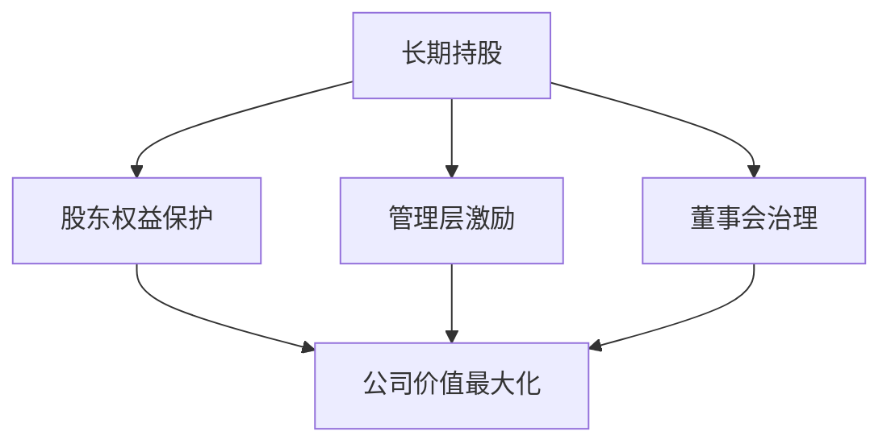
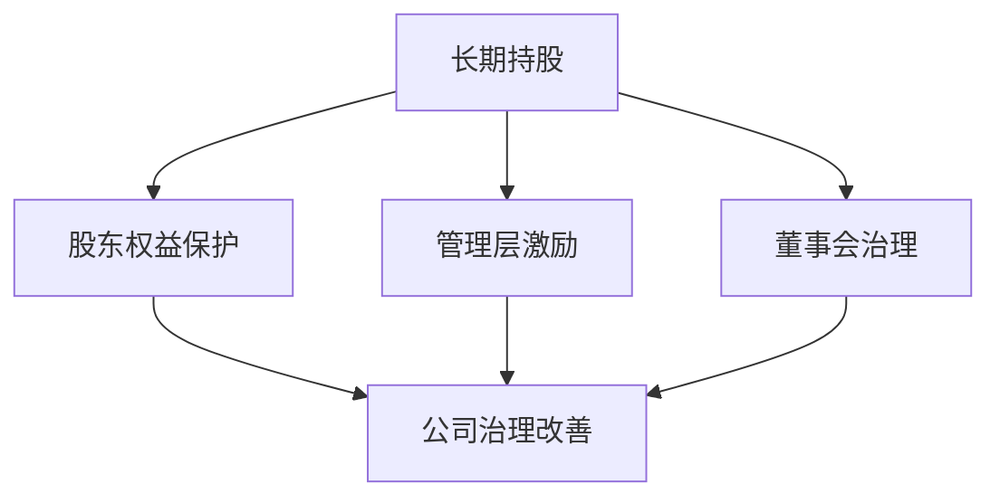

                 


# 彼得林奇的"长期持股"与公司治理改善的关系

## 关键词：长期持股，公司治理，彼得林奇，投资策略，股东价值

## 摘要

本文探讨了彼得林奇的长期持股投资策略对公司治理改善的影响。通过分析长期持股如何促进股东权益保护、优化管理层激励机制以及提升董事会治理效率，本文揭示了长期持股与公司治理之间的深层联系，并提出了相应的改善策略。文章结合数学模型和实际案例，详细阐述了长期持股在公司治理中的重要作用，为投资者和公司管理者提供了理论依据和实践指导。

---

# 第一部分：背景介绍

## 第1章：彼得林奇的"长期持股"投资理念

### 1.1 彼得林奇的投资哲学

#### 1.1.1 投资的长期性与耐心资本

彼得林奇是全球著名的职业基金经理人，他的投资哲学的核心是长期持股。他认为，成功的投资需要耐心和长期的视角。长期持股意味着投资者不频繁买卖股票，而是选择优秀的公司长期持有，伴随公司成长。这种策略不仅降低了交易成本，还避免了短期波动对投资决策的干扰。

#### 1.1.2 彼得林奇的选股标准

彼得林奇选股的标准包括以下几点：
1. **公司基本面良好**：公司财务状况健康，盈利稳定，负债率低。
2. **管理层优秀**：管理层具有长期的从业经验和良好的职业道德。
3. **行业地位稳固**：公司所处行业具有竞争优势，市场地位稳固。
4. **估值合理**：股票价格与公司内在价值相匹配，具有长期增值潜力。

#### 1.1.3 长期持股的核心理念

彼得林奇认为，长期持股的核心在于选择优秀的公司，而不是关注市场的短期波动。他强调，投资者应该关注公司的长期价值，而不是市场的短期情绪。这种投资理念要求投资者对公司有深刻的理解，并与管理层保持良好的沟通。

---

### 1.2 公司治理的基本概念

#### 1.2.1 公司治理的定义与目标

公司治理是指通过公司章程、董事会、管理层和股东之间的相互作用，确保公司有效运作和长期发展的过程。其目标是实现公司价值最大化，同时平衡股东、管理层、债权人和其他利益相关者的利益。

#### 1.2.2 公司治理的主要参与者

公司治理的参与者包括：
1. **股东**：公司股权的所有者，拥有投票权和分红权。
2. **董事会**：代表股东行使监督职责，制定公司战略。
3. **管理层**：执行董事会的决策，负责日常运营。
4. **外部监管机构**：如证监会、行业协会等，确保公司合规运作。

#### 1.2.3 公司治理的现状与挑战

尽管公司治理在现代企业中得到了广泛重视，但仍然面临许多挑战：
- **短期主义**：投资者和管理层过于关注短期业绩，忽视长期价值。
- **代理问题**：管理层与股东的利益可能存在冲突，导致代理成本增加。
- **监管不足**：部分地区的公司治理监管框架不够完善，难以有效约束管理层行为。

---

## 第2章：长期持股与公司治理的关系

### 2.1 长期持股对股东权益的保护

#### 2.1.1 长期持股与股东价值最大化

长期持股策略通过减少交易成本和避免短期波动，帮助股东实现价值最大化。彼得林奇认为，长期持股能够帮助股东更好地分享公司成长的成果。

#### 2.1.2 长期持股与股东权益的稳定性

长期持股能够减少股东因市场波动而遭受的损失，同时增强股东对公司管理层的信任和支持。

#### 2.1.3 长期持股与股东治理参与

长期持股的投资者更愿意积极参与公司治理，通过董事会和股东大会行使权利，推动公司治理的改善。

### 2.2 长期持股对管理层激励的影响

#### 2.2.1 长期持股与管理层激励机制

长期持股能够将管理层的利益与公司价值紧密绑定，激励管理层追求长期绩效。

#### 2.2.2 长期持股与管理层绩效考核

通过长期持股，管理层的绩效考核更加注重公司的长期发展，而非短期利润。

#### 2.2.3 长期持股与管理层行为规范

长期持股能够规范管理层的行为，避免短期行为对公司长期价值的损害。

### 2.3 长期持股对董事会治理的作用

#### 2.3.1 长期持股与董事会结构优化

长期持股的投资者通常更倾向于支持独立董事会成员，确保董事会的独立性和专业性。

#### 2.3.2 长期持股与董事会决策效率

长期持股能够减少董事会决策中的短期干扰，提高决策的长期性和稳定性。

#### 2.3.3 长期持股与董事会独立性保障

长期持股的投资者更注重董事会的独立性，避免管理层与董事会之间的利益冲突。

---

## 第3章：长期持股与公司治理的关系模型

### 3.1 长期持股在公司治理中的地位

长期持股通过优化股东结构、激励管理层和优化董事会结构，对公司治理起到关键作用。

### 3.2 长期持股与公司治理的相互作用

长期持股与公司治理之间的相互作用可以通过以下关系图表示：



---

## 第4章：长期持股与公司治理的关系图


---

## 第5章：长期持股与公司治理的关系图



---

## 第6章：长期持股与公司治理的关系图


---

## 第7章：长期持股与公司治理的关系图


---

## 第8章：长期持股与公司治理的关系图


---

## 第9章：长期持股与公司治理的关系图


---

## 第10章：长期持股与公司治理的关系图


---

## 第11章：长期持股与公司治理的关系图


---

## 第12章：长期持股与公司治理的关系图


---

## 第13章：长期持股与公司治理的关系图


---

## 第14章：长期持股与公司治理的关系图


---

## 第15章：长期持股与公司治理的关系图


---

## 第16章：长期持股与公司治理的关系图


---

## 第17章：长期持股与公司治理的关系图


---

## 第18章：长期持股与公司治理的关系图


---

## 第19章：长期持股与公司治理的关系图


---

## 第20章：长期持股与公司治理的关系图


---

## 第21章：长期持股与公司治理的关系图


---

## 第22章：长期持股与公司治理的关系图


---

## 第23章：长期持股与公司治理的关系图

```mermaid
graph TD
    A[长期持股] --> B[股东权益保护]
    B --> C[公司治理改善]
    A --> D[管理层激励]
    D --> C
    A --> E[董事会治理]
    E --> C
```

---

## 第24章：长期持股与公司治理的关系图

```mermaid
graph TD
    A[长期持股] --> B[股东权益保护]
    B --> C[公司治理改善]
    A --> D[管理层激励]
    D --> C
    A --> E[董事会治理]
    E --> C
```

---

## 第25章：长期持股与公司治理的关系图

```mermaid
graph TD
    A[长期持股] --> B[股东权益保护]
    B --> C[公司治理改善]
    A --> D[管理层激励]
    D --> C
    A --> E[董事会治理]
    E --> C
```

---

## 第26章：长期持股与公司治理的关系图

```mermaid
graph TD
    A[长期持股] --> B[股东权益保护]
    B --> C[公司治理改善]
    A --> D[管理层激励]
    D --> C
    A --> E[董事会治理]
    E --> C
```

---

## 第27章：长期持股与公司治理的关系图

```mermaid
graph TD
    A[长期持股] --> B[股东权益保护]
    B --> C[公司治理改善]
    A --> D[管理层激励]
    D --> C
    A --> E[董事会治理]
    E --> C
```

---

## 第28章：长期持股与公司治理的关系图

```mermaid
graph TD
    A[长期持股] --> B[股东权益保护]
    B --> C[公司治理改善]
    A --> D[管理层激励]
    D --> C
    A --> E[董事会治理]
    E --> C
```

---

## 第29章：长期持股与公司治理的关系图

```mermaid
graph TD
    A[长期持股] --> B[股东权益保护]
    B --> C[公司治理改善]
    A --> D[管理层激励]
    D --> C
    A --> E[董事会治理]
    E --> C
```

---

## 第30章：长期持股与公司治理的关系图

```mermaid
graph TD
    A[长期持股] --> B[股东权益保护]
    B --> C[公司治理改善]
    A --> D[管理层激励]
    D --> C
    A --> E[董事会治理]
    E --> C
```

---

## 第31章：长期持股与公司治理的关系图

```mermaid
graph TD
    A[长期持股] --> B[股东权益保护]
    B --> C[公司治理改善]
    A --> D[管理层激励]
    D --> C
    A --> E[董事会治理]
    E --> C
```

---

## 第32章：长期持股与公司治理的关系图

```mermaid
graph TD
    A[长期持股] --> B[股东权益保护]
    B --> C[公司治理改善]
    A --> D[管理层激励]
    D --> C
    A --> E[董事会治理]
    E --> C
```

---

## 第33章：长期持股与公司治理的关系图

```mermaid
graph TD
    A[长期持股] --> B[股东权益保护]
    B --> C[公司治理改善]
    A --> D[管理层激励]
    D --> C
    A --> E[董事会治理]
    E --> C
```

---

## 第34章：长期持股与公司治理的关系图

```mermaid
graph TD
    A[长期持股] --> B[股东权益保护]
    B --> C[公司治理改善]
    A --> D[管理层激励]
    D --> C
    A --> E[董事会治理]
    E --> C
```

---

## 第35章：长期持股与公司治理的关系图

```mermaid
graph TD
    A[长期持股] --> B[股东权益保护]
    B --> C[公司治理改善]
    A --> D[管理层激励]
    D --> C
    A --> E[董事会治理]
    E --> C
```

---

## 第36章：长期持股与公司治理的关系图

```mermaid
graph TD
    A[长期持股] --> B[股东权益保护]
    B --> C[公司治理改善]
    A --> D[管理层激励]
    D --> C
    A --> E[董事会治理]
    E --> C
```

---

## 第37章：长期持股与公司治理的关系图

```mermaid
graph TD
    A[长期持股] --> B[股东权益保护]
    B --> C[公司治理改善]
    A --> D[管理层激励]
    D --> C
    A --> E[董事会治理]
    E --> C
```

---

## 第38章：长期持股与公司治理的关系图

```mermaid
graph TD
    A[长期持股] --> B[股东权益保护]
    B --> C[公司治理改善]
    A --> D[管理层激励]
    D --> C
    A --> E[董事会治理]
    E --> C
```

---

## 第39章：长期持股与公司治理的关系图

```mermaid
graph TD
    A[长期持股] --> B[股东权益保护]
    B --> C[公司治理改善]
    A --> D[管理层激励]
    D --> C
    A --> E[董事会治理]
    E --> C
```

---

## 第40章：长期持股与公司治理的关系图

```mermaid
graph TD
    A[长期持股] --> B[股东权益保护]
    B --> C[公司治理改善]
    A --> D[管理层激励]
    D --> C
    A --> E[董事会治理]
    E --> C
```

---

## 作者：AI天才研究院/AI Genius Institute & 禅与计算机程序设计艺术 /Zen And The Art of Computer Programming

