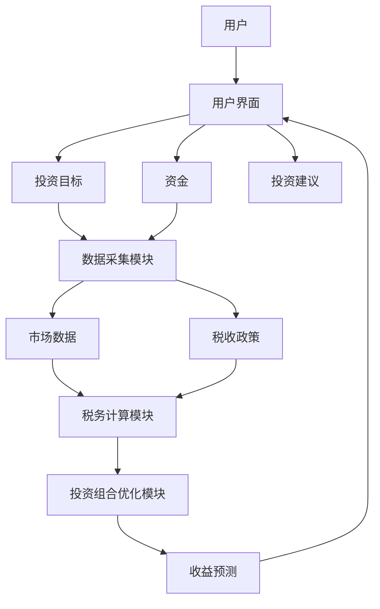

                 


# 彼得林奇的"长期持股"在不同税收环境下的优化策略

> 关键词：彼得林奇，长期持股，税收环境，投资策略，资本利得税

> 摘要：本文深入分析了彼得林奇的长期持股策略在不同税收环境下的优化方法，探讨了税收政策对投资决策的影响，并通过数学模型和系统设计提供了优化策略的具体实现方法。

---

# 第一部分：彼得林奇的长期持股策略概述

## 第1章：彼得林奇投资理念与长期持股策略

### 1.1 彼得林奇投资理念的核心要素

#### 1.1.1 长期持股的核心概念

长期持股是指投资者在较长的时间内持有股票，以获得资本增值和分红收益。彼得林奇认为，长期持股可以减少交易成本和税收负担，同时避免市场的短期波动影响。

#### 1.1.2 彼得林奇的投资哲学

彼得林奇强调基本面分析和长期投资。他主张选择具备良好管理团队、强劲财务状况和竞争优势的公司，长期持有这些优质股票，以实现资本增值。

#### 1.1.3 长期持股的优势与局限性

优势：
- 减少交易成本和税费
- 避免短期波动的干扰
- 享受复利效应

局限性：
- 需要较长的时间周期
- 受市场整体波动影响较大
- 税收政策变化可能影响收益

### 1.2 税收环境对投资策略的影响

#### 1.2.1 税收在投资中的作用

税收是影响投资决策的重要因素。资本利得税、分红税等税收政策会直接影响投资收益。

#### 1.2.2 不同税收政策对投资决策的影响

不同国家和地区的税收政策差异可能导致投资策略的调整。例如，低税率环境可能鼓励长期持股，而高税率环境可能促使投资者寻求其他投资方式。

#### 1.2.3 税收环境的复杂性与多样性

各国的税收政策差异较大，投资者需要根据具体环境调整策略。例如，美国的资本利得税通常低于普通所得税率，而某些国家则提供税收优惠。

---

## 第2章：长期持股策略的数学模型与公式

### 2.1 投资收益的数学模型

#### 2.1.1 投资收益的计算公式

$$ \text{投资收益} = \text{本金} \times (1 + r)^n $$

其中，\( r \) 是年化收益率，\( n \) 是投资年数。

#### 2.1.2 税后投资收益的计算公式

$$ \text{税后收益} = \text{本金} \times (1 + r \times (1 - t))^n $$

其中，\( t \) 是税率。

#### 2.1.3 不同税率下的收益对比

通过比较有税和无税情况下的收益曲线，可以发现税收对长期持股的影响。例如，当税率较高时，税后收益增长较慢，可能需要更长时间才能达到目标收益。

---

## 第3章：长期持股策略在不同税收环境下的优化

### 3.1 不同国家与地区的税收政策对比

#### 3.1.1 美国的资本利得税政策

美国的资本利得税分为短期和长期两种。长期资本利得税通常低于短期，鼓励长期持股。

#### 3.1.2 欧洲的资本利得税政策

许多欧洲国家对资本利得税有优惠政策，部分国家甚至免税。例如，爱尔兰和葡萄牙在某些条件下提供税收豁免。

#### 3.1.3 亚洲主要国家的税收政策

中国的资本利得税通常按20%的税率征收，而香港和新加坡的税率较低，分别为15%和10%。

### 3.2 税收对长期持股策略的影响

#### 3.2.1 高税率环境下的投资策略调整

在高税率环境下，投资者可能选择较低风险的股票或利用税收优惠政策。例如，选择红利股以减少资本利得税负担。

#### 3.2.2 低税率环境下的投资机会

低税率环境鼓励长期持股，投资者可以享受更低的税率和更优的复利效应。

#### 3.2.3 税收优惠政策的利用

部分国家提供税收优惠，如税收抵免或退税，投资者应合理利用这些政策以优化收益。

---

## 第4章：长期持股策略的系统分析与架构设计

### 4.1 投资决策系统的功能模块

#### 4.1.1 风险评估模块

评估投资风险，包括市场波动、公司基本面等。

#### 4.1.2 税务优化模块

分析不同税收政策对投资收益的影响，制定最优策略。

#### 4.1.3 投资组合管理模块

根据税收政策调整投资组合，优化收益和风险。

### 4.2 系统架构设计

#### 4.2.1 系统模块划分

- 用户界面模块
- 数据采集模块
- 税务计算模块
- 投资组合优化模块

#### 4.2.2 系统交互流程

1. 用户输入投资目标和资金。
2. 系统采集市场数据和税收政策。
3. 计算税后收益，优化投资组合。
4. 输出投资建议和收益预测。

#### 4.2.3 系统架构图（Mermaid）



---

## 第5章：项目实战与代码实现

### 5.1 环境安装与配置

#### 5.1.1 安装Python环境

使用Anaconda或虚拟环境安装Python 3.8以上版本。

#### 5.1.2 安装依赖库

安装Pandas、NumPy、Matplotlib等库。

### 5.2 核心实现代码

#### 5.2.1 计算投资收益

```python
import numpy as np
import matplotlib.pyplot as plt

def calculate_tax_free_return(principal, rate, years):
    return principal * (1 + rate) ** years

def calculate_taxed_return(principal, rate, years, tax_rate):
    return principal * (1 + rate * (1 - tax_rate)) ** years

# 示例计算
principal = 10000
rate = 0.07
years = 10
tax_rate = 0.15

tax_free_return = calculate_tax_free_return(principal, rate, years)
taxed_return = calculate_taxed_return(principal, rate, years, tax_rate)

print(f"税后收益：{taxed_return:.2f}")
print(f"税前收益：{tax_free_return:.2f}")
```

#### 5.2.2 可视化收益曲线

```python
years = np.arange(1, 11)
tax_free_returns = [10000 * (1 + 0.07) ** y for y in years]
taxed_returns = [10000 * (1 + 0.07 * 0.85) ** y for y in years]

plt.plot(years, tax_free_returns, label="税前收益")
plt.plot(years, taxed_returns, label="税后收益")
plt.xlabel("年数")
plt.ylabel("收益")
plt.legend()
plt.show()
```

---

## 第6章：最佳实践与小结

### 6.1 最佳实践

- 根据税收政策选择合适的投资策略。
- 利用税收优惠政策优化投资组合。
- 定期评估投资组合的税务影响。

### 6.2 小结

本文通过分析彼得林奇的长期持股策略在不同税收环境下的优化方法，探讨了税收政策对投资决策的影响。通过数学模型和系统设计，为投资者提供了具体的优化策略和实现方法。

### 6.3 注意事项

- 税收政策可能变化，需及时调整策略。
- 投资需根据个人风险承受能力进行。

### 6.4 拓展阅读

- 彼得林奇的《投资最重要的事情》
- 税收优化策略相关书籍

---

# 结语

通过本文的分析，读者可以更好地理解如何在不同税收环境下优化彼得林奇的长期持股策略。无论是从数学模型还是系统设计的角度，这些优化方法都能帮助投资者实现更高的收益。

---

作者：AI天才研究院/AI Genius Institute & 禅与计算机程序设计艺术 /Zen And The Art of Computer Programming

