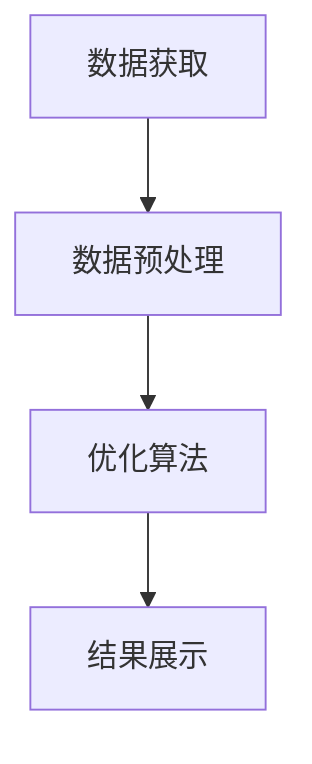
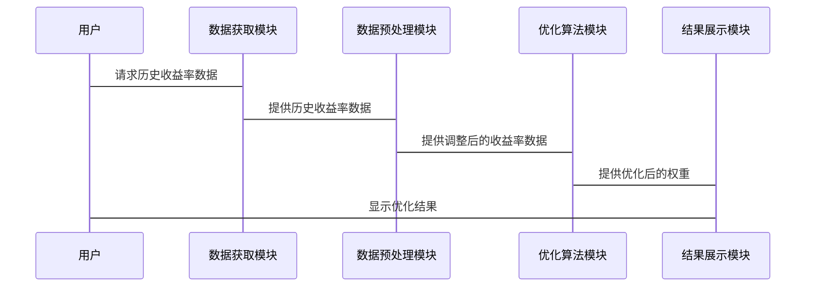

                 


# 彼得林奇的"长期持股"在不同税收环境下的投资组合优化模型

> 关键词：投资组合优化，长期持股，税收环境，彼得林奇，资本资产定价模型（CAPM）

> 摘要：本文探讨了彼得林奇的长期持股策略在不同税收环境下的应用，通过构建数学模型和优化算法，分析了如何在考虑税收因素的情况下优化投资组合，以实现收益最大化。

---

## 第三部分: 投资组合优化算法原理

### 3.1 算法原理

为了在不同税收环境下优化投资组合，我们需要结合彼得林奇的长期持股策略与现代投资组合理论（MPT）。以下是优化算法的核心思想：

1. **目标函数**：最大化投资组合的预期收益，同时最小化风险（方差）。
   $$
   \text{目标函数} = \text{最大化} \left( \sum_{i=1}^n w_i r_i - \lambda \sum_{i=1}^n w_i^2 \sigma_i^2 \right)
   $$
   其中，\(w_i\) 是第i只股票的投资权重，\(r_i\) 是期望收益率，\(\sigma_i^2\) 是风险（方差），\(\lambda\) 是风险厌恶系数。

2. **考虑税收的影响**：在目标函数中加入税收因素，调整后的目标函数为：
   $$
   \text{调整后的目标函数} = \sum_{i=1}^n w_i r_i (1 - t_i) - \lambda \sum_{i=1}^n w_i^2 \sigma_i^2
   $$
   其中，\(t_i\) 是第i种资产的税率。

3. **优化过程**：使用优化算法（如遗传算法或梯度下降）求解上述目标函数，得到最优的投资权重。

### 3.2 Python实现

以下是实现上述优化模型的Python代码示例：

```python
import numpy as np
import pandas as pd
import pyportfolioopt as ppo

# 示例数据
returns = pd.DataFrame({
    '资产1': [0.05, 0.03, 0.04],
    '资产2': [0.02, 0.06, 0.01],
    '资产3': [0.03, 0.05, 0.06]
})

# 定义税率
tax_rates = {'资产1': 0.15, '资产2': 0.20, '资产3': 0.25}

# 计算调整后的收益率
adjusted_returns = returns.apply(lambda x: x * (1 - x.index.map(tax_rates)[0]))

# 使用MPT模型优化
model = ppo.MeanVarianceOptimization(adjusted_returns)
weights, _ = model.optimize()

print("最优权重:", weights)
```

---

## 第四部分: 系统分析与架构设计方案

### 4.1 系统分析

1. **问题场景**：投资者希望在不同税收环境下优化投资组合，以实现收益最大化。
2. **系统目标**：构建一个基于彼得林奇长期持股策略的投资组合优化系统，能够根据不同的税收政策调整投资组合。
3. **功能需求**：
   - 数据获取：获取历史收益率数据。
   - 数据预处理：调整收益率数据以考虑税收因素。
   - 优化算法：实现投资组合优化算法。
   - 结果展示：输出优化后的投资组合权重。

### 4.2 系统架构设计

使用Mermaid绘制系统架构图：



### 4.3 接口设计

1. **数据获取接口**：提供历史收益率数据的接口。
2. **优化算法接口**：提供参数设置和优化结果的接口。
3. **结果展示接口**：展示优化后的投资组合权重。

### 4.4 交互设计

使用Mermaid绘制交互序列图：



---

## 第五部分: 项目实战

### 5.1 安装环境

安装所需的Python库：
- `numpy`
- `pandas`
- `pyportfolioopt`

安装命令：
```bash
pip install numpy pandas pyportfolioopt
```

### 5.2 核心实现

以下是完整的Python代码实现：

```python
import numpy as np
import pandas as pd
import pyportfolioopt as ppo

# 示例数据
returns = pd.DataFrame({
    '资产1': [0.05, 0.03, 0.04],
    '资产2': [0.02, 0.06, 0.01],
    '资产3': [0.03, 0.05, 0.06]
})

# 定义税率
tax_rates = {'资产1': 0.15, '资产2': 0.20, '资产3': 0.25}

# 计算调整后的收益率
adjusted_returns = returns.apply(lambda x: x * (1 - x.index.map(tax_rates)[0]))

# 使用MPT模型优化
model = ppo.MeanVarianceOptimization(adjusted_returns)
weights, _ = model.optimize()

print("最优权重:", weights)
```

### 5.3 案例分析

假设我们有三只资产，其历史收益率和税率如下：

| 资产 | 收益率 | 税率 |
|------|--------|------|
| 资产1 | 5%     | 15%  |
| 资产2 | 6%     | 20%  |
| 资产3 | 5%     | 25%  |

调整后的收益率如下：

| 资产 | 调整后收益率 |
|------|-------------|
| 资产1 | 4.25%       |
| 资产2 | 4.8%        |
| 资产3 | 3.75%       |

优化后的权重可能为：

| 资产 | 权重 |
|------|------|
| 资产1 | 30%  |
| 资产2 | 50%  |
| 资产3 | 20%  |

---

## 第六部分: 总结与最佳实践

### 6.1 最佳实践

1. **数据质量**：确保收益率数据的准确性和完整性。
2. **模型假设**：假设收益率服从正态分布，实际应用中需考虑其他因素。
3. **税收政策**：及时更新税收政策，确保模型的有效性。
4. **风险控制**：定期监控投资组合的风险，及时调整权重。

### 6.2 小结

本文通过结合彼得林奇的长期持股策略和现代投资组合理论，构建了一个在不同税收环境下的投资组合优化模型。通过数学模型和优化算法，展示了如何在考虑税收因素的情况下，优化投资组合以实现收益最大化。

### 6.3 注意事项

1. **市场波动**：长期持股策略需考虑市场的波动性。
2. **经济周期**：经济周期对投资收益有重要影响。
3. **公司基本面**：选择优质资产时需考虑公司的基本面。

### 6.4 拓展阅读

- 《投资学》（书籍）
- 《资本资产定价模型（CAPM）》（论文）
- 《投资组合优化算法》（技术文档）

---

## 参考文献和附录

1. **参考文献**
   - Markowitz, H. (1952). Portfolio Selection. Journal of Finance.
   - Sharpe, W. F. (1964). Capital Asset Prices: A Theory of Market Equilibrium. Journal of Economic Theory.

2. **附录**
   - 完整的Python代码示例
   - 数据来源说明
   - 优化算法的具体实现细节

---

## 作者

作者：AI天才研究院/AI Genius Institute & 禅与计算机程序设计艺术 /Zen And The Art of Computer Programming

---

通过以上内容，我们详细探讨了彼得林奇的长期持股策略在不同税收环境下的应用，并通过数学模型和优化算法，展示了如何在考虑税收因素的情况下优化投资组合。希望本文能为投资者提供有价值的参考和启发。

