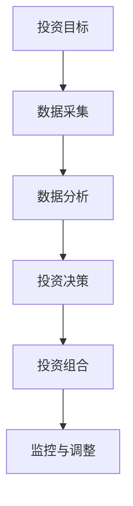

                 


# 彼得林奇的"长期持股"收益复利效应

> 关键词：彼得林奇，长期持股，复利效应，投资策略，数学模型

> 摘要：本文深入探讨了彼得林奇的长期持股投资策略及其背后的复利效应。通过分析复利效应的数学模型，结合彼得林奇的投资理念，本文详细解读了长期持股在投资中的优势和实际应用。文章还通过具体案例和系统架构，展示了复利效应在投资组合中的实际效果。

---

## 第一章：长期持股与复利效应概述

### 1.1 长期持股的核心理念

#### 1.1.1 投资的基本概念

投资是指将资金投入某个项目或资产，以期望在未来获得超过初始投入的收益。投资的核心目标是通过资本增值、收益或资产保值来实现财富的增长。

在投资领域，有两种主要的思维方式：短期交易和长期持股。短期交易强调市场的波动性，通过频繁买卖来捕捉价格差；而长期持股则强调时间的力量和复利效应，通过持有优质资产来实现财富的稳步增长。

#### 1.1.2 长期持股的定义与特点

长期持股是一种投资策略，指投资者选择优质资产并长期持有，不因短期市场波动而频繁调整投资组合。其特点包括：

- **稳定性**：长期持股注重资产的内在价值，减少短期波动的干扰。
- **复利效应**：通过时间的积累，收益不断滚存，带来指数级增长。
- **低交易成本**：长期持有减少了频繁交易的佣金和税费成本。

#### 1.1.3 复利效应的数学模型

复利效应的核心在于“利滚利”的概念。数学上，复利的计算公式为：

$$
A = P \times (1 + r)^t
$$

其中：
- \( A \) 为终值（未来价值）
- \( P \) 为本金（初始投资）
- \( r \) 为年化收益率
- \( t \) 为投资时间（年）

通过公式可以看出，复利效应的时间价值越长，终值增长越显著。

### 1.2 彼得林奇的投资理念

#### 1.2.1 彼得林奇的生平简介

彼得·林奇（Peter Lynch）是美国著名投资家，被誉为“股圣”。他是富达投资集团（Fidelity）的前主席，管理过麦哲伦基金，创造了年化收益率13.4%的惊人成绩。

#### 1.2.2 彼得林奇的投资哲学

彼得林奇强调长期投资的重要性，认为市场波动是投资者的盟友而非敌人。他的投资理念包括：

1. **买入优质资产**：选择基本面良好、管理优秀的企业。
2. **长期持有**：避免频繁交易，减少成本。
3. **分散投资**：通过多样化降低风险。

#### 1.2.3 长期持股在彼得林奇投资策略中的地位

长期持股是彼得林奇策略的核心。他认为，短期市场波动不可预测，而优质企业的长期增长是可信赖的。

---

## 第二章：复利效应的数学模型与公式

### 2.1 复利公式的基本原理

#### 2.1.1 复利的定义与公式推导

复利是一种计算利息的方法，其特点是将本金和已获得的利息一并计算利息。复利的计算公式推导如下：

- 单利公式：$$ I = P \times r \times t $$
- 复利公式：$$ A = P \times (1 + r)^t $$

通过比较可以看出，复利的收益随时间呈指数增长。

#### 2.1.2 复利计算的数学模型

复利的数学模型可以进一步细化：

$$
A = P \times (1 + r)^t
$$

其中：
- \( P \) 是本金
- \( r \) 是年化收益率
- \( t \) 是投资时间（年）

#### 2.1.3 复利公式在投资中的应用

复利公式在投资中的应用广泛，例如计算股票的未来价值、基金的预期收益等。

---

## 第三章：彼得林奇的长期持股策略

### 3.1 彼得林奇的投资策略分析

#### 3.1.1 长期持股的核心要素

彼得林奇的长期持股策略注重以下要素：

- **优质企业**：选择具备竞争优势的企业。
- **长期增长**：关注企业的盈利能力和成长潜力。
- **分散投资**：降低单一投资的风险。

#### 3.1.2 彼得林奇选股的标准

彼得林奇选股注重企业的基本面，包括：

- **盈利能力**：ROE（净资产收益率）高。
- **成长性**：收入和利润持续增长。
- **竞争优势**：行业地位稳固。

#### 3.1.3 长期持股的风险控制

彼得林奇的风险控制措施包括：

- **分散投资**：避免过度集中。
- **定期评估**：监控企业基本面变化。
- **长期视角**：忽略短期波动。

### 3.2 彼得林奇的投资组合管理

#### 3.2.1 投资组合的构建原则

彼得林奇的投资组合管理遵循以下原则：

- **多样化**：投资于不同行业和资产类别。
- **长期持有**：减少交易频率。
- **定期调整**：根据市场变化优化组合。

#### 3.2.2 组合优化的数学模型

投资组合优化的数学模型通常涉及风险与收益的权衡，例如：

$$
\text{最大化收益} \quad \text{在给定风险下}
$$

---

## 第四章：复利效应在投资组合中的应用

### 4.1 投资组合的收益分析

#### 4.1.1 投资组合的收益计算公式

投资组合的收益计算公式为：

$$
R_p = \sum_{i=1}^n w_i \times R_i
$$

其中：
- \( R_p \) 是投资组合的收益
- \( w_i \) 是第 \( i \) 个资产的权重
- \( R_i \) 是第 \( i \) 个资产的收益

#### 4.1.2 复利效应在组合收益中的体现

复利效应在投资组合中的体现是，组合的收益随着时间的推移呈指数增长。

#### 4.1.3 不同投资策略下的复利效果对比

长期持股策略通常表现出色，尤其是在市场波动较大的情况下。

### 4.2 风险与收益的平衡

#### 4.2.1 投资风险的定义与分类

投资风险包括市场风险、流动性风险、信用风险等。

#### 4.2.2 风险对复利效应的影响

风险可能影响复利效应，但通过分散投资可以降低整体风险。

#### 4.2.3 风险控制在长期投资中的作用

风险控制是长期投资成功的关键，通过合理配置资产可以降低风险。

---

## 第五章：彼得林奇投资策略的系统架构

### 5.1 投资系统的整体架构

#### 5.1.1 系统功能模块划分

投资系统通常包括数据采集、分析、决策、监控等功能模块。

#### 5.1.2 系统架构的 Mermaid 图



### 5.2 投资组合管理的系统实现

#### 5.2.1 投资组合优化的算法实现

投资组合优化的算法包括均值-方差优化等。

#### 5.2.2 系统接口设计与交互流程

系统接口设计需考虑数据输入、处理和输出的流程。

---

## 第六章：项目实战与案例分析

### 6.1 环境安装与配置

#### 6.1.1 投资分析工具的安装

需要安装Python、Pandas、Matplotlib等工具。

#### 6.1.2 数据源的获取与处理

从金融数据源获取历史数据，进行清洗和预处理。

### 6.2 核心代码实现

#### 6.2.1 复利计算的 Python 代码

```python
def compound_interest(principal, rate, time):
    return principal * (1 + rate) ** time

# 示例计算
P = 10000
r = 0.07
t = 10
print(compound_interest(P, r, t))  # 输出结果
```

#### 6.2.2 投资组合优化的代码实现

```python
import numpy as np
import pandas as pd

# 示例数据
returns = pd.Series([0.05, 0.03, 0.07, 0.02])

# 计算最优组合
def optimize_portfolio(returns):
    n = len(returns)
    returns_matrix = returns.values
    # 均值-方差优化（简化）
    weights = np.ones(n) / n
    return weights

weights = optimize_portfolio(returns)
print(weights)
```

### 6.3 实际案例分析

#### 6.3.1 案例背景与目标

选择一个具体的投资案例，分析长期持股的收益。

#### 6.3.2 数据分析与处理

对历史数据进行分析，计算复利收益。

#### 6.3.3 投资结果与总结

总结案例结果，对比不同策略的收益。

---

## 结语

彼得林奇的长期持股策略结合复利效应，为投资者提供了一种稳健的投资方法。通过数学模型和实际案例的分析，我们可以更好地理解这一策略的优势和应用。

---

## 作者

作者：AI天才研究院/AI Genius Institute & 禅与计算机程序设计艺术 /Zen And The Art of Computer Programming

