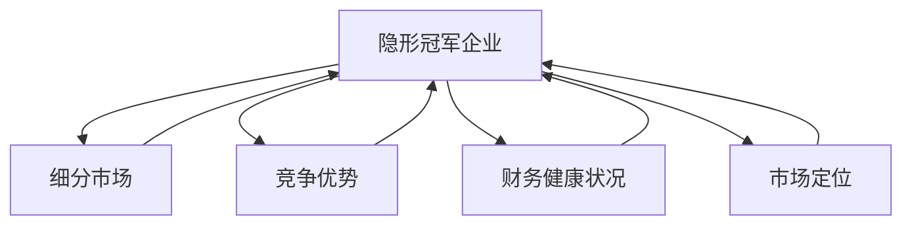
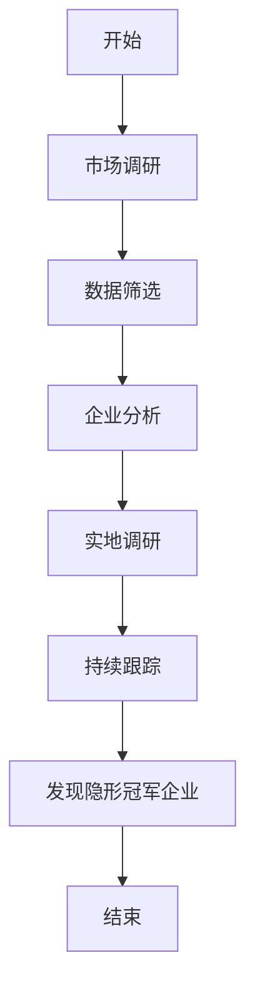
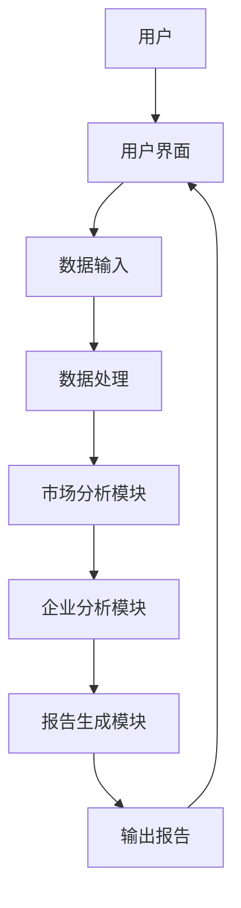

                 


## # 第3章: 隐形冠军的核心概念与联系

### 3.1 隐形冠军的核心概念

隐形冠军企业是指那些在特定细分市场中占据领先地位，但未公开上市且不为大众所熟知的企业。这些企业通常专注于某一领域，具有强大的市场竞争力和持续的盈利能力。隐形冠军的核心概念包括以下几个方面：

1. **专注性**：隐形冠军通常专注于一个特定的细分市场，而不是分散资源追求广泛的市场覆盖。
2. **市场领导地位**：在特定细分市场中，隐形冠军通常拥有较高的市场份额和市场影响力。
3. **持续创新能力**：隐形冠军企业注重技术创新和产品改进，以保持竞争优势。
4. **财务健康**：隐形冠军企业通常具有稳健的财务状况，盈利能力强，负债率低。
5. **家族或创业团队管理**：隐形冠军企业通常由家族或创业团队管理，具有较强的内部凝聚力和决策效率。

### 3.2 核心概念对比表格

以下是隐形冠军与其他类型企业（如传统投资标的企业、成长型企业、周期性行业企业）的核心概念对比表格：

| 对比维度           | 隐形冠军                   | 传统投资标的企业      | 成长型企业               | 周期性行业企业           |
|--------------------|----------------------------|-----------------------|-------------------------|-------------------------|
| 市场定位           | 细分市场领导者             | 大众市场参与者        | 高速增长市场参与者       | 受经济周期影响的行业参与者 |
| 企业规模           | 中小企业为主               | 大中型企业为主         | 中小企业为主             | 大中型企业为主           |
| 市场份额           | 高，在细分市场占据主导地位 | 中等，分散在多个市场   | 高，但在新兴市场         | 受经济周期影响波动较大   |
| 竞争优势           | 专注于技术创新和成本控制   | 多元化经营             | 侧重于市场扩展和增长      | 侧重于周期性行业优势      |
| 财务健康           | 稳健，负债率低，现金流强    | 负债率较高，现金流一般 | 高增长，财务风险较高     | 受经济周期影响，财务状况波动较大 |

### 3.3 ER实体关系图

以下是隐形冠军企业的核心概念与相关实体之间的关系图：



从上图可以看出，隐形冠军企业与其所在的细分市场、竞争优势、财务健康状况和市场定位之间存在密切的关联。

## # 第4章: 隐形冠军的发现方法与流程

### 4.1 隐形冠军的发现方法

发现隐形冠军企业需要从以下几个方面入手：

1. **市场调研**：通过行业研究报告、市场数据分析等方法，识别出具有高增长潜力的细分市场。
2. **数据筛选**：筛选出在细分市场中市场份额高、财务状况稳健的企业。
3. **企业分析**：深入分析企业的竞争优势、管理团队、技术创新能力等。
4. **实地调研**：通过实地考察、访谈等方式，进一步验证企业的竞争优势和市场地位。
5. **持续跟踪**：对潜在的隐形冠军企业进行长期跟踪，观察其发展动态和财务表现。

### 4.2 隐形冠军的发现流程

以下是发现隐形冠军企业的流程图：



### 4.3 数学模型与公式

在发现隐形冠军企业的过程中，我们可以使用以下数学模型和公式来进行分析：

1. **市场份额计算**：

   企业市场份额 = (企业销售额 / 细分市场总销售额) × 100%

2. **盈利能力分析**：

   净利润 = 营业收入 - 成本 - 税费 - 利息支出

3. **ROE（净资产收益率）计算**：

   ROE = (净利润 / 净资产) × 100%

   如果ROE高于行业平均水平，说明企业的盈利能力较强。

### 4.4 实际案例分析

以某隐形冠军企业为例，假设该企业在某个细分市场中占据20%的市场份额，而行业平均市场份额为10%。同时，该企业的ROE为20%，高于行业平均水平的15%。这说明该企业具有较强的市场竞争力和盈利能力，符合隐形冠军的特征。

### 4.5 代码实现

以下是使用Python进行隐形冠军企业筛选的代码示例：

```python
import pandas as pd

# 假设我们有一个包含企业数据的DataFrame
df = pd.DataFrame({
    '企业名称': ['企业A', '企业B', '企业C'],
    '市场份额': [20, 15, 10],
    'ROE': [20, 18, 12]
})

# 筛选市场份额高于行业平均水平且ROE高于行业平均水平的企业
industry_average_share = df['市场份额'].mean()
industry_average_roe = df['ROE'].mean()

# 筛选条件
df['是否隐形冠军'] = df.apply(lambda x: 
    x['市场份额'] > industry_average_share and 
    x['ROE'] > industry_average_roe, axis=1)

print(df)
```

### 4.6 系统分析与架构设计

以下是隐形冠军企业发现系统的系统架构设计图：



### 4.7 项目实战

以下是发现隐形冠军企业的实际案例分析：

**项目背景**：

假设我们正在寻找一个隐形冠军企业，专注于某个细分市场，如高端制造业中的精密零件加工。

**项目目标**：

通过市场调研、数据分析和实地调研，发现该细分市场中的隐形冠军企业。

**项目实施步骤**：

1. **市场调研**：收集该细分市场的行业报告，了解市场规模、竞争格局和主要企业。
2. **数据筛选**：筛选出市场份额高、ROE高的企业。
3. **企业分析**：分析企业的竞争优势、管理团队和技术创新能力。
4. **实地调研**：与企业管理层进行访谈，了解企业的经营状况和未来发展规划。
5. **持续跟踪**：定期跟踪企业的财务数据和市场表现。

### 4.8 最佳实践 tips

1. **长期关注**：隐形冠军企业的发现需要长期关注和持续跟踪。
2. **数据支持**：通过数据分析和市场调研，确保发现的隐形冠军企业具有坚实的市场和财务基础。
3. **风险管理**：在发现隐形冠军企业后，需要对其潜在风险进行评估和管理。

### 4.9 小结

隐形冠军企业的发现需要结合市场调研、数据分析和实地调研等多种方法。通过系统的方法和流程，可以有效发现具有竞争优势和长期发展潜力的隐形冠军企业。

---

**作者：AI天才研究院/AI Genius Institute & 禅与计算机程序设计艺术 /Zen And The Art of Computer Programming**

