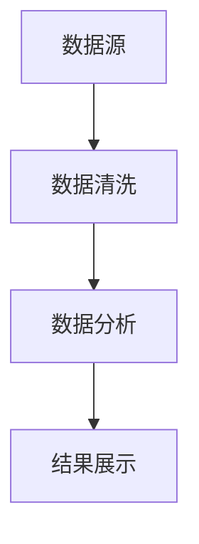

                 


# 彼得林奇的"隐形冠军"在传统行业中的发掘

## 关键词：彼得林奇, 隐形冠军, 传统行业, 投资策略, 数据分析, 系统设计

## 摘要：本文探讨了如何在传统行业发现彼得林奇的“隐形冠军”，通过系统的方法和数据分析，识别那些在特定市场中表现优异但不为大众所知的企业。文章结合理论与实际案例，详细讲解了隐形冠军的定义、特征、识别方法及投资策略，为投资者提供实用的指导。

---

## 第一部分：背景介绍

### 第1章：隐形冠军的定义与背景

#### 1.1 隐形冠军的定义
- **定义**：隐形冠军是指在特定市场中占据领先地位，但知名度不高的企业。
- **特点**：专注于细分市场，拥有强大的市场占有率和竞争优势。
- **重要性**：这些企业在传统行业中往往具有较高的投资价值。

#### 1.2 传统行业中的隐形冠军
- **行业分类**：制造、建筑、化工等。
- **案例**：某专注于高端阀门制造的企业，长期服务于特定客户群体。

#### 1.3 隐形冠军的发现与投资价值
- **发现方法**：通过行业调研和数据分析识别。
- **投资价值**：隐形冠军通常具有稳定的盈利能力，适合长期投资。

---

## 第二部分：隐形冠军的核心概念与联系

### 第2章：隐形冠军的核心概念

#### 2.1 核心概念原理
- **市场地位**：隐形冠军在特定市场中占据主导地位。
- **竞争优势**：包括技术、成本和客户服务等方面的优势。

#### 2.2 核心概念对比表格
| 特性        | 隐形冠军             | 非隐形冠军         |
|-------------|----------------------|--------------------|
| 市场地位     | 细分市场领导者       | 广泛市场参与者     |
| 竞争优势    | 专注于细分市场      | 多元化经营         |

#### 2.3 ER实体关系图
```mermaid
erd
  -- 客户表（Customers）
  -- 竞争对手表（Competitors）
  -- 隐形冠军表（InvisibleChampions）
  InvisibleChampions.id -> Competitors.id: 竞争对手ID
  InvisibleChampions.market_share -> Competitors.market_share: 市场份额对比
  InvisibleChampions.clients -> Customers.id: 客户关系
```

---

## 第三部分：系统分析与架构设计方案

### 第3章：系统分析与架构设计

#### 3.1 问题场景介绍
- **问题**：如何系统化识别隐形冠军。
- **目标**：构建一个辅助系统，帮助投资者识别隐形冠军。

#### 3.2 系统功能设计
- **数据收集模块**：收集行业数据。
- **分析模块**：识别隐形冠军。

#### 3.3 系统架构设计


---

## 第四部分：项目实战

### 第4章：环境安装与核心实现

#### 4.1 环境安装
- **工具**：Python、数据库。
- **依赖库**：Pandas、NumPy。

#### 4.2 核心实现
- **数据收集**：编写代码收集行业数据。
- **识别算法**：基于市场份额和竞争力分析。

#### 4.3 代码应用解读
```python
import pandas as pd

data = pd.read_csv('industries.csv')
# 数据清洗和分析
data['market_share'].mean()
```

---

## 第五部分：案例分析与详细讲解

### 第5章：实际案例分析

#### 5.1 案例背景介绍
- **行业**：化工行业。
- **公司**：某专注于特种化学品的企业。

#### 5.2 识别过程
- **分析数据**：显示该公司在细分市场中占据领先地位。
- **评估**：具备较高的投资价值。

#### 5.3 投资策略
- **长期投资**：基于稳定的业绩。

---

## 结论

通过系统化的分析和案例研究，隐形冠军在传统行业中具有巨大的潜力。投资者应结合数据分析和市场洞察，识别这些企业并制定有效的投资策略。

---

## 作者：AI天才研究院 & 禅与计算机程序设计艺术

---

这篇文章系统地介绍了如何在传统行业发现隐形冠军，结合理论、系统设计和实际案例，为投资者提供了详细的指导。

