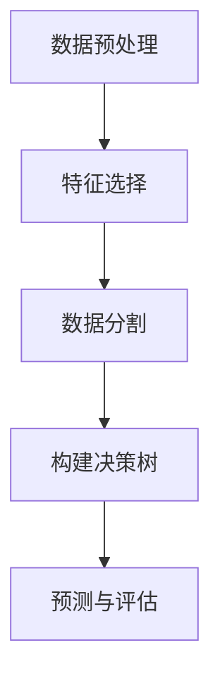

                 


# 彼得林奇的"隐形冠军"在工业4.0背景下的发掘方法

> 关键词：隐形冠军，工业4.0，数据挖掘，彼得林奇，投资策略

> 摘要：本文基于彼得林奇的“隐形冠军”理论，结合工业4.0背景，系统地探讨了如何在智能化、数字化的工业环境下，利用数据挖掘和算法模型，发现和培育隐形冠军企业。文章从理论基础、方法论、技术实现、案例分析到实战应用，全面阐述了隐形冠军的识别方法和成长路径，为企业在工业4.0时代寻找投资机会或实现自身转型提供了理论支持和实践指导。

---

## 第一部分: 隐形冠军的定义与特征

### 第1章: 隐形冠军的定义与特征

#### 1.1 隐形冠军的定义
隐形冠军是指那些在特定细分市场中占据绝对领先地位，但知名度却相对较低的企业。它们专注于某个领域，通过技术创新、成本控制和卓越的客户体验，在行业内具有强大的竞争力。隐形冠军的核心特征包括：
- **专注性**：专注于一个细分市场，避免多元化竞争。
- **创新性**：持续投入研发，保持技术领先。
- **稳定性**：在市场波动中表现稳定，抗风险能力强。
- **隐蔽性**：虽然在细分市场中表现优异，但很少被外界关注。

#### 1.2 工业4.0的定义与特点
工业4.0是继蒸汽机时代、电气化时代、自动化时代之后的第四次工业革命，其核心特征是智能化、数字化和网络化。工业4.0通过物联网、大数据、人工智能等技术，实现了从设计、生产、物流到服务的全生命周期数字化管理。其特点包括：
- **智能化生产**：通过传感器和人工智能实现智能工厂。
- **数据驱动**：利用大数据分析优化生产流程。
- **互联互通**：设备、系统和数据的实时互联。

---

### 第2章: 隐形冠军在工业4.0中的重要性

#### 2.1 隐形冠军在工业4.0中的战略地位
隐形冠军在工业4.0背景下具有独特的战略地位，主要体现在：
- **技术驱动**：隐形冠军往往掌握核心技术，成为工业4.0生态系统的核心供应商。
- **垂直整合**：隐形冠军能够通过垂直整合优化供应链，提高效率。
- **创新引擎**：隐形冠军通过技术创新推动行业升级。

#### 2.2 隐形冠军的发掘方法
在工业4.0背景下，发掘隐形冠军需要结合数据驱动的方法论：
- **数据收集**：通过行业报告、专利数据、市场调研等渠道收集潜在隐形冠军的信息。
- **数据分析**：利用大数据技术筛选出具有高成长潜力的企业。
- **深度分析**：结合企业的财务数据、技术实力、管理团队等多维度进行综合评估。

---

### 第3章: 隐形冠军的识别标准与评估模型

#### 3.1 隐形冠军的识别标准
隐形冠军的识别标准可以从以下几个方面进行评估：
1. **市场领导地位**：企业在特定细分市场的占有率是否领先。
2. **产品创新能力**：企业是否持续推出创新产品或技术。
3. **财务健康状况**：企业的盈利能力、资产负债率等财务指标是否健康。
4. **管理团队能力**：企业的管理团队是否具有行业经验和战略眼光。

#### 3.2 隐形冠军的评估模型
为了更好地识别隐形冠军，我们可以构建一个基于工业4.0背景的评估模型，如下：

**评估指标：**
| 指标类别      | 具体指标         | 权重 |
|---------------|------------------|------|
| 市场表现       | 细分市场占有率   | 30% |
| 创新能力       | R&D投入占比     | 25% |
| 财务健康       | 净利润率         | 20% |
| 管理能力       | 高管行业经验     | 15% |
| 供应链能力     | 供应链稳定性     | 10% |

**评估流程：**
1. 数据收集：收集目标企业的各项指标数据。
2. 数据清洗：对数据进行预处理，去除异常值。
3. 综合评分：根据权重计算综合得分。
4. 结果分析：根据得分将企业分为潜在隐形冠军、成长型企业和一般企业。

---

### 第4章: 数据挖掘与隐形冠军的发现

#### 4.1 数据挖掘的基本原理
数据挖掘是通过分析大量数据，发现隐藏在数据中的模式、关系和趋势。其基本步骤包括：
1. 数据清洗：去除噪声数据。
2. 数据预处理：标准化数据格式。
3. 数据分析：使用统计分析或机器学习算法进行模式识别。
4. 结果解读：将数据挖掘结果转化为可操作的决策依据。

#### 4.2 数据挖掘在隐形冠军识别中的应用
在工业4.0背景下，数据挖掘可以帮助我们发现隐形冠军的特征。例如：
- **客户行为分析**：通过分析客户的采购数据，识别高潜力企业。
- **市场趋势预测**：通过分析行业趋势，预测哪些企业在未来可能成为隐形冠军。

---

### 第5章: 隐形冠军的案例分析

#### 5.1 国际隐形冠军案例
1. **德国工业4.0隐形冠军**：如西门子的子企业Mindspeed，专注于工业自动化领域的芯片设计。
2. **美国隐形冠军**：如3M公司，通过持续创新保持在材料科学领域的领先地位。
3. **日本隐形冠军**：如精工集团（Seiko Group），在精密机械领域具有强大的竞争力。

#### 5.2 国内隐形冠军案例
1. **中国制造2025背景下的隐形冠军**：如专注于工业机器人核心部件的企业。
2. **高端制造领域的隐形冠军**：如某些专注于高端轴承制造的企业。

---

### 第6章: 隐形冠军的培育与成长策略

#### 6.1 隐形冠军的培育策略
1. **核心技术研发**：持续投入研发，保持技术领先。
2. **市场定位与品牌建设**：专注于细分市场，打造差异化品牌。
3. **供应链管理**：优化供应链，降低生产成本。

#### 6.2 隐形冠军的成长路径
1. **从小企业到隐形冠军**：通过专注和创新实现转型。
2. **国际化发展**：通过全球化布局扩大市场影响力。

---

### 第7章: 工业4.0背景下隐形冠军的未来趋势

#### 7.1 工业4.0对隐形冠军的影响
1. **数字化转型的机遇**：隐形冠军可以通过数字化转型提升效率。
2. **智能制造的挑战**：隐形冠军需要适应智能制造的新要求。

---

### 第8章: 技术实现与算法原理

#### 8.1 算法原理
为了识别隐形冠军，我们可以使用决策树算法进行分类。以下是决策树算法的流程：



#### 8.2 Python代码实现
以下是使用Python实现决策树算法的示例代码：

```python
from sklearn.tree import DecisionTreeClassifier
from sklearn.model_selection import train_test_split
from sklearn.metrics import accuracy_score

# 数据预处理
X = dataset.drop('target', axis=1)
y = dataset['target']

# 数据分割
X_train, X_test, y_train, y_test = train_test_split(X, y, test_size=0.2)

# 构建决策树模型
model = DecisionTreeClassifier()
model.fit(X_train, y_train)

# 预测与评估
y_pred = model.predict(X_test)
print("准确率:", accuracy_score(y_test, y_pred))
```

---

### 第9章: 项目实战

#### 9.1 环境安装
- 安装Python和相关库（如scikit-learn）。
- 安装Jupyter Notebook用于数据可视化。

#### 9.2 核心实现
以下是识别隐形冠军的代码实现：

```python
import pandas as pd
from sklearn.ensemble import RandomForestClassifier

# 加载数据
data = pd.read_csv('隐形冠军数据.csv')

# 数据预处理
data = data.dropna()

# 特征选择
features = ['市场占有率', 'R&D投入', '净利润率', '高管经验']
target = '是否隐形冠军'

X = data[features]
y = data[target]

# 数据分割
X_train, X_test, y_train, y_test = train_test_split(X, y, test_size=0.2)

# 模型训练
model = RandomForestClassifier()
model.fit(X_train, y_train)

# 预测与评估
y_pred = model.predict(X_test)
print("准确率:", accuracy_score(y_test, y_pred))
```

---

### 第10章: 结论与展望

隐形冠军在工业4.0背景下具有重要的战略意义。通过数据驱动的方法，我们可以更高效地识别和培育隐形冠军。未来，随着人工智能和大数据技术的进一步发展，隐形冠军的识别和培育将更加精准和高效。

---

### 作者信息

作者：AI天才研究院/AI Genius Institute & 禅与计算机程序设计艺术 /Zen And The Art of Computer Programming

---

希望这篇文章能够为您提供有价值的见解和实用的方法，帮助您在工业4.0背景下更好地发掘隐形冠军企业！

