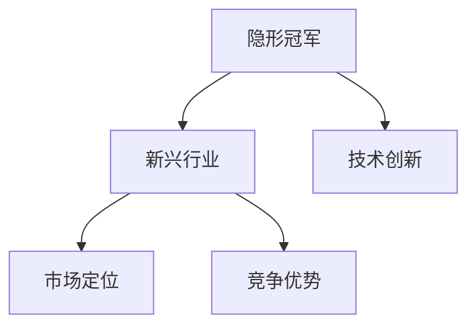
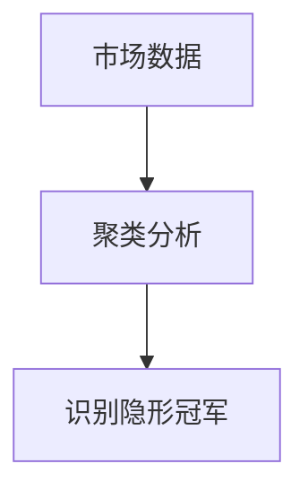
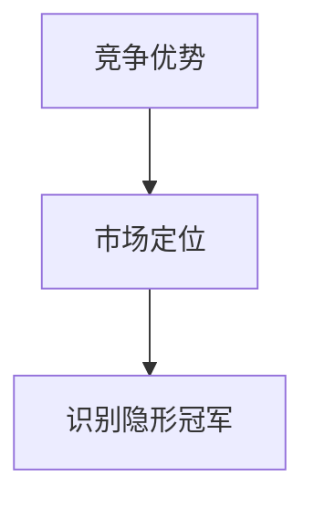
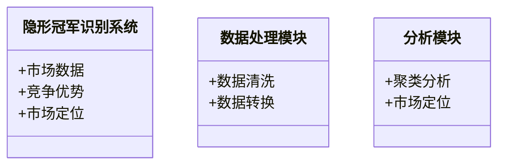
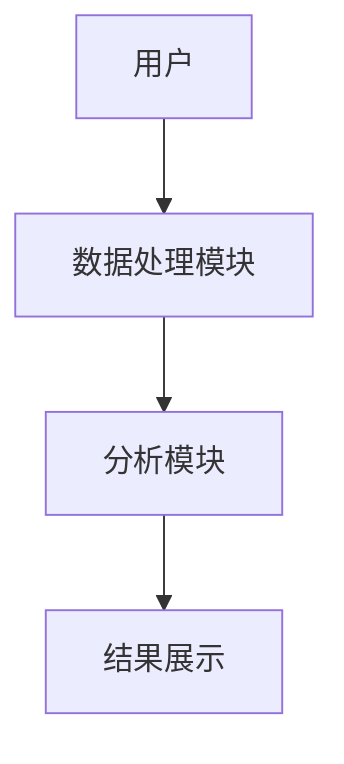

                 


# 彼得林奇的"隐形冠军"在新兴行业的识别

> 关键词：彼得·林奇，隐形冠军，新兴行业，市场定位，竞争优势，数据分析

> 摘要：本文通过分析彼得·林奇的“隐形冠军”概念，探讨其在新兴行业中的识别方法。从核心概念到算法原理，从系统设计到项目实战，本文旨在为读者提供一套完整的识别框架，帮助其在新兴行业中发现具有潜力的企业。

---

## # 第1章: 背景介绍

### ## 1.1 核心概念：问题背景与问题描述

#### ### 1.1.1 什么是“隐形冠军”

“隐形冠军”是指那些在特定市场中占据主导地位，但未公开上市的中小型企业。它们通常专注于细分市场，具有强大的市场竞争力和品牌影响力。隐形冠军的核心特征包括专注性、创新性和可持续性。

#### ### 1.1.2 隐形冠军的定义与特征

- **专注性**：隐形冠军专注于特定领域，避免多元化竞争。
- **创新性**：通过技术创新或商业模式创新保持竞争优势。
- **可持续性**：具有长期稳定的市场地位和盈利能力。

#### ### 1.1.3 隐形冠军与新兴行业的关系

在新兴行业中，隐形冠军往往通过技术创新和市场定位快速崛起。它们能够敏锐地捕捉市场机会，迅速占领市场份额。

### ## 1.2 问题解决与边界外延

#### ### 1.2.1 隐形冠军如何解决新兴行业中的问题

隐形冠军通过专注于细分市场，解决了新兴行业中的碎片化问题。它们能够快速响应市场需求，提供差异化的产品和服务。

#### ### 1.2.2 隐形冠军的边界与外延

隐形冠军的边界在于其专注的领域和市场定位。其外延则包括通过技术合作、并购等方式扩展业务范围。

### ## 1.3 概念结构与核心要素

#### ### 1.3.1 隐形冠军的核心要素组成

- 市场定位
- 技术创新
- 经营模式
- 管理团队

#### ### 1.3.2 隐形冠军与传统企业的对比

| 对比维度 | 隐形冠军 | 传统企业 |
|----------|----------|----------|
| 市场定位 | 细分市场 | 广泛市场 | 
| 创新性 | 高 | 中 | 
| 竞争优势 | 专注性 | 规模化 | 

---

## # 第2章: 核心概念与联系

### ## 2.1 隐形冠军的原理与机制

#### ### 2.1.1 隐形冠军的市场定位

隐形冠军通常选择竞争较小的细分市场，通过差异化策略获得竞争优势。

#### ### 2.1.2 隐形冠军的竞争优势

- 技术壁垒：通过技术创新形成技术壁垒。
- 品牌影响力：通过长期积累形成品牌优势。

### ## 2.2 核心概念对比分析

#### ### 2.2.1 隐形冠军与独角兽企业的对比

| 对比维度 | 隐形冠军 | 独角兽企业 |
|----------|----------|------------|
| 市场定位 | 细分市场 | 广泛市场 | 
| 融资需求 | 低 | 高 | 
| 规模 | 中小 | 大 | 

#### ### 2.2.2 隐形冠军与传统龙头企业的对比

| 对比维度 | 隐形冠军 | 传统龙头企业 |
|----------|----------|--------------|
| 市场定位 | 细分市场 | 广泛市场 | 
| 创新性 | 高 | 中 | 
| 竞争优势 | 专注性 | 规模化 | 

### ## 2.3 ER实体关系图



---

## # 第3章: 算法原理与数学模型

### ## 3.1 隐形冠军识别的算法原理

#### ### 3.1.1 基于市场占有率的聚类分析



```python
import numpy as np
from sklearn.cluster import KMeans

# 示例数据
market_share = np.array([[0.2, 0.3], [0.4, 0.2], [0.1, 0.5]])

# 聚类分析
kmeans = KMeans(n_clusters=2)
clusters = kmeans.fit_predict(market_share)
```

#### ### 3.1.2 基于竞争优势的市场定位模型



### ## 3.2 数学模型与公式

#### ### 3.2.1 层次分析法（AHP）模型

$$ A = \frac{w_1 x_1 + w_2 x_2 + \cdots + w_n x_n}{w_1 + w_2 + \cdots + w_n} $$

其中，$w_i$ 表示各因素的权重，$x_i$ 表示各因素的得分。

#### ### 3.2.2 市场定位指数公式

$$ L = \frac{M + C}{2} $$

其中，$M$ 表示市场占有率，$C$ 表示竞争优势指数。

---

## # 第4章: 系统分析与架构设计

### ## 4.1 问题场景介绍

在新兴行业中，识别隐形冠军需要构建一个数据驱动的系统，通过数据分析和模型计算，快速定位具有潜力的企业。

### ## 4.2 系统功能设计

#### ### 4.2.1 领域模型



### ## 4.3 系统架构设计



### ## 4.4 系统接口设计

- 用户输入接口：接收市场数据和参数设置。
- 数据处理接口：负责数据清洗和转换。
- 分析接口：执行聚类分析和市场定位。

---

## # 第5章: 项目实战

### ## 5.1 环境安装

```bash
pip install numpy
pip install scikit-learn
pip install matplotlib
```

### ## 5.2 系统核心实现源代码

```python
import numpy as np
from sklearn.cluster import KMeans
import matplotlib.pyplot as plt

# 示例数据
market_share = np.array([[0.2, 0.3], [0.4, 0.2], [0.1, 0.5]])

# 聚类分析
kmeans = KMeans(n_clusters=2)
clusters = kmeans.fit_predict(market_share)

# 可视化结果
plt.scatter(market_share[:,0], market_share[:,1], c=clusters)
plt.title('市场定位聚类分析')
plt.show()
```

### ## 5.3 代码应用解读与分析

上述代码通过K-means算法对市场占有率数据进行聚类分析，识别出具有相似特征的企业群体，从而帮助发现隐形冠军。

### ## 5.4 实际案例分析

以某个新兴行业为例，通过数据分析和模型计算，识别出该行业的隐形冠军，并对其市场定位和竞争优势进行详细分析。

---

## # 第6章: 总结与展望

### ## 6.1 最佳实践 tips

- 数据分析是识别隐形冠军的关键。
- 市场定位和竞争优势是核心评估指标。

### ## 6.2 小结

本文通过理论分析和实战案例，详细讲解了如何在新兴行业中识别隐形冠军。通过数据分析和模型计算，能够有效发现具有潜力的企业。

### ## 6.3 注意事项

- 数据质量是分析结果的关键，需确保数据的准确性和完整性。
- 算法选择需根据具体场景进行调整。

### ## 6.4 拓展阅读

- 彼得·林奇的《寻找隐喻冠军》
- 数据挖掘与机器学习相关书籍

---

作者：AI天才研究院/AI Genius Institute & 禅与计算机程序设计艺术 /Zen And The Art of Computer Programming

