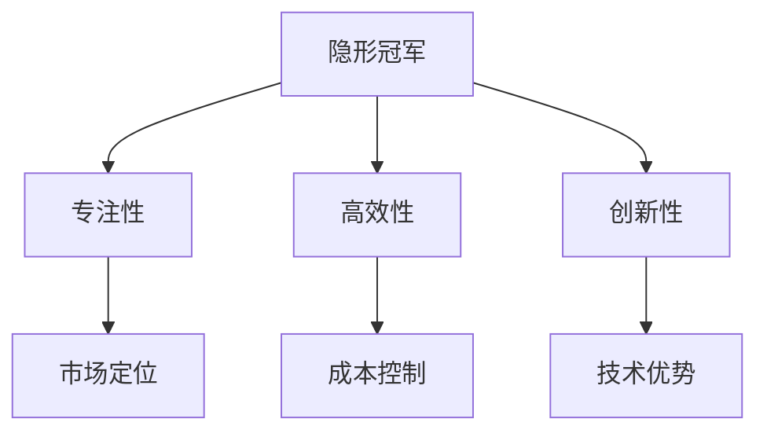
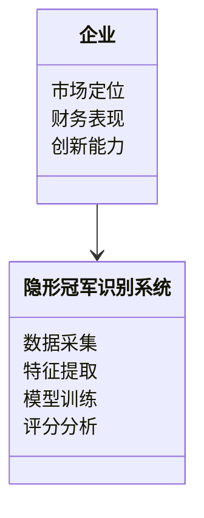

                 


# 彼得林奇的"隐形冠军"在服务业中的发掘

## 关键词：隐形冠军，彼得林奇，服务业，投资策略，企业分析

## 摘要：本文深入探讨了彼得林奇提出的“隐形冠军”概念在服务业中的应用，分析了隐形冠军在服务业中的特征、识别标准及成功要素，结合实际案例，详细阐述了如何通过系统化的分析方法识别和投资于这些隐形冠军企业。

---

# 第1章: "隐形冠军"的定义与特征

## 1.1 "隐形冠军"的定义

### 1.1.1 什么是"隐形冠军"

"隐形冠军"一词由彼得·林奇在其投资理论中提出，指的是那些在特定行业中占据领先地位，但因规模较小或专注性较强而未被广泛认知的企业。这些企业往往在某个细分市场中具有强大的竞争优势，能够在激烈的市场竞争中脱颖而出。

### 1.1.2 "隐形冠军"的核心特征

1. **专注性**：隐形冠军通常专注于一个细分市场，避免与大型企业正面竞争。
2. **高效性**：它们以高效率和低成本运营，能够在竞争中保持优势。
3. **创新性**：隐形冠军往往通过技术创新或商业模式创新来巩固其市场地位。
4. **稳定性**：它们在市场波动中表现稳定，能够持续增长。

### 1.1.3 "隐形冠军"的边界与外延

隐形冠军的边界在于其专注性和市场定位。它们既不是行业巨擘，也不是初创企业，而是在特定领域内精耕细作的企业。其外延包括专注于某一区域、某一客户群体或某一技术的企业。

---

## 1.2 彼得林奇的"隐形冠军"投资理念

### 1.2.1 彼得林奇的投资风格

彼得·林奇以其在富达投资管理公司的投资业绩闻名，他主张投资于那些具有持续增长潜力的企业，尤其是那些被市场忽视的中小型企业。

### 1.2.2 "隐形冠军"在彼得林奇投资体系中的地位

隐形冠军是彼得林奇投资组合中的重要组成部分。他认为，这些企业由于专注于特定市场，往往具有较高的利润率和较低的竞争压力。

### 1.2.3 "隐形冠军"的识别标准

1. **专注性**：企业专注于某一细分市场。
2. **稳定性**：企业财务表现稳定，增长可持续。
3. **竞争优势**：企业在技术和市场上具有独特优势。

---

# 第2章: 服务业中的"隐形冠军"分析

## 2.1 服务业的行业特点

### 2.1.1 服务业的定义与分类

服务业是指为消费者提供无形产品或服务的行业，包括金融、医疗、教育、零售等多个领域。

### 2.1.2 服务业的竞争特点

服务业的竞争往往基于服务质量、客户体验和品牌忠诚度。与制造业相比，服务业的边际成本较低，但市场竞争更为激烈。

### 2.1.3 服务业的市场结构分析

服务业市场结构多样，从完全竞争到完全垄断不等。隐形冠军通常在完全竞争或寡头竞争市场中占据优势。

---

## 2.2 服务业中的"隐形冠军"特征

### 2.2.1 专注细分市场

隐形冠军往往专注于某一细分市场，例如一家专注于高端酒店管理的公司，或一家专注于在线教育平台的企业。

### 2.2.2 高客户满意度

隐形冠军通过提供高质量的服务和卓越的客户体验，建立长期客户关系。

### 2.2.3 高效率与低成本

隐形冠军通过优化运营流程和利用技术手段降低成本，提高效率。

---

## 2.3 服务业"隐形冠军"的识别标准

### 2.3.1 市场占有率分析

隐形冠军通常在特定细分市场中占据领先地位，具有较高的市场占有率。

### 2.3.2 财务表现分析

隐形冠军通常具有稳定的收入增长和较高的利润率，财务表现优于行业平均水平。

### 2.3.3 企业治理与创新能力

隐形冠军注重企业治理和创新能力，能够持续推出新产品或服务，满足客户需求。

---

# 第3章: "隐形冠军"的核心概念与联系

## 3.1 核心概念原理

### 3.1.1 "隐形冠军"的定义与属性

隐形冠军的定义基于其在特定市场中的专注性和高效性，其属性包括市场定位、竞争优势和增长潜力。

### 3.1.2 "隐形冠军"与其他企业类型的区别

| 比较维度 | 隐形冠军 | 传统巨头 | 初创企业 |
|----------|----------|----------|----------|
| 市场定位 | 细分市场 | 多元化市场 | 创新市场 |
| 竞争优势 | 专注与效率 | 资源与品牌 | 创新与速度 |
| 发展阶段 | 成熟稳定 | 成熟多元化 | 快速成长 |

### 3.1.3 "隐形冠军"的成功要素

1. **专注性**：专注于细分市场。
2. **高效性**：优化运营流程。
3. **创新性**：持续创新产品和服务。

## 3.2 核心概念对比表



---

# 第4章: 数学模型与算法实现

## 4.1 算法原理

### 4.1.1 数据采集与特征提取

隐形冠军识别的步骤包括数据采集、特征提取、模型训练和结果分析。

### 4.1.2 模型训练与结果分析

通过机器学习算法，如支持向量机（SVM）或随机森林（Random Forest），对隐形冠军进行分类。

### 4.1.3 评分模型的构建

构建评分模型，对企业的市场定位、财务表现和创新能力进行评分，综合得出隐形冠军的识别结果。

## 4.2 数学公式

$$ \text{评分} = \alpha \cdot \text{市场定位} + \beta \cdot \text{财务表现} + \gamma \cdot \text{创新能力} $$

其中，$\alpha + \beta + \gamma = 1$，权重系数根据行业特点调整。

---

# 第5章: 系统分析与架构设计

## 5.1 系统功能设计

### 5.1.1 领域模型



### 5.1.2 系统架构设计


### 5.1.3 接口设计与交互

系统通过API接口与企业数据源对接，进行实时数据分析和隐形冠军识别。

---

# 第6章: 项目实战与案例分析

## 6.1 项目实战

### 6.1.1 环境安装

安装Python和相关库（如scikit-learn、pandas）。

### 6.1.2 核心代码实现

```python
from sklearn.svm import SVC
from sklearn.metrics import accuracy_score

# 数据预处理
X = ...  # 特征数据
y = ...  # 标签

# 训练模型
model = SVC()
model.fit(X, y)

# 模型预测
y_pred = model.predict(X)
print("准确率:", accuracy_score(y, y_pred))
```

### 6.1.3 案例分析

以某家专注于在线教育的企业为例，分析其是否符合隐形冠军的特征，并进行评分。

---

# 第7章: 最佳实践与投资策略

## 7.1 投资策略

### 7.1.1 专注细分市场

选择专注于细分市场的企业进行投资。

### 7.1.2 关注财务指标

重点关注企业的财务表现，尤其是利润率和市场占有率。

### 7.1.3 坚持长期投资

隐形冠军的成长是长期的过程，需要投资者具备耐心。

---

## 7.2 总结

彼得林奇的“隐形冠军”理念为投资者提供了独特的视角。通过系统化的分析和识别方法，可以在服务业中找到具有潜力的企业，实现长期稳定的收益。

---

## 作者：AI天才研究院/AI Genius Institute & 禅与计算机程序设计艺术 /Zen And The Art of Computer Programming

---

# 结语

通过本文的深入分析，我们不仅了解了彼得林奇的“隐形冠军”概念，还探讨了其在服务业中的具体应用。希望本文能为投资者和企业管理者提供有价值的参考和启示。

