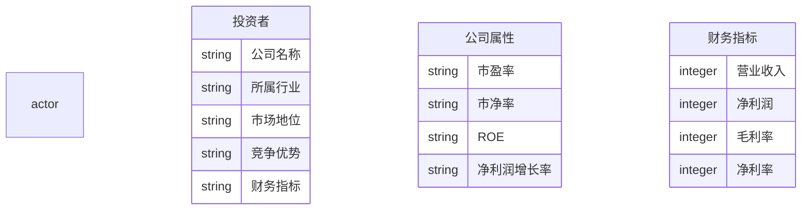
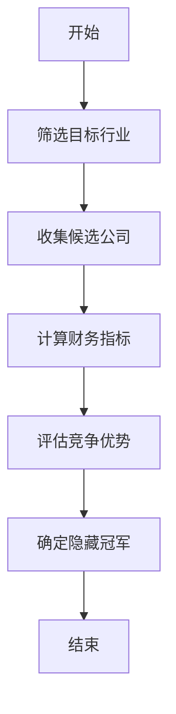
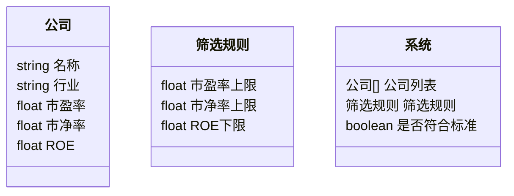
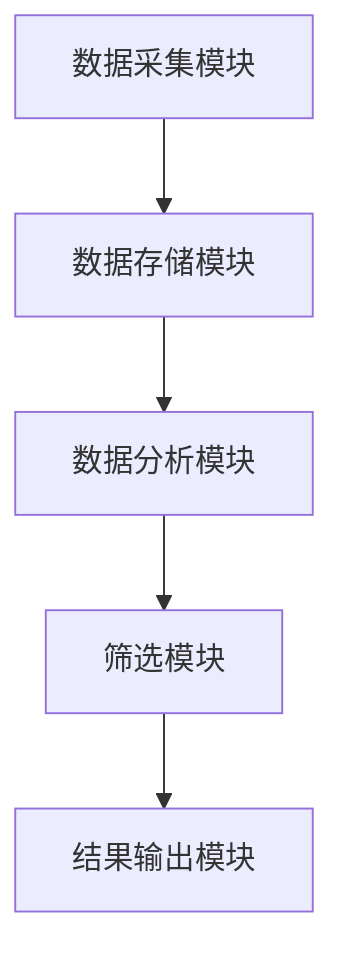
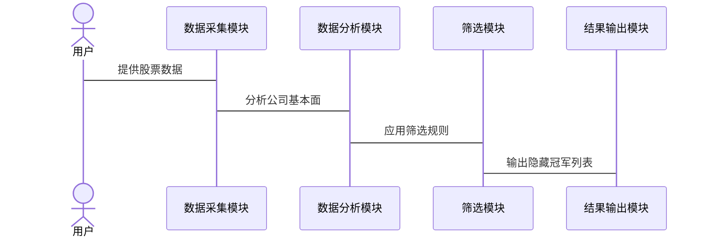

                 


# 彼得林奇的"隐藏冠军"发掘技巧

---

## 关键词：  
彼得林奇，隐藏冠军，投资技巧，股票筛选，价值发现，投资策略

---

## 摘要：  
本文深入探讨了彼得·林奇的“隐藏冠军”投资理念，系统地分析了如何识别和发掘那些在特定领域表现优异但未被市场充分认知的公司。文章从背景介绍、核心概念、算法原理、系统架构到项目实战，全面解析了隐藏冠军的发掘方法，并结合实际案例和数学模型，为投资者提供了实用的工具和策略。

---

## 目录

### 第一部分：背景介绍  
#### 1.1 隐藏冠军的定义  
- 什么是隐藏冠军？  
- 隐藏冠军的核心要素：市场地位、竞争优势、盈利能力  
- 彼得·林奇的投资理念：寻找那些尚未被市场充分挖掘的优质公司  

#### 1.2 隐藏冠军的特点  
- 未被市场充分认知  
- 具备强大的竞争优势  
- 持续稳定的盈利能力  

#### 1.3 隐藏冠军与其他类型公司的对比  
- 与蓝筹股、成长股的对比分析  
- 隐藏冠军的独特性：小而美，专注细分市场  

#### 1.4 隐藏冠军的投资价值  
- 长期稳定的投资回报  
- 低风险、高收益的潜在机会  

---

### 第二部分：核心概念与联系  
#### 2.1 隐藏冠军的核心概念  
- 市场地位：行业领先，细分市场龙头  
- 竞争优势：独特的商业模式、技术壁垒  
- 财务表现：稳定的收入和利润，低估值  

#### 2.2 隐藏冠军与其他公司对比的特征  
- 表格对比：隐藏冠军 vs 蓝筹股 vs 成长股  
- 隐藏冠军的优势：专注、灵活、高ROE  

#### 2.3 隐藏冠军的实体关系图  


---

### 第三部分：算法原理  
#### 3.1 隐藏冠军的筛选指标  
- 市盈率（PE）：$$ PE = \frac{股票价格}{每股收益} $$
- 市净率（PB）：$$ PB = \frac{股票价格}{每股净资产} $$
- 净资产收益率（ROE）：$$ ROE = \frac{净利润}{净资产} $$
- 净利润增长率：$$ 净利润增长率 = \frac{当年净利润 - 上年净利润}{上年净利润} \times 100\% $$

#### 3.2 隐藏冠军的筛选流程  


#### 3.3 隐藏冠军的数学模型  
- 多指标加权评分模型：$$ 评分 = 0.3 \times PE + 0.3 \times PB + 0.4 \times ROE $$

#### 3.4 算法实现代码  
```python
def calculate_pe(stock_price, earnings_per_share):
    return stock_price / earnings_per_share

def calculate_pb(stock_price, book_value_per_share):
    return stock_price / book_value_per_share

def calculate_roe(net_profit, equity):
    return net_profit / equity

def find_hidden_champions(stocks):
    hidden_champions = []
    for stock in stocks:
        pe = calculate_pe(stock['price'], stock['earnings_per_share'])
        pb = calculate_pb(stock['price'], stock['book_value_per_share'])
        roe = calculate_roe(stock['net_profit'], stock['equity'])
        score = 0.3 * pe + 0.3 * pb + 0.4 * roe
        if score > 2.5:
            hidden_champions.append(stock)
    return hidden_champions
```

---

### 第四部分：系统分析与架构设计  
#### 4.1 系统分析  
- 问题场景：如何构建一个自动化的隐藏冠军筛选系统？  
- 需求分析：数据采集、分析、筛选、可视化  

#### 4.2 领域模型  


#### 4.3 系统架构设计  


#### 4.4 系统交互设计  


---

### 第五部分：项目实战  
#### 5.1 项目背景  
- 选择一个行业（如制造业）作为案例  
- 数据来源：财务报表、行业报告  

#### 5.2 代码实现  
```python
import pandas as pd

# 假设data是包含公司数据的DataFrame
data = pd.read_csv('companies.csv')

# 筛选市盈率 < 15，市净率 < 2，ROE > 10%
data['is_hidden_champion'] = data.apply(lambda row: 
    row['PE'] < 15 and row['PB'] < 2 and row['ROE'] > 10, axis=1)

# 输出隐藏冠军列表
hidden_champions = data[data['is_hidden_champion']]
print(hidden_champions)
```

#### 5.3 案例分析  
- 某公司案例：市盈率12，市净率1.8，ROE 12%  
- 结论：符合隐藏冠军的条件，具有投资价值  

---

### 第六部分：最佳实践  
#### 6.1 投资策略总结  
- 长期关注，持续跟踪  
- 分散投资，降低风险  

#### 6.2 投资注意事项  
- 估值陷阱：避免高估的公司  
- 行业变化：关注行业趋势和政策影响  

#### 6.3 拓展阅读  
- 彼得·林奇的《寻找alpha》  
- 投资分析经典书籍推荐  

---

## 附录  
#### 工具指南  
- 数据来源：Yahoo Finance、 Bloomberg  
- 工具推荐：Python、Pandas、Matplotlib  

#### 术语表  
- 隐藏冠军：未被市场充分认知，但具备强大竞争优势的公司  
- 市盈率（PE）：股价与每股收益的比率  
- 市净率（PB）：股价与每股净资产的比率  

---

## 作者：  
**AI天才研究院/AI Genius Institute**  
**禅与计算机程序设计艺术/Zen And The Art of Computer Programming**

