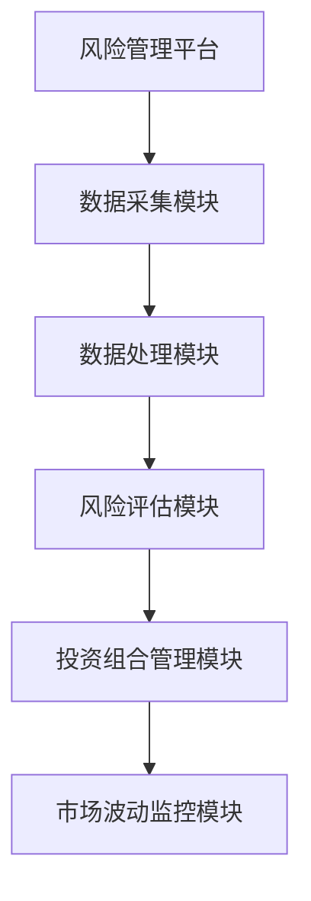

                 


# 彼得林奇的风险管理原则

## 关键词：风险管理, 彼得林奇, 投资原则, 风险评估, 投资组合管理, 数学模型

## 摘要：  
彼得·林奇是全球著名投资专家，他提出的风险管理原则在投资领域具有深远影响。本文将详细阐述彼得林奇的风险管理原则，包括风险评估、投资组合管理、市场波动应对策略等核心内容，并结合数学模型和系统架构设计，深入分析这些原则的实际应用。

---

## 第1章: 风险管理的核心概念

### 1.1 风险管理的定义与背景

#### 1.1.1 风险的定义与分类
风险是指在投资过程中，由于不确定因素导致投资收益低于预期甚至出现损失的可能性。根据来源和性质，风险可以分为市场风险、流动性风险、信用风险和操作风险。

#### 1.1.2 风险管理的重要性
在投资领域，风险管理是确保投资组合稳健增长的关键。有效的风险管理能够帮助投资者在市场波动中降低损失，抓住投资机会。

#### 1.1.3 彼得·林奇与风险管理的联系
彼得·林奇以其长期投资和价值投资理念闻名，他强调通过分散投资和持续监控来管理风险，确保投资组合的稳定性。

### 1.2 彼得·林奇的背景与投资理念

#### 1.2.1 彼得·林奇的生平简介
彼得·林奇是美国著名的投资专家，曾管理富达麦哲伦基金，取得了卓越的投资业绩。

#### 1.2.2 彼得·林奇的投资哲学
他强调长期投资、价值投资和分散投资，认为市场波动是投资机会的来源。

#### 1.2.3 彼得·林奇风险管理原则的核心思想
林奇的风险管理原则强调通过分散投资、定期评估和动态调整来控制风险，确保投资组合的稳健性。

---

## 第2章: 风险评估与量化

### 2.1 风险的量化方法

#### 2.1.1 波动率的计算公式
波动率衡量资产价格的波动程度，公式为：
$$ \sigma = \sqrt{\frac{1}{n-1} \sum_{i=1}^{n} (x_i - \bar{x})^2} $$

#### 2.1.2 风险值（VaR）的定义与计算
VaR是指在给定置信水平下，投资组合可能的最大损失。公式为：
$$ VaR = \mu + z \times \sigma $$

#### 2.1.3 风险调整后的收益（RAROC）
RAROC考虑了风险因素，公式为：
$$ RAROC = \frac{ROE}{资本风险系数} $$

### 2.2 彼得林奇的风险评估模型

#### 2.2.1 模型的输入参数
包括历史收益率、波动率、相关系数等。

#### 2.2.2 模型的计算过程
通过历史数据分析，计算资产的波动率和相关性，评估投资组合的整体风险。

#### 2.2.3 模型的输出结果
输出包括投资组合的风险值和风险调整后的收益。

---

## 第3章: 风险分散与投资组合管理

### 3.1 风险分散的基本原理

#### 3.1.1 风险分散的定义
通过投资不同资产或行业降低风险。

#### 3.1.2 风险分散的实现方法
包括资产配置、行业分散和地域分散。

#### 3.1.3 风险分散的优缺点
优点是降低风险，缺点是可能降低收益。

### 3.2 投资组合管理的策略

#### 3.2.1 投资组合的构建原则
根据风险承受能力和投资目标选择资产。

#### 3.2.2 投资组合的优化方法
通过调整资产权重优化风险收益比。

#### 3.2.3 投资组合的风险控制
定期重新评估和调整投资组合。

---

## 第4章: 市场波动与风险管理

### 4.1 市场波动的定义与影响

#### 4.1.1 市场波动的来源
包括经济周期、政策变化和市场情绪等。

#### 4.1.2 市场波动对投资的影响
波动可能导致收益波动和投资损失。

#### 4.1.3 市场波动的预测方法
通过技术分析和基本面分析预测市场波动。

### 4.2 彼得林奇应对市场波动的策略

#### 4.2.1 灵活调整投资组合
根据市场变化及时调整资产配置。

#### 4.2.2 逆向投资的策略
在市场下跌时寻找被低估的投资机会。

#### 4.2.3 风险控制的具体措施
设定止损点和风险预算。

---

## 第5章: 风险管理的数学模型与公式

### 5.1 风险管理的数学模型

#### 5.1.1 风险值（VaR）的公式
$$ VaR = \mu + z \times \sigma $$

#### 5.1.2 风险调整后的收益（RAROC）的公式
$$ RAROC = \frac{ROE}{资本风险系数} $$

### 5.2 彼得林奇风险管理模型的数学推导

#### 5.2.1 波动率的计算
$$ \sigma = \sqrt{\frac{1}{n-1} \sum_{i=1}^{n} (x_i - \bar{x})^2} $$

#### 5.2.2 投资组合风险的计算
$$ \sigma_p = \sqrt{w_1^2 \sigma_1^2 + w_2^2 \sigma_2^2 + 2w_1w_2 Cov(1,2) } $$

---

## 第6章: 系统分析与架构设计方案

### 6.1 风险管理系统的需求分析

#### 6.1.1 系统目标
实现风险评估、投资组合管理和市场波动应对。

#### 6.1.2 系统功能需求
包括数据采集、风险评估、投资组合优化和市场监控。

#### 6.1.3 系统性能需求
要求高效的数据处理和实时监控能力。

### 6.2 系统架构设计

#### 6.2.1 系统架构图


#### 6.2.2 系统架构图说明
- 数据采集模块负责收集市场数据。
- 数据处理模块进行清洗和转换。
- 风险评估模块计算VaR和RAROC。
- 投资组合管理模块优化资产配置。
- 市场波动监控模块实时跟踪市场变化。

---

## 第7章: 项目实战

### 7.1 环境安装

#### 7.1.1 安装Python和相关库
安装Python和pandas、numpy等库。

### 7.2 系统核心实现源代码

#### 7.2.1 波动率计算代码
```python
import numpy as np
def calculate_volatility(prices):
    returns = np.log(prices[1:] / prices[:-1])
    return np.std(returns)
```

#### 7.2.2 VaR计算代码
```python
import scipy.stats as stats
def calculate_var(returns, confidence_level=0.95):
    alpha = stats.norm.ppf(confidence_level)
    return alpha * np.std(returns)
```

### 7.3 代码应用解读与分析

#### 7.3.1 波动率计算
```python
prices = [100, 105, 98, 102, 104]
volatility = calculate_volatility(prices)
print("波动率:", volatility)
```

#### 7.3.2 VaR计算
```python
returns = [0.05, -0.02, 0.03, -0.01]
var = calculate_var(returns)
print("VaR:", var)
```

### 7.4 实际案例分析

#### 7.4.1 案例分析
假设一个投资组合的历史收益率为[0.02, -0.01, 0.03, -0.02]，计算VaR。

#### 7.4.2 结果解读
VaR为-0.02，意味着在95%置信水平下，投资组合的最大损失为2%。

### 7.5 项目小结

#### 7.5.1 小结
通过代码实现风险管理模型，能够有效评估投资组合的风险，帮助投资者做出决策。

---

## 第8章: 最佳实践、小结、注意事项和拓展阅读

### 8.1 最佳实践
定期评估投资组合，及时调整资产配置，避免过度集中风险。

### 8.2 小结
彼得·林奇的风险管理原则强调分散投资、长期持有和动态调整，结合数学模型和系统设计，能够有效管理投资风险。

### 8.3 注意事项
投资者需根据自身风险承受能力调整投资策略，避免盲目跟风。

### 8.4 拓展阅读
推荐阅读彼得·林奇的《投资最重要的事情》和风险管理相关的书籍。

---

## 作者：AI天才研究院/AI Genius Institute & 禅与计算机程序设计艺术 /Zen And The Art of Computer Programming

