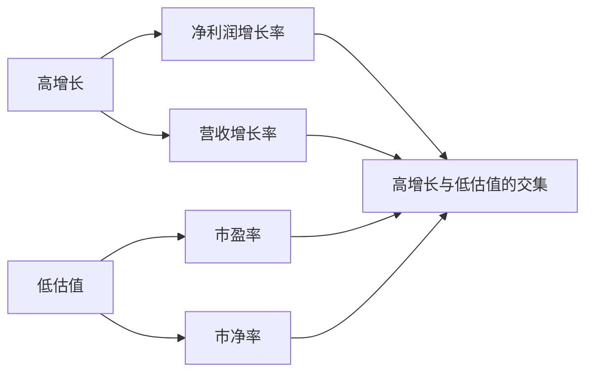
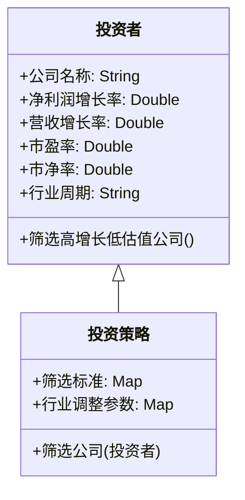
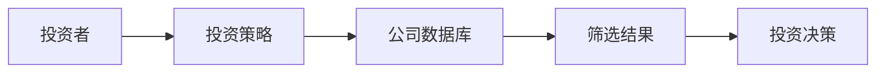
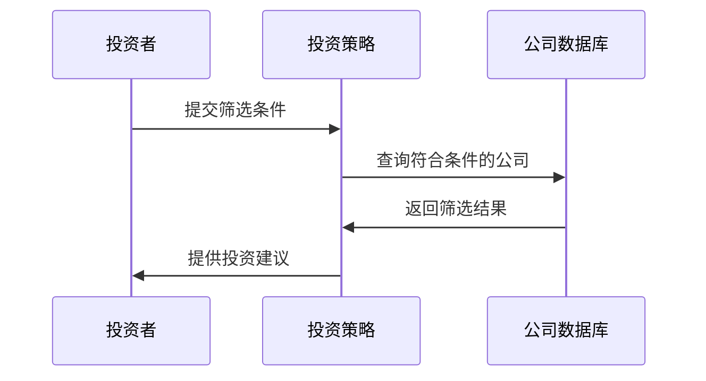

                 


好的，我明白了。让我一步步地分析和撰写这篇文章。

# 彼得林奇的"高增长低估值"在不同行业周期中的筛选

> 关键词：彼得林奇，高增长低估值，行业周期，投资策略，筛选方法

> 摘要：本文探讨了彼得林奇的“高增长低估值”投资策略，并分析其在不同行业周期中的应用。通过数学模型、系统架构设计和实际案例，详细阐述了如何筛选高增长低估值的投资标的，并提供了最佳实践和注意事项。

---

## 第一部分: 背景介绍

### 第1章: 投资理念的背景

#### 1.1 投资理念的背景

- **现代投资学的演变**：从传统价值投资到量化分析的发展历程。
- **彼得·林奇的投资风格**：注重基本面分析，寻找具有持续增长潜力的公司。
- **高增长低估值策略的提出背景**：在20世纪80年代，彼得·林奇通过筛选高增长但低估值的公司取得了卓越的投资业绩。

#### 1.2 高增长低估值的核心概念

- **高增长的定义与衡量标准**：净利润增长率和营收增长率。
- **低估值的定义与衡量标准**：市盈率和市净率。
- **行业周期的基本概念**：行业周期的定义与分类，不同周期的特点。

#### 1.3 高增长低估值策略的意义

- 在不同行业周期中，高增长低估值策略的有效性分析。
- 策略的优势与局限性。

### 第2章: 核心概念与联系

#### 2.1 高增长低估值的原理

- 使用Mermaid流程图展示高增长与低估值的关系。



- 通过表格对比高增长和低估值的属性特征。

| 属性 | 高增长 | 低估值 |
|------|--------|--------|
| 净利润增长率 | >20% | - |
| 营收增长率 | >20% | - |
| 市盈率 | - | <20 |
| 市净率 | - | <1.5 |

### 第3章: 高增长低估值策略的数学模型

#### 3.1 高增长的衡量指标

- 净利润增长率公式：
$$ \text{净利润增长率} = \frac{\text{本期净利润} - \text{上期净利润}}{\text{上期净利润}} \times 100\% $$

- 营收增长率公式：
$$ \text{营收增长率} = \frac{\text{本期营收} - \text{上期营收}}{\text{上期营收}} \times 100\% $$

#### 3.2 低估值的衡量指标

- 市盈率公式：
$$ \text{市盈率} = \frac{\text{股票价格}}{\text{每股收益}} $$

- 市净率公式：
$$ \text{市净率} = \frac{\text{股票价格}}{\text{每股净资产}} $$

#### 3.3 高增长低估值的综合筛选公式

- 筛选标准：
$$ \text{净利润增长率} > 20\% \quad \text{且} \quad \text{市盈率} < 20 $$

- 行业周期调整。

---

## 第二部分: 系统分析与架构设计

### 第4章: 问题场景介绍

- 投资者在不同行业周期中如何应用高增长低估值策略。

### 第5章: 系统功能设计

- **领域模型类图**：


### 第6章: 系统架构设计

- **系统架构图**：


### 第7章: 接口设计

- **筛选接口**：
```http
POST /api/screen
Content-Type: application/json

{
    "净利润增长率": 30,
    "营收增长率": 25,
    "市盈率": 18,
    "市净率": 1.2,
    "行业周期": "复苏期"
}
```

### 第8章: 交互序列图

- **筛选流程**：


---

## 第三部分: 项目实战

### 第9章: 环境安装

- **Python环境**：安装Python 3.x及以上版本。
- **依赖库安装**：使用pip安装numpy、pandas、matplotlib。

### 第10章: 核心代码实现

#### 10.1 筛选函数

```python
def screen_high_growth_low_valuation(company_data, industry_cycle='复苏期'):
    # 筛选高增长低估值的公司
    selected = []
    for company in company_data:
        if (company['净利润增长率'] > 20 and company['营收增长率'] > 20 and 
            company['市盈率'] < 20 and company['市净率'] < 1.5):
            selected.append(company)
    return selected
```

#### 10.2 行业周期调整

```python
def adjust_for_industry_cycle(selected_companies, cycle='复苏期'):
    # 根据行业周期调整筛选标准
    adjusted = []
    for company in selected_companies:
        if cycle == '复苏期':
            if company['市盈率'] < 25:
                adjusted.append(company)
        elif cycle == '繁荣期':
            if company['市盈率'] < 15:
                adjusted.append(company)
    return adjusted
```

### 第11章: 实际案例分析

#### 11.1 案例背景

- **行业周期**：经济复苏期。
- **筛选标准**：净利润增长率 > 20%，营收增长率 > 20%，市盈率 < 25。

#### 11.2 数据分析

| 公司名称 | 净利润增长率 | 营收增长率 | 市盈率 | 市净率 | 行业周期 |
|----------|---------------|------------|--------|---------|----------|
| 公司A    | 25%           | 22%        | 20     | 1.3     | 复苏期    |
| 公司B    | 18%           | 19%        | 22     | 1.4     | 复苏期    |
| 公司C    | 30%           | 25%        | 18     | 1.2     | 复苏期    |

#### 11.3 结果解读

- 符合筛选标准的公司：公司A和公司C。
- 行业周期调整后，公司A的市盈率刚好达标，公司C更具优势。

---

## 第四部分: 总结与注意事项

### 第12章: 最佳实践

- **定期调整筛选标准**：根据市场变化和行业周期调整。
- **分散投资**：避免过度集中于单一行业或公司。
- **长期持有**：耐心等待公司价值的实现。

### 第13章: 小结

- 彼得林奇的高增长低估值策略在不同行业周期中具有显著优势。
- 通过系统化的方法和工具，投资者可以更好地筛选出优质标的。

### 第14章: 注意事项

- 风险提示：高增长公司可能面临高波动性。
- 数据准确性：确保数据来源可靠。
- 保持学习：市场环境不断变化，需持续学习和调整策略。

### 第15章: 拓展阅读

- 推荐书籍：《彼得·林奇的成功投资》。
- 在线资源：行业周期分析报告和投资策略博客。

---

## 作者信息

作者：AI天才研究院/AI Genius Institute & 禅与计算机程序设计艺术/Zen And The Art of Computer Programming

---

希望这篇文章能满足您的需求。如果需要进一步调整或补充，请随时告诉我。

