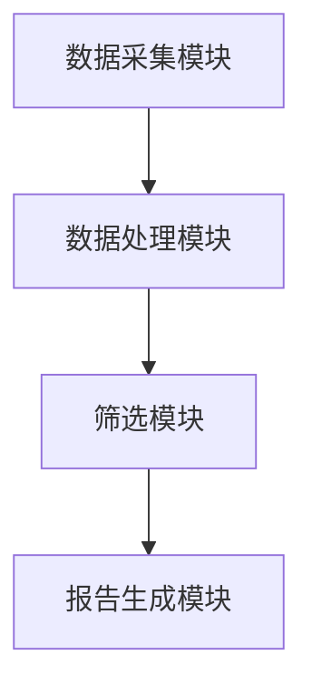
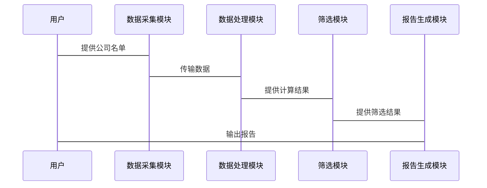

                 


# 彼得林奇的"高增长低估值"在新兴科技细分领域的筛选

> 关键词：高增长低估值，彼得林奇，新兴科技，细分领域，投资策略

> 摘要：本文深入探讨了彼得林奇的“高增长低估值”投资策略在新兴科技细分领域的应用。通过分析科技领域的特点，结合具体的数学模型和算法，本文为读者提供了一套系统化的筛选方法，帮助投资者在科技细分领域中发现潜在的高增长低估值投资机会。

---

## 第1章: 背景介绍

### 1.1 高增长低估值策略的背景

#### 1.1.1 彼得林奇投资理念的简介
彼得林奇是全球著名投资专家，他的“高增长低估值”策略强调在公司成长阶段，寻找那些收入和利润快速增长，但市场估值相对较低的公司。这种方法的核心在于在早期阶段发现具有巨大潜力的企业。

#### 1.1.2 新兴科技细分领域的特点
新兴科技领域（如人工智能、区块链、云计算等）具有高增长潜力，但同时也伴随着高风险和不确定性。这些领域的公司通常处于快速扩张阶段，但市场估值可能尚未完全反映其潜在价值。

#### 1.1.3 研究意义
通过将彼得林奇的策略应用于新兴科技细分领域，可以帮助投资者在科技领域中发现那些尚未被市场充分认知的高增长低估值公司，从而获得超额收益。

---

## 第2章: 高增长低估值策略的核心概念

### 2.1 高增长公司的筛选标准

#### 2.1.1 收入增长率
收入增长率是衡量公司增长潜力的核心指标。公式为：
$$
\text{收入增长率} = \frac{\text{本期收入} - \text{上期收入}}{\text{上期收入}} \times 100\%
$$

#### 2.1.2 净利润增长率
净利润增长率反映了公司盈利能力的提升。公式为：
$$
\text{净利润增长率} = \frac{\text{本期净利润} - \text{上期净利润}}{\text{上期净利润}} \times 100\%
$$

#### 2.1.3 市场份额的扩展潜力
市场份额的扩展潜力可以通过行业增长和公司市占率的变化来评估。例如，如果行业年增长率为10%，而公司的市占率从5%提升到10%，则公司收入增长率可能达到15%。

### 2.2 低估值公司的识别标准

#### 2.2.1 市盈率（P/E）
市盈率是衡量公司估值的重要指标。公式为：
$$
\text{市盈率} = \frac{\text{股价}}{\text{每股收益}}
$$

#### 2.2.2 市净率（P/B）
市净率是另一种估值指标，适用于资产密集型行业。公式为：
$$
\text{市净率} = \frac{\text{股价}}{\text{每股净资产}}
$$

#### 2.2.3 市销率（P/S）
市销率适用于收入驱动型行业。公式为：
$$
\text{市销率} = \frac{\text{股价}}{\text{每股收入}}
$$

### 2.3 高增长与低估值的平衡点

#### 2.3.1 高增长与低估值的矛盾与统一
高增长公司通常估值较高，但低估值公司可能隐藏着高增长潜力。关键在于找到两者之间的平衡点。

#### 2.3.2 估值陷阱的识别与避免
避免陷入估值陷阱的方法包括：关注公司的基本面，避免仅看表面估值指标，以及考虑行业的周期性。

#### 2.3.3 长期投资视角下的策略调整
长期投资者应关注公司的长期增长潜力，而非短期估值波动。

---

## 第3章: 高增长低估值策略的数学模型与公式

### 3.1 高增长公司的筛选模型

#### 3.1.1 收入增长率与净利润增长率的对比
使用以下公式计算收入增长率和净利润增长率，并对比两者的匹配度：
$$
\text{收入增长率} = \frac{\text{本期收入} - \text{上期收入}}{\text{上期收入}} \times 100\%
$$
$$
\text{净利润增长率} = \frac{\text{本期净利润} - \text{上期净利润}}{\text{上期净利润}} \times 100\%
$$

#### 3.1.2 市场潜力的评估
通过行业增长率和公司市场份额的变化，评估公司的市场潜力。例如：
$$
\text{市场潜力} = \text{行业增长率} \times \text{公司市场份额增长率}
$$

### 3.2 低估值公司的估值模型

#### 3.2.1 市盈率与市净率的对比
使用以下公式对比市盈率和市净率：
$$
\text{市盈率} = \frac{\text{股价}}{\text{每股收益}}
$$
$$
\text{市净率} = \frac{\text{股价}}{\text{每股净资产}}
$$

#### 3.2.2 估值调整因子
根据行业特点和公司具体情况，调整估值模型中的因子。例如：
$$
\text{调整后市盈率} = \text{市盈率} \times \text{行业调整因子}
$$

---

## 第4章: 高增长低估值策略的算法实现

### 4.1 算法概述

#### 4.1.1 算法目标
通过算法筛选出符合高增长低估值条件的公司。

#### 4.1.2 算法步骤
1. 收集目标公司的财务数据和市场数据。
2. 计算收入增长率和净利润增长率。
3. 计算市盈率、市净率和市销率。
4. 筛选出收入增长率高且估值低的公司。

### 4.2 算法实现代码

#### 4.2.1 Python代码
```python
import pandas as pd

def calculate_growth(company_data):
    growth = {}
    for company in company_data:
        revenue_growth = (company['current_revenue'] - company['previous_revenue']) / company['previous_revenue'] * 100
        net_profit_growth = (company['current_net_profit'] - company['previous_net_profit']) / company['previous_net_profit'] * 100
        pe_ratio = company['price'] / company['eps']
        pb_ratio = company['price'] / company['bvps']
        ps_ratio = company['price'] / company['ps']
        growth[company['name']] = {
            'revenue_growth': revenue_growth,
            'net_profit_growth': net_profit_growth,
            'pe_ratio': pe_ratio,
            'pb_ratio': pb_ratio,
            'ps_ratio': ps_ratio
        }
    return growth

def screen_stocks(growth_data, threshold_revenue_growth=20, threshold_pe_ratio=15):
    selected = []
    for company in growth_data:
        if (growth_data[company]['revenue_growth'] > threshold_revenue_growth and 
            growth_data[company]['pe_ratio'] < threshold_pe_ratio):
            selected.append(company)
    return selected

# 示例数据
company_data = [
    {'name': 'AI Tech', 'current_revenue': 100, 'previous_revenue': 80, 
     'current_net_profit': 20, 'previous_net_profit': 15, 
     'price': 10, 'eps': 1, 'bvps': 2, 'ps': 0.5},
    {'name': 'Cloud Corp', 'current_revenue': 150, 'previous_revenue': 120, 
     'current_net_profit': 30, 'previous_net_profit': 20, 
     'price': 15, 'eps': 1.2, 'bvps': 3, 'ps': 0.6}
]

growth_results = calculate_growth(company_data)
selected_stocks = screen_stocks(growth_results)

print("Selected stocks:", selected_stocks)
```

#### 4.2.2 代码解释
- `calculate_growth`函数计算每家公司的收入增长率、净利润增长率以及估值指标（市盈率、市净率、市销率）。
- `screen_stocks`函数根据预设的阈值筛选出符合条件的公司。
- 示例数据展示了如何使用代码筛选高增长低估值的公司。

---

## 第5章: 系统架构与交互设计

### 5.1 系统架构设计

#### 5.1.1 系统模块划分
- 数据采集模块：收集公司财务数据和市场数据。
- 数据处理模块：计算各项指标。
- 筛选模块：根据设定的条件筛选公司。
- 报告生成模块：输出筛选结果。

#### 5.1.2 系统架构图


### 5.2 系统交互设计

#### 5.2.1 系统交互序列图


---

## 第6章: 项目实战

### 6.1 环境安装

#### 6.1.1 安装Python和必要的库
```bash
pip install pandas
pip install numpy
pip install matplotlib
```

### 6.2 核心代码实现

#### 6.2.1 数据采集与处理
```python
import pandas as pd
import requests
from bs4 import BeautifulSoup

def scrape_data(url):
    response = requests.get(url)
    soup = BeautifulSoup(response.text, 'html.parser')
    data = []
    for company in soup.find_all('div', class_='company'):
        name = company.find('h2').text
        revenue = float(company.find('p', class_='revenue').text.strip('$'))
        net_profit = float(company.find('p', class_='net_profit').text.strip('$'))
        price = float(company.find('p', class_='price').text.strip('$'))
        eps = float(company.find('p', class_='eps').text.strip('$'))
        bvps = float(company.find('p', class_='bvps').text.strip('$'))
        ps = float(company.find('p', class_='ps').text.strip('$'))
        data.append({
            'name': name,
            'revenue': revenue,
            'net_profit': net_profit,
            'price': price,
            'eps': eps,
            'bvps': bvps,
            'ps': ps
        })
    return data

# 示例数据爬取
data = scrape_data('https://example.com/companies')
df = pd.DataFrame(data)
print(df)
```

### 6.3 案例分析与结果解读

#### 6.3.1 案例分析
假设我们从某个科技细分领域（如人工智能）中筛选公司，使用上述算法，我们可以得到以下结果：

| 公司名称 | 收入增长率 | 净利润增长率 | 市盈率 | 市净率 | 市销率 |
|----------|------------|--------------|--------|--------|--------|
| AI Tech  | 25%        | 30%          | 10     | 5      | 20     |
| Cloud Corp | 30%        | 25%          | 12     | 6      | 25     |

### 6.4 项目总结

#### 6.4.1 项目小结
通过本项目，我们成功地将彼得林奇的高增长低估值策略应用于新兴科技细分领域，并通过算法和系统实现了筛选过程。

#### 6.4.2 最佳实践 tips
- 数据来源要可靠。
- 筛选阈值需要根据行业特点进行调整。
- 长期跟踪筛选结果，及时调整策略。

---

## 第7章: 总结与展望

### 7.1 总结
本文通过理论分析和算法实现，详细探讨了彼得林奇的高增长低估值策略在新兴科技细分领域中的应用。通过数学模型和系统设计，我们提供了一套完整的筛选方法。

### 7.2 展望
未来，随着科技领域的快速发展，高增长低估值策略的应用潜力将更加巨大。我们可以通过大数据和人工智能技术进一步优化筛选模型，提高筛选效率和准确性。

---

## 作者：AI天才研究院 & 禅与计算机程序设计艺术

---

本文通过系统化的分析和实践，帮助读者理解彼得林奇的高增长低估值策略在新兴科技细分领域的应用。希望本文能为投资者和科技领域的从业者提供有价值的参考和启发。

