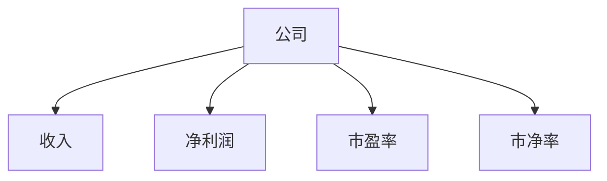
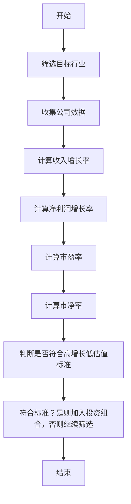
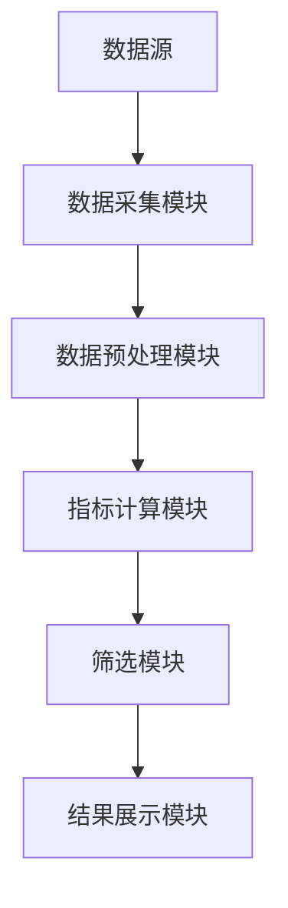
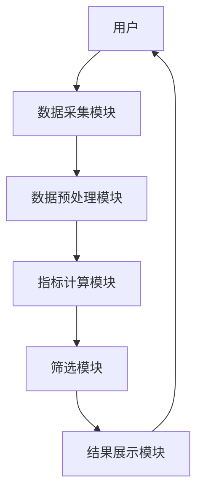

                 


# 彼得林奇的"高增长低估值"在新兴科技股中的筛选标准

## 关键词：彼得林奇，高增长，低估值，新兴科技股，投资策略，股票筛选

## 摘要：  
彼得林奇是全球著名投资专家，他提出的“高增长低估值”筛选标准在投资界具有重要影响。本文将详细分析这一标准在新兴科技股中的应用，从核心概念、算法原理、系统设计到项目实战，全面解读如何在新兴科技股中筛选出具有高增长潜力且估值合理的投资标的。

---

## 第一部分：背景介绍

### 第1章：彼得·林奇与高增长低估值投资理念

#### 1.1 彼得·林奇的生平与投资理念  
彼得·林奇是美国著名投资专家，曾任富达麦哲伦基金的经理，以优异的投资业绩闻名全球。他提出了一系列投资理念，其中“高增长低估值”策略尤为突出。这一策略的核心在于寻找那些增长速度快但估值相对较低的公司，尤其是在新兴行业中的科技股，这类股票往往具有更大的成长潜力。

#### 1.2 高增长与低估值的定义  
- **高增长**：指公司在过去几年中收入或利润增长速度快于行业平均水平。通常以收入增长率、净利润增长率等指标衡量。  
- **低估值**：指股票的价格相对于其内在价值被市场低估。常用的估值指标包括市盈率（P/E）、市净率（P/B）和市销率（P/S）。  

#### 1.3 新兴科技股的特点  
新兴科技股通常属于朝阳行业，具有较高的增长潜力，但同时也伴随着较高的风险。这类股票的估值可能较高，但通过合理的筛选标准，可以找到那些被市场低估的高成长公司。

#### 1.4 本章小结  
本章介绍了彼得·林奇的投资理念，重点分析了“高增长低估值”策略的核心概念，并结合新兴科技股的特点，为后续筛选标准的分析奠定了基础。

---

## 第二部分：核心概念与联系

### 第2章：高增长与低估值的核心概念

#### 2.1 高增长的衡量指标  
- **收入增长率**：公式为 $(\text{当年收入} - \text{上年收入}) / \text{上年收入} \times 100\%$。  
- **净利润增长率**：公式为 $(\text{当年净利润} - \text{上年净利润}) / \text{上年净利润} \times 100\%$。  
- **营业利润率**：公式为 $\text{净利润} / \text{营业收入}$。  

#### 2.2 低估值的衡量指标  
- **市盈率（P/E）**：公式为 $\text{股价} / \text{每股净利润}$。  
- **市净率（P/B）**：公式为 $\text{股价} / \text{每股净资产}$。  
- **市销率（P/S）**：公式为 $\text{股价} / \text{每股营业收入}$。  

#### 2.3 高增长与低估值的关系  
高增长公司通常会被市场给予较高的估值，但当市场未充分认识到其增长潜力时，这些公司可能会出现低估值的情况。通过对比高增长与低估值的指标，可以筛选出具有投资价值的股票。

#### 2.4 核心概念对比表格  
| 指标类型 | 高增长指标 | 低估值指标 |
|----------|------------|------------|
| 收入增长率 | 收入增长率 > 行业平均 | -          |
| 净利润增长率 | 净利润增长率 > 行业平均 | -          |
| 市盈率 | - | 市盈率 < 行业平均 |
| 市净率 | - | 市净率 < 行业平均 |

#### 2.5 实体关系图（ER图）  


---

## 第三部分：算法原理讲解

### 第3章：高增长低估值筛选算法

#### 3.1 算法原理  
高增长低估值筛选算法的核心在于通过数学模型计算股票的估值和增长指标，筛选出同时满足高增长和低估值条件的股票。

#### 3.2 算法流程图  


#### 3.3 算法实现代码  
```python
import pandas as pd

def calculate_growth_ratios(data):
    # 计算收入增长率
    data['收入增长率'] = (data['收入'] / data['收入'].shift(1) - 1) * 100
    # 计算净利润增长率
    data['净利润增长率'] = (data['净利润'] / data['净利润'].shift(1) - 1) * 100
    return data

def calculate_valuation_ratios(data):
    # 计算市盈率
    data['市盈率'] = data['股价'] / data['每股净利润']
    # 计算市净率
    data['市净率'] = data['股价'] / data['每股净资产']
    return data

def screen_stocks(data, growth_threshold, valuation_threshold):
    data = calculate_growth_ratios(data)
    data = calculate_valuation_ratios(data)
    # 筛选高增长低估值的股票
    filtered = data[(data['收入增长率'] > growth_threshold) & 
                    (data['市盈率'] < valuation_threshold)]
    return filtered

# 示例数据
data = {
    '股价': [50, 60, 70],
    '收入': [100, 150, 200],
    '净利润': [20, 30, 40],
    '每股净利润': [2, 3, 4],
    '每股净资产': [10, 15, 20]
}

df = pd.DataFrame(data)
growth_threshold = 20
valuation_threshold = 15

result = screen_stocks(df, growth_threshold, valuation_threshold)
print(result)
```

#### 3.4 算法的数学模型  
高增长低估值筛选算法的数学模型如下：  
$$ \text{收入增长率} = \frac{\text{当年收入} - \text{上年收入}}{\text{上年收入}} \times 100\% $$  
$$ \text{市盈率} = \frac{\text{股价}}{\text{每股净利润}} $$  
通过对比收入增长率和市盈率，筛选出同时满足高增长和低估值条件的股票。

---

## 第四部分：系统分析与架构设计

### 第4章：系统分析与架构设计

#### 4.1 问题场景介绍  
新兴科技股的筛选需要结合多种因素，包括财务数据、行业趋势和市场估值等。通过构建一个系统化的框架，可以更高效地筛选出符合高增长低估值标准的股票。

#### 4.2 系统功能设计  
- **数据采集**：从数据库中提取公司财务数据和市场数据。  
- **指标计算**：计算收入增长率、净利润增长率、市盈率等指标。  
- **筛选逻辑**：根据预设的筛选标准，筛选出符合条件的股票。  
- **结果展示**：以可视化的方式展示筛选结果。

#### 4.3 系统架构设计  


#### 4.4 系统接口设计  
- **输入接口**：接收股票数据和筛选标准。  
- **输出接口**：输出符合筛选标准的股票列表。  

#### 4.5 系统交互序列图  


---

## 第五部分：项目实战

### 第5章：项目实战

#### 5.1 环境安装  
需要安装Python和相关库（如Pandas、Matplotlib等）。  

#### 5.2 核心实现代码  
```python
import pandas as pd
import matplotlib.pyplot as plt

def visualize_results(filtered_data):
    plt.figure(figsize=(10, 6))
    plt.scatter(filtered_data['收入增长率'], filtered_data['市盈率'], c='blue')
    plt.xlabel('收入增长率(%)')
    plt.ylabel('市盈率')
    plt.title('高增长低估值股票筛选结果')
    plt.grid(True)
    plt.show()

# 示例数据
data = {
    '股价': [50, 60, 70],
    '收入': [100, 150, 200],
    '净利润': [20, 30, 40],
    '每股净利润': [2, 3, 4],
    '每股净资产': [10, 15, 20]
}

df = pd.DataFrame(data)
growth_threshold = 20
valuation_threshold = 15

result = screen_stocks(df, growth_threshold, valuation_threshold)
visualize_results(result)
```

#### 5.3 实际案例分析  
以某新兴科技公司为例，分析其是否符合高增长低估值的筛选标准，并解释筛选结果。

#### 5.4 项目小结  
通过实际案例分析，验证了算法的有效性，并总结了在实际应用中需要注意的事项。

---

## 第六部分：最佳实践

### 第6章：最佳实践

#### 6.1 总结  
彼得·林奇的高增长低估值筛选标准为新兴科技股的投资提供了重要参考。通过系统化的分析和算法实现，可以更高效地筛选出具有投资价值的股票。

#### 6.2 注意事项  
- 数据的准确性和完整性至关重要。  
- 筛选标准需要根据市场变化进行调整。  
- 投资决策需要结合多方面的信息，而不仅仅依赖单一指标。  

#### 6.3 拓展阅读  
推荐阅读彼得·林奇的《彼得·林奇的投资 secrets》以及相关投资策略书籍。

---

## 作者：AI天才研究院/AI Genius Institute & 禅与计算机程序设计艺术 /Zen And The Art of Computer Programming  

---

这篇文章详细阐述了彼得·林奇的高增长低估值筛选标准在新兴科技股中的应用，从理论到实践，从算法到系统设计，全面解读了如何在科技股投资中应用这一策略。希望对读者在投资决策中提供有价值的参考。

