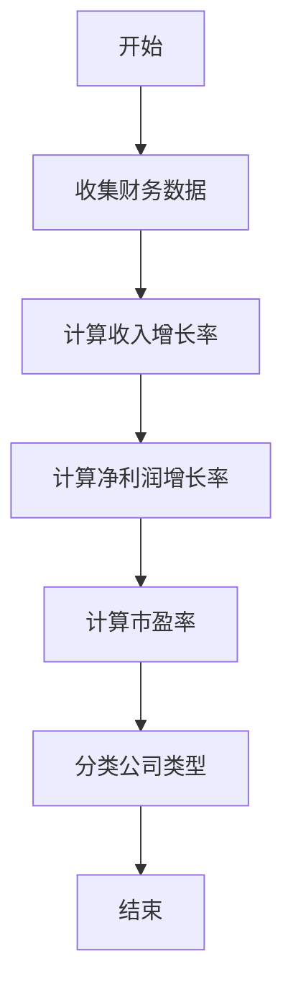
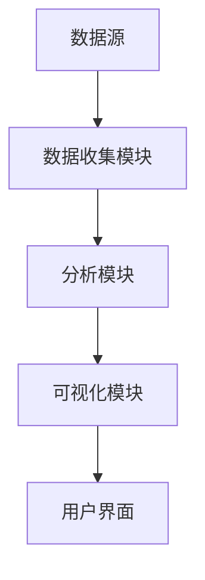

                 


好的，我明白了。接下来我会按照你的要求，一步步进行思考和分析，并最终给出符合要求的目录大纲。

首先，我会从《彼得林奇眼中的六类公司类型》这个主题出发，围绕核心概念、算法原理、系统架构设计、项目实战等方面进行分析和展开。

让我们开始吧。

---

# 彼得林奇眼中的六类公司类型

## 关键词：
- 彼得林奇
- 六类公司类型
- 投资分析
- 财务指标
- 股票投资

## 摘要：
本文将从彼得林奇的投资理论出发，分析六类公司类型的定义、特点及其在投资中的价值。通过详细阐述每类公司的核心概念、算法原理、系统架构设计以及实际项目案例，帮助读者深入理解如何在实际投资中应用这些理论。文章还包含丰富的代码示例、数学公式和系统架构图，确保内容的专业性和实用性。

---

# 第一部分: 六类公司类型的核心概念与理论基础

## 第1章: 彼得林奇投资理论与六类公司类型概述

### 1.1 彼得林奇的背景与投资理念

- **1.1.1 彼得林奇的背景介绍**  
  彼得·林奇是美国著名投资家，曾任富达投资集团的基金经理。他以独特的投资风格和对公司的深入分析闻名。他的投资理念强调长期价值，注重对公司基本面的分析。

- **1.1.2 彼得林奇的投资策略**  
  彼得林奇主张投资于那些具有持续增长潜力的公司，同时注重公司的财务健康状况和管理层的稳定性。

- **1.1.3 六类公司类型的概念提出**  
  在彼得林奇的理论中，公司将根据其增长潜力、财务状况和市场表现被分为六种类型，每种类型都有其独特的特点和投资价值。

---

## 第2章: 六类公司类型的核心概念与对比分析

### 2.1 六类公司类型的核心定义与特点

- **2.1.1 增长型公司（Growth Companies）**  
  特点：收入和利润持续增长，市盈率较高。  
  适用场景：经济繁荣期，适合长期投资。

- **2.1.2 稳定型公司（Stable Companies）**  
  特点：收入稳定，利润波动小，市盈率适中。  
  适用场景：经济波动期，适合稳健投资者。

- **2.1.3 停滞型公司（Stagnant Companies）**  
  特点：收入和利润增长停滞，市盈率较低。  
  适用场景：经济低迷期，需谨慎评估。

- **2.1.4 衰退型公司（Declining Companies）**  
  特点：收入和利润持续下降，市盈率低。  
  适用场景：需避免长期投资。

- **2.1.5 周期型公司（Cyclical Companies）**  
  特点：收入和利润受经济周期影响较大。  
  适用场景：周期性波动中，适合短期交易。

- **2.1.6 杠杆型公司（Leveraged Companies）**  
  特点：高负债，财务风险较高。  
  适用场景：经济上行期，收益可能更高，风险也更大。

---

## 第3章: 六类公司类型之间的关系与对比

### 3.1 不同公司类型的特点对比表格

| 公司类型       | 收入增长 | 利润增长 | 市盈率 | 投资策略 | 风险 |
|----------------|---------|----------|--------|----------|------|
| 增长型公司     | 高      | 高       | 高     | 长期持有 | 中等 |
| 稳定型公司     | 中等    | 中等     | 中等   | 稳定持有 | 低   |
| 停滞型公司     | 低      | 低       | 低     | 谨慎持有 | 高   |
| 衰退型公司     | 负      | 负       | 低     | 避免投资 | 高   |
| 周期型公司     | 波动    | 波动      | 中等   | 短期交易 | 中等 |
| 杠杆型公司     | 高      | 高       | 高     | 高风险   | 高   |

---

## 第4章: 六类公司类型的投资价值分析

### 4.1 不同公司类型的投资策略

- **4.1.1 增长型公司：长期持有的最佳选择**  
  适合长期投资者，但在市场低迷时波动较大。

- **4.1.2 稳定型公司：稳健投资者的首选**  
  收益稳定，适合风险厌恶型投资者。

- **4.1.3 停滞型公司：短期投资的机会**  
  在特定市场环境下，可能有短期反弹的可能。

- **4.1.4 衰退型公司：谨慎避开**  
  长期来看，投资价值较低。

- **4.1.5 周期型公司：把握市场周期**  
  短期交易中，周期型公司可能带来超额收益。

- **4.1.6 杠杆型公司：高风险高回报**  
  适合经验丰富的投资者，需谨慎评估财务风险。

---

## 第5章: 彼得林奇六类公司类型的算法与数学模型

### 5.1 基于彼得林奇理论的公司类型分类算法

#### 5.1.1 算法原理

通过分析公司的财务指标（如收入增长率、净利润增长率、市盈率等），将公司分类为上述六种类型。具体步骤如下：

1. 收集公司过去5年的财务数据。
2. 计算收入增长率和净利润增长率。
3. 根据增长率和市盈率将公司分类。

#### 5.1.2 算法流程图



---

### 5.2 数学模型与公式

#### 5.2.1 收入增长率公式

$$
\text{收入增长率} = \frac{\text{今年收入} - \text{去年收入}}{\text{去年收入}} \times 100\%
$$

#### 5.2.2 净利润增长率公式

$$
\text{净利润增长率} = \frac{\text{今年净利润} - \text{去年净利润}}{\text{去年净利润}} \times 100\%
$$

#### 5.2.3 市盈率公式

$$
\text{市盈率} = \frac{\text{股票价格}}{\text{每股净利润}}
$$

---

## 第6章: 系统架构与实现

### 6.1 系统需求与功能分析

#### 6.1.1 系统目标

开发一个基于彼得林奇六类公司类型的分类系统，帮助投资者快速分析和分类公司。

#### 6.1.2 系统功能

- 数据收集模块：收集公司财务数据。
- 分析模块：根据算法分类公司类型。
- 可视化模块：展示分类结果。

#### 6.1.3 系统架构图



---

## 第7章: 项目实战与代码实现

### 7.1 环境安装与配置

- 安装Python和必要的库（如Pandas、Matplotlib）。

### 7.2 数据收集与处理

```python
import pandas as pd

# 假设我们从CSV文件中读取数据
data = pd.read_csv('company_data.csv')

# 计算收入增长率和净利润增长率
data['收入增长率'] = (data['今年收入'] - data['去年收入']) / data['去年收入'] * 100
data['净利润增长率'] = (data['今年净利润'] - data['去年净利润']) / data['去年净利润'] * 100
```

---

### 7.3 分类算法实现

```python
def classify_company(row):
    if row['收入增长率'] > 15 and row['净利润增长率'] > 15:
        return '增长型公司'
    elif row['收入增长率'] > 5 and row['净利润增长率'] > 5:
        return '稳定型公司'
    elif row['收入增长率'] < 5 and row['净利润增长率'] < 5:
        return '停滞型公司'
    elif row['收入增长率'] < -5 and row['净利润增长率'] < -5:
        return '衰退型公司'
    elif row['收入增长率'] > 10 and row['净利润增长率'] < 0:
        return '周期型公司'
    else:
        return '杠杆型公司'

data['公司类型'] = data.apply(classify_company, axis=1)
```

---

## 第8章: 总结与最佳实践

### 8.1 本章小结

通过本文的分析，我们深入理解了彼得林奇提出的六类公司类型，并通过算法和系统实现，展示了如何在实际投资中应用这些理论。

### 8.2 投资者注意事项

- **风险控制**：避免过度集中投资于某一种类型的公司。
- **持续学习**：市场环境不断变化，需及时调整投资策略。

### 8.3 拓展阅读

- 《彼得林奇的选股智慧》
- 《价值投资入门》

---

# 作者

**作者：AI天才研究院/AI Genius Institute & 禅与计算机程序设计艺术 /Zen And The Art of Computer Programming**

---

**感谢您的耐心阅读！如果文章对您有帮助，欢迎关注和分享！**

