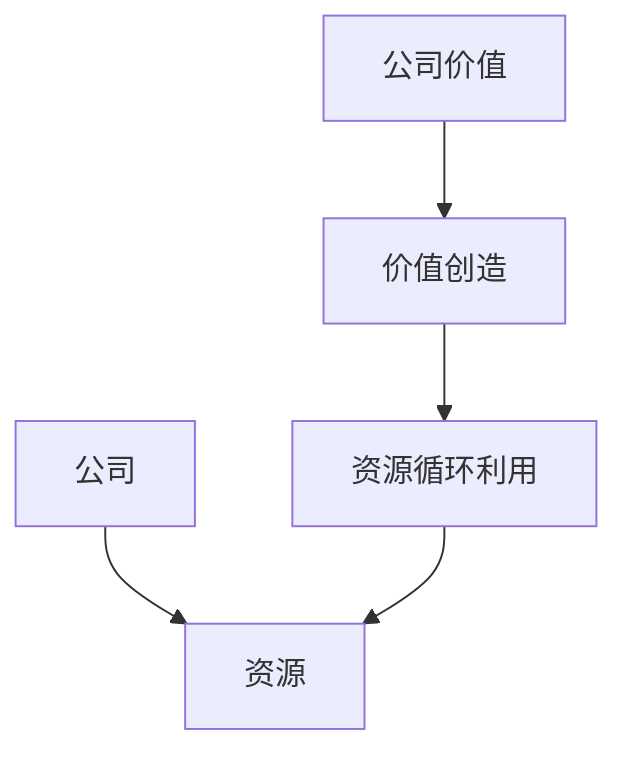

                 

# 循环经济模式下的公司估值方法

> 关键词：循环经济模式、公司估值、资源循环利用、可持续发展、经济模型

> 摘要：在循环经济模式下，公司估值方法需要适应新的经济环境，考虑资源的循环利用和可持续发展。本文将详细分析循环经济模式的特点，探讨其对传统估值方法的影响，并提出适应循环经济模式的新型公司估值方法。

---

# 第一部分: 循环经济模式下的公司估值背景与概念

## 第1章: 循环经济模式的概述

### 1.1 循环经济的基本概念

#### 1.1.1 循环经济的定义与特征

循环经济是一种以资源高效利用和循环利用为核心，以减量化、再利用、资源化为原则的经济模式。其主要特征包括：

- **减量化**：通过减少资源消耗和废物产生，降低对环境的压力。
- **再利用**：通过对废弃物进行再利用，延长资源的生命周期。
- **资源化**：将废弃物转化为可利用的资源，实现资源的循环流动。

循环经济的核心理念是实现“从摇篮到摇篮”的资源流动，而不是传统的“从摇篮到坟墓”。

#### 1.1.2 循环经济与传统经济的对比

| 经济模式 | 资源利用 | 废物处理 | 环境影响 |
|----------|----------|----------|----------|
| 传统经济 | 一次性使用，资源消耗 | 单独处理，可能产生污染 | 高，资源浪费 |
| 循环经济 | 资源循环利用 | 再利用和资源化 | 低，可持续 |

#### 1.1.3 循环经济的核心理念与实践

循环经济的核心理念是“资源节约”和“环境保护”。在实践中，企业需要通过技术创新和管理优化，实现资源的高效利用和循环流动。

---

### 1.2 循环经济模式下的公司特征

#### 1.2.1 循环经济模式下的企业运营特点

在循环经济模式下，企业的运营特点包括：

1. **资源高效利用**：企业通过技术创新和管理优化，最大限度地减少资源消耗。
2. **废弃物资源化**：企业将废弃物转化为新的资源，延长资源的生命周期。
3. **循环供应链**：企业构建循环供应链，实现资源在上下游企业之间的循环流动。

#### 1.2.2 企业资源循环利用的实现路径

企业可以通过以下路径实现资源的循环利用：

1. **内部循环**：企业内部将废弃物转化为可利用的资源。
2. **外部循环**：企业与上下游企业合作，构建循环供应链。
3. **技术创新**：通过技术创新，提高资源利用效率和废弃物资源化能力。

#### 1.2.3 循环经济对企业价值的影响

循环经济模式下的企业通常具有以下优势：

1. **成本优势**：通过资源循环利用，降低原材料和能源的消耗成本。
2. **竞争优势**：循环经济模式下的企业更具可持续性，能够在市场竞争中获得优势。
3. **品牌价值**：循环经济模式下的企业通常具有较高的品牌价值，吸引更多的消费者和投资者。

---

## 第2章: 循环经济模式下的公司估值问题背景

### 2.1 传统公司估值方法的局限性

#### 2.1.1 传统估值方法的核心假设

传统公司估值方法通常基于以下假设：

1. **资源有限性**：假设资源是有限的，企业需要不断寻找新的资源。
2. **一次性利用**：假设资源只能一次性使用，无法循环利用。
3. **环境影响忽略**：传统估值方法通常忽略环境影响，只关注企业的财务表现。

#### 2.1.2 传统估值方法在循环经济模式下的不足

1. **无法反映资源循环利用的价值**：传统估值方法无法准确反映循环经济模式下资源循环利用带来的价值。
2. **忽视环境成本**：传统估值方法通常忽略环境成本，而循环经济模式下，环境成本是一个重要的考量因素。
3. **缺乏长期视角**：传统估值方法通常关注短期财务表现，而循环经济模式下的企业更注重长期的可持续发展。

#### 2.1.3 循环经济模式对传统估值方法的挑战

1. **资源循环利用的复杂性**：循环经济模式下的资源循环利用涉及多个环节，传统估值方法难以准确评估。
2. **环境影响的量化**：循环经济模式下的企业需要考虑环境影响，但如何量化环境影响是一个难题。
3. **长期价值的不确定性**：循环经济模式下的企业可能面临更长的生命周期，但长期价值的不确定性增加了估值的难度。

---

### 2.2 循环经济模式下的估值问题描述

#### 2.2.1 循环经济模式下的公司价值构成

在循环经济模式下，公司价值的构成包括：

1. **资源价值**：包括企业内部资源的循环利用价值和外部资源的循环利用价值。
2. **环境价值**：包括企业对环境的保护价值和对资源的节约价值。
3. **社会价值**：包括企业在社会中的品牌形象和社会责任感。

#### 2.2.2 循环经济模式下的资源利用效率

循环经济模式下的资源利用效率通常高于传统经济模式。企业通过资源循环利用，能够显著降低资源消耗和环境影响。

#### 2.2.3 循环经济模式下的公司生命周期特点

循环经济模式下的公司生命周期通常更长，企业的可持续发展能力更强。企业通过资源循环利用和技术创新，能够在更长的时间内保持竞争优势。

---

### 2.3 循环经济模式下的估值问题解决思路

#### 2.3.1 循环经济模式下公司估值的核心目标

循环经济模式下的公司估值的核心目标是：

1. **准确反映资源循环利用的价值**：通过评估资源循环利用带来的经济效益，准确反映公司的价值。
2. **量化环境影响**：通过量化企业的环境影响，评估企业的可持续发展能力。
3. **长期价值评估**：通过长期价值评估，为投资者提供更全面的估值依据。

#### 2.3.2 循环经济模式下公司估值的关键因素

1. **资源循环利用效率**：包括企业内部资源循环利用效率和外部资源循环利用效率。
2. **环境影响量化**：包括企业对环境的正面和负面影响。
3. **长期价值驱动因素**：包括企业的技术创新能力、品牌价值和市场竞争力。

#### 2.3.3 循环经济模式下公司估值的实现路径

1. **构建循环经济模式下的估值模型**：通过构建适合循环经济模式的估值模型，准确反映资源循环利用的价值。
2. **量化环境影响**：通过环境影响评估，量化企业的环境影响。
3. **长期价值评估**：通过长期价值评估，为投资者提供更全面的估值依据。

---

## 第3章: 循环经济模式下的公司估值核心概念与联系

### 3.1 循环经济模式下的公司估值原理

#### 3.1.1 循环经济模式下公司估值的基本原理

循环经济模式下的公司估值的基本原理是：通过评估企业资源的循环利用价值和环境影响，准确反映企业的整体价值。

#### 3.1.2 循环经济模式下公司估值的核心要素

1. **资源循环利用价值**：包括企业内部资源循环利用价值和外部资源循环利用价值。
2. **环境影响**：包括企业对环境的正面和负面影响。
3. **长期价值驱动因素**：包括企业的技术创新能力、品牌价值和市场竞争力。

#### 3.1.3 循环经济模式下公司估值的关键假设

1. **资源循环利用的可行性**：假设企业能够实现资源的高效循环利用。
2. **环境影响的可量化性**：假设企业能够量化其环境影响。
3. **长期价值的可预测性**：假设企业能够在长期实现可持续发展。

---

### 3.2 核心概念对比分析

#### 3.2.1 循环经济模式与传统经济模式的对比

| 经济模式 | 资源利用 | 废物处理 | 环境影响 |
|----------|----------|----------|----------|
| 传统经济 | 一次性使用，资源消耗 | 单独处理，可能产生污染 | 高，资源浪费 |
| 循环经济 | 资源高效利用和循环利用 | 再利用和资源化 | 低，可持续 |

#### 3.2.2 循环经济模式下公司估值与传统估值的对比

| 估值模式 | 传统估值 | 循环经济估值 |
|----------|----------|--------------|
| 核心假设 | 资源有限性 | 资源循环利用 |
| 估值目标 | 短期财务表现 | 长期可持续发展 |
| 关键因素 | 财务指标 | 资源循环利用效率、环境影响 |

#### 3.2.3 循环经济模式下公司估值的关键差异

1. **估值目标**：传统估值目标是短期财务表现，而循环经济估值目标是长期可持续发展。
2. **关键因素**：传统估值的关键因素是财务指标，而循环经济估值的关键因素是资源循环利用效率和环境影响。
3. **环境影响**：传统估值忽略环境影响，而循环经济估值将环境影响作为重要因素。

---

### 3.3 实体关系图与流程图

#### 3.3.1 循环经济模式下的公司估值实体关系图

---

## 总结

循环经济模式下的公司估值方法需要适应新的经济环境，考虑资源的循环利用和可持续发展。本文详细分析了循环经济模式的特点，探讨了其对传统估值方法的影响，并提出了适应循环经济模式的新型公司估值方法。通过构建循环经济模式下的估值模型，量化环境影响，实现长期价值评估，能够为投资者提供更全面的估值依据。

---

**作者：AI天才研究院/AI Genius Institute & 禅与计算机程序设计艺术 /Zen And The Art of Computer Programming**

