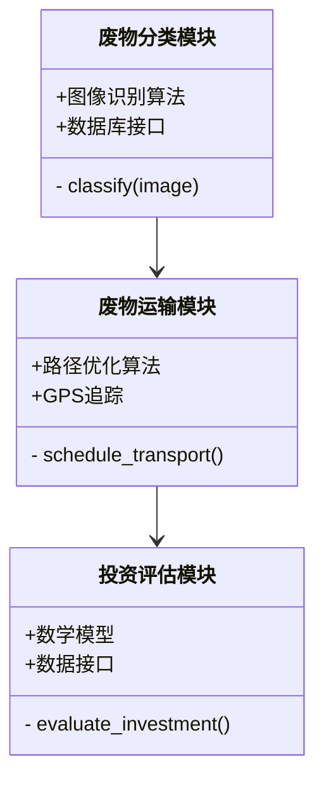

                 


# 循环经济模式下的废物回收企业投资

## 关键词：循环经济，废物回收，企业投资，数学建模，算法优化，系统设计

## 摘要：  
本文探讨了循环经济模式下废物回收企业的投资策略，分析了循环经济的核心概念、废物回收的现状与挑战，以及投资模式与算法优化。通过构建数学模型和系统架构，详细阐述了如何在循环经济框架下优化废物回收企业的投资回报，实现资源高效利用和环境可持续发展。

---

# 第1章 循环经济模式与废物回收的背景介绍

## 1.1 循环经济的基本概念与核心特征

### 1.1.1 循环经济的定义与内涵  
循环经济是一种以资源高效利用和循环利用为核心的发展模式，强调通过减少资源消耗、延长产品生命周期以及废弃物资源化，实现经济与环境的双赢。其核心在于“从摇篮到摇篮”的理念，即废弃物不是终点，而是新的资源起点。

### 1.1.2 循环经济与传统经济的区别  
与传统经济的“从摇篮到坟墓”线性模式不同，循环经济强调闭环系统，通过技术创新和制度创新，实现资源的循环利用。这种模式不仅减少了对自然资源的依赖，还降低了环境污染。

### 1.1.3 循环经济的重要性与发展趋势  
随着全球资源枯竭和环境问题的加剧，循环经济已成为全球可持续发展的重要方向。它不仅有助于减少碳排放，还能通过资源再利用创造新的经济增长点。

---

## 1.2 废物回收的现状与问题

### 1.2.1 全球废物产生与处理现状  
全球每年产生的废物量巨大，尤其是工业废料、电子废弃物和生活垃圾。这些废物的不当处理不仅浪费资源，还对环境造成严重威胁。

### 1.2.2 废物回收中的主要问题  
- **技术落后**：部分地区的废物处理技术简单，导致资源利用率低。  
- **成本高**：回收过程中的分拣、运输和处理成本较高，影响企业的盈利能力。  
- **政策支持不足**：部分地区缺乏有效的政策支持，企业难以获得稳定的资金来源。

### 1.2.3 废物回收对环境与经济的双重影响  
废物回收不仅有助于减少环境污染，还能为企业创造可观的经济价值。例如，回收塑料、金属和电子元件可以降低原材料成本，提升企业的竞争力。

---

## 1.3 循环经济模式下的废物回收特点

### 1.3.1 循环经济模式下的废物资源化  
在循环经济模式下，废物被视为资源的潜在来源。企业通过技术创新，将废弃物转化为新的产品或材料，实现资源的高效利用。

### 1.3.2 废物回收企业的核心目标  
循环经济模式下的废物回收企业，其核心目标是通过资源化利用，降低生产成本，同时减少对环境的负担。这需要企业具备高效的技术和创新的商业模式。

### 1.3.3 循环经济与废物回收的协同发展  
循环经济模式下的废物回收企业，通过与上下游企业的合作，构建闭环供应链，实现资源的高效流动和价值最大化。这种模式不仅提高了企业的竞争力，还促进了整个社会的可持续发展。

---

## 1.4 本章小结  
本章详细介绍了循环经济的基本概念、废物回收的现状与问题，以及循环经济模式下废物回收的特点。通过这些分析，我们为后续章节的深入探讨奠定了基础。

---

# 第2章 循环经济模式下的废物回收企业投资核心概念

## 2.1 循环经济模式下的废物回收系统

### 2.1.1 循环经济模式下的废物分类与处理  
在循环经济模式下，废物的分类与处理是实现资源化利用的关键。企业需要根据不同类型废弃物的特性，制定相应的处理策略，例如将塑料、金属和电子废弃物分开处理。

### 2.1.2 废物回收企业的核心业务流程  
- **收集与分类**：通过智能分拣技术，将废弃物分类为可回收材料和其他废物。  
- **处理与加工**：对可回收材料进行加工，提取有价值的部分，如金属提炼、塑料再造等。  
- **产品再利用**：将处理后的材料重新用于生产，形成闭环供应链。

### 2.1.3 循环经济模式下的资源流动与价值链  
在循环经济模式下，资源流动形成闭环，企业通过回收、加工和再利用，构建高效的价值链。这不仅降低了成本，还创造了新的商业模式。

---

## 2.2 废物回收企业的投资模式

### 2.2.1 投资主体与投资形式  
- **投资主体**：包括政府、企业和第三方机构。政府主要通过政策支持和资金投入，企业则直接参与回收和加工。  
- **投资形式**：包括直接投资、股权投资和合作投资等。

### 2.2.2 投资回报与风险分析  
- **投资回报**：通过资源化利用，企业可以降低原材料成本，提升产品附加值。  
- **风险分析**：技术风险、市场风险和政策风险是影响投资回报的主要因素。

### 2.2.3 循环经济模式下的投资驱动因素  
- **政策支持**：政府通过税收优惠和补贴，鼓励企业参与循环经济。  
- **技术进步**：技术创新降低了回收成本，提高了资源利用率。  
- **市场需求**：消费者对环保产品的需求增加，推动了循环经济的发展。

---

## 2.3 核心概念的ER实体关系图

### 2.3.1 实体关系图的构建  
以下是循环经济模式下废物回收企业的ER实体关系图：

```mermaid
er
    actor 投资者
    actor 政府机构
    actor 消费者
    entity 废物回收企业
    entity 可回收材料
    entity 再生产品
    entity 加工设备
    entity 供应链
    relationship - 投资者投资废物回收企业
    relationship - 政府机构提供政策支持
    relationship - 废物回收企业处理可回收材料
    relationship - 废物回收企业生产再生产品
    relationship - 再生产品通过供应链交付给消费者
    relationship - 加工设备用于处理可回收材料
```

### 2.3.2 实体关系图的分析  
通过上述实体关系图，可以看出循环经济模式下废物回收企业的运作流程。投资者、政府机构和消费者共同构成了系统的外部实体，而废物回收企业、可回收材料和再生产品则是系统的核心实体。

---

## 2.4 本章小结  
本章分析了循环经济模式下的废物回收系统，探讨了企业的核心业务流程和投资模式。通过构建ER实体关系图，我们清晰地展示了系统的运作机制。

---

# 第3章 废物回收企业投资的算法原理

## 3.1 废物回收企业投资评估模型

### 3.1.1 模型的输入与输出  
- **输入**：包括投资成本、回收率、市场价格等。  
- **输出**：包括投资回报率、回收周期、风险评估等。

### 3.1.2 模型的构建过程  
通过线性回归分析，建立投资回报与回收率、市场价格之间的关系模型。公式如下：

$$ ROI = \alpha \times Recovery Rate + \beta \times Market Price $$

其中，$\alpha$ 和 $\beta$ 是回归系数。

### 3.1.3 模型的验证与优化  
通过实际数据验证模型的准确性，并根据误差调整回归系数，确保模型能够准确预测投资回报。

---

## 3.2 投资回报率预测算法

### 3.2.1 算法的数学模型  
使用蒙特卡洛模拟，预测不同市场条件下的投资回报率。公式如下：

$$ ROI = \sum_{i=1}^{n} p_i \times r_i $$

其中，$p_i$ 是市场状态的概率，$r_i$ 是对应的投资回报率。

### 3.2.2 算法的实现步骤  
1. 确定市场状态及其概率。  
2. 计算每种市场状态下的投资回报率。  
3. 计算期望回报率和方差。  
4. 生成随机数，模拟不同市场状态下的回报率。  
5. 统计模拟结果，得出最终预测。

### 3.2.3 算法的优缺点分析  
优点：能够考虑多种市场因素，预测较为准确。缺点：计算复杂，需要大量数据支持。

---

## 3.3 废物资源化效率优化算法

### 3.3.1 算法的设计思路  
通过遗传算法优化废物资源化效率，确定最佳的回收路径和处理方案。

### 3.3.2 算法的实现流程  
1. 初始化种群。  
2. 计算适应度。  
3. 选择优秀个体。  
4. 进行交叉和变异操作。  
5. 重复迭代，直到达到目标。

### 3.3.3 算法的案例分析  
以电子废弃物为例，通过遗传算法优化回收流程，提高了资源化效率，降低了处理成本。

---

## 3.4 本章小结  
本章详细介绍了废物回收企业投资的算法原理，包括投资评估模型和回报率预测算法。通过优化算法，企业可以更好地制定投资策略，提高资源利用效率。

---

# 第4章 废物回收企业投资的系统分析与架构设计

## 4.1 系统功能设计

### 4.1.1 废物分类与识别模块  
使用图像识别技术，自动分类废物类型，提高分类效率。

### 4.1.2 废物运输与处理模块  
通过智能物流系统，优化运输路径，降低运输成本。

### 4.1.3 投资评估与优化模块  
基于数学模型，实时评估投资回报，提供优化建议。

---

## 4.2 系统架构设计

### 4.2.1 系统类图  
以下是系统类图：



### 4.2.2 系统交互图  
以下是系统交互图：

```mermaid
sequenceDiagram
    actor 用户
    system 废物分类模块
    system 废物运输模块
    system 投资评估模块
    用户 -> 废物分类模块: 提交废物图像
    废物分类模块 -> 废物运输模块: 下达运输指令
    废物运输模块 -> 投资评估模块: 提供运输数据
    投资评估模块 -> 用户: 提供投资报告
```

---

## 4.3 本章小结  
本章从系统功能设计和架构设计两个方面，详细阐述了废物回收企业的运作机制。通过模块化设计和智能技术的应用，企业能够实现高效管理，提升投资回报。

---

# 第5章 废物回收企业投资的项目实战

## 5.1 项目背景介绍

### 5.1.1 项目目标  
以城市电子废弃物回收为例，构建循环经济模式下的废物回收系统，实现资源的高效利用。

---

## 5.2 核心代码实现

### 5.2.1 废物分类与识别模块代码  
以下是Python代码示例：

```python
import cv2
import numpy as np

def classify_image(image_path):
    # 加载预训练模型
    model = cv2.dnn.readNet('classifier.prototxt', 'classifier.caffemodel')
    # 加载图像
    image = cv2.imread(image_path)
    # 预处理
    blob = cv2.dnn.blobFromImage(image, 1, (224, 224), (104, 117, 128), swapChannels=False, 
                                 scaleFactor=1.0)
    # 前向传播
    model.setInput(blob)
    output = model.forward()
    # 获取分类结果
    class_id = np.argmax(output[0])
    return class_id
```

### 5.2.2 投资评估模块代码  
以下是投资回报率预测算法的Python代码：

```python
import numpy as np
import pandas as pd

def predict_return_rate(data):
    # 数据预处理
    X = data.drop(['Market Price'], axis=1)
    y = data['Market Price']
    # 划分训练集和测试集
    X_train, X_test, y_train, y_test = train_test_split(X, y, test_size=0.2, random_state=42)
    # 训练模型
    model = LinearRegression()
    model.fit(X_train, y_train)
    # 预测
    y_pred = model.predict(X_test)
    return y_pred
```

---

## 5.3 项目小结  
通过具体案例分析，我们展示了循环经济模式下废物回收企业的运作流程。通过技术实现和数据分析，企业能够优化投资策略，提高资源利用效率。

---

# 第6章 总结与展望

## 6.1 总结  
本文详细探讨了循环经济模式下废物回收企业的投资策略，分析了核心概念、算法原理和系统架构设计。通过具体案例分析，展示了如何通过技术创新和制度创新，实现资源的高效利用和环境的可持续发展。

## 6.2 注意事项  
- 投资者应充分考虑市场风险和技术风险，制定合理的投资计划。  
- 政府应加大政策支持力度，为企业提供稳定的资金和政策支持。

## 6.3 未来展望  
未来，随着人工智能和大数据技术的发展，废物回收企业将更加智能化。智能回收系统、区块链技术的应用，将进一步提升资源化效率，降低投资成本。

## 6.4 拓展阅读  
- 《循环经济与可持续发展》  
- 《废物资源化技术与应用》  
- 《投资学原理与实践》

---

# 作者：AI天才研究院/AI Genius Institute & 禅与计算机程序设计艺术 /Zen And The Art of Computer Programming

