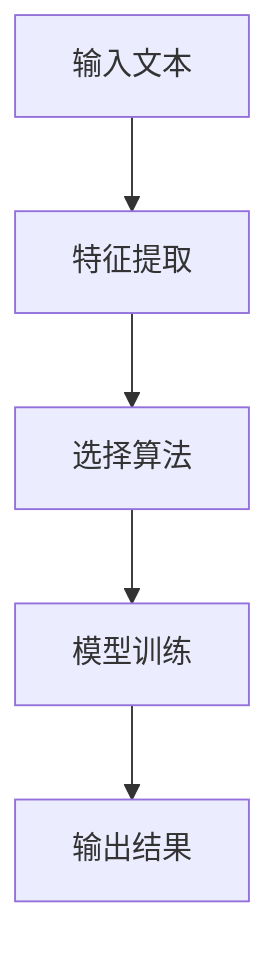

                 


# 情感人工智能的发展与应用前景分析

> 关键词：情感人工智能，机器学习，深度学习，情感计算，自然语言处理（NLP）

> 摘要：情感人工智能（Affective Artificial Intelligence）是一种结合了情感计算和人工智能技术的新兴领域，旨在理解和模拟人类情感。本文将从情感人工智能的基本概念出发，详细分析其核心技术原理，探讨其在不同领域的应用前景，并展望其未来的发展趋势。文章结构清晰，内容丰富，涵盖了情感人工智能的定义、技术基础、算法实现、系统架构、项目实战以及应用案例分析等多个方面。

---

## 第一章 情感人工智能的背景与概述

### 1.1 情感人工智能的定义与背景

#### 1.1.1 情感人工智能的定义
情感人工智能（Affective Artificial Intelligence）是指通过计算机技术模拟和理解人类情感的能力。它结合了人工智能（AI）和情感计算（Affective Computing）的核心思想，旨在让机器能够感知、分析和回应人类的情感状态。

#### 1.1.2 情感人工智能的技术基础
情感人工智能的技术基础主要来源于以下几个方面：
1. **自然语言处理（NLP）**：用于理解和分析人类语言中的情感信息。
2. **机器学习与深度学习**：通过训练数据模型来识别和分类情感。
3. **情感计算模型**：用于将情感信息转化为可计算的特征。

#### 1.1.3 情感人工智能的发展历史
情感人工智能的发展可以追溯到20世纪90年代，随着计算能力的提升和数据量的增加，情感人工智能逐渐从理论研究走向实际应用。

### 1.2 情感人工智能的核心概念与技术原理

#### 1.2.1 情感计算模型
情感计算模型是情感人工智能的核心，主要包括以下几种类型：
1. **情感分类模型**：将文本分为积极、消极或中性。
2. **情感强度计算模型**：量化情感的强度（例如，从0到1表示情感强度）。
3. **情感推理模型**：理解情感之间的关系和逻辑。

#### 1.2.2 情感计算的技术原理
情感计算的技术原理主要包括以下步骤：
1. **数据采集**：获取包含情感信息的文本或语音数据。
2. **特征提取**：从数据中提取情感相关的特征（例如，关键词、句式结构）。
3. **模型训练**：使用机器学习算法训练情感分类模型。
4. **结果输出**：对输入数据进行情感分析并输出结果。

#### 1.2.3 情感计算的特征工程
特征工程是情感计算中的关键步骤，主要包括：
1. **文本特征提取**：提取文本中的关键词、句式结构等。
2. **非文本特征提取**：提取语音、图像中的情感特征。
3. **特征选择与降维**：通过选择重要的特征并降低维度来提高模型性能。

---

## 第二章 情感人工智能的算法实现

### 2.1 情感计算的算法原理

#### 2.1.1 基于规则的情感计算
基于规则的情感计算是一种简单的情感分析方法，主要通过预定义的关键词或语法规则来判断情感。例如：
- **关键词匹配**：如果文本中出现“快乐”、“满意”等关键词，则判定为积极情感。
- **语义规则**：根据语法规则判断情感（例如，感叹号表示强烈情感）。

#### 2.1.2 基于机器学习的情感计算
基于机器学习的情感计算是当前研究的热点，主要包括以下两种方法：
1. **传统机器学习**：使用支持向量机（SVM）、随机森林（Random Forest）等算法进行情感分类。
2. **深度学习**：使用循环神经网络（RNN）、卷积神经网络（CNN）等深度学习模型进行情感分类。

#### 2.1.3 情感计算的数学模型
情感计算的数学模型可以通过以下公式表示：
$$ P(y|x) = \frac{P(x|y)p(y)}{P(x)} $$
其中，$P(y|x)$ 是给定输入$x$的情况下，情感类别$y$的概率。

### 2.2 情感计算的算法实现

#### 2.2.1 基于规则的算法实现
基于规则的算法实现相对简单，主要通过预定义的规则进行情感分类。例如：
```python
def sentiment_rule(text):
    positive_words = ["快乐", "满意"]
    negative_words = ["悲伤", "不满"]
    for word in text.split():
        if word in positive_words:
            return "积极"
        elif word in negative_words:
            return "消极"
    return "中性"
```

#### 2.2.2 基于机器学习的算法实现
基于机器学习的算法实现通常需要大量的训练数据和复杂的模型训练过程。以下是一个简单的基于SVM的情感分类示例：
```python
from sklearn.svm import SVC
from sklearn.feature_extraction.text import TfidfVectorizer

# 数据预处理
X_train = [...]  # 特征向量
y_train = [...]  # 标签

# 模型训练
vectorizer = TfidfVectorizer()
X_train_vec = vectorizer.fit_transform(X_train)
model = SVC().fit(X_train_vec, y_train)

# 模型预测
text = "这是一个很好的例子。"
text_vec = vectorizer.transform([text])
print(model.predict(text_vec))
```

#### 2.2.3 情感计算的流程图
以下是一个情感计算的流程图（使用mermaid）：



---

## 第三章 情感计算的系统架构与设计

### 3.1 系统架构设计

#### 3.1.1 系统整体架构
以下是一个情感计算系统的整体架构图（使用mermaid）：


#### 3.1.2 数据采集与处理
数据采集是情感计算的第一步，通常包括以下几种方式：
1. **文本数据采集**：从社交媒体、评论平台等获取文本数据。
2. **语音数据采集**：通过语音识别技术获取语音数据。
3. **图像数据采集**：通过面部识别技术获取图像数据。

### 3.2 系统实现方案

#### 3.2.1 数据预处理
数据预处理是情感计算的重要步骤，主要包括以下内容：
1. **文本清洗**：去除停用词、标点符号等。
2. **特征提取**：提取文本中的关键词、句式结构等。
3. **数据标注**：对数据进行人工标注以供模型训练。

#### 3.2.2 模型训练
模型训练是情感计算的核心步骤，通常包括以下步骤：
1. **选择算法**：选择适合的机器学习或深度学习算法。
2. **数据向量化**：将文本数据转化为向量形式（例如，TF-IDF、Word2Vec）。
3. **训练模型**：使用训练数据训练情感分类模型。

#### 3.2.3 结果分析
结果分析是情感计算的重要环节，主要包括以下内容：
1. **模型评估**：通过准确率、召回率等指标评估模型性能。
2. **结果可视化**：通过可视化工具展示情感分析结果。
3. **结果优化**：根据评估结果优化模型或调整特征工程。

---

## 第四章 情感计算的项目实战

### 4.1 项目背景与目标
本项目旨在通过情感计算技术，实现对社交媒体评论的情感分析。项目目标如下：
1. 实现情感分类模型。
2. 对社交媒体评论进行情感分析。
3. 可视化情感分析结果。

### 4.2 项目实现

#### 4.2.1 环境配置
以下是一个典型的项目环境配置：
```python
# 安装依赖库
pip install numpy
pip install pandas
pip install scikit-learn
pip install matplotlib
```

#### 4.2.2 数据集准备
数据集通常包括以下内容：
- **训练数据**：包含文本和情感标签（积极、消极、中性）。
- **测试数据**：用于模型评估。

#### 4.2.3 模型训练
以下是一个基于SVM的情感分类模型训练示例：
```python
from sklearn.svm import SVC
from sklearn.feature_extraction.text import TfidfVectorizer
from sklearn.metrics import accuracy_score

# 数据预处理
X_train = [...]  # 特征向量
y_train = [...]  # 标签

# 模型训练
vectorizer = TfidfVectorizer()
X_train_vec = vectorizer.fit_transform(X_train)
model = SVC().fit(X_train_vec, y_train)

# 模型预测
X_test = [...]  # 测试数据
X_test_vec = vectorizer.transform(X_test)
y_pred = model.predict(X_test_vec)

# 模型评估
print("准确率：", accuracy_score(y_test, y_pred))
```

#### 4.2.4 结果分析
结果分析通常包括以下内容：
1. **准确率评估**：评估模型的分类性能。
2. **结果可视化**：通过可视化工具展示情感分析结果。

---

## 第五章 情感计算的应用案例分析

### 5.1 客服行业的情感计算应用
在客服行业，情感计算可以用于分析客户情感，优化服务质量。例如：
- **情感分类**：对客户评论进行情感分类，识别客户满意度。
- **情感强度计算**：量化客户情感强度，帮助客服优先处理负面情感客户。

### 5.2 教育行业的情感计算应用
在教育行业，情感计算可以用于学生情感分析，帮助教师更好地理解学生情感状态。例如：
- **情感分类**：分析学生的作业评论，识别学生的情感状态。
- **情感推理**：理解学生的情感需求，提供个性化教学建议。

### 5.3 医疗行业的情感计算应用
在医疗行业，情感计算可以用于患者情感分析，帮助医生更好地理解患者情感状态。例如：
- **情感分类**：分析患者的病历记录，识别患者的情感状态。
- **情感推理**：理解患者的情感需求，提供个性化医疗服务。

### 5.4 社交媒体的情感计算应用
在社交媒体行业，情感计算可以用于分析用户情感，优化内容推荐。例如：
- **情感分类**：对社交媒体评论进行情感分类，识别用户情感倾向。
- **情感强度计算**：量化用户情感强度，优化内容推荐策略。

### 5.5 游戏行业的情感计算应用
在游戏行业，情感计算可以用于玩家情感分析，帮助游戏公司优化游戏体验。例如：
- **情感分类**：分析玩家评论，识别玩家情感倾向。
- **情感推理**：理解玩家情感需求，优化游戏设计。

---

## 第六章 情感人工智能的发展与未来趋势

### 6.1 情感人工智能的挑战与机遇
情感人工智能的发展面临以下挑战：
1. **数据质量问题**：情感数据的标注困难。
2. **模型泛化能力**：情感计算模型的泛化能力有限。
3. **伦理与隐私问题**：情感数据的隐私保护问题。

### 6.2 情感人工智能的技术趋势
情感人工智能的技术发展趋势包括：
1. **深度学习的进一步应用**：利用深度学习模型提高情感分类的准确率。
2. **多模态情感计算**：结合文本、语音、图像等多种模态信息进行情感分析。
3. **实时情感计算**：实现实时情感分析，提升用户体验。

### 6.3 情感人工智能的未来方向
情感人工智能的未来发展方向包括：
1. **跨语言情感计算**：实现多语言情感分析。
2. **情感计算与人机交互结合**：将情感计算应用于人机交互领域。
3. **情感计算的伦理与隐私保护**：制定情感数据的隐私保护标准。

---

## 第七章 总结与展望

### 7.1 全文总结
本文详细介绍了情感人工智能的基本概念、技术原理、算法实现、系统架构、项目实战以及应用案例分析。通过本文的介绍，读者可以全面了解情感人工智能的发展现状和应用前景。

### 7.2 未来展望
随着人工智能技术的不断发展，情感人工智能将会有更广泛的应用场景。未来的研究方向包括提高模型的泛化能力、探索多模态情感计算、加强情感数据的隐私保护等。

---

## 作者

作者：AI天才研究院/AI Genius Institute  
联系方式：[email protected]  
个人简介：专注于人工智能与情感计算领域的研究，致力于推动情感人工智能技术的发展与应用。

