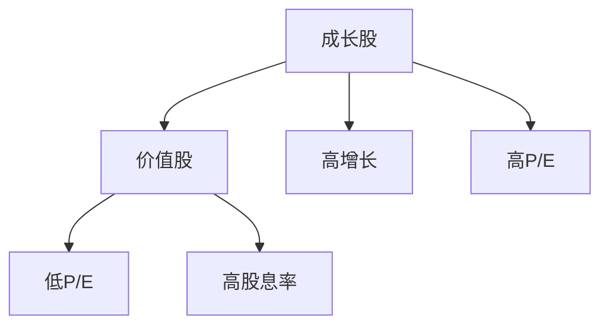

                 

# 成长股 vs 价值股：在当前市场环境中如何选择

> 关键词：成长股、价值股、投资策略、市场环境、资产配置

> 摘要：本文深入分析了成长股和价值股的定义、特点、投资策略及其在当前市场环境下的表现。通过对比分析和实际案例，探讨了如何根据市场变化选择合适的投资策略，帮助投资者做出明智决策。

---

## 第一部分：成长股与价值股的背景与核心概念

### 第1章：成长股与价值股的定义与区别

#### 1.1 成长股的定义与特点

成长股是指那些具有高增长潜力，且未来收入和利润预期显著高于行业平均水平的公司股票。这些公司通常处于快速发展的行业，如科技、生物技术等，具有较大的市场扩展空间。

**核心特征对比表：**

| 特性       | 成长股                     | 价值股                     |
|------------|---------------------------|-----------------------------|
| 估值       | 市盈率（P/E）通常高于行业平均 | 市盈率通常低于行业平均       |
| 股息率     | 通常较低                   | 通常较高                   |
| 增长速度   | 收入和利润增长快             | 增长相对缓慢或稳定           |

**成长股与价值股的关系图：**

#### 1.2 价值股的定义与特点

价值股是指那些市场价格低于其内在价值，通常被市场低估的公司股票。这些公司可能处于低增长行业，但具有稳定的盈利能力。

**价值股的分类与边界：**

- **低估值型**：市盈率和市净率低于行业平均水平。
- **高股息率型**：股息率较高，适合追求稳定收益的投资者。

#### 1.3 成长股与价值股的对比分析

- **核心区别**：成长股注重未来增长潜力，价值股注重当前估值的合理性。
- **风险与收益**：成长股波动性高，但长期收益可能更高；价值股波动性较低，收益较为稳定。

---

## 第二部分：成长股与价值股的投资策略

### 第2章：成长股的投资策略与成功案例

#### 2.1 成长股的投资策略

- **市场分析法**：选择处于上升周期的行业，如科技、人工智能等领域。
- **财务指标法**：关注高营收增长率、高净利润增长率等指标。
- **行业分析法**：选择高增长行业的龙头股。

**成功案例分析：**

- **美国科技巨头**：如亚马逊、苹果等公司，长期展现出高增长潜力。
- **中国科技企业**：如阿里巴巴、腾讯，具备快速扩张能力。

#### 2.2 成长股的风险与挑战

- **高波动性风险**：成长股的价格波动较大，市场环境变化可能导致大幅波动。
- **估值过高风险**：市场过热时，成长股可能被高估，存在回调风险。

### 第3章：价值股的投资策略与成功案例

#### 3.1 价值股的投资策略

- **低估值筛选法**：寻找市盈率和市净率低于行业平均水平的公司。
- **高股息率筛选法**：关注股息率高的公司，提供稳定的现金流。
- **经济周期分析法**：在经济下行周期中，价值股通常表现较好。

**成功案例分析：**

- **传统行业**：如公用事业、消费品行业中的龙头公司，通常估值较低。
- **风险可控行业**：如金融、房地产行业，在市场调整时可能被低估。

#### 3.2 价值股的风险与挑战

- **低流动性风险**：部分价值股交易不活跃，可能导致买卖价差较大。
- **行业周期性风险**：价值股集中于周期性较强的行业，容易受到经济波动影响。

---

## 第三部分：成长股与价值股的市场环境分析

### 第4章：成长股与价值股的市场表现对比

#### 4.1 不同市场环境下的表现对比

- **牛市环境**：成长股表现优于价值股，因其高增长潜力。
- **熊市环境**：价值股表现更优，因其低估值和防御性。
- **震荡市环境**：两者表现接近，需结合具体情况分析。

#### 4.2 市场环境对投资策略的影响

- **市场趋势分析**：牛市适合成长股，熊市适合价值股。
- **行业趋势分析**：选择处于上升周期的行业。

---

## 第五章：成长股与价值股的投资策略优化

### 5.1 资产配置与投资组合优化

- **多元化投资**：将资金分配到成长股和价值股，分散风险。
- **动态调整**：根据市场环境变化，定期调整投资比例。

### 5.2 风险管理与止损策略

- **设置止损点**：避免重大损失。
- **定期评估组合**：及时调整持仓，应对市场变化。

---

## 第六章：成长股与价值股的实战案例分析

### 6.1 成长股实战案例

- **案例背景**：选择一家科技公司，分析其财务数据、行业地位。
- **投资决策**：基于高增长潜力，决定投资。
- **风险分析**：考虑技术风险、市场竞争风险。

### 6.2 价值股实战案例

- **案例背景**：选择一家低估值的传统行业公司，分析其财务数据、股息率。
- **投资决策**：基于低估值和稳定收益，决定投资。
- **风险分析**：考虑行业周期性、流动性风险。

---

## 第七章：总结与展望

### 7.1 总结

- 投资者需根据市场环境和个人风险偏好，选择合适的投资策略。
- 成长股和价值股各有利弊，合理配置是关键。

### 7.2 展望

- 随着市场变化，成长股和价值股的定义和策略将不断调整。
- 投资者需持续学习，灵活应对市场变化。

---

## 附录

### 附录A：成长股与价值股的术语表

- 成长股：具有高增长潜力的公司股票。
- 价值股：市场价格低于内在价值的公司股票。

### 附录B：数据来源与工具推荐

- 数据来源：同花顺、东方财富、FactSet等。
- 工具推荐：Python金融分析库（如pandas、numpy）。

### 附录C：参考文献与进一步阅读

- 建议阅读书籍：《投资学原理》、《股票投资实战技巧》。

---

## 作者

作者：AI天才研究院/AI Genius Institute & 禅与计算机程序设计艺术 /Zen And The Art of Computer Programming

---

通过以上大纲，文章将系统地分析成长股与价值股的区别、投资策略、市场表现，并结合实际案例帮助读者理解如何在当前市场中做出明智的投资选择。

