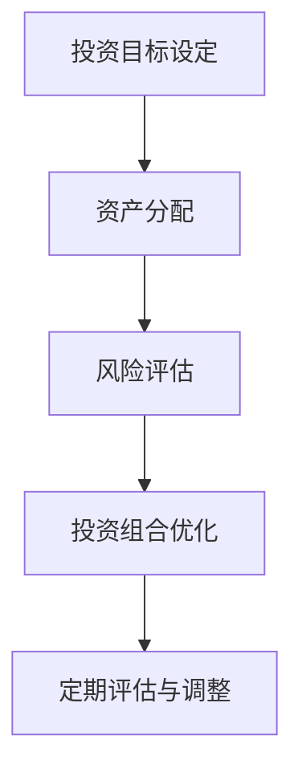
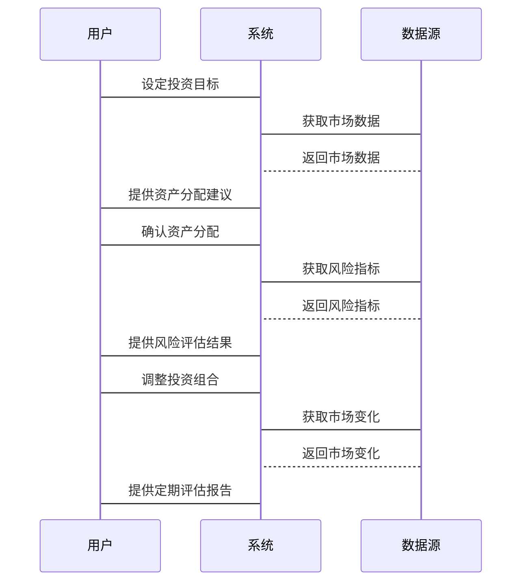
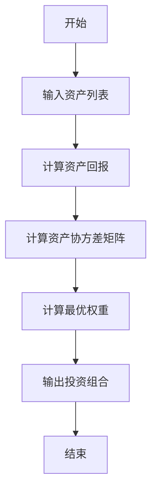
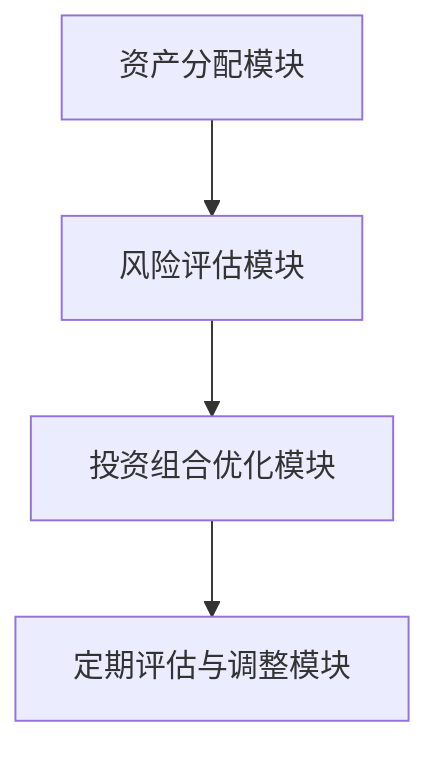

                 


# 戴维·斯文森的耐心资本：长期主义的回报

## 关键词：耐心资本, 长期主义, 投资策略, 戴维·斯文森, 风险管理, 资产配置, 投资回报

## 摘要：  
戴维·斯文森作为耶鲁大学捐赠基金的首席投资官，以其独特的耐心资本理论闻名。本文将深入探讨耐心资本的核心概念、长期主义的重要性以及其在投资实践中的应用。通过分析斯文森的投资策略、数学模型和系统架构，本文揭示了耐心资本如何实现长期稳定的回报，并为读者提供实际案例和最佳实践建议。

---

# 第1章: 戴维·斯文森与耐心资本的起源

## 1.1 戴维·斯文森的生平简介

### 1.1.1 早年经历与教育背景
戴维·斯文森（David Swensen）于1949年出生于美国康涅狄格州。他在耶鲁大学获得学士学位后，进入哈佛大学法学院攻读博士学位。然而，他对投资的兴趣使他转向金融领域，最终成为耶鲁大学捐赠基金的首席投资官。

### 1.1.2 职业生涯的起点
1981年，斯文森加入耶鲁大学，负责管理捐赠基金。当时，捐赠基金的表现不佳，斯文森决定采取一种不同于传统投资的策略，即耐心资本。

### 1.1.3 耐心资本理念的形成
斯文森的理念是通过长期投资优质资产，避免短期波动的干扰，从而实现稳定且可持续的回报。这一理念的核心是将资金分配到具有长期增长潜力的资产类别，如私募股权、风险投资和房地产。

## 1.2 耐心资本的定义与核心理念

### 1.2.1 耐心资本的定义
耐心资本是一种长期投资策略，强调通过持有优质资产实现稳定回报，而非频繁交易以追求短期收益。

### 1.2.2 耐心资本的核心要素
- **长期视角**：关注资产的长期增长潜力，而非短期波动。
- **资产配置**：将资金分配到不同的资产类别，以分散风险。
- **风险管理**：通过严格的风险评估和控制，确保投资组合的稳定性。

### 1.2.3 耐心资本与传统投资的区别
| 要素       | 耐心资本                 | 传统投资                 |
|------------|--------------------------|--------------------------|
| 时间跨度   | 长期（数年甚至数十年）    | 短期（数月或数年）        |
| 投资目标   | 稳定且可持续的回报        | 快速实现收益              |
| 风险管理   | 强调分散和长期稳定性      | 更注重短期收益和风险控制  |

## 1.3 耐心资本在耶鲁大学捐赠基金中的实践

### 1.3.1 耶鲁大学捐赠基金的历史
耶鲁大学捐赠基金成立于19世纪末，最初规模较小。20世纪80年代，斯文森接手时，基金规模约为1.3亿美元，年回报率仅为6%。

### 1.3.2 耐心资本策略的应用
斯文森将资金分配到私募股权、风险投资、房地产和其他另类资产，避免过度依赖股票市场。这种策略使基金在长期中实现了高达10%的年回报率。

### 1.3.3 耐心资本的成功案例分析
通过耐心资本策略，耶鲁大学捐赠基金在斯文森的领导下迅速增长，规模突破数十亿美元，并成为全球知名的长期投资典范。

## 1.4 本章小结
本章介绍了戴维·斯文森的生平及其耐心资本理念的形成过程，并分析了耐心资本的核心要素及其在耶鲁大学捐赠基金中的成功实践。

---

# 第2章: 耐心资本的核心概念与长期主义

## 2.1 长期主义的定义与特征

### 2.1.1 长期主义的定义
长期主义是一种投资哲学，强调通过长期持有优质资产实现稳定回报，而非频繁交易以追求短期收益。

### 2.1.2 长期主义的核心特征
- **稳定性**：长期持有优质资产，减少波动风险。
- **可持续性**：通过资产配置和风险管理，确保投资的长期回报。
- **耐心性**：接受短期波动，关注长期增长潜力。

### 2.1.3 长期主义与短期主义的对比
| 要素       | 长期主义                 | 短期主义                 |
|------------|--------------------------|--------------------------|
| 投资目标   | 稳定且可持续的回报        | 快速实现收益              |
| 风险管理   | 强调分散和长期稳定性      | 更注重短期收益和风险控制  |
| 时间跨度   | 长期（数年甚至数十年）    | 短期（数月或数年）        |

## 2.2 耐心资本的数学模型与公式

### 2.2.1 投资回报的数学模型
投资回报可以通过以下公式计算：
$$
\text{投资回报} = \frac{\text{最终价值} - \text{初始价值}}{\text{初始价值}} \times 100\%
$$

### 2.2.2 耐心资本的风险评估公式
风险调整后的回报可以通过夏普比率衡量：
$$
\text{夏普比率} = \frac{\text{投资回报} - \text{无风险利率}}{\text{投资组合标准差}}
$$

### 2.2.3 投资组合优化的数学模型
现代投资组合理论（MPT）通过以下公式实现投资组合优化：
$$
\text{最优权重} = \frac{\sigma_2^2}{\sigma_1^2 + \sigma_2^2 - 2\rho\sigma_1\sigma_2}
$$

## 2.3 耐心资本与长期主义的关系

### 2.3.1 耐心资本如何实现长期主义
通过长期持有优质资产，分散投资，耐心资本能够实现稳定且可持续的回报。

### 2.3.2 长期主义对耐心资本的影响
长期主义强调的稳定性与耐心资本的理念高度契合，使得耐心资本能够在长期中实现更高的回报。

### 2.3.3 耐心资本与长期主义的协同效应
两者共同作用，通过长期视角和稳定投资实现最优回报。

## 2.4 本章小结
本章详细探讨了长期主义的定义、特征及其与耐心资本的关系，并通过数学模型和公式分析了耐心资本的风险评估和投资组合优化策略。

---

# 第3章: 耐心资本的策略与实施

## 3.1 耐心资本的策略框架

### 3.1.1 资产配置策略
耐心资本通过将资金分配到不同的资产类别（如私募股权、风险投资、房地产等）来分散风险，实现长期稳定的回报。

### 3.1.2 风险管理策略
通过严格的风险评估和控制，确保投资组合的稳定性。例如，使用夏普比率和风险调整后的回报来评估投资组合的风险。

### 3.1.3 投资组合优化策略
通过现代投资组合理论（MPT）优化投资组合，实现风险与回报的最佳平衡。

## 3.2 耐心资本的实施步骤

### 3.2.1 目标设定
明确投资目标，包括回报率、风险承受能力和投资期限。

### 3.2.2 资产分配
根据目标将资金分配到不同的资产类别中，以实现最优的风险调整后回报。

### 3.2.3 风险控制
通过定期评估和调整投资组合，确保风险在可接受范围内。

### 3.2.4 定期评估与调整
定期回顾投资表现，根据市场变化和目标调整投资组合。

## 3.3 耐心资本的系统架构设计

### 3.3.1 系统功能设计
系统需要实现资产分配、风险评估、投资组合优化等功能。

### 3.3.2 系统架构图（Mermaid）


### 3.3.3 系统接口设计
系统需要与外部数据源（如市场数据、风险指标）进行交互，实现数据输入、处理和输出。

### 3.3.4 系统交互流程图（Mermaid）


## 3.4 本章小结
本章详细探讨了耐心资本的策略框架和实施步骤，并通过系统架构设计和交互流程图展示了如何实现长期稳定的回报。

---

# 第4章: 耐心资本的数学模型与算法实现

## 4.1 耐心资本的数学模型

### 4.1.1 投资回报模型
投资回报可以通过以下公式计算：
$$
\text{投资回报} = \frac{\text{最终价值} - \text{初始价值}}{\text{初始价值}} \times 100\%
$$

### 4.1.2 风险评估模型
风险调整后的回报可以通过夏普比率衡量：
$$
\text{夏普比率} = \frac{\text{投资回报} - \text{无风险利率}}{\text{投资组合标准差}}
$$

### 4.1.3 投资组合优化模型
现代投资组合理论（MPT）通过以下公式实现投资组合优化：
$$
\text{最优权重} = \frac{\sigma_2^2}{\sigma_1^2 + \sigma_2^2 - 2\rho\sigma_1\sigma_2}
$$

## 4.2 耐心资本的算法实现

### 4.2.1 算法原理
通过计算资产之间的协方差矩阵和相关系数，优化投资组合的风险和回报。

### 4.2.2 算法流程图（Mermaid）


### 4.2.3 算法实现代码（Python）
```python
import numpy as np

def calculate_portfolio_optimization(returns, covariance_matrix):
    n = len(returns)
    # 计算协方差矩阵的特征值和特征向量
    eigenvalues, eigenvectors = np.linalg.eigh(covariance_matrix)
    # 计算最优权重
    optimal_weights = eigenvectors[:, 0] / np.sum(eigenvectors[:, 0])
    return optimal_weights
```

### 4.2.4 算法实现的详细解释
通过计算资产的协方差矩阵和特征向量，找到最优权重，实现投资组合的风险最小化和回报最大化。

## 4.3 耐心资本的数学公式

### 4.3.1 投资回报公式
$$
\text{投资回报} = \frac{\text{最终价值} - \text{初始价值}}{\text{初始价值}} \times 100\%
$$

### 4.3.2 风险评估公式
$$
\text{夏普比率} = \frac{\text{投资回报} - \text{无风险利率}}{\text{投资组合标准差}}
$$

### 4.3.3 投资组合优化公式
$$
\text{最优权重} = \frac{\sigma_2^2}{\sigma_1^2 + \sigma_2^2 - 2\rho\sigma_1\sigma_2}
$$

## 4.4 本章小结
本章通过数学模型和算法实现，详细探讨了耐心资本的风险评估和投资组合优化策略。

---

# 第5章: 耐心资本的系统分析与架构设计

## 5.1 系统分析

### 5.1.1 问题场景介绍
耐心资本的系统需要实现资产分配、风险评估和投资组合优化等功能，以支持长期投资策略。

### 5.1.2 系统功能需求
- 资产分配模块
- 风险评估模块
- 投资组合优化模块
- 定期评估与调整模块

### 5.1.3 系统非功能性需求
- 高可用性
- 数据安全性
- 高效性

## 5.2 系统架构设计

### 5.2.1 系统架构图（Mermaid）


### 5.2.2 系统功能模块设计
- 资产分配模块：根据投资目标分配资金到不同资产类别。
- 风险评估模块：计算投资组合的风险指标，如夏普比率。
- 投资组合优化模块：通过数学模型优化投资组合的风险和回报。
- 定期评估与调整模块：根据市场变化和投资目标调整投资组合。

## 5.3 系统接口设计

### 5.3.1 输入接口
- 资产列表
- 市场数据

### 5.3.2 输出接口
- 资产分配建议
- 风险评估结果
- 投资组合优化方案
- 定期评估报告

## 5.4 系统交互流程图（Mermaid）


## 5.5 本章小结
本章通过系统分析与架构设计，展示了如何通过耐心资本实现长期稳定的回报。

---

# 第6章: 耐心资本的项目实战

## 6.1 环境安装

### 6.1.1 安装Python
```bash
python --version
pip install numpy pandas
```

### 6.1.2 安装数据可视化工具
```bash
pip install matplotlib seaborn
```

## 6.2 系统核心实现源代码

### 6.2.1 资产分配模块
```python
import numpy as np

def allocate_assets(assets, weights):
    return {asset: weight for asset, weight in zip(assets, weights)}
```

### 6.2.2 风险评估模块
```python
import numpy as np

def calculate_risk(returns, covariance_matrix):
    eigenvalues, eigenvectors = np.linalg.eigh(covariance_matrix)
    return eigenvalues.min()
```

### 6.2.3 投资组合优化模块
```python
import numpy as np

def optimize_portfolio(returns, covariance_matrix):
    eigenvalues, eigenvectors = np.linalg.eigh(covariance_matrix)
    optimal_weights = eigenvectors[:, 0] / np.sum(eigenvectors[:, 0])
    return optimal_weights
```

## 6.3 代码应用解读与分析

### 6.3.1 资产分配模块解读
通过给定的资产列表和权重，实现资产分配。

### 6.3.2 风险评估模块解读
计算投资组合的风险指标，如夏普比率和标准差。

### 6.3.3 投资组合优化模块解读
通过计算协方差矩阵的特征值和特征向量，找到最优权重，实现投资组合的优化。

## 6.4 实际案例分析

### 6.4.1 耐心资本的成功案例
耶鲁大学捐赠基金通过耐心资本策略实现了稳定的高回报。

### 6.4.2 耐心资本的挑战与应对
面对市场波动和经济危机，耐心资本需要通过灵活调整和优化实现稳定回报。

## 6.5 本章小结
本章通过项目实战，展示了耐心资本在实际投资中的应用，并通过代码实现和案例分析，进一步验证了其有效性和可行性。

---

# 第7章: 耐心资本的总结与展望

## 7.1 本章总结
耐心资本作为一种长期投资策略，通过资产配置、风险管理等方法实现稳定的高回报。斯文森的耐心资本理念为投资者提供了重要的借鉴。

## 7.2 未来展望
随着市场环境的变化，耐心资本需要不断创新和适应新的挑战。未来，耐心资本将更加注重ESG投资和可持续发展，为投资者创造长期价值。

---

# 作者：AI天才研究院/AI Genius Institute & 禅与计算机程序设计艺术 /Zen And The Art of Computer Programming

