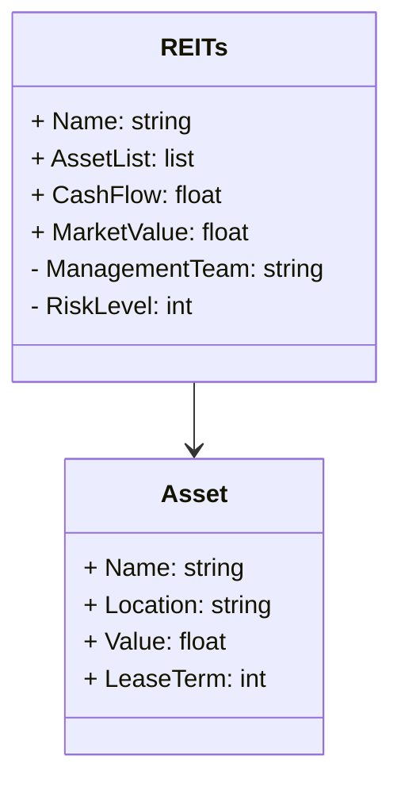
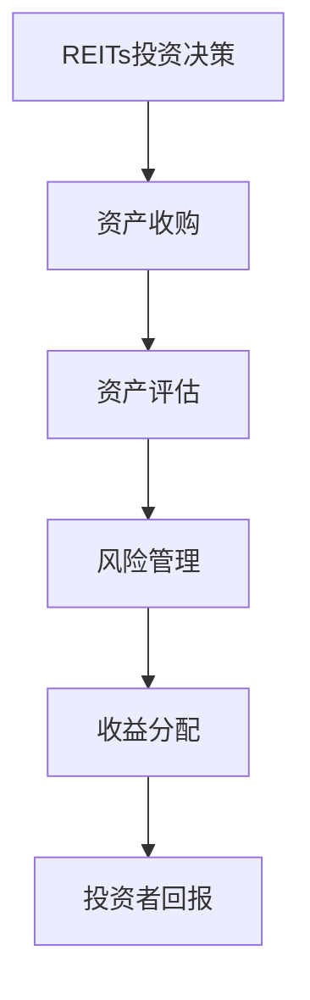
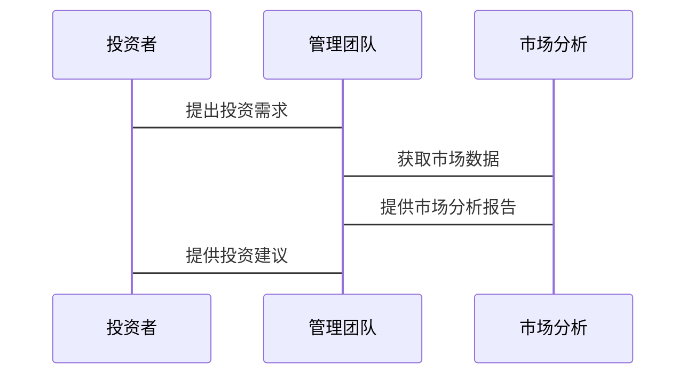

                 


# 房地产投资信托（REITs）：多元化投资组合的选择

## 关键词：
- 房地产投资信托（REITs）
- 投资组合
- 资产配置
- 风险管理
- 估值模型

## 摘要：
房地产投资信托（REITs）是一种将资金投资于房地产资产的金融工具，通过多元化投资策略和专业管理，为投资者提供稳定的收益和资本增值。本文深入探讨REITs的核心概念、运作机制、风险与收益平衡、估值方法以及实际案例分析，帮助投资者构建科学合理的投资组合。

---

## 第1章: 房地产投资信托（REITs）的背景与概念

### 1.1 REITs的起源与发展
#### 1.1.1 REITs的起源与演变
房地产投资信托基金（REITs）起源于20世纪60年代，最初目的是让更多投资者能够通过间接方式投资房地产市场。REITs的起源可以追溯到美国，1960年通过的《房地产投资信托法案》为REITs的发展奠定了法律基础。随后，REITs在全球范围内迅速发展，成为房地产金融的重要工具。

REITs的演变经历了多个阶段：从早期的单一资产型REITs到多样化的商业地产REITs，再到近年来兴起的创新型REITs（如基础设施REITs和可持续发展REITs）。REITs的多样化发展使其能够适应不同的市场需求和经济环境。

#### 1.1.2 REITs的定义与特点
REITs是一种通过发行股份或受益凭证，汇集投资者资金用于房地产投资的金融工具。REITs的典型特点包括：
1. **高流动性**：REITs通常在证券交易所上市，投资者可以方便地买卖份额。
2. **专业化管理**：由专业的房地产管理公司负责运营和资产管理。
3. **收益稳定**：REITs通过租金收入和资产增值实现收益，通常派发高比例的股息。
4. **分散风险**：通过多元化投资降低单一资产的风险。

#### 1.1.3 REITs的分类与运作机制
REITs可以根据投资目标、资产类型和运营模式进行分类。常见的分类包括：
1. **零售REITs**：主要投资于商场、购物中心等零售物业。
2. **办公REITs**：专注于写字楼和办公室资产。
3. **住宅REITs**：投资于公寓、住宅社区等居住类物业。
4. **综合REITs**：涵盖多种类型的房地产资产。

REITs的运作机制包括资产收购、管理和收益分配。投资者通过购买REITs的份额间接持有房地产资产，并享受租金收入和资产增值带来的收益。

### 1.2 REITs在资产配置中的作用
#### 1.2.1 REITs与传统投资资产的对比
REITs作为一种金融工具，具有以下特点：
1. **收益与房地产市场相关**：REITs的收益主要来源于房地产市场的表现。
2. **高杠杆效应**：通过杠杆融资放大收益，但也增加了风险。
3. **稳定现金流**：REITs通常有稳定的租金收入，能够提供稳定的现金流。

与股票和债券相比，REITs的风险和收益具有一定的互补性。在经济周期波动中，REITs可以作为分散投资风险的重要工具。

#### 1.2.2 REITs的风险与收益特征
REITs的风险主要包括市场风险、利率风险和流动性风险。收益方面，REITs的回报通常包括股息收益和资本增值两部分。

#### 1.2.3 REITs的市场流动性与投资门槛
REITs通常在证券交易所上市，具有较高的流动性。与直接投资房地产相比，REITs的投资门槛较低，适合中小投资者参与。

### 1.3 本章小结
本章介绍了REITs的起源与发展、核心概念和分类，以及REITs在资产配置中的作用。通过分析REITs的特点和运作机制，读者可以理解REITs作为一种投资工具的独特优势。

---

## 第2章: REITs的收益与风险分析

### 2.1 REITs的收益来源
#### 2.1.1 租金收入
REITs的主要收益来源是租金收入。通过出租房地产资产，REITs可以获得稳定的现金流。租金收入的多少取决于租赁市场的供需状况、租赁期限和租金水平。

#### 2.1.2 物业增值收益
REITs的收益还包括物业增值部分。随着房地产市场的波动，REITs持有的资产价值可能会上升或下降，从而影响整体收益。

#### 2.1.3 其他收益来源
除了租金收入和物业增值，REITs还可以通过资产处置、再开发等操作获得额外收益。

### 2.2 REITs的风险分析
#### 2.2.1 市场风险
REITs的收益与房地产市场密切相关，房地产市场的波动会对REITs的收益和价值产生直接影响。

#### 2.2.2 利率风险
REITs通常通过杠杆融资，利率的变化会影响其融资成本和资产价值。利率上升会增加融资成本，降低REITs的收益。

#### 2.2.3 经营风险
REITs的收益还受到运营管理的影响，包括租金收取能力、资产维护成本等。

### 2.3 REITs的风险与收益的平衡
#### 2.3.1 REITs的风险管理策略
投资者可以通过分散投资、选择低杠杆率的REITs、关注管理团队的能力等方法来降低投资风险。

#### 2.3.2 REITs的收益稳定性分析
REITs的收益稳定性与其资产组合、租赁情况和市场环境密切相关。选择具有稳定租金收入和良好现金流的REITs可以提高收益的稳定性。

#### 2.3.3 REITs的风险调整后收益评估
通过比较不同REITs的风险调整后收益，投资者可以更好地选择适合自己的投资标的。

### 2.4 本章小结
本章分析了REITs的主要收益来源和风险因素，探讨了如何平衡风险与收益。投资者在选择REITs时需要综合考虑市场环境、资产组合和管理能力等因素。

---

## 第3章: REITs的估值模型与方法

### 3.1 REITs的估值概述
#### 3.1.1 REITs估值的基本概念
REITs的估值是指对其内在价值的评估，通常基于其未来现金流的现值。REITs的估值需要考虑市场环境、资产状况和财务表现等因素。

#### 3.1.2 REITs估值的主要方法
常用的REITs估值方法包括现金流折现模型（DCF）、市场比较法和倍数法。

### 3.2 现金流折现模型
#### 3.2.1 现金流折现模型的原理
现金流折现模型通过预测未来的现金流，并将其折现为现值来评估REITs的价值。公式如下：

$$
\text{企业价值} = \sum_{t=1}^{n} \frac{\text{现金流}_t}{(1 + r)^t}
$$

其中，$r$是折现率，$n$是预测期数，$\text{现金流}_t$是第$t$年的现金流。

#### 3.2.2 现金流折现模型的公式与应用
通过DCF模型，投资者可以估算REITs的内在价值，并与市场价格进行比较。如果市场价格低于内在价值，REITs可能具有投资价值。

#### 3.2.3 现金流折现模型的优缺点
现金流折现模型的优点是能够考虑未来现金流的现值，但需要假设现金流的预测准确性和折现率的合理性。

### 3.3 其他估值方法
#### 3.3.1 市场比较法
市场比较法通过比较类似REITs的市场价格和资产状况，评估目标REITs的价值。这种方法适用于市场数据较为充分的情况。

#### 3.3.2 倍数法
倍数法通过比较市盈率、市净率等指标，评估REITs的相对价值。公式如下：

$$
\text{目标价值} = \text{目标倍数} \times \text{可比REITs的平均倍数}
$$

### 3.4 本章小结
本章介绍了REITs的主要估值方法，重点讲解了现金流折现模型的应用和优缺点。投资者可以根据具体情况选择合适的估值方法，做出科学的投资决策。

---

## 第4章: REITs的系统分析与架构设计

### 4.1 项目介绍
本章以一个REITs投资项目为例，分析其系统架构和功能设计。假设我们选择一个综合商业REITs项目，涵盖写字楼、商场和酒店等多种资产。

### 4.2 系统功能设计
#### 4.2.1 领域模型
以下是REITs项目的领域模型：



#### 4.2.2 系统架构设计
以下是REITs项目的系统架构图：



#### 4.2.3 系统接口设计
REITs项目的接口设计包括资产收购、资产管理和收益分配三个主要部分。

#### 4.2.4 系统交互设计
以下是REITs项目的交互序列图：



### 4.3 本章小结
本章通过系统架构设计和功能分析，展示了REITs项目的整体框架和运作流程。通过领域模型和系统图，投资者可以更好地理解REITs的投资决策和管理过程。

---

## 第5章: REITs的项目实战

### 5.1 环境安装与数据准备
#### 5.1.1 环境安装
为了进行REITs的估值分析，需要安装以下工具：
- Python编程环境（如Anaconda）
- 数据分析库（如Pandas、NumPy）
- 可视化工具（如Matplotlib、Seaborn）

#### 5.1.2 数据准备
需要收集目标REITs的财务数据、市场数据和资产信息。数据来源包括公司财报、行业报告和市场研究。

### 5.2 系统核心实现
#### 5.2.1 现金流计算
以下是现金流计算的Python代码示例：

```python
import pandas as pd
import numpy as np

# 假设数据
cash_flows = [100, 200, 150, 250, 300]
discount_rate = 0.08

# 现金流现值计算
pv = np.npv(discount_rate, cash_flows)
print("现金流现值:", pv)
```

#### 5.2.2 内部收益率计算
以下是内部收益率计算的Python代码示例：

```python
import numpy as np

cash_flows = [-500, 200, 200, 200, 200]
discount_rate = 0.08

# 内部收益率计算
irr = np.irr(cash_flows)
print("内部收益率:", irr)
```

#### 5.2.3 资产估值
以下是资产估值的Python代码示例：

```python
import pandas as pd
import numpy as np

data = {
    'Property': ['写字楼', '商场', '酒店'],
    'Value': [1000, 800, 600],
    'LeaseTerm': [5, 7, 3]
}

df = pd.DataFrame(data)
print(df)
```

### 5.3 案例分析
#### 5.3.1 项目背景
假设我们选择一个综合商业REITs项目，涵盖写字楼、商场和酒店三种资产，总价值为2400万元，投资期限为5年。

#### 5.3.2 财务分析
通过现金流折现模型计算REITs的内在价值：

$$
\text{内在价值} = \sum_{t=1}^{5} \frac{\text{现金流}_t}{(1 + 0.08)^t}
$$

假设每年现金流分别为500万元、600万元、700万元、800万元和900万元，计算如下：

$$
\text{内在价值} = \frac{500}{1.08} + \frac{600}{1.08^2} + \frac{700}{1.08^3} + \frac{800}{1.08^4} + \frac{900}{1.08^5}
$$

通过计算，可以得出REITs的内在价值约为2500万元。

#### 5.3.3 风险评估
通过分析市场风险、利率风险和经营风险，评估REITs的投资风险。假设市场风险概率为30%，利率风险概率为25%，经营风险概率为20%，综合风险概率为：

$$
\text{综合风险概率} = 1 - (1 - 0.3) \times (1 - 0.25) \times (1 - 0.2) = 0.425
$$

综合风险概率为42.5%，表明REITs的投资风险较高。

### 5.4 本章小结
本章通过实际案例分析，展示了REITs项目从环境准备、数据分析到财务评估的全过程。通过现金流计算和内部收益率分析，投资者可以更好地评估REITs的投资价值和风险。

---

## 第6章: 总结与展望

### 6.1 投资策略总结
投资者在选择REITs时，需要综合考虑市场环境、资产组合、管理能力和风险承受能力。通过多元化投资和科学的估值方法，可以有效降低投资风险。

### 6.2 风险管理总结
REITs的风险管理需要从资产选择、融资结构和运营管理三个方面入手。通过合理的风险分散和有效的风险管理，可以提高REITs的投资回报。

### 6.3 未来展望
随着房地产市场的不断发展和金融工具的创新，REITs的投资模式和产品类型将更加多样化。未来，REITs可能更加注重可持续发展和数字化管理，为投资者提供更多的选择和更高的收益。

### 6.4 本章小结
本章总结了REITs的投资策略和风险管理方法，展望了未来的发展趋势。通过科学的投资策略和有效的风险管理，投资者可以更好地实现资产增值。

---

## 作者：AI天才研究院/AI Genius Institute & 禅与计算机程序设计艺术 /Zen And The Art of Computer Programming

