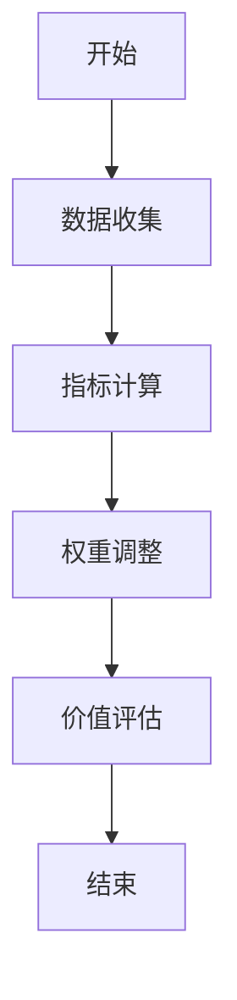

                 


# 托马斯罗的企业价值评估模型

## 关键词：企业价值评估模型, 企业价值, 托马斯罗模型, 算法原理, 企业估值, 价值评估

## 摘要：托马斯罗的企业价值评估模型是一种基于多维度分析的企业估值方法，通过整合企业的财务、市场和管理等多方面因素，提供精准的价值评估。本文详细分析模型的背景、核心概念、算法原理、系统架构及项目实战，帮助读者深入理解并应用该模型。

---

## 第一部分：托马斯罗模型的背景与核心概念

### 第1章：托马斯罗模型的背景介绍

#### 1.1 企业价值评估的起源与发展

企业价值评估是现代企业管理中的核心任务之一，其目的是确定企业在市场中的合理价值。传统的估值方法，如市盈率法、市净率法等，往往局限于单一维度的分析，难以全面反映企业的实际价值。随着企业规模的扩大和市场环境的复杂化，传统的估值方法逐渐暴露出其局限性，无法满足企业多样化的估值需求。

托马斯罗模型的提出，正是为了弥补这些不足。它通过整合企业的财务状况、市场表现、管理能力等多个维度的信息，提供了一种更为全面的企业价值评估方法。托马斯罗模型的理论基础深厚，结合了现代金融学、管理学和统计学的最新研究成果，具有较强的科学性和实用性。

#### 1.2 托马斯罗模型的核心概念

托马斯罗模型的核心概念包括以下几个方面：

- **企业价值**：指企业在市场中整体的经济价值，是企业所有资产的公允价值。
- **财务指标**：包括净利润、营业收入、资产总额等，用于衡量企业的财务健康状况。
- **市场指标**：包括市盈率、市净率、股价等，用于反映市场对企业的估值。
- **管理指标**：包括管理效率、团队稳定性等，用于评估企业的管理能力。

通过整合这些指标，托马斯罗模型能够全面、准确地评估企业的价值。

---

### 第2章：托马斯罗模型的核心概念与联系

#### 2.1 核心概念的原理

托马斯罗模型的核心原理在于其多维度的分析方法。它不仅考虑了企业的财务状况，还考虑了市场表现和管理能力等多个方面。这些指标之间的关系可以通过ER图清晰地展示出来。

#### 2.2 模型的数学基础与公式

托马斯罗模型的数学公式如下：

$$
V = \alpha \times F + \beta \times M + \gamma \times G
$$

其中：
- \( V \) 表示企业价值。
- \( F \) 表示财务指标的综合得分。
- \( M \) 表示市场指标的综合得分。
- \( G \) 表示管理指标的综合得分。
- \( \alpha \)、\( \beta \)、\( \gamma \) 表示各指标的权重系数。

该公式表明，企业价值是财务、市场和管理三个维度的综合体现，各维度的权重系数可以根据企业的实际情况进行调整。

---

## 第二部分：托马斯罗模型的算法原理

### 第3章：托马斯罗模型的算法原理

#### 3.1 算法原理概述

托马斯罗模型的算法流程如下：

1. **数据收集**：收集企业的财务数据、市场数据和管理数据。
2. **指标计算**：计算各维度的综合得分。
3. **权重调整**：根据企业的实际情况调整各指标的权重系数。
4. **价值评估**：应用托马斯罗公式计算企业价值。

#### 3.2 算法的Mermaid流程图



#### 3.3 算法的Python实现

以下是托马斯罗模型的Python实现示例：

```python
def calculate_value(company_data):
    # 财务指标综合得分
    F = company_data['net_profit'] * 0.4 + company_data['revenue'] * 0.3 + company_data['total_assets'] * 0.3
    # 市场指标综合得分
    M = company_data['pe_ratio'] * 0.5 + company_data['pb_ratio'] * 0.3 + company_data['stock_price'] * 0.2
    # 管理指标综合得分
    G = company_data['management_efficiency'] * 0.6 + company_data['team_stability'] * 0.4
    # 权重系数
    alpha = 0.5
    beta = 0.3
    gamma = 0.2
    # 企业价值计算
    V = alpha * F + beta * M + gamma * G
    return V

# 示例数据
company_data = {
    'net_profit': 100,
    'revenue': 500,
    'total_assets': 800,
    'pe_ratio': 15,
    'pb_ratio': 3,
    'stock_price': 50,
    'management_efficiency': 0.8,
    'team_stability': 0.9
}

# 调用函数
value = calculate_value(company_data)
print(f"企业价值：{value}")
```

---

## 第三部分：托马斯罗模型的系统分析与架构设计

### 第4章：托马斯罗模型的系统分析与架构设计

#### 4.1 系统功能设计

托马斯罗模型的系统功能设计如下：

- **数据输入**：接收企业的财务、市场和管理数据。
- **指标计算**：计算各维度的综合得分。
- **权重调整**：根据企业实际情况调整各指标的权重。
- **价值评估**：输出企业价值。

#### 4.2 系统架构设计

系统架构设计如下：

- **数据层**：存储企业的各项数据。
- **计算层**：负责各项指标的计算。
- **权重层**：负责权重系数的调整。
- **输出层**：显示最终的企业价值。

#### 4.3 系统接口设计

系统接口设计如下：

- **输入接口**：接收企业的各项数据。
- **输出接口**：显示计算结果。

#### 4.4 系统交互流程

系统交互流程如下：

1. 用户输入企业的各项数据。
2. 系统计算各维度的综合得分。
3. 用户调整各指标的权重系数。
4. 系统输出企业价值。

---

## 第四部分：托马斯罗模型的项目实战

### 第5章：托马斯罗模型的项目实战

#### 5.1 环境安装

需要安装以下库：

- `pandas`
- `numpy`
- `scipy`

#### 5.2 核心实现代码

以下是托马斯罗模型的核心实现代码：

```python
import pandas as pd
import numpy as np

def calculate_value(company_data):
    F = company_data['net_profit'] * 0.4 + company_data['revenue'] * 0.3 + company_data['total_assets'] * 0.3
    M = company_data['pe_ratio'] * 0.5 + company_data['pb_ratio'] * 0.3 + company_data['stock_price'] * 0.2
    G = company_data['management_efficiency'] * 0.6 + company_data['team_stability'] * 0.4
    alpha = 0.5
    beta = 0.3
    gamma = 0.2
    V = alpha * F + beta * M + gamma * G
    return V

# 示例数据
data = {
    'net_profit': [100],
    'revenue': [500],
    'total_assets': [800],
    'pe_ratio': [15],
    'pb_ratio': [3],
    'stock_price': [50],
    'management_efficiency': [0.8],
    'team_stability': [0.9]
}

df = pd.DataFrame(data)
result = calculate_value(df.iloc[0])
print(f"企业价值：{result}")
```

#### 5.3 代码应用解读

上述代码首先定义了一个计算企业价值的函数 `calculate_value`，然后创建了一个包含企业各项数据的DataFrame，并调用该函数计算企业价值。

---

## 第五部分：托马斯罗模型的最佳实践

### 第6章：托马斯罗模型的最佳实践

#### 6.1 小结

托马斯罗模型通过整合企业的财务、市场和管理指标，提供了一种全面的企业价值评估方法。在实际应用中，需要根据企业的具体情况调整各指标的权重，以获得更准确的评估结果。

#### 6.2 注意事项

- 数据的准确性是关键，确保输入的数据真实可靠。
- 权重的调整需要根据企业的实际情况进行，避免过于主观。
- 模型的输出结果仅供参考，不能作为最终决策的唯一依据。

#### 6.3 拓展阅读

- 《企业价值评估的理论与实践》
- 《托马斯罗模型在金融领域的应用》

---

## 作者：AI天才研究院/AI Genius Institute & 禅与计算机程序设计艺术 /Zen And The Art of Computer Programming

