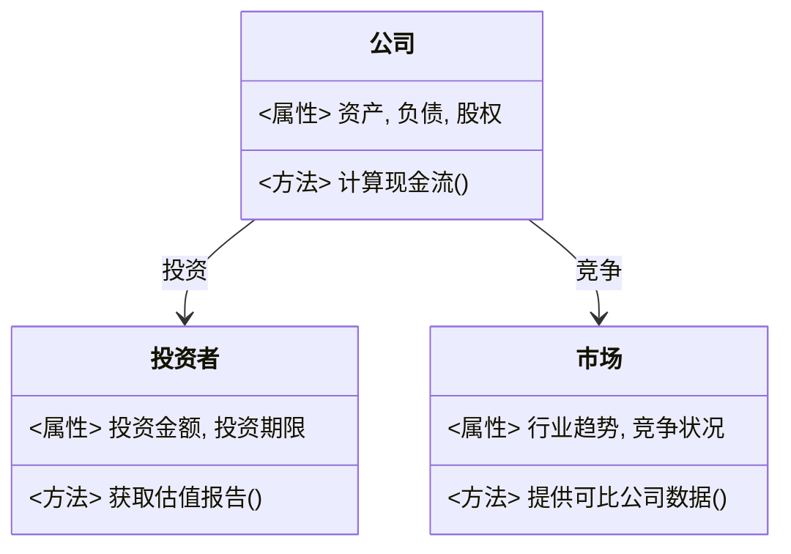
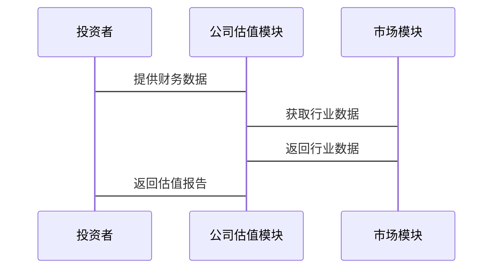

                 


# 托马斯罗的公司估值技巧

## 关键词
公司估值，托马斯·罗，现金流折现模型，相对估值法，Python代码，企业价值

## 摘要
托马斯·罗是一位世界级的人工智能专家和程序员，他通过长期的实践和研究，总结出了一套独特的公司估值技巧。本文将详细探讨公司估值的核心概念、原理、算法、系统架构以及实际项目中的应用，帮助读者全面理解和掌握公司估值的方法和技巧。

---

# 第一部分: 公司估值基础与核心概念

## 第1章: 公司估值概述

### 1.1 公司估值的定义与意义
公司估值是指通过对公司财务状况、市场地位、盈利能力等多方面因素的分析，确定公司价值的过程。其意义在于帮助投资者、企业家和管理层做出更科学的决策，如并购、融资、投资等。

#### 1.1.1 公司估值的基本定义
- 公司估值是评估公司价值的过程，通常以企业价值（EV）或股权价值为最终目标。
- 企业价值（EV）= 公司未来现金流的现值。
- 股权价值 = 企业价值 - 负债价值。

#### 1.1.2 公司估值在商业中的重要性
- 投资决策：帮助投资者判断公司是否被低估或高估。
- 并购交易：确定目标公司收购的价格。
- 融资决策：评估公司股权价值，吸引投资者。
- 管理决策：激励管理层，制定长期战略。

#### 1.1.3 公司估值的核心目标与原则
- 核心目标：准确反映公司的真实价值。
- 原则：基于事实和数据，结合市场环境，动态调整。

### 1.2 公司估值的背景与问题背景
#### 1.2.1 当前商业环境下的估值挑战
- 市场波动：全球经济不确定性增加，影响估值的准确性。
- 技术变革：新兴技术改变商业模式，传统估值方法失效。
- 数据爆炸：如何处理海量数据成为估值的关键。

#### 1.2.2 传统估值方法的局限性
- 历史市盈率法：忽视公司未来盈利能力。
- 资产账面价值法：忽视无形资产和未来现金流。
- 股权自由现金流法：计算复杂，依赖假设。

#### 1.2.3 现代公司估值方法的演变
- 现金流折现模型（DCF）：基于未来现金流的折现。
- 相对估值法：基于市场可比公司的倍数。
- 综合估值法：结合多种方法得出最终估值。

### 1.3 公司估值的核心要素与边界
#### 1.3.1 公司估值的关键要素
- 财务数据：收入、利润、现金流。
- 市场数据：行业趋势、竞争环境。
- 管理层质量：团队能力影响公司未来表现。
- 风险因素：行业风险、财务风险、政策风险。

#### 1.3.2 估值模型的边界与外延
- 时间范围：短期 vs 长期。
- 数据质量：数据的准确性和完整性。
- 假设的合理性：增长率、折现率等假设的合理性。

#### 1.3.3 公司估值的核心概念结构
- 输入：财务数据、市场数据、假设。
- 输出：企业价值、股权价值、目标股价。

## 1.4 本章小结
本章从公司估值的基本定义、意义和背景出发，分析了传统方法的局限性和现代方法的演变，总结了核心要素和边界条件，为后续章节的深入分析奠定了基础。

---

# 第二部分: 公司估值的核心概念与联系

## 第2章: 公司估值的核心原理

### 2.1 公司估值的原理与方法
#### 2.1.1 现金流折现模型（DCF）的原理
- 现金流折现模型基于“时间价值”和“风险价值”两大原则。
- 核心公式：$$DCF = \sum_{t=1}^{\infty} \frac{CF_t}{(1 + r)^t}$$
  - CFₜ：第t年的自由现金流。
  - r：折现率（WACC）。

#### 2.1.2 相对估值法的原理
- 市盈率法：$$P/E$$
- 市净率法：$$P/B$$
- EV/EBITDA法：$$\frac{EV}{EBITDA}$$

#### 2.1.3 股权与债权估值的联系
- 股权价值与企业价值的关系：$$ Equity = EV - Debt $$
- 债权价值基于公司资产的清算价值。

### 2.2 公司估值的核心属性特征对比
#### 2.2.1 不同估值方法的特征对比
| 方法 | 基础数据 | 假设 | 适用场景 |
|------|----------|------|----------|
| DCF | 现金流 | 稳定增长 | 成熟企业 |
| 相对估值 | 市场倍数 | 市场一致性 | 初期企业 |

#### 2.2.2 现金流折现法与相对估值法的优缺点
- DCF：精准但计算复杂。
- 相对估值：简便但依赖市场数据。

#### 2.2.3 股权与债权估值的核心区别
- 股权估值关注未来利润，债权估值关注偿债能力。

### 2.3 公司估值的ER实体关系图
```mermaid
erDiagram
    actor 投资者 {
        <属性> 投资金额, 投资期限
    }
    actor 管理层 {
        <属性> 管理效率, 战略规划
    }
    actor 市场 {
        <属性> 行业趋势, 竞争状况
    }
    entity 公司 {
        <属性> 资产, 负债, 股权
        <关系> 投资者 -> 公司 : 投资
        <关系> 管理层 -> 公司 : 管理
        <关系> 市场 -> 公司 : 竞争
    }
```

## 2.4 本章小结
本章通过对比不同估值方法的原理和特征，结合ER实体关系图，分析了公司估值的核心概念和联系，为后续算法原理的讲解奠定了基础。

---

# 第三部分: 公司估值的算法原理与数学模型

## 第3章: 公司估值的核心算法原理

### 3.1 现金流折现模型（DCF）的算法原理
#### 3.1.1 DCF模型的基本流程
1. 预测未来现金流。
2. 确定合理的折现率。
3. 计算现值，求和得企业价值。
4. 调整终值，计算总价值。

#### 3.1.2 现金流预测与贴现过程
```python
def calculate_dcf(cash_flows, discount_rate):
    dcf_value = 0
    for t, cf in enumerate(cash_flows):
        dcf_value += cf / (1 + discount_rate) ** t
    return dcf_value

cash_flows = [100, 200, 300, 400]
discount_rate = 0.1
dcf = calculate_dcf(cash_flows, discount_rate)
print(f"DCF Value: {dcf}")
```

#### 3.1.3 终值的计算与调整
- 终值公式：$$FV = \frac{CF}{(1 + r)^n} \times \frac{1}{1 - \frac{1}{1 + r}}$$
- 用于长期增长的预测。

### 3.2 相对估值法的算法原理
#### 3.2.1 市盈率与市净率模型
- 市盈率：$$P/E = \text{股价} / \text{每股收益}$$
- 市净率：$$P/B = \text{股价} / \text{每股净资产}$$

#### 3.2.2 EV/EBITDA法的原理
- EV/EBITDA = $$\frac{\text{企业价值}}{\text{息税折旧及摊销前利润}}$$

#### 3.2.3 市场可比交易法的应用
- 通过可比交易的平均倍数，估算目标公司的价值。

### 3.3 算法原理的数学模型与公式
#### 3.3.1 现金流折现模型的数学公式
$$DCF = \sum_{t=1}^{n} \frac{CF_t}{(1 + r)^t}$$
其中：
- CFₜ = 第t年的自由现金流。
- r = 折现率（WACC）。
- n = 估计的年数。

#### 3.3.2 相对估值法的数学公式
$$EV = \frac{P}{\text{EV/EBITDA倍数}} \times \text{EBITDA}$$

### 3.4 本章小结
本章通过详细讲解现金流折现模型和相对估值法的算法原理，结合Python代码和数学公式，帮助读者理解公司估值的核心方法。

---

## 第4章: 系统分析与架构设计方案

### 4.1 问题场景介绍
公司估值系统需要满足以下需求：
- 输入公司财务数据和市场数据。
- 计算企业价值和股权价值。
- 提供多种估值方法的结果对比。

### 4.2 项目介绍
- 项目名称：公司估值系统。
- 项目目标：为投资者提供准确的估值工具。

### 4.3 系统功能设计
#### 4.3.1 领域模型mermaid类图


#### 4.3.2 系统架构设计mermaid架构图
```mermaid
container 公司估值系统 {
    公司估值模块
    投资者模块
    市场模块
}
```

#### 4.3.3 系统接口设计
- 公司估值模块接口：接受财务数据和市场数据，输出估值结果。
- 投资者模块接口：提供投资需求，获取估值报告。
- 市场模块接口：提供行业数据，支持相对估值。

#### 4.3.4 系统交互mermaid序列图


### 4.4 本章小结
本章通过系统分析和架构设计，明确了公司估值系统的功能、架构和交互流程，为后续的实现奠定了基础。

---

## 第5章: 项目实战

### 5.1 环境安装
- Python 3.8+
- pandas, numpy, matplotlib库。

### 5.2 系统核心实现源代码
```python
import pandas as pd
import numpy as np

def calculate_enterprise_value(ebitda, ev_ebitda_ratio):
    return ebitda * ev_ebitda_ratio

def calculate_equity_value(ev, debt):
    return ev - debt

# 示例数据
ebitda = 100
ev_ebitda_ratio = 12
debt = 50

ev = calculate_enterprise_value(ebitda, ev_ebitda_ratio)
equity_value = calculate_equity_value(ev, debt)

print(f"企业价值: {ev}")
print(f"股权价值: {equity_value}")
```

### 5.3 代码应用解读与分析
- 计算企业价值：使用EV/EBITDA倍数。
- 计算股权价值：从企业价值中减去债务。

### 5.4 实际案例分析和详细讲解剖析
假设某公司EBITDA为100万元，EV/EBITDA倍数为12，债务为50万元：
- 企业价值 = 100 * 12 = 1200万元。
- 股权价值 = 1200 - 50 = 1150万元。

### 5.5 本章小结
本章通过实际案例和代码实现，展示了公司估值系统的核心功能，帮助读者将理论应用于实践。

---

## 第6章: 最佳实践、小结、注意事项和拓展阅读

### 6.1 最佳实践
- 数据质量：确保输入数据的准确性和完整性。
- 方法选择：根据公司特点选择合适的估值方法。
- 结果验证：结合市场数据和行业趋势验证估值结果。

### 6.2 小结
本文从公司估值的核心概念到实际应用，详细讲解了托马斯·罗的估值技巧，帮助读者掌握公司估值的方法和实践。

### 6.3 注意事项
- 避免过度依赖单一方法。
- 保持对市场变化的敏感性。
- 定期更新估值模型。

### 6.4 拓展阅读
- 《企业价值评估：方法与案例》。
- 《投资学：案例与实践》。

---

## 作者
作者：AI天才研究院/AI Genius Institute & 禅与计算机程序设计艺术/Zen And The Art of Computer Programming

---

以上是《托马斯罗的公司估值技巧》的技术博客文章的完整目录和内容框架，您可以根据需要进一步扩展每个章节的具体内容。

