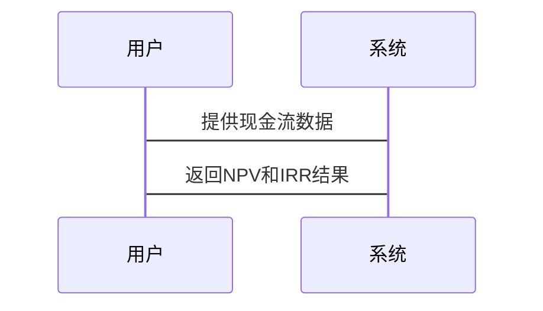

                 


# 托马斯罗的现金流投资法

> 关键词：现金流投资法，托马斯罗，净现值（NPV），内部收益率（IRR），投资决策，价值评估

> 摘要：现金流投资法是一种基于现金流预测和贴现模型的投资决策方法，通过分析未来现金流的时间价值和风险，帮助投资者评估投资项目的真实价值。本文将从现金流投资法的背景、核心原理、数学模型、系统分析、项目实战等方面，详细阐述托马斯罗的现金流投资法，帮助读者掌握这一重要的投资决策工具。

---

## 第一部分: 托马斯罗的现金流投资法概述

### 第1章: 现金流投资法的背景与基础

#### 1.1 现金流投资法的定义与重要性

##### 1.1.1 现金流的定义与作用
现金流是指企业在一定时期内，由于经营、投资和筹资活动而产生的现金流入和流出。现金流是企业财务健康状况的重要指标，也是评估投资项目价值的核心依据。

##### 1.1.2 托马斯罗现金流投资法的核心理念
托马斯罗的现金流投资法强调通过预测未来现金流，并将其贴现为现值，以评估投资项目的真实价值。这种方法能够帮助投资者克服短期利润的迷惑，专注于长期价值的创造。

##### 1.1.3 现金流投资法与传统投资方法的区别
传统的投资方法往往关注于企业的盈利能力（如ROE、ROA等），而现金流投资法则更加注重企业的现金流量，尤其是自由现金流（Free Cash Flow）。

---

#### 1.2 托马斯罗的现金流理论基础

##### 1.2.1 现金流与价值的关系
现金流是价值的源泉。只有能够产生稳定现金流的资产或项目，才具有长期投资价值。

##### 1.2.2 现金流贴现模型的起源与发展
现金流贴现模型起源于20世纪30年代，托马斯罗在他的经典著作中进一步完善了这一理论，强调了现金流贴现模型在投资决策中的重要性。

##### 1.2.3 现金流投资法的适用场景
现金流投资法适用于长期资产投资评估，如房地产、基础设施项目、技术创新项目等。

---

#### 1.3 现金流投资法的核心要素

##### 1.3.1 现金流的分类与预测
现金流可以分为经营现金流、投资现金流和筹资现金流。托马斯罗的现金流投资法主要关注于经营现金流和投资现金流。

##### 1.3.2 现金流的时间价值与风险
现金流的时间价值是指资金随着时间的推移而产生的价值变化。风险则是指未来现金流的不确定性，需要通过贴现率来反映。

##### 1.3.3 现金流与资产定价的关系
现金流投资法通过预测未来现金流，并将其贴现为现值，来确定资产的公允价值。这种方法能够帮助投资者避免市场泡沫，理性评估资产价值。

---

### 第2章: 现金流投资法的核心原理

#### 2.1 现金流预测与分析方法

##### 2.1.1 现金流预测的基本步骤
1. 确定预测的范围和时间跨度。
2. 收集历史数据，分析趋势。
3. 确定关键驱动因素，建立预测模型。
4. 验证模型的准确性，调整参数。

##### 2.1.2 现金流预测的常见模型
- 线性回归模型
- 时间序列分析模型
- 情景分析模型

##### 2.1.3 现金流预测的准确性与风险
现金流预测的准确性受到市场环境、企业管理层决策等多种因素的影响。因此，在实际应用中，需要结合定性分析和定量分析，提高预测的准确性。

---

#### 2.2 现金流贴现模型的数学公式

##### 2.2.1 净现值（NPV）公式
$$ NPV = \sum_{t=1}^{n} \frac{CF_t}{(1+r)^t} $$
其中，$CF_t$是第t期的现金流，$r$是贴现率，$n$是预测的期数。

##### 2.2.2 内部收益率（IRR）公式
$$ IRR = r \text{ 满足 } NPV = 0 $$

##### 2.2.3 净现值与内部收益率的对比
| 对比维度 | NPV | IRR |
|----------|------|-----|
| 计算依据 | 现金流贴现值 | 投资回报率 |
| 适用场景 | 项目规模不同的比较 | 独立项目评估 |

---

#### 2.3 现金流贴现模型的优缺点

##### 2.3.1 优点：精确性与科学性
现金流贴现模型能够将未来的现金流折现为现值，帮助投资者理性评估项目的长期价值。

##### 2.3.2 缺点：假设的局限性
现金流贴现模型依赖于对未来现金流的准确预测，而实际情况往往充满不确定性。

##### 2.3.3 实际应用中的注意事项
- 确保贴现率的选择合理
- 考虑通货膨胀对现金流的影响
- 定期更新现金流预测模型

---

### 第3章: 现金流投资法的系统分析

#### 3.1 现金流投资系统的组成

##### 3.1.1 数据输入模块
- 现金流历史数据
- 市场环境数据
- 项目相关信息

##### 3.1.2 模型计算模块
- 现金流预测模型
- 现金流贴现模型
- 风险评估模型

##### 3.1.3 结果输出模块
- 净现值（NPV）
- 内部收益率（IRR）
- 投资建议报告

---

#### 3.2 现金流投资系统的架构设计

##### 3.2.1 系统架构图


##### 3.2.2 系统功能模块
- 数据管理模块
- 模型计算模块
- 结果展示模块

---

#### 3.3 系统接口设计与交互流程

##### 3.3.1 系统接口设计


##### 3.3.2 系统交互流程
1. 用户输入现金流数据
2. 系统进行现金流预测和贴现计算
3. 系统输出NPV和IRR结果
4. 用户根据结果做出投资决策

---

## 第4章: 现金流投资法的项目实战

### 4.1 环境安装与数据准备

#### 4.1.1 环境安装
- Python 3.8+
- NumPy库
- Pandas库
- Matplotlib库

#### 4.1.2 数据准备
```python
import pandas as pd

# 创建现金流数据
data = {
    '年份': [2023, 2024, 2025, 2026, 2027],
    '现金流': [100, 200, 300, 400, 500]
}
df = pd.DataFrame(data)
print(df)
```

---

### 4.2 系统核心实现

#### 4.2.1 现金流预测模型实现
```python
import numpy as np

def cash_flow_prediction():
    # 示例数据
    cash_flows = [100, 200, 300, 400, 500]
    return cash_flows

# 调用函数
predicted_flows = cash_flow_prediction()
print(predicted_flows)
```

#### 4.2.2 现金流贴现模型实现
```python
def npv_calculator(flows, discount_rate):
    npv = sum(flow / (1 + discount_rate)**t for t, flow in enumerate(flows, start=1))
    return npv

# 示例计算
flows = [100, 200, 300, 400, 500]
discount_rate = 0.08
npv = npv_calculator(flows, discount_rate)
print(f"净现值（NPV）为：{npv:.2f}")
```

---

### 4.3 实际案例分析

#### 4.3.1 案例背景
假设某企业计划投资一个项目，预计未来五年的现金流分别为100、200、300、400、500万元，贴现率为8%。

#### 4.3.2 计算NPV和IRR
```python
def irr_calculator(flows):
    def npv(r):
        return sum(flow / (1 + r)**t for t, flow in enumerate(flows, start=1))
    # 使用牛顿法求解IRR
    r = 0.1
    for _ in range(100):
        current_npv = npv(r)
        if abs(current_npv) < 1e-6:
            break
        derivative = (npv(r + 1e-6) - npv(r - 1e-6)) / 2e-6
        r -= current_npv / derivative
    return r

flows = [100, 200, 300, 400, 500]
irr = irr_calculator(flows)
print(f"内部收益率（IRR）为：{irr * 100:.2f}%")
```

---

## 第5章: 现金流投资法的总结与展望

### 5.1 总结
托马斯罗的现金流投资法通过预测未来现金流，并将其贴现为现值，帮助投资者理性评估投资项目的真实价值。这种方法能够克服传统投资方法的局限性，为长期价值投资提供了科学依据。

### 5.2 展望
随着人工智能和大数据技术的发展，现金流预测模型将更加精准，现金流投资法在投资决策中的应用将更加广泛。

---

## 附录: 现金流投资法的拓展阅读

### 附录A: 现金流投资法与风险管理
现金流投资法在实际应用中，需要结合风险评估模型，如蒙特卡洛模拟，来提高预测的准确性。

### 附录B: 现金流投资法的Python库
- `numpy`：用于数组运算和随机数生成
- `pandas`：用于数据处理和分析
- `scipy`：用于科学计算和优化

---

## 作者：AI天才研究院/AI Genius Institute & 禅与计算机程序设计艺术 /Zen And The Art of Computer Programming

---

通过以上内容，您可以全面了解托马斯罗的现金流投资法，并将其应用于实际投资决策中。

