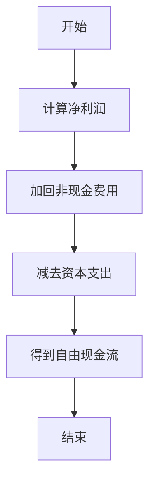

                 


# 托马斯罗的自由现金流分析

## 关键词：自由现金流、现金流分析、财务分析、投资评估、企业价值、资本预算

## 摘要：托马斯罗的自由现金流分析方法，从基础概念到算法实现，深入探讨自由现金流的计算公式、模型构建和实际应用。通过系统架构设计和项目实战，结合丰富的案例分析，全面解析自由现金流分析的核心原理和最佳实践。

---

# 第一部分: 托马斯罗的自由现金流分析背景

## 第1章: 自由现金流分析的背景与核心概念

### 1.1 自由现金流的定义与特点
#### 1.1.1 自由现金流的定义
自由现金流（Free Cash Flow，简称FCF）是指企业在扣除所有必要的投资支出后，剩余可用于偿还债务、支付股息、进行再投资或其他分配的现金流量。它是企业财务健康的重要指标，反映了企业的盈利能力和资金流动性。

#### 1.1.2 自由现金流的核心特点
- **自由性**：不被企业内部投资需求束缚，可用于外部分配。
- **时间性**：强调现金流的时间价值，需考虑资金的时间价值。
- **风险性**：与投资项目的回报率和风险相关联。

#### 1.1.3 自由现金流与企业价值的关系
自由现金流是评估企业价值的核心指标，因为它直接反映了企业创造现金流的能力。高自由现金流意味着企业有更多资源进行再投资或回馈股东。

---

### 1.2 自由现金流的计算公式与应用范围
#### 1.2.1 自由现金流的计算公式
$$FCF = \text{净利润} + \text{非现金费用} - \text{资本性支出}$$

#### 1.2.2 自由现金流的应用场景
- 投资决策：评估投资项目的价值。
- 股权评估：用于计算股权自由现金流（FCFE）。
- 债务评估：用于计算债务人自由现金流（FCFD）。

#### 1.2.3 自由现金流与企业财务健康度
自由现金流为正的企业通常具有较强的偿债能力和扩张能力，是企业财务健康的重要标志。

---

### 1.3 自由现金流与净利润的区别与联系
#### 1.3.1 净利润的定义与计算
净利润（Net Income）是企业在扣除所有费用后的利润，是会计利润，不考虑现金流的时间价值和风险。

#### 1.3.2 自由现金流与净利润的主要区别
- 净利润是会计利润，自由现金流是实际现金流。
- 净利润考虑非现金费用，自由现金流考虑资本支出。

#### 1.3.3 自由现金流与净利润的综合应用
将自由现金流与净利润结合分析，可以更全面地评估企业的真实盈利能力和财务状况。

---

### 1.4 自由现金流分析的边界与外延
#### 1.4.1 自由现金流分析的边界条件
- 仅考虑直接相关因素，如经营现金流和资本支出。
- 忽略间接因素，如市场波动和政策变化。

#### 1.4.2 自由现金流分析的外延领域
- 投资决策：用于评估投资项目。
- 估值分析：用于计算企业价值。

#### 1.4.3 自由现金流分析的局限性
- 仅适用于特定时间段的分析。
- 忽略了其他重要的财务指标，如应收账款和应付账款。

---

## 1.5 本章小结
本章介绍了自由现金流的基本概念、计算公式和应用场景，重点分析了其与净利润的区别和联系。理解这些内容是进行后续分析的基础。

---

# 第二部分: 自由现金流分析的核心概念与联系

## 第2章: 自由现金流的核心概念原理

### 2.1 自由现金流的属性特征对比
#### 2.1.1 自由现金流的时间价值属性
$$FCF_{\text{现值}} = \frac{FCF}{(1 + r)^t}$$
其中，r为折现率，t为时间。

#### 2.1.2 自由现金流的风险评估属性
高风险项目通常需要更高的折现率，从而影响自由现金流的现值。

#### 2.1.3 自由现金流的收益性与流动性对比
收益性关注未来现金流的总量，流动性关注现金流的时间分布。

---

### 2.2 自由现金流的ER实体关系图
```mermaid
erDiagram
    user frees CashFlow {
        <name>
        <cashFlow>
        <time>
    }
    user has frees CashFlow
    frees CashFlow has <name>
```

---

### 2.3 自由现金流的Mermaid流程


---

## 2.4 本章小结
本章通过对比分析和图表展示，详细讲解了自由现金流的核心概念和相关属性，为后续分析奠定了基础。

---

接下来，我会继续按照这个结构，详细撰写后续章节的内容，确保每个部分都涵盖必要的主题，并保持逻辑连贯和内容丰富。

