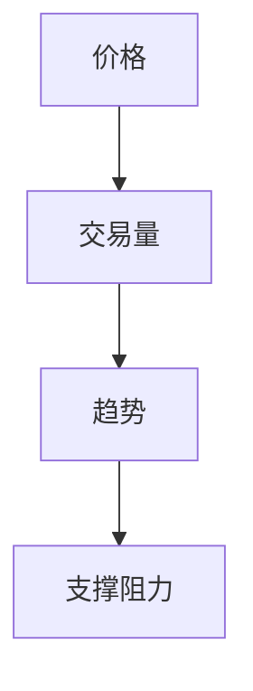
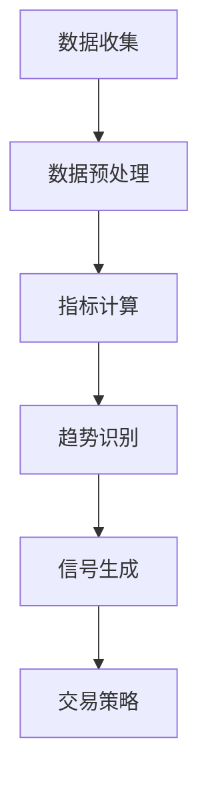
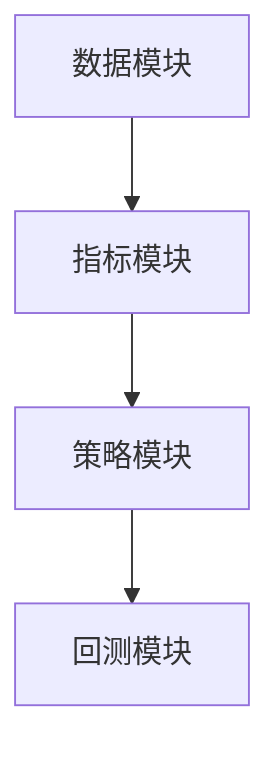

                 

# 技术分析在高波动市场中的应用

> 关键词：技术分析、高波动市场、交易策略、指标、机器学习、风险管理

> 摘要：技术分析作为一种重要的金融工具，广泛应用于市场预测和交易决策。本文系统探讨了技术分析在高波动市场中的应用，从核心概念到高级策略，结合实际案例和系统设计，帮助读者掌握相关知识和技能。文章深入分析了技术分析的算法原理、高波动市场的挑战、技术分析策略的应用，以及与机器学习的结合，为读者提供全面的指导。

---

## 目录

1. [技术分析的背景与核心概念](#技术分析的背景与核心概念)
2. [技术分析的核心概念与联系](#技术分析的核心概念与联系)
3. [技术分析的算法原理](#技术分析的算法原理)
4. [高波动市场的特点与技术分析的挑战](#高波动市场的特点与技术分析的挑战)
5. [高波动市场中的技术分析策略](#高波动市场中的技术分析策略)
6. [技术分析与机器学习的结合](#技术分析与机器学习的结合)
7. [技术分析系统的实战指南](#技术分析系统的实战指南)
8. [总结与展望](#总结与展望)

---

## 第一章: 技术分析的背景与核心概念

### 1.1 技术分析的起源与发展

#### 1.1.1 技术分析的起源
技术分析起源于20世纪初，早期交易员通过观察价格图表寻找市场规律。道氏理论奠定了技术分析的基础，强调价格走势反映了所有市场信息。

#### 1.1.2 技术分析的发展历程
从早期的简单图形分析到现代复杂指标和算法，技术分析经历了从手动计算到自动化的过程。近年来，随着计算机技术的发展，技术分析方法更加多样化和精确化。

#### 1.1.3 技术分析在现代金融中的地位
技术分析是金融领域的重要工具，广泛应用于股票、外汇、期货等市场的价格预测和交易决策。结合大数据和人工智能技术，技术分析的影响力进一步扩大。

### 1.2 技术分析的核心假设

#### 1.2.1 市场价格反映所有信息
技术分析认为市场价格已经反映了所有可获取的信息，因此通过分析价格走势可以预测未来的价格变化。

#### 1.2.2 市场价格的趋势性
市场价格具有一定的趋势性，技术分析通过识别趋势来指导交易策略。趋势可以分为上升趋势、下降趋势和横向整理趋势。

#### 1.2.3 历史价格的重复性
市场参与者的行为模式具有重复性，技术分析通过识别历史价格模式来预测未来市场行为。

### 1.3 技术分析与基本面分析的对比

#### 1.3.1 基本面分析的定义与特点
基本面分析关注市场的内在因素，如公司财务状况、行业趋势等，通过分析这些因素来预测价格走势。

#### 1.3.2 技术分析的定义与特点
技术分析专注于市场价格和成交量的变化，通过识别图形形态和指标来预测未来价格。

#### 1.3.3 两种分析方法的优缺点对比
基本面分析适合长期投资，但对短期价格波动的预测能力有限。技术分析适合短期交易，但需要结合市场环境灵活运用。

### 1.4 技术分析的核心要素

#### 1.4.1 价格
价格是技术分析的核心，通过分析价格走势识别趋势和形态。

#### 1.4.2 交易量
交易量是价格变动的辅助指标，用于确认趋势强度和价格波动的可靠性。

#### 1.4.3 时间
时间是技术分析的重要维度，不同时间周期（如分钟、小时、日线）的分析结果不同。

#### 1.4.4 指标
技术指标是技术分析的关键工具，如移动平均线、RSI、MACD等，帮助交易者识别市场状态和趋势。

### 1.5 本章小结
本章介绍了技术分析的背景、核心假设、与基本面分析的对比，以及技术分析的核心要素，为后续章节的学习打下基础。

---

## 第二章: 技术分析的核心概念与联系

### 2.1 技术分析的核心概念

#### 2.1.1 价格与市场的反映
价格走势反映了市场的供需关系和参与者情绪，是技术分析的核心研究对象。

#### 2.1.2 趋势与支撑阻力
趋势是价格的主方向，支撑位和阻力位是价格波动的关键点，帮助交易者识别买卖机会。

#### 2.1.3 交易量与价格的关系
交易量是价格变动的验证指标，高交易量表明趋势的强度，低交易量可能预示趋势反转。

### 2.2 技术分析核心概念的属性特征对比

| 概念       | 描述                                                                 |
|------------|----------------------------------------------------------------------|
| 价格       | 反映市场供需，是技术分析的核心。                                     |
| 交易量     | 验证价格变动的强度，高交易量确认趋势。                               |
| 趋势       | 价格的主要运动方向，分为上升、下降和横向。                         |
| 支撑阻力   | 支撑位是价格下跌的支撑点，阻力位是价格上涨的障碍。                   |

### 2.3 技术分析的ER实体关系图

---

## 第三章: 技术分析的算法原理

### 3.1 技术分析的算法流程

#### 3.1.1 数据收集与预处理
收集历史价格和交易量数据，清洗数据并标准化处理。

#### 3.1.2 指标计算与趋势识别
计算技术指标（如移动平均线、RSI），识别趋势和形态。

#### 3.1.3 信号生成与交易策略
根据指标生成买入或卖出信号，制定交易策略。

### 3.2 技术分析的算法流程图

### 3.3 技术分析的数学模型与公式

#### 3.3.1 移动平均线（MA）
$$ MA_n = \frac{1}{n} \sum_{i=1}^{n} P_i $$
其中，$P_i$ 是第i个价格，n是计算周期。

#### 3.3.2 相对强弱指数（RSI）
$$ RSI = \frac{100}{1 + \frac{S}{K}} $$
其中，S是上涨幅度，K是下跌幅度，用于衡量市场的超买或超卖状态。

#### 3.3.3 移动平均收敛散度（MACD）
$$ MACD = EMA_{12} - EMA_{26} $$
$$ Signal = EMA_{9} \text{ of MACD} $$

---

## 第四章: 高波动市场的特点与技术分析的挑战

### 4.1 高波动市场的特点

#### 4.1.1 价格波动剧烈
高波动市场中价格波动频繁，趋势变化快，增加了交易的难度。

#### 4.1.2 交易机会多
高波动市场提供了更多的交易机会，但也增加了风险。

#### 4.1.3 市场情绪不稳定
市场参与者情绪波动大，影响价格走势，增加了技术分析的复杂性。

### 4.2 技术分析在高波动市场的挑战

#### 4.2.1 信号误判
高波动市场中指标信号可能频繁变化，导致误判交易机会。

#### 4.2.2 策略失效
传统的技术分析策略在高波动市场中可能失效，需要灵活调整。

#### 4.2.3 风险管理难度大
高波动市场中风险管理尤为重要，需要制定严格的止损策略。

### 4.3 高波动市场中的技术分析机会

#### 4.3.1 短期交易机会
高波动市场适合短期交易，技术分析可以快速捕捉价格波动。

#### 4.3.2 高收益潜力
通过精准的技术分析，交易者可以在高波动市场中获得高收益。

#### 4.3.3 创新策略开发
高波动市场促使交易者开发新的技术分析策略，结合现代技术提升预测能力。

---

## 第五章: 高波动市场中的技术分析策略

### 5.1 动量策略

#### 5.1.1 动量策略的定义
动量策略基于价格动量，买入近期上涨的资产，卖出近期下跌的资产。

#### 5.1.2 动量策略的应用
在高波动市场中，动量策略可以捕捉短期趋势，但需要注意风险控制。

### 5.2 突破策略

#### 5.2.1 突破策略的定义
突破策略关注价格突破关键阻力位，通常伴随大成交量，预示趋势反转。

#### 5.2.2 突破策略的应用
在高波动市场中，突破策略可以有效捕捉趋势变化，但需要严格的资金管理和止损设置。

### 5.3 逆向交易策略

#### 5.3.1 逆向交易策略的定义
逆向交易策略在市场恐慌时买入，市场狂热时卖出，利用市场情绪反转获利。

#### 5.3.2 逆向交易策略的应用
在高波动市场中，逆向策略需要交易者具备强大的心理素质和市场敏感度。

### 5.4 案例分析

#### 5.4.1 动量策略案例
某股票近期连续上涨，技术指标显示超买，交易者卖出锁定收益。

#### 5.4.2 突破策略案例
价格突破长期下降趋势线，成交量大幅增加，交易者买入顺势而为。

#### 5.4.3 逆向策略案例
市场恐慌性下跌，交易者在低位买入，待市场反弹获利。

---

## 第六章: 技术分析与机器学习的结合

### 6.1 技术分析与机器学习的结合

#### 6.1.1 机器学习在技术分析中的应用
机器学习算法可以分析海量数据，发现传统技术分析难以捕捉的模式，提升预测准确性。

#### 6.1.2 常见算法
- 线性回归
- 支持向量机（SVM）
- 随机森林
- 神经网络

#### 6.1.3 机器学习模型的优势
- 高精度预测
- 自适应学习
- 处理复杂数据

### 6.2 技术分析与机器学习结合的实际应用

#### 6.2.1 数据准备
收集历史价格、交易量和技术指标数据，进行特征工程。

#### 6.2.2 模型训练
使用机器学习算法训练模型，识别价格走势和形态。

#### 6.2.3 模型优化
通过交叉验证和网格搜索优化模型参数，提高预测准确率。

### 6.3 机器学习在高波动市场中的应用案例

#### 6.3.1 LSTM神经网络
LSTM网络擅长处理时间序列数据，适用于预测高波动市场的短期价格走势。

#### 6.3.2 分类算法
使用分类算法识别市场状态，如牛市、熊市和震荡市，指导交易策略。

---

## 第七章: 技术分析系统的实战指南

### 7.1 环境安装与数据收集

#### 7.1.1 环境安装
安装Python、Pandas、Matplotlib、Scikit-learn等工具，搭建技术分析环境。

#### 7.1.2 数据收集
通过API获取历史价格数据，清洗数据并存储。

### 7.2 系统核心实现

#### 7.2.1 技术指标计算
编写函数计算移动平均线、RSI等指标，展示代码实现。

#### 7.2.2 策略开发
开发交易策略，如动量策略和突破策略，结合回测功能验证策略有效性。

#### 7.2.3 系统架构设计
设计系统架构，包括数据模块、指标模块、策略模块和回测模块，使用mermaid图展示。

### 7.3 实际案例分析

#### 7.3.1 环境搭建与数据导入
安装必要的库，导入历史价格数据，展示代码示例。

#### 7.3.2 指标计算与策略开发
编写代码计算技术指标，开发交易策略，展示代码实现。

#### 7.3.3 系统优化与回测
优化系统参数，进行历史数据回测，分析策略表现。

### 7.4 小结
本章通过实际操作展示了技术分析系统的开发过程，帮助读者掌握从数据收集到策略开发的实战技能。

---

## 第八章: 总结与展望

### 8.1 总结
本文系统探讨了技术分析在高波动市场中的应用，从核心概念到高级策略，结合实际案例和系统设计，为读者提供了全面的指导。

### 8.2 未来展望
未来，技术分析将与大数据和人工智能进一步结合，开发更智能的交易系统。同时，风险管理的重要性将更加突出，交易者需要不断学习和适应市场变化。

---

## 参考文献

1. 葛拉汉，本杰明. 《股票作手回忆录》. 北京: 中信出版社, 2008.
2. 艾德勒，J. 约翰. 《技术分析实战指南》. 上海: 上海财经大学出版社, 2010.
3. 哲amburger，亚历山大. 《专业投机原理》. 北京: 清华大学出版社, 2008.

---

## 作者：AI天才研究院/AI Genius Institute & 禅与计算机程序设计艺术 /Zen And The Art of Computer Programming

---

本文系统地介绍了技术分析在高波动市场中的应用，从理论到实践，帮助读者掌握技术分析的核心概念、算法原理和实际应用。通过结合机器学习和系统设计，文章为读者提供了前沿的技术视角和实战指导。

