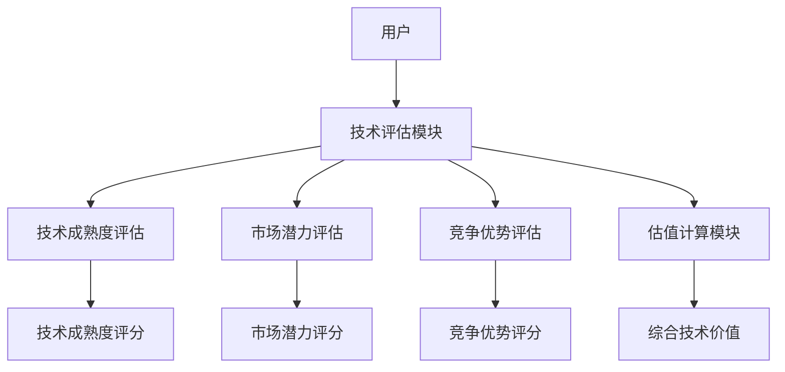

                 


# 《技术型企业的特殊估值考虑》

---

## 关键词

- 技术型企业
- 特殊估值
- 技术评估
- 市场分析
- 估值模型
- 系统架构
- 项目实战

---

## 摘要

技术型企业由于其核心资产和技术的特殊性，在估值过程中需要考虑诸多独特因素。本文从技术评估、市场分析、算法原理、系统架构等多个维度，详细探讨技术型企业的特殊估值方法，并结合实际案例分析，提供可行的解决方案。通过系统的分析和实战指导，帮助读者掌握技术型企业的估值技巧，确保在复杂的技术和市场环境中做出明智的决策。

---

## 正文

### 第一部分：技术型企业的特殊估值背景

#### 第1章：技术型企业的定义与特殊估值的必要性

##### 1.1 技术型企业的定义

技术型企业是以技术创新为核心竞争力的企业，其价值往往依赖于知识产权、技术储备和研发能力。与传统企业相比，技术型企业具有以下核心特征：

- **高度依赖技术**：企业的核心竞争力源于技术和创新。
- **高风险与高回报**：技术创新带来高风险，但潜在回报也更高。
- **动态变化**：技术更新迭代快，企业需持续投入研发。

技术型企业的估值需要考虑技术的可扩展性、商业化潜力以及市场环境等多重因素。

##### 1.2 特殊估值的必要性

传统估值方法如市盈率、市净率等难以准确反映技术型企业的真实价值。技术型企业的估值需考虑以下因素：

- **技术成熟度**：技术是否成熟，能否转化为实际收益。
- **市场定位**：技术在市场中的定位及竞争优势。
- **研发能力**：企业的研发团队和持续创新能力。

### 第二部分：技术型企业的核心估值概念

#### 第2章：技术评估的核心要素

##### 2.1 技术评估的基本原理

技术评估是技术型企业估值的关键步骤。通过评估技术的先进性、稳定性和商业潜力，可以确定其价值。

##### 2.2 市场分析与竞争评估

市场分析包括需求分析和竞争分析，帮助确定技术的市场定位和竞争优势。以下是技术评估的关键维度：

- **技术成熟度**：技术是否经过验证，能否稳定运行。
- **市场潜力**：技术的市场需求和增长空间。
- **竞争分析**：与竞争对手技术的优劣势对比。

### 第三部分：技术型企业的估值模型与算法

#### 第3章：技术评估模型的构建

##### 3.1 技术评估模型的原理

技术评估模型通过量化技术的各维度价值，综合得出技术的总体估值。模型的输入变量包括技术成熟度、市场需求、竞争环境等。

##### 3.2 技术评估模型的数学公式

技术价值计算公式：

$$
TV = w_1 \times MT + w_2 \times MP + w_3 \times CP
$$

其中：
- $TV$ 表示技术价值
- $MT$ 表示技术成熟度
- $MP$ 表示市场潜力
- $CP$ 表示竞争优势
- $w_1, w_2, w_3$ 表示各维度的权重，通常通过专家评分确定。

### 第四部分：系统分析与架构设计

#### 第4章：系统功能设计

##### 4.1 系统功能模块

技术评估系统通常包括以下功能模块：

- **技术评估模块**：评估技术的成熟度和潜力。
- **市场分析模块**：分析市场需求和竞争环境。
- **估值计算模块**：综合各因素计算技术价值。

##### 4.2 系统架构设计

系统架构设计需确保模块间的高效交互。以下是系统架构图：



### 第五部分：项目实战与案例分析

#### 第5章：技术型企业估值实战

##### 5.1 项目背景与目标

假设我们正在评估一家AI初创企业。目标是通过技术评估模型，确定其核心AI技术的市场价值。

##### 5.2 核心代码实现

以下是技术评估模型的Python代码实现：

```python
def calculate_technology_value(maturity, market_potential, competition):
    # 权重根据实际情况调整，这里假设成熟度占40%，市场潜力占50%，竞争优势占10%
    weight_maturity = 0.4
    weight_market = 0.5
    weight_competition = 0.1

    TV = (maturity * weight_maturity) + (market_potential * weight_market) + (competition * weight_competition)
    return TV

# 示例数据
maturity = 0.8  # 技术成熟度，0-1评分
market_potential = 0.7  # 市场潜力，0-1评分
competition = 0.6  # 竞争优势，0-1评分

TV = calculate_technology_value(maturity, market_potential, competition)
print(f"技术价值评分：{TV}")
```

### 第六部分：总结与展望

#### 第6章：总结与最佳实践

##### 6.1 估值模型的总结

- 技术评估模型通过量化技术的各维度价值，帮助企业准确评估技术的市场价值。
- 模型的权重需根据企业实际情况调整，以反映不同的侧重点。

##### 6.2 未来趋势与建议

- **技术型企业的估值将更加依赖数据分析**：随着大数据和AI的发展，技术评估将更加精准。
- **动态调整模型**：根据市场变化和技术进步，定期更新估值模型。

---

### 附录

- 附录A：技术评估模型的详细公式
- 附录B：系统架构设计的mermaid图
- 附录C：项目实战的完整代码

---

### 图表目录

- 图3-1：技术评估模型的mermaid流程图
- 图4-1：系统架构设计的mermaid图
- 图5-1：系统交互的mermaid序列图

---

### 作者

作者：AI天才研究院/AI Genius Institute & 禅与计算机程序设计艺术 /Zen And The Art of Computer Programming

---

通过本文的系统分析和实战指导，读者可以深入了解技术型企业的特殊估值方法，并在实际工作中应用这些知识，提升企业的估值能力。

