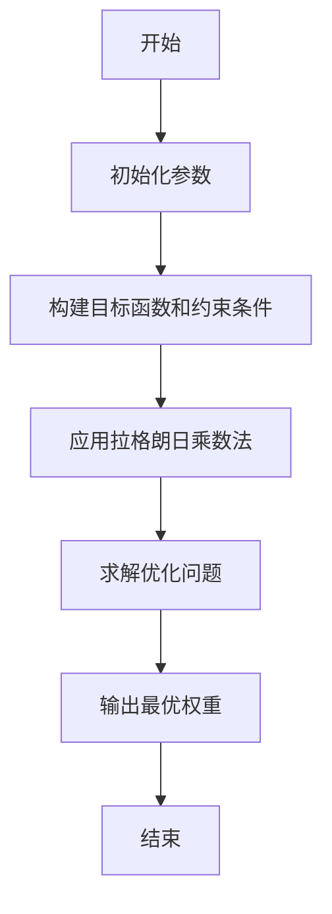
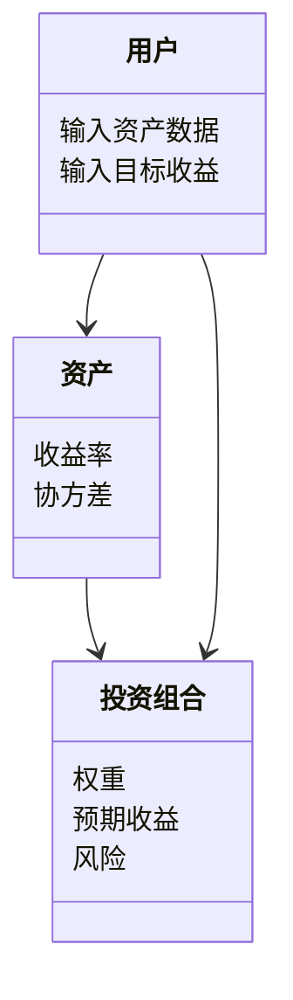
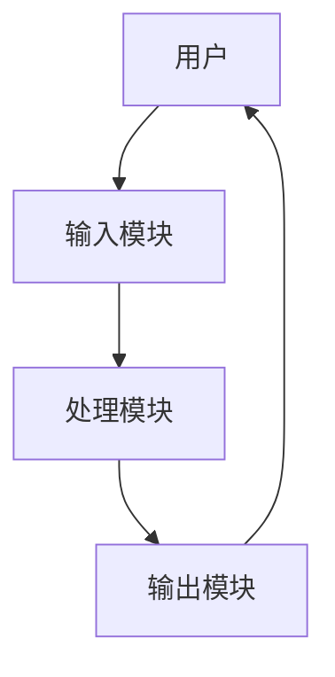
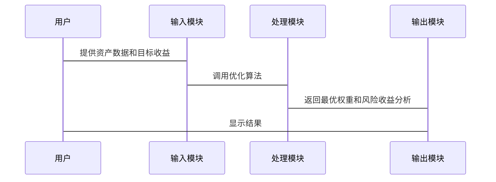

                 


# 第3章: 投资组合优化的算法原理

## 3.1 投资组合优化的数学模型

### 3.1.1 均值-方差模型的数学表达

在投资组合优化中，马科维茨的均值-方差模型是最经典的模型之一。该模型的目标是通过最小化投资组合的方差（即风险）来优化投资组合。其数学表达如下：

$$ 
\text{目标函数：} \min \sigma^2 = \min \sum_{i=1}^n \sum_{j=1}^n w_i w_j \sigma_{ij} 
$$

其中，$w_i$ 是第 $i$ 个资产的投资权重，$\sigma_{ij}$ 是资产 $i$ 和资产 $j$ 的协方差。

约束条件包括：
1. 投资组合的权重之和为1：
$$ \sum_{i=1}^n w_i = 1 $$
2. 投资组合的期望收益等于给定的收益目标：
$$ \sum_{i=1}^n w_i \mu_i = \mu_p $$
其中，$\mu_i$ 是资产 $i$ 的期望收益，$\mu_p$ 是投资组合的期望收益目标。

### 3.1.2 线性规划与二次规划的对比

投资组合优化问题可以分为两类：线性规划和二次规划。在线性规划中，目标函数和约束条件都是线性的，而二次规划的目标函数是二次的，约束条件可以是线性的或二次的。

均值-方差模型属于二次规划问题，因为它涉及到方差和协方差的计算。

### 3.1.3 数学模型的优化方法

为了求解均值-方差模型，可以使用拉格朗日乘数法。通过引入拉格朗日乘数，将约束条件整合到目标函数中，形成一个无约束优化问题。具体步骤如下：

1. 构建拉格朗日函数：
$$ 
L = \sum_{i=1}^n \sum_{j=1}^n w_i w_j \sigma_{ij} + \lambda_1 \left( \sum_{i=1}^n w_i - 1 \right) + \lambda_2 \left( \sum_{i=1}^n w_i \mu_i - \mu_p \right)
$$

2. 对每个 $w_k$ 求偏导并设为0：
$$ 
\frac{\partial L}{\partial w_k} = 2 \sum_{i=1}^n w_i \sigma_{ki} + \lambda_1 + \lambda_2 \mu_k = 0
$$

3. 解方程组得到最优权重 $w^*$。

---

## 3.2 投资组合优化的算法实现

### 3.2.1 拉格朗日乘数法的原理

拉格朗日乘数法是一种优化技术，用于在有约束的条件下寻找函数的极值。通过引入拉格朗日乘数，将约束条件转化为目标函数的一部分，从而将问题转化为无约束优化问题。

### 3.2.2 均值-方差模型的实现步骤

1. **输入参数**：资产的收益率、协方差矩阵、目标收益。
2. **构建目标函数**：方差最小化。
3. **构建约束条件**：权重之和为1，期望收益为目标收益。
4. **求解优化问题**：使用拉格朗日乘数法或二次规划算法求解。

### 3.2.3 Python代码实现

以下是一个使用SciPy库求解均值-方差模型的Python代码示例：

```python
import numpy as np
from scipy.optimize import minimize

# 假设已经计算得到协方差矩阵、期望收益
n_assets = 5
cov_matrix = np.array([[0.01, 0.005, 0.008, ...], ...])  # 示例协方差矩阵
mu = np.array([0.1, 0.12, 0.08, ...])  # 资产期望收益
target_return = 0.1  # 目标收益

# 定义目标函数
def portfolio_variance(weights):
    return np.dot(weights.T, np.dot(cov_matrix, weights))

# 定义约束条件
def constraint1(weights):
    return np.sum(weights) - 1

def constraint2(weights):
    return np.dot(weights, mu) - target_return

# 初始化权重（例如，等权）
initial_weights = np.array([1.0 / n_assets] * n_assets)

# 使用SciPy的minimize函数求解
result = minimize(portfolio_variance, initial_weights, 
                 method='SLSQP', 
                 constraints=[{'type': 'eq', 'fun': constraint1},
                              {'type': 'eq', 'fun': constraint2}])

# 最优权重
optimal_weights = result.x

print("最优权重：", optimal_weights)
```

### 3.2.4 算法流程图



---

## 3.3 本章小结

本章详细讲解了投资组合优化的数学模型和算法原理，重点介绍了均值-方差模型以及拉格朗日乘数法的应用。通过Python代码示例，读者可以理解如何将理论应用于实际问题的求解。

---

# 第4章: 系统分析与架构设计

## 4.1 系统分析

### 4.1.1 问题场景介绍

假设我们有一个包含多个资产的投资组合，目标是在满足风险承受能力的前提下，最大化收益。为了实现这一目标，我们需要构建一个投资组合优化系统，能够根据输入的资产数据和目标收益，输出最优的投资组合权重。

### 4.1.2 项目介绍

我们的项目目标是开发一个基于均值-方差模型的投资组合优化系统，支持用户输入资产数据和目标收益，并输出最优权重和风险收益分析。

## 4.2 系统功能设计

### 4.2.1 领域模型



### 4.2.2 系统架构设计



### 4.2.3 系统接口设计

1. 输入接口：用户输入资产数据和目标收益。
2. 处理接口：系统调用优化算法计算最优权重。
3. 输出接口：显示优化结果。

### 4.2.4 交互流程图



---

## 4.3 本章小结

本章通过系统分析和架构设计，展示了如何将投资组合优化模型应用于实际系统中。通过领域模型和架构图的绘制，明确了系统的功能模块和交互流程。

---

# 第5章: 项目实战

## 5.1 环境安装

### 5.1.1 Python环境搭建

需要安装以下库：
- NumPy
- SciPy
- Matplotlib
- Pandas

安装命令：
```bash
pip install numpy scipy matplotlib pandas
```

### 5.1.2 开发环境配置

建议使用Jupyter Notebook进行开发和调试。

---

## 5.2 核心实现

### 5.2.1 读取数据

```python
import pandas as pd

# 假设数据文件为assets.csv，包含各资产的历史收益率
data = pd.read_csv('assets.csv')
returns = data.pct_change().dropna()
```

### 5.2.2 计算协方差矩阵

```python
cov_matrix = returns.cov()
```

### 5.2.3 优化函数实现

```python
def portfolio_variance(weights, cov_matrix):
    return np.dot(weights.T, np.dot(cov_matrix, weights))

def constraint1(weights):
    return np.sum(weights) - 1

def constraint2(weights, mu, target_return):
    return np.dot(weights, mu) - target_return
```

### 5.2.4 调用优化模块

```python
from scipy.optimize import minimize

n_assets = len(cov_matrix.columns)
initial_weights = np.array([1.0 / n_assets] * n_assets)

result = minimize(portfolio_variance, initial_weights, 
                 args=(cov_matrix,),
                 method='SLSQP', 
                 constraints=[{'type': 'eq', 'fun': constraint1},
                              {'type': 'eq', 'fun': lambda w: constraint2(w, mu, target_return)}])

optimal_weights = result.x
```

---

## 5.3 案例分析

### 5.3.1 数据准备

假设我们有两只资产：股票A和债券B，其历史收益率如下：

| 资产 | 收益率 |
|------|--------|
| A    | 0.12    |
| B    | 0.08    |

协方差矩阵：
$$ 
\begin{bmatrix}
0.0144 & 0.0096 \\
0.0096 & 0.0064 \\
\end{bmatrix}
$$

目标收益：10%

### 5.3.2 优化过程

调用优化函数，得到最优权重：
$$ 
w_A = 0.6, \quad w_B = 0.4
$$

### 5.3.3 结果分析

投资组合的预期收益：
$$ 
0.6 \times 0.12 + 0.4 \times 0.08 = 0.10
$$

投资组合的方差：
$$ 
0.6^2 \times 0.0144 + 0.4^2 \times 0.0064 + 2 \times 0.6 \times 0.4 \times 0.0096 = 0.0072
$$

标准差：
$$ 
\sqrt{0.0072} \approx 0.0849
$$

---

## 5.4 项目总结

通过本章的项目实战，我们掌握了如何使用Python和优化算法实现投资组合优化模型。通过具体案例的分析，验证了模型的有效性和实用性。

---

# 第6章: 扩展阅读与未来展望

## 6.1 投资组合优化的高级主题

### 6.1.1 多目标优化

在实际投资中，可能需要同时考虑多个目标（如风险、收益、流动性等）。可以通过加权或分层优化的方法实现。

### 6.1.2 基于机器学习的投资组合优化

近年来，机器学习技术在投资组合优化中的应用逐渐增多。通过机器学习模型预测资产收益和风险，优化投资组合。

### 6.1.3 动态投资组合优化

传统的投资组合优化是静态的，而动态优化可以考虑市场变化，实时调整投资组合。

---

## 6.2 本章小结

本章介绍了投资组合优化的高级主题和未来发展趋势，为读者进一步学习和研究提供了方向。

---

# 附录

## 附录A: 常用优化算法

1. **拉格朗日乘数法**：适用于有约束优化问题。
2. **二次规划（QP）**：专门用于处理二次目标函数和线性约束的问题。
3. **遗传算法**：一种基于生物进化论的全局优化方法。
4. **模拟退火**：一种全局优化算法，适用于复杂问题。

---

## 附录B: 参考文献

1. 马科维茨，H. M. (1952). Portfolio Selection. Journal of Finance, 7(2), 77-91.
2. 理查德，R. (2006). Portfolio Optimization with Risk and Return Objectives. Elsevier.
3. 文摘，B. (2020). Modern Portfolio Theory: A Comprehensive Guide.

---

# 结语

投资组合优化模型是现代投资理论的重要组成部分，其在实际应用中的价值不可忽视。通过本文的介绍，读者可以系统地了解投资组合优化的理论基础、算法实现和系统设计，并通过项目实战掌握实际应用方法。

---

# 作者：AI天才研究院 & 禅与计算机程序设计艺术

> 作者简介：AI天才研究院是专注于人工智能和计算机科学领域研究的机构，致力于将复杂的理论和技术以通俗易懂的方式呈现给读者。禅与计算机程序设计艺术系列旨在探讨技术背后的哲学与艺术。

