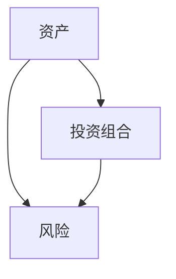
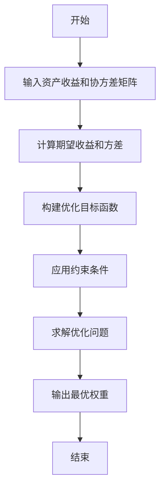
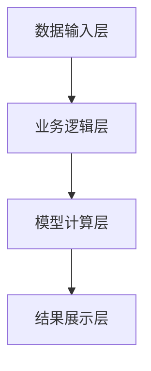

                 


# 投资组合优化：均值-方差模型的实际应用

## 关键词：投资组合优化，均值-方差模型，投资组合管理，风险收益，数学模型

## 摘要：  
本文详细介绍了投资组合优化中均值-方差模型的实际应用，从模型的基本原理到数学推导，再到系统实现和案例分析，逐步展开讲解。通过丰富的数学公式和Python代码示例，帮助读者理解如何在实际投资中应用均值-方差模型，优化投资组合，实现风险与收益的最佳平衡。

---

## 目录大纲

### 第一部分：投资组合优化背景介绍

#### 第1章：投资组合优化概述

##### 1.1 问题背景
- 1.1.1 投资组合的概念  
  投资组合是指将资金分配到不同资产（如股票、债券、基金等）中，以分散风险并最大化收益。  
- 1.1.2 投资组合优化的重要性  
  通过优化投资组合，投资者可以在不同风险水平下获得最大收益，或在给定收益下最小化风险。  
- 1.1.3 均值-方差模型的提出  
  均值-方差模型由Harry Markowitz提出，是现代投资组合理论（MPT）的基础，为投资组合优化提供了理论依据。

##### 1.2 问题描述
- 1.2.1 投资者的收益与风险目标  
  投资者通常希望在可接受的风险范围内获得最大收益。  
- 1.2.2 资产配置的基本问题  
  在多个资产中如何分配资金以实现最优风险-收益平衡？  
- 1.2.3 均值-方差模型的应用场景  
  适用于多种资产配置问题，尤其是在资产间存在相关性的情况下。

##### 1.3 问题解决
- 1.3.1 均值-方差模型的基本思路  
  通过最小化投资组合的方差（风险）来实现给定收益，或最大化收益来实现给定风险。  
- 1.3.2 模型的数学表达  
  使用均值和方差作为风险和收益的衡量标准，构建优化目标函数。  
- 1.3.3 解决方案的可行性分析  
  均值-方差模型假设资产收益服从正态分布，且能够通过数学优化算法求解。

##### 1.4 模型的边界与外延
- 1.4.1 模型的假设条件  
  资产收益是随机变量，且协方差矩阵是正定的。  
- 1.4.2 模型的适用范围  
  适用于风险厌恶型投资者，且数据充分的情况下。  
- 1.4.3 模型的局限性  
  忽略了资产收益的非正态分布，且在市场剧烈波动时可能失效。

##### 1.5 概念结构与核心要素
- 1.5.1 资产、投资组合、风险、收益的定义  
  资产：可投资的金融工具；投资组合：资产的集合；风险：收益的波动性；收益：资产的预期回报。  
- 1.5.2 均值-方差模型的核心要素  
  资产的期望收益、方差、协方差矩阵。  
- 1.5.3 模型的输入与输出  
  输入：资产的历史收益率、协方差矩阵；输出：最优投资权重、最小方差或最大收益。

---

### 第二部分：均值-方差模型的核心概念与联系

#### 第2章：均值-方差模型的核心原理

##### 2.1 核心概念原理
- 2.1.1 资产的期望收益与方差  
  期望收益是资产未来收益的平均值，方差衡量了收益的波动性。  
- 2.1.2 投资组合的期望收益与方差  
  投资组合的期望收益是各资产期望收益的加权平均，方差则受资产间协方差的影响。  
- 2.1.3 风险-收益权衡  
  在投资组合中，收益增加通常伴随着风险（方差）的增加，但通过优化可以找到最佳平衡点。

##### 2.2 概念属性对比
| 概念 | 资产 | 投资组合 |
|------|------|----------|
| 期望收益 | 单个资产的期望值 | 加权平均值 |
| 方差 | 单个资产的方差 | 组合方差（受协方差影响） |
| 协方差 | 与其它资产的相关性 | - |

##### 2.3 实体关系图


---

### 第三部分：均值-方差模型的算法原理

#### 第3章：算法原理与实现

##### 3.1 算法原理
- 3.1.1 算法目标  
  最小化投资组合的方差，或最大化收益，受权重约束（权重之和为1）。  
- 3.1.2 优化问题的数学表达  
  使用二次规划问题求解，目标函数为权重的二次型，约束条件包括权重非负且和为1。

##### 3.2 算法流程


##### 3.3 Python代码实现
```python
import numpy as np
from scipy.optimize import minimize

def portfolio_optimization(returns, cov_matrix):
    n = len(returns)
    # 定义优化目标函数
    def objective(weights):
        return np.dot(weights.T, np.dot(cov_matrix, weights))
    
    # 约束条件
    constraints = [{'type': 'eq', 'fun': lambda w: np.sum(w) - 1},
                   {'type': 'ineq', 'fun': lambda w: w[i] for i in range(n)}]
    
    # 初始权重
    initial_weights = np.array([1/n]*n)
    
    # 求解
    result = minimize(objective, initial_weights, constraints)
    return result.x

# 示例数据
n_assets = 3
returns = np.array([0.1, 0.2, 0.15])
cov_matrix = np.array([
    [0.05, 0.02, 0.03],
    [0.02, 0.08, 0.01],
    [0.03, 0.01, 0.10]
])
weights = portfolio_optimization(returns, cov_matrix)
print(weights)
```

##### 3.4 算法的数学模型
$$ \text{目标函数：} \min_w \sum_{i=1}^n \sum_{j=1}^n w_i w_j \sigma_{ij} $$
$$ \text{约束条件：} \sum_{i=1}^n w_i = 1, \quad w_i \geq 0 $$

---

### 第四部分：均值-方差模型的数学模型

#### 第4章：数学推导与公式分析

##### 4.1 数学模型的推导
$$ \text{投资组合方差：} \sigma_p^2 = \mathbf{w}^T \mathbf{C} \mathbf{w} $$
其中，$\mathbf{w}$ 是权重向量，$\mathbf{C}$ 是协方差矩阵。

##### 4.2 优化问题的解
$$ \text{最优权重：} \mathbf{w}^* = \arg \min \mathbf{w}^T \mathbf{C} \mathbf{w} \quad \text{在} \quad \mathbf{w}^T \mathbf{1} = 1, \mathbf{w} \geq 0 $$

##### 4.3 示例分析
假设有两个资产A和B，协方差矩阵为：
$$ \mathbf{C} = \begin{bmatrix} 0.04 & 0.02 \\ 0.02 & 0.09 \end{bmatrix} $$
求最优权重：
$$ \mathbf{w}^* = \begin{bmatrix} w_A \\ w_B \end{bmatrix} $$

---

### 第五部分：均值-方差模型的系统设计

#### 第5章：系统分析与架构设计

##### 5.1 系统功能模块
- 数据输入：读取资产收益和协方差矩阵。
- 模型计算：求解优化问题，得到最优权重。
- 结果展示：输出投资组合的收益和风险。

##### 5.2 领域模型类图


##### 5.3 系统架构图


---

### 第六部分：均值-方差模型的项目实战

#### 第6章：项目实现与案例分析

##### 6.1 环境安装
- 安装Python和相关库（numpy、scipy、pandas）。

##### 6.2 核心代码实现
```python
import numpy as np
from scipy.optimize import minimize

def portfolio_optimization(returns, cov_matrix):
    n = len(returns)
    def objective(weights):
        return np.dot(weights.T, np.dot(cov_matrix, weights))
    
    constraints = [{'type': 'eq', 'fun': lambda w: np.sum(w) - 1},
                   {'type': 'ineq', 'fun': lambda w: w[i] for i in range(n)}]
    
    initial_weights = np.array([1/n]*n)
    
    result = minimize(objective, initial_weights, constraints)
    return result.x

# 示例数据
returns = np.array([0.1, 0.2, 0.15])
cov_matrix = np.array([
    [0.05, 0.02, 0.03],
    [0.02, 0.08, 0.01],
    [0.03, 0.01, 0.10]
])
weights = portfolio_optimization(returns, cov_matrix)
print(weights)
```

##### 6.3 案例分析
假设投资于三个资产，计算最优权重并分析结果。

---

### 第七部分：均值-方差模型的最佳实践

#### 第7章：总结与建议

##### 7.1 小结
均值-方差模型是投资组合优化的基础，通过数学优化实现风险与收益的平衡。

##### 7.2 注意事项
- 模型假设与实际市场的差异可能导致结果偏差。
- 数据的质量和准确性对结果影响重大。
- 市场波动可能影响模型的有效性。

##### 7.3 拓展阅读
推荐书籍：
1. 《投资学》（ Corporate Finance）——罗斯（Ross）
2. 《投资组合管理》——格里诺（Grinblatt）

---

## 作者：AI天才研究院/AI Genius Institute & 禅与计算机程序设计艺术 /Zen And The Art of Computer Programming

