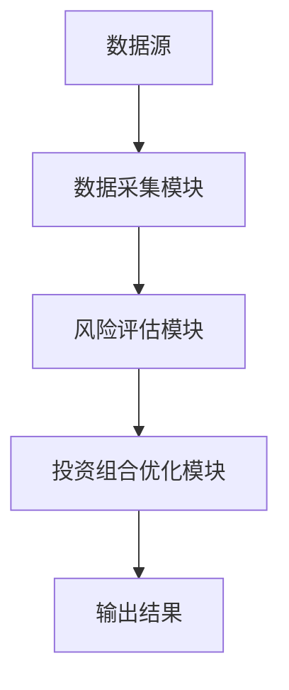

                 

# 投资组合保险策略：动态风险管理方法

---

## 关键词  
投资组合保险策略、动态风险管理、风险管理方法、资产配置、风险评估、风险控制

---

## 摘要  
投资组合保险策略是一种通过动态风险管理方法来优化投资组合收益与风险的策略。本文从背景、概念、数学基础、算法原理、系统架构设计、项目实战等多个维度详细阐述投资组合保险策略的核心内容，结合实际案例和代码实现，帮助读者全面理解并掌握动态风险管理方法。文章内容丰富，逻辑清晰，适合投资组合经理、风险管理专家以及对金融数据分析感兴趣的读者阅读。

---

# 第一部分：投资组合保险策略概述

## 第1章：投资组合保险策略的背景与概念

### 1.1 投资组合保险策略的背景

#### 1.1.1 金融风险管理的重要性
- 金融市场的不确定性对企业投资组合的影响。
- 投资组合保险策略的必要性。

#### 1.1.2 投资组合保险策略的起源与发展
- 早期风险管理方法的局限性。
- 投资组合保险策略的演变与现状。

#### 1.1.3 动态风险管理的必要性
- 市场环境的变化对企业风险管理的影响。
- 动态风险管理的优势与应用场景。

### 1.2 投资组合保险策略的核心概念

#### 1.2.1 投资组合的基本定义
- 投资组合的定义与组成。
- 投资组合的收益与风险关系。

#### 1.2.2 保险策略的内涵与外延
- 保险策略的定义。
- 保险策略与投资组合管理的结合。

#### 1.2.3 动态风险管理的特征
- 动态风险管理的核心思想。
- 动态风险管理与传统风险管理的区别。

---

## 第2章：投资组合保险策略的数学基础

### 2.1 投资组合的数学模型

#### 2.1.1 投资组合的收益与风险
- 收益的计算方法。
- 风险的度量方式。

#### 2.1.2 方差与协方差的计算
- 方差的定义与意义。
- 协方差的计算与应用。

#### 2.1.3 资产配置的优化模型
- 资产配置的优化目标。
- 常用的优化模型与方法。

### 2.2 动态风险管理的数学公式

#### 2.2.1 马科维茨的有效前沿
- 马科维茨有效前沿的定义。
- 有效前沿的数学表达式。

#### 2.2.2 风险价值（VaR）与条件风险价值（CVaR）
- VaR的定义与计算方法。
- CVaR的定义与应用场景。

#### 2.2.3 动态投资组合调整的数学模型
- 动态调整的必要性。
- 动态调整的数学模型与算法。

---

## 第3章：投资组合保险策略的核心算法

### 3.1 现代投资组合理论（MPT）

#### 3.1.1 均值-方差优化
- 均值-方差优化的定义。
- 均值-方差优化的实现步骤。

#### 3.1.2 资产配置的最优解
- 最优资产配置的求解方法。
- 资产配置的优化目标与约束条件。

#### 3.1.3 算法实现步骤
- 数据输入与预处理。
- 优化模型的构建与求解。

### 3.2 风险平价策略

#### 3.2.1 风险平价的定义
- 风险平价的概念与意义。
- 风险平价的应用场景。

#### 3.2.2 风险平价的计算公式
- 风险平价的计算公式。
- 风险平价的实现步骤。

#### 3.2.3 算法实现与优化
- 风险平价算法的实现。
- 算法的优化与改进。

---

## 第4章：动态风险管理的系统架构设计

### 4.1 系统功能设计

#### 4.1.1 数据采集模块
- 数据采集模块的功能与作用。
- 数据采集的实现步骤。

#### 4.1.2 风险评估模块
- 风险评估模块的功能与作用。
- 风险评估的实现步骤。

#### 4.1.3 投资组合优化模块
- 投资组合优化模块的功能与作用。
- 投资组合优化的实现步骤。

### 4.2 系统架构图

### 4.3 系统接口设计

#### 4.3.1 数据接口
- 数据接口的定义与作用。
- 数据接口的实现方式。

#### 4.3.2 模块间接口
- 模块间接口的定义与作用。
- 模块间接口的实现方式。

#### 4.3.3 用户接口
- 用户接口的定义与作用。
- 用户接口的实现方式。

---

## 第5章：项目实战——投资组合保险策略的实现

### 5.1 环境安装与配置

#### 5.1.1 环境要求
- 系统要求与依赖库安装。
- 开发工具的配置与安装。

#### 5.1.2 数据准备
- 数据源的选择与获取。
- 数据的预处理与清洗。

### 5.2 核心代码实现

#### 5.2.1 数据采集模块
- 数据采集的代码实现。
- 数据采集模块的测试与验证。

#### 5.2.2 风险评估模块
- 风险评估的代码实现。
- 风险评估模块的测试与验证。

#### 5.2.3 投资组合优化模块
- 投资组合优化的代码实现。
- 投资组合优化模块的测试与验证。

### 5.3 实际案例分析

#### 5.3.1 案例背景
- 案例的背景与目标。
- 案例的数据与需求。

#### 5.3.2 案例分析
- 案例的分析与解决思路。
- 案例的实现过程与结果。

#### 5.3.3 案例总结
- 案例的总结与经验教训。
- 案例的优化与改进方向。

---

## 第6章：总结与展望

### 6.1 投资组合保险策略的总结
- 投资组合保险策略的核心内容与主要方法。
- 投资组合保险策略的优缺点与适用场景。

### 6.2 未来展望
- 动态风险管理方法的发展趋势。
- 投资组合保险策略的未来研究方向。

---

## 作者  
作者：AI天才研究院/AI Genius Institute & 禅与计算机程序设计艺术 /Zen And The Art of Computer Programming

