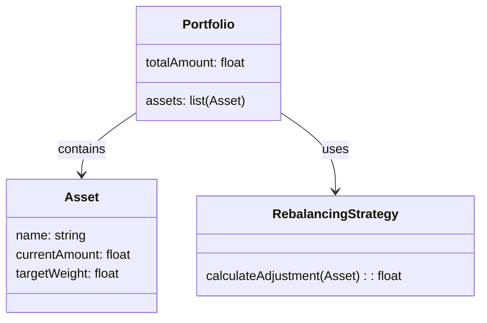
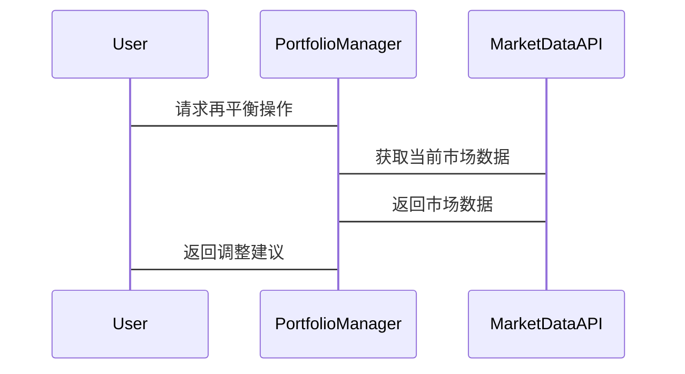

                 


# 投资组合再平衡：何时以及如何调整资产配置

> 关键词：投资组合再平衡，资产配置，风险管理，投资策略，系统架构

> 摘要：本文深入探讨投资组合再平衡的核心概念、策略与实施方法。通过分析资产配置的基本原理、再平衡的触发条件、数学模型的构建以及系统架构的设计，结合实际案例，为投资者提供科学的指导。文章还介绍了如何通过技术手段优化再平衡过程，帮助投资者在复杂市场环境中实现稳健收益。

---

# 第一部分：投资组合再平衡概述

## 第1章：投资组合再平衡的核心概念

### 1.1 投资组合再平衡的定义与背景

#### 1.1.1 投资组合再平衡的定义  
投资组合再平衡是指根据市场变化、投资者风险偏好或投资目标的变化，定期或不定期地调整资产配置比例，以维持投资组合的风险收益特征与初始设定一致的过程。

#### 1.1.2 再平衡的背景与重要性  
随着市场波动、经济周期变化以及投资者自身目标的调整，单一的初始资产配置可能会偏离预期的风险收益目标。再平衡通过调整各资产类别的权重，确保投资组合的表现符合预期。

#### 1.1.3 再平衡的核心目标  
- 维持投资组合的风险收益匹配。  
- 避免单一资产类别过度暴露带来的风险。  
- 利用市场波动优化收益。  

---

### 1.2 资产配置的基本原理

#### 1.2.1 资产配置的定义与分类  
资产配置是将资金分配到不同资产类别（如股票、债券、现金等）的过程。根据期限、风险偏好和收益目标，资产配置可以分为战略性配置和战术性配置。

#### 1.2.2 不同资产类别的特性与风险  
| 资产类别 | 风险 | 收益 | 流动性 |
|----------|------|------|--------|
| 股票     | 高   | 高   | 高     |
| 债券     | 中   | 中   | 中     |
| 现金     | 低   | 低   | 高     |

#### 1.2.3 资产配置与投资目标的关系  
资产配置需要根据投资者的风险承受能力、收益目标和投资期限进行调整。例如，风险厌恶型投资者可能更倾向于债券和现金配置，而风险偏好型投资者则可能增加股票配置。

---

## 第2章：资产配置的核心概念与联系

### 2.1 核心概念与原理

#### 2.1.1 投资组合再平衡的数学模型  
再平衡的核心是根据当前资产权重与目标权重的差异进行调整。假设当前权重为$w_i$，目标权重为$w_i^*$，调整比例为$\Delta w_i = w_i^* - w_i$。

#### 2.1.2 再平衡的核心逻辑  
1. 计算当前资产权重与目标权重的差异。  
2. 根据差异调整各资产的持有比例。  
3. 定期或不定期执行再平衡操作。  

---

### 2.2 资产配置的属性特征对比

#### 2.2.1 资产配置的灵活性  
- 灵活性高：可以根据市场变化快速调整。  
- 灵活性低：需要长期战略配置，调整成本较高。  

#### 2.2.2 再平衡策略的多样性  
- 恒定比例策略：保持各资产比例不变。  
- 目标权重策略：根据目标权重调整比例。  
- 动态再平衡策略：根据市场变化实时调整。  

---

## 第3章：投资组合再平衡的算法原理

### 3.1 算法原理概述

#### 3.1.1 再平衡算法的基本流程  
1. 计算当前资产权重。  
2. 确定目标资产权重。  
3. 计算调整比例。  
4. 执行调整操作。  

#### 3.1.2 常见的再平衡策略  
- **恒定比例策略**：定期调整各资产比例，保持不变。  
- **目标权重策略**：根据目标权重进行调整。  
- **动态再平衡策略**：根据市场变化实时调整。  

---

### 3.2 算法实现的数学模型

#### 3.2.1 资产权重计算公式  
$$ w_i = \frac{A_i}{\sum_{j=1}^n A_j} $$  
其中，$A_i$为第$i$类资产的当前金额，$\sum_{j=1}^n A_j$为投资组合的总金额。

#### 3.2.2 再平衡调整的数学模型  
$$ \Delta w_i = w_i^* - w_i $$  
其中，$\Delta w_i$为第$i$类资产的调整比例，$w_i^*$为目标权重，$w_i$为当前权重。

---

### 3.3 代码实现与案例分析

#### 3.3.1 环境安装与配置  
假设我们使用Python进行实现，需要安装以下库：  
- `numpy`：用于数值计算。  
- `pandas`：用于数据分析。  
- `matplotlib`：用于可视化。  

#### 3.3.2 核心算法的Python实现  

```python
import numpy as np
import pandas as pd

# 示例数据：当前资产金额和目标权重
current_amounts = np.array([100000, 50000, 30000])
target_weights = np.array([0.6, 0.3, 0.1])

# 计算当前权重
current_weights = current_amounts / current_amounts.sum()

# 计算调整比例
delta_weights = target_weights - current_weights

# 打印结果
print("当前权重:", current_weights)
print("目标权重:", target_weights)
print("调整比例:", delta_weights)
```

#### 3.3.3 实际案例的分析与解读  
假设投资者当前资产配置为股票60%、债券30%、现金10%，但目标配置为股票50%、债券40%、现金10%。通过再平衡调整，将股票部分减少10%，债券部分增加10%，最终实现目标配置。

---

## 第4章：投资组合再平衡的系统分析与架构设计

### 4.1 问题场景介绍

#### 4.1.1 投资组合再平衡的典型问题  
- 市场波动导致资产权重偏离目标。  
- 投资目标变化需要及时调整。  
- 税务优化与成本控制。  

#### 4.1.2 系统设计的目标与范围  
- 实现自动化的资产配置调整。  
- 提供实时市场数据监控。  
- 支持多种再平衡策略。  

---

### 4.2 系统功能设计

#### 4.2.1 领域模型的Mermaid类图  



---

### 4.3 系统架构设计

#### 4.3.1 系统架构的Mermaid架构图  

```mermaid
docker

portfolio-rebalancing-system
    contains
        frontend: Web Interface
        backend: PortfolioManager
        database: InvestmentData
        strategy-engine: RebalancingStrategy

    connectsTo
        frontend --> backend
        backend --> database
        backend --> strategy-engine
```

---

## 第5章：投资组合再平衡的实战指南

### 5.1 环境安装与配置

#### 5.1.1 开发环境的选择与安装  
- **Python 3.x**  
- **Jupyter Notebook** 用于数据分析和可视化。  
- **Pandas** 和 **NumPy** 用于数据处理。  

#### 5.1.2 数据获取与处理工具的配置  
- 使用Yahoo Finance API获取实时市场数据。  
- 使用Pandas进行数据清洗和分析。  

---

### 5.2 核心算法的实现与解读

#### 5.2.1 算法实现  

```python
import pandas as pd
import numpy as np

# 示例数据
data = {
    '资产类别': ['股票', '债券', '现金'],
    '当前金额': [100000, 50000, 30000],
    '目标权重': [0.6, 0.3, 0.1]
}
df = pd.DataFrame(data)

# 计算当前权重
current_weights = df['当前金额'] / df['当前金额'].sum()

# 计算调整比例
delta_weights = df['目标权重'] - current_weights

# 输出结果
print("当前权重:", current_weights)
print("调整比例:", delta_weights)
```

#### 5.2.2 算法解读  
上述代码展示了如何计算当前资产权重与目标权重的差异，并根据差异调整各资产的持有比例。

---

### 5.3 实际案例分析与解读

#### 5.3.1 案例分析  
假设投资者的投资组合如下：  

| 资产类别 | 当前金额 | 当前权重 | 目标权重 |
|----------|----------|----------|----------|
| 股票     | 100000   | 0.6      | 0.5      |
| 债券     | 50000    | 0.3      | 0.4      |
| 现金     | 30000    | 0.1      | 0.1      |

通过再平衡，投资者需要将股票部分减少10%，债券部分增加10%，以实现目标配置。

---

### 5.4 系统交互设计

#### 5.4.1 系统交互流程  



---

## 第6章：投资组合再平衡的最佳实践与小结

### 6.1 最佳实践 tips

#### 6.1.1 定期检查与调整  
- 每季度或每年进行一次再平衡操作。  
- 根据市场变化和投资目标调整频率。  

#### 6.1.2 税务优化  
- 尽量减少短期交易以降低税务负担。  
- 利用税收优惠账户（如401(k)）进行投资。  

---

### 6.2 小结

投资组合再平衡是实现稳健投资收益的重要手段。通过科学的资产配置和及时的调整，投资者可以在不同市场环境下优化风险收益比。本文从理论到实践，详细介绍了再平衡的核心概念、算法实现和系统设计，为投资者提供了全面的指导。

---

# 作者：AI天才研究院/AI Genius Institute & 禅与计算机程序设计艺术 /Zen And The Art of Computer Programming

