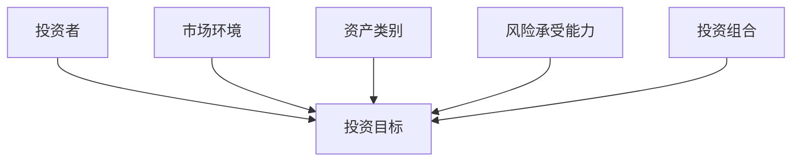
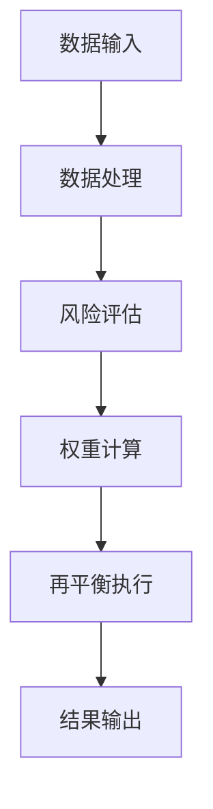
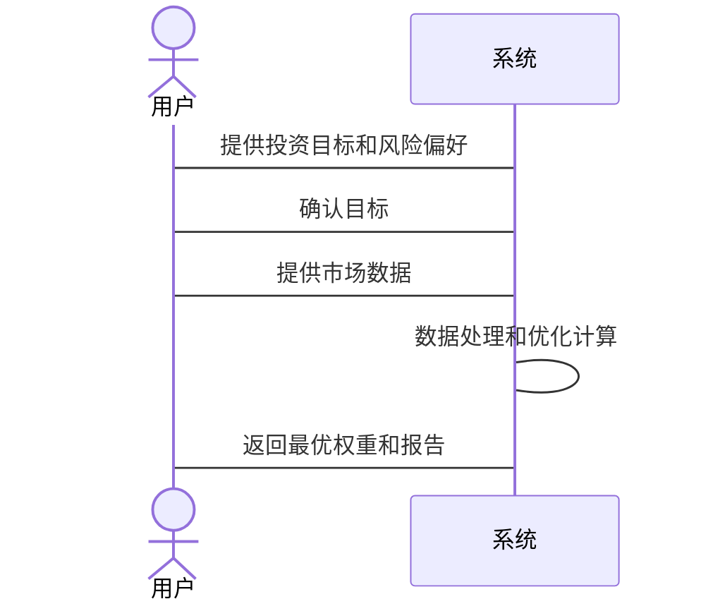

                 


# 投资组合再平衡：维持风险收益目标的关键

---

## 关键词：
投资组合再平衡，风险收益，资产配置，优化算法，系统架构，案例分析

---

## 摘要：
投资组合再平衡是金融领域中维持风险与收益目标的重要策略。本文从基本概念入手，深入探讨其原理、算法、系统架构，并通过实际案例分析其应用。通过数学模型和图表，详细讲解如何优化投资组合，降低风险，提升收益。最后，总结最佳实践，为读者提供全面的指导。

---

## 第一部分：投资组合再平衡概述

### 第1章：投资组合再平衡的基本概念

#### 1.1 投资组合再平衡的定义与背景

##### 1.1.1 投资组合再平衡的基本概念

投资组合再平衡是指根据市场变化和个人风险承受能力，定期调整投资组合中各资产的比例，以维持预期的风险和收益目标。通过再平衡，投资者可以优化资产配置，避免过度集中在某类资产，从而降低风险并提升收益。

##### 1.1.2 再平衡的必要性与重要性

在市场波动和经济变化中，单一资产的表现可能优于或劣于其他资产，导致投资组合偏离预期目标。再平衡能够及时调整，确保投资组合符合既定的风险收益目标。此外，再平衡还能分散风险，避免重大损失。

##### 1.1.3 再平衡的边界与外延

再平衡的边界包括市场环境、投资者风险承受能力和投资目标的变化。外延则涉及多资产配置、全球化投资环境以及数字化工具的应用。

#### 1.2 投资组合再平衡的核心要素

##### 1.2.1 资产配置的目标与原则

资产配置的目标是实现风险和收益的最优平衡，原则包括分散化、长期投资和定期调整。

##### 1.2.2 再平衡的触发条件与频率

触发条件包括资产比例偏离目标、市场环境变化等，频率通常为季度或半年一次。

##### 1.2.3 再平衡的成本与风险

成本包括交易费用和税务，风险在于频繁调整可能增加市场波动影响。

### 第2章：投资组合再平衡的演变与趋势

#### 2.1 再平衡策略的历史演变

##### 2.1.1 传统再平衡方法的局限性

传统方法依赖定期调整，可能无法适应快速变化的市场环境。

##### 2.1.2 现代再平衡方法的创新

现代方法引入量化分析和AI技术，提升再平衡的效率和精准度。

##### 2.1.3 数量化与智能化的再平衡趋势

技术进步推动再平衡向自动化和智能化发展。

#### 2.2 全球化背景下的再平衡挑战

##### 2.2.1 多资产配置的复杂性

全球化增加了资产种类和市场的多样性，提升了再平衡的复杂性。

##### 2.2.2 跨市场波动的协调问题

跨国市场的波动需要协调，以维持整体投资组合的稳定。

##### 2.2.3 全球经济环境对再平衡的影响

全球经济环境的变化要求再平衡策略更具灵活性和适应性。

#### 2.3 数字化与AI驱动的再平衡创新

##### 2.3.1 AI在再平衡中的应用

AI技术用于预测市场趋势和优化资产配置。

##### 2.3.2 大数据驱动的再平衡优化

大数据分析为再平衡提供更精准的决策支持。

##### 2.3.3 数字化工具对再平衡效率的提升

数字化工具提高了再平衡的效率和准确性。

### 第3章：投资组合再平衡的核心概念与联系

#### 3.1 再平衡的核心原理

##### 3.1.1 资产配置模型

资产配置模型是再平衡的核心，包括现代投资组合理论和有效前沿。

##### 3.1.2 投资组合优化

优化目标包括风险最小化和收益最大化，需考虑相关系数和约束条件。

#### 3.2 核心概念的联系与对比

##### 3.2.1 资产配置模型对比

| 模型 | 描述 | 优点 | 缺点 |
|------|------|------|------|
| 均值-方差模型 | 优化风险和收益 | 精准 | 计算复杂 |
| 风险中性模型 | 控制风险 | 简单 | 灵活性低 |

##### 3.2.2 ER实体关系图



---

## 第二部分：投资组合再平衡的算法原理

### 第4章：再平衡的数学模型与优化算法

#### 4.1 再平衡的数学模型

##### 4.1.1 优化目标

$$ \text{目标：} \min_w \sigma^2 \quad \text{在} \quad \mu^T w = \mu_t \text{下} $$

##### 4.1.2 约束条件

$$ w \geq 0, \sum w_i = 1 $$

##### 4.1.3 参数

- $w$：权重向量
- $\mu$：预期收益向量
- $\sigma^2$：风险方差
- $\mu_t$：目标收益

#### 4.2 优化算法

##### 4.2.1 均值-方差优化

优化步骤：

1. 计算各资产的预期收益和风险。
2. 构建优化模型，目标是最小化风险，在目标收益下。
3. 使用拉格朗日乘数法求解。

##### 4.2.2 风险中性优化

步骤：

1. 计算各资产的预期收益和风险。
2. 调整权重，确保风险中性。
3. 优化收益。

#### 4.3 算法实现

##### 4.3.1 Python代码示例

```python
import numpy as np
from scipy.optimize import minimize

def portfolio_var(weights, returns covariance):
    return np.dot(weights.T, np.dot(covariance, weights))

def optimize_portfolio(target_return, returns, covariance):
    n = len(weights)
    init_guess = [0.01] * n
    constraints = [{'type': 'eq', 'fun': lambda w: np.sum(w) - 1},
                   {'type': 'eq', 'fun': lambda w: np.dot(w, returns) - target_return}]
    result = minimize(portfolio_var, init_guess, args=(covariance,), constraints=constraints)
    return result.x

# 示例数据
returns = np.array([0.1, 0.2, 0.15])
covariance = np.array([[0.04, 0.01, 0], [0.01, 0.06, 0.02], [0, 0.02, 0.03]])
target_return = 0.15

weights = optimize_portfolio(target_return, returns, covariance)
print("最优权重:", weights)
```

---

## 第三部分：系统架构与实现

### 第5章：投资组合再平衡系统架构设计

#### 5.1 系统架构设计

##### 5.1.1 系统模块划分



##### 5.1.2 关键模块功能

- 数据输入：接收市场数据和投资目标。
- 数据处理：清洗和转换数据。
- 风险评估：计算各资产的风险和相关性。
- 权重计算：应用优化算法计算最优权重。
- 再平衡执行：调整投资组合。
- 结果输出：显示调整结果。

#### 5.2 系统接口设计

##### 5.2.1 输入接口

- 市场数据接口：接收资产价格和收益数据。
- 用户输入接口：接收投资目标和风险偏好。

##### 5.2.2 输出接口

- 调整后的投资组合权重。
- 风险和收益报告。

#### 5.3 系统交互流程



---

## 第四部分：项目实战

### 第6章：投资组合再平衡的实战应用

#### 6.1 环境安装

- 安装Python和必要的库（numpy, scipy, matplotlib）。

#### 6.2 核心代码实现

##### 6.2.1 数据处理

```python
import pandas as pd
import numpy as np

# 示例数据加载
data = pd.read_csv('market_data.csv')
returns = data.pct_change().dropna()
```

##### 6.2.2 优化计算

```python
from scipy.optimize import minimize

def objective(weights, returns):
    return np.dot(weights.T, np.dot(returns.cov(), weights))

def constraint(weights, target_return, returns):
    return np.dot(weights, returns.mean()) - target_return

# 优化
n = len(returns.columns)
init_guess = [1/n] * n
constraints = [{'type': 'eq', 'fun': lambda w: np.sum(w) - 1},
              {'type': 'eq', 'fun': lambda w: constraint(w, target_return, returns)}]
bounds = [(0, 1) for _ in range(n)]
result = minimize(objective, init_guess, constraints=constraints, bounds=bounds)
weights = result.x
```

##### 6.2.3 结果分析

分析调整后的权重，确保符合预期收益和风险目标，进行市场回测，验证策略的有效性。

#### 6.3 案例分析

##### 6.3.1 案例介绍

假设一个投资者的目标是10%的年收益，风险承受能力中等。

##### 6.3.2 数据来源与处理

使用历史市场数据计算各资产的收益和风险。

##### 6.3.3 权重调整

通过优化算法计算出最优权重，调整投资组合。

##### 6.3.4 分析与解读

评估调整后的组合是否达到目标，是否在可接受的风险范围内。

##### 6.3.5 案例小结

再平衡策略成功优化了投资组合，达到了预期收益并降低了风险。

---

## 第五部分：最佳实践与总结

### 第7章：投资组合再平衡的最佳实践

#### 7.1 小结

再平衡是维持投资组合风险收益目标的关键策略，通过定期调整和优化，投资者可以更好地应对市场变化。

#### 7.2 注意事项

- 定期评估和调整，避免过度集中在某类资产。
- 考虑交易成本和税务影响。
- 结合市场环境和经济周期调整策略。

#### 7.3 拓展阅读

推荐相关书籍和文章，深入理解投资组合管理和风险控制。

#### 7.4 参考文献

列出引用的书籍、文章和工具。

---

## 作者：AI天才研究院 & 禅与计算机程序设计艺术

---

**说明：** 由于篇幅限制，实际文章可能需要更详细的内容和更多案例。

