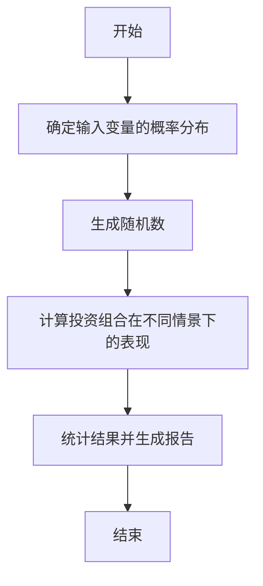

                 


# 投资组合压力测试：评估极端情景下的风险敞口

> **关键词**：投资组合压力测试，风险敞口，VaR，CVaR，蒙特卡洛模拟，金融风险管理

> **摘要**：本文详细探讨了投资组合压力测试的理论基础、算法实现及其在金融风险管理中的应用。通过分析极端情景下的风险敞口，本文为投资者和金融机构提供了一套系统化的压力测试方法，包括VaR和CVaR等风险度量工具，以及蒙特卡洛模拟和历史情景分析等算法实现。文章还结合实际案例，展示了如何通过系统架构设计和项目实战来实现投资组合的压力测试，帮助读者全面理解并掌握这一重要的金融风险管理技术。

---

## 第一部分：投资组合压力测试的背景与核心概念

---

### 第1章：投资组合压力测试概述

#### 1.1 投资组合压力测试的基本概念

##### 1.1.1 压力测试的定义与目的

压力测试是一种用于评估投资组合在极端市场条件下的表现和风险的方法。其目的是通过模拟可能出现的最坏情况，帮助投资者和金融机构识别和量化潜在风险，从而制定有效的风险管理策略。

**压力测试的核心目标：**

1. 识别投资组合在极端市场条件下的潜在损失。
2. 评估投资组合对市场波动的敏感性。
3. 帮助制定风险缓解策略。

##### 1.1.2 投资组合风险敞口的概念

风险敞口是指投资组合在特定市场条件下的潜在损失或收益的变化范围。它反映了投资组合对市场变动的敏感程度，是压力测试的核心内容之一。

##### 1.1.3 压力测试在金融风险管理中的作用

1. **风险识别**：通过模拟极端情景，发现投资组合中的潜在风险点。
2. **风险量化**：计算投资组合在极端条件下的具体损失。
3. **策略制定**：为投资者和金融机构提供风险管理的参考依据。

#### 1.2 压力测试的分类与方法

##### 1.2.1 历史情景测试

基于历史市场数据，模拟历史上发生过的极端市场情景，评估投资组合在这些情景下的表现。

**示例：**

- 2008年金融危机
- 1997年亚洲金融危机

##### 1.2.2 模拟情景测试

通过数学模型生成可能的极端市场情景，评估投资组合在这些情景下的表现。

**常用方法：**

1. **蒙特卡洛模拟**：通过随机抽样生成大量可能的市场情景。
2. **情景分析**：基于特定假设生成有限的极端情景。

##### 1.2.3 敏感性测试

通过调整市场变量（如利率、汇率、波动率等），评估投资组合对这些变量变化的敏感性。

##### 1.2.4 综合压力测试框架

综合运用历史情景测试、模拟情景测试和敏感性测试，构建全面的压力测试框架。

#### 1.3 投资组合压力测试的应用场景

##### 1.3.1 金融机构的风险管理

- 银行、保险公司等金融机构通过压力测试评估其投资组合在极端条件下的风险敞口。

##### 1.3.2 投资者决策支持

- 投资者通过压力测试了解其投资组合在极端情景下的表现，从而做出更明智的投资决策。

##### 1.3.3 政策制定与监管

- 监管机构通过压力测试评估金融机构的稳定性，制定更有效的监管政策。

#### 1.4 本章小结

本章介绍了投资组合压力测试的基本概念、分类和应用场景，强调了压力测试在金融风险管理中的重要性。

---

### 第2章：投资组合压力测试的核心概念与理论基础

#### 2.1 风险度量方法

##### 2.1.1 VaR（Value at Risk）

VaR是指在一定置信水平下，投资组合在正常市场条件下可能发生的最大损失。

**公式：**

$$ VaR = \mu + z \cdot \sigma $$

其中：
- $\mu$ 是资产的平均收益率
- $z$ 是标准正态分布的分位数
- $\sigma$ 是资产的收益率标准差

##### 2.1.2 CVaR（Conditional Value at Risk）

CVaR是指在VaR的基础上，计算超过VaR水平的平均损失。

**公式：**

$$ CVaR = \frac{1}{1-\alpha} \int_{\alpha}^{1} VaR \, d\alpha $$

##### 2.1.3 风险敞口的量化

风险敞口可以通过以下方式量化：
1. 每个资产的风险敞口。
2. 投资组合整体的风险敞口。

---

#### 2.2 现代投资组合理论

##### 2.2.1 马科维茨均值-方差模型

马科维茨均值-方差模型通过优化投资组合的收益和风险，找到最优资产配置。

**公式：**

$$ E[r] = \sum w_i E[r_i] $$
$$ Var(r) = \sum w_i^2 Var(r_i) + \sum w_i w_j Cov(r_i, r_j) $$

其中：
- $w_i$ 是资产$i$的权重
- $E[r_i]$ 是资产$i$的期望收益率
- $Var(r_i)$ 是资产$i$的收益率方差
- $Cov(r_i, r_j)$ 是资产$i$和$j$之间的协方差

##### 2.2.2 资产配置与风险分散化

通过合理配置资产，分散投资组合的风险，降低整体风险敞口。

##### 2.2.3 投资组合的有效边界

有效边界是指在给定风险水平下，能够提供最高收益的投资组合的集合。

---

#### 2.3 压力测试的数学模型与公式

##### 2.3.1 投资组合收益与风险的数学表达

$$ E[r] = \sum w_i E[r_i] $$
$$ Var(r) = \sum w_i^2 Var(r_i) + \sum w_i w_j Cov(r_i, r_j) $$

##### 2.3.2 风险敞口的矩阵表示

使用协方差矩阵表示资产之间的风险相关性。

$$ C = \begin{bmatrix}
\sigma_1^2 & \sigma_1 \sigma_2 & \cdots & \sigma_1 \sigma_n \\
\sigma_2 \sigma_1 & \sigma_2^2 & \cdots & \sigma_2 \sigma_n \\
\vdots & \vdots & \ddots & \vdots \\
\sigma_n \sigma_1 & \sigma_n \sigma_2 & \cdots & \sigma_n^2
\end{bmatrix} $$

---

### 第3章：压力测试的算法原理与实现

#### 3.1 压力测试的主要算法

##### 3.1.1 蒙特卡洛模拟

蒙特卡洛模拟是一种通过随机抽样生成大量可能市场情景的方法。

**步骤：**

1. 确定输入变量的概率分布。
2. 生成随机数。
3. 计算投资组合在不同情景下的表现。
4. 统计结果并生成报告。

**mermaid流程图：**



##### 3.1.2 历史情景分析

基于历史市场数据，模拟极端市场情景。

**步骤：**

1. 收集历史市场数据。
2. 识别极端情景。
3. 计算投资组合在极端情景下的表现。

---

#### 3.2 蒙特卡洛模拟的实现步骤

##### 3.2.1 确定输入变量的概率分布

常用的概率分布包括正态分布、t分布和均匀分布。

##### 3.2.2 生成随机数

使用随机数生成器生成符合输入变量概率分布的随机数。

##### 3.2.3 计算投资组合在不同情景下的表现

计算每个情景下投资组合的收益和风险。

##### 3.2.4 统计结果并生成报告

统计所有情景下的投资组合表现，生成压力测试报告。

---

#### 3.3 本章小结

本章介绍了压力测试的主要算法，重点讲解了蒙特卡洛模拟和历史情景分析的实现步骤。

---

## 第4章：投资组合压力测试的系统架构与实现

#### 4.1 系统架构设计

##### 4.1.1 系统功能模块划分

- 数据输入模块：接收市场数据和投资组合配置。
- 情景生成模块：生成历史情景或模拟情景。
- 投资组合表现计算模块：计算投资组合在不同情景下的表现。
- 报告生成模块：生成压力测试报告。

##### 4.1.2 系统架构的分层设计

- 数据层：存储市场数据和投资组合配置。
- 业务逻辑层：实现压力测试算法。
- 界面层：用户交互界面。

##### 4.1.3 系统接口设计

- 数据输入接口：接收投资组合配置和市场数据。
- 情景生成接口：生成历史或模拟情景。
- 结果输出接口：输出压力测试报告。

---

#### 4.2 系统实现的技术选型

##### 4.2.1 数据处理与分析工具

- Python的Pandas库：用于数据处理。
- NumPy库：用于数值计算。

##### 4.2.2 算法实现框架

- Python的Scikit-learn库：用于机器学习算法。
- PyMC3库：用于贝叶斯建模。

##### 4.2.3 系统架构工具

- Flask框架：用于Web应用开发。
- Docker：用于容器化部署。

---

## 第5章：投资组合压力测试的项目实战

#### 5.1 项目环境安装

##### 5.1.1 安装Python

```bash
python --version
pip install --upgrade pip
```

##### 5.1.2 安装依赖库

```bash
pip install numpy pandas matplotlib seaborn scikit-learn pymc3
```

---

#### 5.2 系统核心实现源代码

##### 5.2.1 数据输入模块

```python
import pandas as pd

def read_data(file_path):
    return pd.read_csv(file_path)
```

##### 5.2.2 情景生成模块

```python
import numpy as np

def generate情景(returns, num情景=1000):
    return np.random.multivariate_normal(returns.mean(), returns.cov(), num情景)
```

##### 5.2.3 投资组合表现计算模块

```python
def 计算表现(returns, weights):
    return np.dot(returns, weights)
```

##### 5.2.4 报告生成模块

```python
import matplotlib.pyplot as plt

def 生成报告(returns, weights):
   表现 = np.dot(returns, weights)
    plt.hist(表现, bins=50)
    plt.show()
```

---

## 第6章：最佳实践与小结

#### 6.1 最佳实践 tips

1. 在进行压力测试时，选择合适的历史情景或模拟情景。
2. 确保数据的准确性和完整性。
3. 定期更新压力测试模型，以反映市场变化。

#### 6.2 本章小结

本文详细介绍了投资组合压力测试的理论基础、算法实现和系统架构设计，并通过项目实战展示了如何将压力测试应用于实际投资组合管理中。通过本文的学习，读者可以掌握投资组合压力测试的核心技术和实践方法。

---

## 作者信息

**作者：AI天才研究院/AI Genius Institute & 禅与计算机程序设计艺术 /Zen And The Art of Computer Programming**

---

这篇文章通过系统化的结构和详细的讲解，帮助读者全面理解投资组合压力测试的核心技术和实际应用。从理论到实践，从算法到系统架构，文章内容丰富且逻辑清晰，为读者提供了一套完整的压力测试解决方案。

