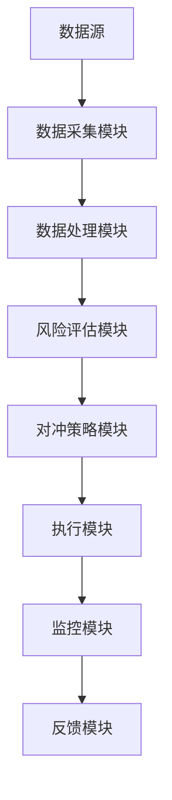

                 


# 投资组合尾部对冲：保护策略在极端市场中的作用

---

## 关键词：
投资组合管理、尾部对冲、风险管理、VaR、CVaR、极端市场、金融对冲策略

---

## 摘要：
在金融市场中，尾部风险是指在极端市场条件下，投资组合可能出现的大幅波动和潜在损失。本文详细探讨了尾部对冲策略在保护投资组合免受极端市场事件影响中的作用。从尾部风险的定义和特征入手，分析了尾部对冲的核心原理，包括VaR和CVaR等风险度量方法，并结合统计套利和机器学习算法，详细阐述了尾部对冲的实现方法。此外，本文还通过系统架构设计和实际案例分析，展示了如何在极端市场中应用尾部对冲策略，并提出了最佳实践和注意事项。

---

## 第一部分：投资组合风险管理与尾部对冲概述

### 第1章：投资组合风险管理基础

#### 1.1 投资组合风险管理的概念

##### 1.1.1 投资组合风险管理的定义
投资组合风险管理是指通过识别、评估和应对投资组合在不同市场条件下的风险，以实现投资目标的稳健性。它涵盖了从市场波动、流动性风险到信用风险等多种风险类型。

##### 1.1.2 投资组合风险管理的重要性
在金融市场中，风险管理是投资组合管理的核心环节。有效的风险管理可以减少投资组合的潜在损失，提高收益的稳定性，并在极端市场条件下保护投资者的资产。

##### 1.1.3 尾部风险的定义与特征
尾部风险是指在极端市场条件下，投资组合可能出现的大幅波动和潜在损失。尾部风险的特征包括低概率、高损失和非线性损失曲线。

#### 1.2 极端市场条件下的投资组合风险

##### 1.2.1 极端市场事件的历史案例
历史上多次极端市场事件（如2008年金融危机、2020年新冠疫情引发的市场崩盘）表明，尾部风险可能对投资组合造成巨大损失。

##### 1.2.2 尾部风险的潜在影响
尾部风险可能导致投资组合的损失远超预期，甚至引发流动性危机和投资组合清偿问题。

##### 1.2.3 投资组合尾部对冲的目标与意义
尾部对冲的目标是通过特定策略降低投资组合在极端市场条件下的潜在损失，保护投资组合的稳定性。

---

### 第2章：尾部对冲策略的基本原理

#### 2.1 尾部对冲的核心概念

##### 2.1.1 尾部对冲的定义
尾部对冲是一种通过特定金融工具和策略，降低投资组合在极端市场条件下的潜在损失的方法。

##### 2.1.2 尾部对冲与传统对冲策略的区别
传统对冲策略通常关注于降低市场波动性，而尾部对冲则专注于应对极端市场事件。

##### 2.1.3 尾部对冲在投资组合管理中的作用
尾部对冲可以帮助投资者在极端市场条件下保护资产，减少潜在损失，并提高投资组合的稳定性。

#### 2.2 尾部对冲的数学模型

##### 2.2.1 投资组合风险的度量方法
常用的风险度量方法包括VaR（Value at Risk）和CVaR（Conditional Value at Risk）。

##### 2.2.2 VaR（Value at Risk）与 CVaR（Conditional Value at Risk）
- **VaR**：在给定置信水平下，投资组合可能遭受的最大损失。
- **CVaR**：在VaR的基础上，考虑了超过VaR的潜在损失。

##### 2.2.3 尾部对冲的数学公式
- **VaR计算公式**：$$VaR = \alpha \cdot \sigma$$，其中$\alpha$是置信水平的分位数，$\sigma$是投资组合的波动率。
- **CVaR计算公式**：$$CVaR = E[R | R > VaR]$$，其中$R$是投资组合的收益。

---

## 第二部分：尾部对冲策略的实现方法

### 第3章：统计套利与尾部对冲

#### 3.1 统计套利的基本原理
统计套利通过寻找资产价格的短期偏差，利用均值回归效应进行套利。

#### 3.2 统计套利在尾部对冲中的应用
通过统计套利，投资者可以在极端市场条件下减少投资组合的潜在损失。

#### 3.3 统计套利的风险与挑战
统计套利依赖于市场的短期波动，可能在极端市场条件下失效。

### 第4章：波动率对冲与尾部对冲

#### 4.1 波动率对冲的定义与原理
波动率对冲通过降低投资组合的波动率，减少极端市场条件下的潜在损失。

#### 4.2 波动率对冲在尾部对冲中的应用
通过波动率对冲，投资者可以降低投资组合在极端市场条件下的波动性。

#### 4.3 波动率对冲的优缺点分析
波动率对冲的优点是简单易行，缺点是可能在极端市场条件下效果有限。

### 第5章：基于VaR的尾部对冲算法

#### 5.1 VaR的计算方法
通过历史模拟法或蒙特卡洛模拟法计算VaR。

#### 5.2 基于VaR的对冲策略实现
根据VaR的结果，选择适当的对冲工具和策略。

#### 5.3 算法的优缺点分析
VaR计算简单，但可能无法准确捕捉极端市场条件下的潜在损失。

### 第6章：基于机器学习的尾部对冲算法

#### 6.1 机器学习在尾部对冲中的应用
通过机器学习模型预测极端市场条件下的潜在损失。

#### 6.2 基于机器学习的对冲策略实现
使用机器学习模型生成尾部对冲策略。

#### 6.3 算法的实现步骤与代码示例
```python
import numpy as np
from sklearn.ensemble import IsolationForest

# 示例数据
X = np.random.randn(1000, 2)
outliers = np.random.randn(100, 2) + 5
X = np.vstack((X, outliers))

# 训练异常检测模型
model = IsolationForest(contamination=0.05)
model.fit(X)

# 预测异常点
outlier_predictions = model.predict(X)
```

---

## 第三部分：尾部对冲的系统架构设计

### 第7章：系统架构概述

#### 7.1 系统架构的目标
设计一个能够实时监控和应对极端市场条件的对冲系统。

#### 7.2 系统架构的主要模块
- 数据采集与处理模块
- 风险评估与预警模块
- 尾部对冲策略执行模块
- 系统监控与反馈模块

#### 7.3 系统架构的优缺点分析
模块化设计提高了系统的可维护性和扩展性。

### 第8章：系统功能设计

#### 8.1 数据采集与处理模块
负责收集和处理市场数据。

#### 8.2 风险评估与预警模块
使用VaR和CVaR模型评估投资组合风险。

#### 8.3 尾部对冲策略执行模块
根据风险评估结果执行尾部对冲策略。

#### 8.4 系统监控与反馈模块
实时监控系统运行状态并提供反馈。

### 第9章：系统架构图



---

## 第四部分：尾部对冲的项目实战

### 第10章：项目实战

#### 10.1 环境安装
安装必要的金融数据接口和机器学习库。

#### 10.2 系统核心实现源代码
```python
import numpy as np
import pandas as pd
from sklearn.ensemble import IsolationForest

# 示例数据
data = pd.DataFrame(np.random.randn(1000, 5), columns=['资产1', '资产2', '资产3', '资产4', '资产5'])

# 训练异常检测模型
model = IsolationForest(contamination=0.05)
model.fit(data)

# 预测异常点
outlier_predictions = model.predict(data)
```

#### 10.3 代码应用解读与分析
通过机器学习模型识别潜在的异常市场条件，并执行相应的尾部对冲策略。

#### 10.4 实际案例分析和详细讲解剖析
分析极端市场条件下的投资组合表现，并展示尾部对冲策略的效果。

#### 10.5 项目小结
总结项目实现的关键步骤和成果。

---

## 第五部分：最佳实践与总结

### 第11章：最佳实践

#### 11.1 小结
尾部对冲是一种有效的风险管理工具，可以在极端市场条件下保护投资组合。

#### 11.2 注意事项
- 尾部对冲策略需要结合具体市场条件和投资目标进行调整。
- 对冲策略的执行需要考虑交易成本和流动性风险。

#### 11.3 拓展阅读
推荐相关书籍和文献，供读者进一步学习。

---

## 作者：
**AI天才研究院/AI Genius Institute & 禅与计算机程序设计艺术/Zen And The Art of Computer Programming**

---

通过以上内容，我们详细探讨了尾部对冲在投资组合管理中的作用，并结合数学模型和实际案例，展示了如何在极端市场条件下保护投资组合。希望本文能为投资者和金融专业人士提供有价值的参考。

