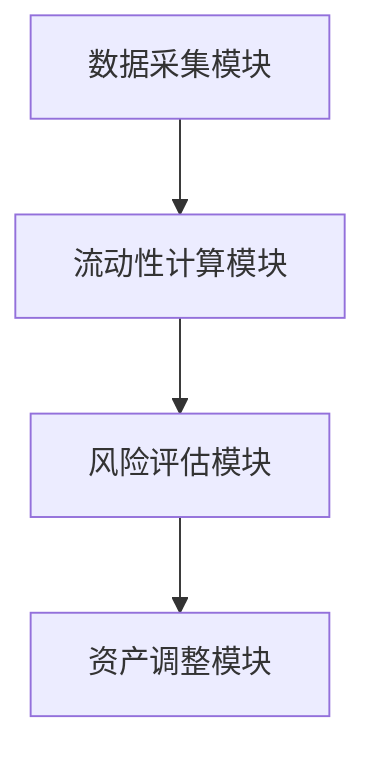
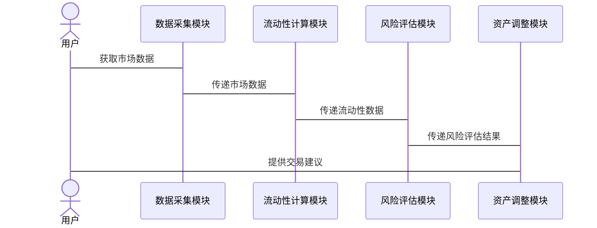

                 


# 投资组合流动性管理：在市场压力下保持灵活性

> 关键词：投资组合流动性管理、市场压力、资产配置、风险管理、动态资产分配、风险价值模型

> 摘要：本文深入探讨了投资组合流动性管理的核心概念、算法原理、系统架构和实战案例。通过详细分析流动性管理在市场压力下的重要性，结合动态资产分配算法和风险价值模型，展示了如何通过系统化的方法保持投资组合的灵活性和稳定性。本文还提供了具体的项目实现和系统设计，帮助读者在实际操作中理解和应用这些理论。

---

## 第1章: 投资组合流动性管理的背景与挑战

### 1.1 投资组合流动性管理的定义

#### 1.1.1 流动性管理的核心概念
流动性管理是指在保证投资组合价值稳定的同时，确保资产能够快速、低成本地转换为现金的能力。流动性是投资组合在市场压力下的关键属性，决定了其在极端市场条件下的应对能力。

#### 1.1.2 投资组合流动性管理的目标
投资组合流动性管理的目标包括：
1. 确保在市场下跌时能够及时调整资产配置，降低损失。
2. 在市场波动时维持投资组合的稳定性。
3. 在极端情况下快速变现，避免资产贬值。

#### 1.1.3 流动性管理的边界与外延
流动性管理的边界包括：
- 资产的流动性：不同资产的流动性差异影响其在投资组合中的权重。
- 市场条件：市场波动性、交易量和市场深度直接影响流动性。
- 时间窗口：流动性管理需要在特定的时间范围内进行调整。

### 1.2 市场压力下的流动性挑战

#### 1.2.1 市场压力的定义与特征
市场压力是指在市场下跌、波动性增加或交易量骤减的情况下，资产的流动性显著下降。这种压力可能导致资产价格大幅波动，增加流动性风险。

#### 1.2.2 流动性风险的来源
流动性风险主要来源于以下几点：
1. 资产本身的流动性不足：例如小市值股票或新兴市场的债券。
2. 市场参与者的行为：投资者恐慌性抛售导致流动性枯竭。
3. 市场结构的变化：例如高频交易算法的失效或交易所暂停交易。

#### 1.2.3 市场压力对投资组合的影响
市场压力会导致投资组合的流动性显著下降，影响其价值和稳定性。在极端情况下，投资组合可能无法及时变现，导致更大的损失。

### 1.3 投资组合流动性管理的重要性

#### 1.3.1 流动性管理在投资组合中的作用
流动性管理是投资组合风险管理的核心环节，能够帮助投资者在市场压力下保持灵活性，避免更大的损失。

#### 1.3.2 流动性管理与投资目标的关系
流动性管理需要与投资目标相结合，例如在追求高收益的同时，确保在市场波动时能够及时调整资产配置。

#### 1.3.3 流动性管理的边界与限制
流动性管理的边界包括市场条件、资产特性和投资目标的限制。

### 1.4 本章小结
本章介绍了投资组合流动性管理的核心概念、市场压力下的流动性挑战以及流动性管理在投资组合中的重要性。接下来的章节将详细探讨流动性管理的核心概念、算法原理和系统设计。

---

## 第2章: 投资组合流动性管理的核心概念与理论基础

### 2.1 流动性管理的核心概念

#### 2.1.1 资产流动性模型
资产流动性模型是流动性管理的理论基础之一，用于衡量资产在特定市场条件下的流动性。模型公式如下：
$$L = \frac{A}{P}$$
其中，$L$ 表示流动性，$A$ 表示资产规模，$P$ 表示价格。

#### 2.1.2 资本资产定价模型（CAPM）
资本资产定价模型（CAPM）用于评估资产的预期收益与市场风险之间的关系，公式如下：
$$E(r_i) = r_f + \beta_i (E(r_m) - r_f)$$
其中，$E(r_i)$ 表示资产 $i$ 的预期收益率，$r_f$ 是无风险利率，$\beta_i$ 是资产的贝塔系数，$E(r_m)$ 是市场预期收益率。

#### 2.1.3 风险价值模型（VaR）
风险价值模型（VaR）用于衡量投资组合在特定置信水平下的潜在损失，公式如下：
$$VaR = z \cdot \sigma$$
其中，$z$ 是标准正态分布的分位数，$\sigma$ 是资产组合的标准差。

### 2.2 流动性管理的核心要素

#### 2.2.1 资产配置策略
资产配置策略是流动性管理的核心要素之一，包括：
1. 确定投资组合的资产类别和权重。
2. 定期调整资产配置以应对市场变化。

#### 2.2.2 交易策略
交易策略包括：
1. 确定买卖时机和价格。
2. 使用订单类型（如市价单、限价单）优化交易成本。

#### 2.2.3 风险管理策略
风险管理策略包括：
1. 使用VaR模型评估潜在损失。
2. 设置止损点和止盈点。

### 2.3 本章小结
本章详细介绍了流动性管理的核心概念和理论基础，包括资产流动性模型、CAPM和VaR模型。接下来的章节将探讨流动性管理的算法实现和系统设计。

---

## 第3章: 投资组合流动性管理的算法与数学模型

### 3.1 流动性管理的算法原理

#### 3.1.1 动态资产分配算法
动态资产分配算法用于根据市场条件实时调整资产配置，流程如下：
1. 监测市场指标（如波动率、交易量）。
2. 使用资产流动性模型评估各资产的流动性。
3. 调整资产权重以优化流动性。

#### 3.1.2 风险价值模型算法
风险价值模型算法用于评估投资组合的潜在损失，步骤如下：
1. 计算资产组合的收益率分布。
2. 确定置信水平和分位数 $z$。
3. 计算 VaR 值。

#### 3.1.3 资产流动性优化算法
资产流动性优化算法用于在给定约束条件下最大化投资组合的流动性，数学模型如下：
$$\max \sum_{i=1}^{n} w_i L_i$$
$$\text{subject to} \quad \sum_{i=1}^{n} w_i = 1, \quad w_i \geq 0$$
其中，$w_i$ 是资产 $i$ 的权重，$L_i$ 是资产 $i$ 的流动性。

### 3.2 流动性管理的数学模型

#### 3.2.1 资产流动性模型的数学表达
$$L = \frac{A}{P}$$

#### 3.2.2 风险价值模型的数学表达
$$VaR = z \cdot \sigma$$

### 3.3 流动性管理的算法实现

#### 3.3.1 动态资产分配算法的实现步骤
1. 收集市场数据（如资产价格、波动率）。
2. 计算各资产的流动性。
3. 根据流动性调整资产权重。
4. 执行交易。

#### 3.3.2 风险价值模型的实现步骤
1. 计算资产组合的收益率分布。
2. 计算标准差 $\sigma$。
3. 确定置信水平和分位数 $z$。
4. 计算 VaR 值。

### 3.4 本章小结
本章详细介绍了流动性管理的算法原理和数学模型，包括动态资产分配算法和风险价值模型。接下来的章节将探讨流动性管理的系统架构和项目实战。

---

## 第4章: 投资组合流动性管理的系统架构与设计方案

### 4.1 系统架构设计

#### 4.1.1 系统功能设计
系统功能包括：
1. 数据采集模块：收集市场数据（如价格、成交量）。
2. 流动性计算模块：使用资产流动性模型计算各资产的流动性。
3. 风险评估模块：使用VaR模型评估潜在损失。
4. 资产调整模块：根据流动性计算结果调整资产配置。

#### 4.1.2 系统架构图


### 4.2 系统接口设计

#### 4.2.1 数据接口
数据接口用于与数据源（如交易所API）交互，获取市场数据。

#### 4.2.2 用户接口
用户接口用于显示系统运行状态和交易建议。

### 4.3 系统交互设计

#### 4.3.1 交互流程
1. 数据采集模块获取市场数据。
2. 流动性计算模块计算各资产的流动性。
3. 风险评估模块评估潜在损失。
4. 资产调整模块根据流动性计算结果调整资产配置。
5. 系统执行交易。

#### 4.3.2 交互流程图


### 4.4 本章小结
本章详细介绍了流动性管理系统的架构设计和交互流程，包括数据采集、流动性计算、风险评估和资产调整模块。接下来的章节将探讨流动性管理的项目实战和最佳实践。

---

## 第5章: 投资组合流动性管理的项目实战

### 5.1 环境安装

#### 5.1.1 系统环境
需要安装Python、Jupyter Notebook和相关库（如Pandas、NumPy）。

#### 5.1.2 数据源
使用Yahoo Finance获取市场数据。

### 5.2 核心代码实现

#### 5.2.1 资产流动性计算
```python
import pandas as pd

def calculate_literacy(assets, prices):
    liquidity = {}
    for i in range(len(assets)):
        asset = assets[i]
        price = prices[i]
        liquidity[asset] = (assets[i] * price) / (price ** 2)
    return liquidity
```

#### 5.2.2 风险价值模型实现
```python
import numpy as np

def calculate_var(returns, confidence_level=0.95):
    alpha = 1 - confidence_level
    z = np.quantile(returns, alpha)
    sigma = np.std(returns)
    var = z * sigma
    return var
```

### 5.3 案例分析

#### 5.3.1 数据获取与预处理
使用Yahoo Finance获取某时间段内的资产价格数据。

#### 5.3.2 流动性计算与分析
计算各资产的流动性，并根据流动性调整资产配置。

#### 5.3.3 风险评估与管理
使用VaR模型评估潜在损失，并根据风险评估结果调整资产权重。

### 5.4 项目小结
本章通过具体的项目案例，展示了如何在实际操作中应用流动性管理的理论和算法。接下来的章节将总结最佳实践和注意事项。

---

## 第6章: 投资组合流动性管理的最佳实践与总结

### 6.1 最佳实践

#### 6.1.1 定期监控市场条件
定期监控市场条件，及时调整资产配置。

#### 6.1.2 使用多元化的资产配置
通过多元化配置降低流动性风险。

#### 6.1.3 优化交易策略
优化交易策略，降低交易成本。

### 6.2 小结

#### 6.2.1 核心要点总结
总结流动性管理的核心概念、算法原理和系统设计。

#### 6.2.2 未来展望
展望未来，流动性管理将更加依赖于人工智能和大数据技术，提升其在市场压力下的应对能力。

### 6.3 注意事项

#### 6.3.1 风险提示
提示读者注意流动性管理的风险和局限性。

#### 6.3.2 拓展阅读
推荐进一步阅读的书籍和资源。

---

## 作者：AI天才研究院/AI Genius Institute & 禅与计算机程序设计艺术 /Zen And The Art of Computer Programming

---

以上是《投资组合流动性管理：在市场压力下保持灵活性》的完整目录大纲和文章内容。文章详细探讨了流动性管理的核心概念、算法原理、系统架构和实战案例，并结合具体的Python代码和Mermaid图表，帮助读者全面理解和应用这些理论。

