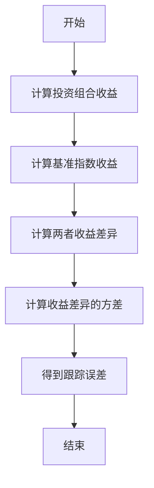
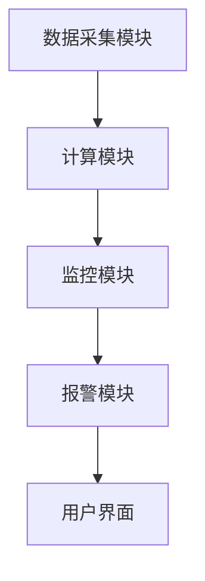
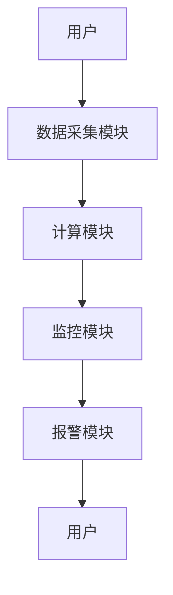

                 


```markdown
# 投资组合跟踪误差：如何衡量并控制偏离基准的风险

> 关键词：投资组合跟踪误差、风险管理、基准指数、投资组合优化、金融风险

> 摘要：本文将详细探讨投资组合跟踪误差的概念、计算方法、影响因素以及如何通过系统化的方法控制跟踪误差，以降低偏离基准的风险。通过理论分析与实际案例结合，帮助读者全面理解并掌握跟踪误差的管理策略。

---

# 第一部分: 投资组合跟踪误差基础

## 第1章: 投资组合跟踪误差概述

### 1.1 投资组合跟踪误差的定义

#### 1.1.1 投资组合与基准指数的定义
- 投资组合：一组金融资产的组合，旨在实现特定的投资目标。
- 基准指数：用于衡量投资组合表现的参照标准，如沪深300指数、标普500指数等。

#### 1.1.2 跟踪误差的数学定义
- 跟踪误差（Tracking Error）衡量投资组合收益与基准指数收益之间的差异。
- 公式：$$\text{跟踪误差} = \sqrt{\frac{1}{n}\sum_{i=1}^{n}(r_p - r_b)^2}$$
  - $r_p$：投资组合的收益
  - $r_b$：基准指数的收益
  - $n$：时间段的数量

#### 1.1.3 跟踪误差的重要性
- 量化投资组合与基准的偏离程度。
- 评估投资组合的管理能力。
- 为风险控制提供依据。

### 1.2 跟踪误差的背景与问题背景

#### 1.2.1 投资组合管理的基本概念
- 投资组合管理的目标是实现收益与风险的最佳平衡。
- 基准指数的选择对跟踪误差的计算至关重要。

#### 1.2.2 跟踪误差的产生原因
- 市场波动性。
- 交易成本与滑点。
- 投资组合调整的延迟。

#### 1.2.3 跟踪误差与投资风险的关系
- 跟踪误差是投资组合风险的重要组成部分。
- 跟踪误差越大，投资组合偏离基准的风险越高。

### 1.3 跟踪误差的核心概念与边界

#### 1.3.1 跟踪误差的核心要素
- 投资组合收益。
- 基准收益。
- 时间窗口。

#### 1.3.2 跟踪误差的边界与外延
- 跟踪误差的计算范围。
- 跟踪误差的适用场景。

#### 1.3.3 跟踪误差与相关风险指标的对比
- 对比表格：跟踪误差与其他风险指标（如夏普比率、最大回撤）的对比。

### 1.4 本章小结
- 本章介绍了跟踪误差的基本概念、计算方法及其重要性。
- 强调了跟踪误差在投资组合管理中的核心作用。

---

# 第二部分: 跟踪误差的数学模型与计算方法

## 第2章: 跟踪误差的数学模型

### 2.1 跟踪误差的计算公式

#### 2.1.1 跟踪误差的公式推导
- 从方差的角度出发，推导跟踪误差的计算公式。
- 公式：$$\text{跟踪误差} = \sqrt{\sigma_p^2 - 2\rho\sigma_p\sigma_b + \sigma_b^2}$$
  - $\rho$：投资组合收益与基准收益的相关系数。
  - $\sigma_p$：投资组合的收益标准差。
  - $\sigma_b$：基准指数的收益标准差。

#### 2.1.2 跟踪误差的计算步骤
1. 计算投资组合和基准指数的历史收益率。
2. 计算两者的收益差异。
3. 计算收益差异的方差。
4. 开平方得到跟踪误差。

#### 2.1.3 与相关指标（如夏普比率）的区别
- 夏普比率衡量的是单位风险超额收益。
- 跟踪误差衡量的是投资组合与基准的偏离程度。

### 2.2 跟踪误差的数学模型

#### 2.2.1 投资组合收益与基准收益的差异
- 通过统计方法分析收益差异的分布。
- 使用概率论模型预测未来收益差异。

#### 2.2.2 跟踪误差的方差计算
- 公式：$$\text{方差} = \mathbb{E}[(r_p - r_b)^2]$$
- 通过历史数据估计方差。

#### 2.2.3 跟踪误差与投资组合风险的关系
- 跟踪误差是投资组合风险的重要组成部分。
- 跟踪误差越小，投资组合的风险越低。

### 2.3 跟踪误差的计算流程图



### 2.4 本章小结
- 本章详细推导了跟踪误差的数学模型，并通过流程图展示了计算步骤。
- 强调了数学模型在跟踪误差计算中的重要性。

---

# 第三部分: 跟踪误差的来源与影响

## 第3章: 跟踪误差的主要来源

### 3.1 市场风险的影响

#### 3.1.1 市场波动对跟踪误差的影响
- 市场波动会导致投资组合与基准收益的差异增加。
- 通过历史数据分析验证市场波动对跟踪误差的影响。

#### 3.1.2 行业或板块轮动的影响
- 行业轮动会导致投资组合与基准的偏离。
- 通过因子分析方法研究行业轮动对跟踪误差的影响。

#### 3.1.3 宏观经济环境的影响
- 宏观经济政策变化会影响市场走势。
- 通过宏观经济指标分析其对跟踪误差的影响。

### 3.2 交易成本与流动性风险

#### 3.2.1 买卖价差对跟踪误差的影响
- 买卖价差会导致实际交易收益低于预期收益。
- 通过成本收益分析模型计算买卖价差对跟踪误差的影响。

#### 3.2.2 市场冲击与流动性
- 大额交易会导致市场冲击，增加交易成本。
- 通过流动性分析模型研究市场冲击对跟踪误差的影响。

### 3.3 其他因素

#### 3.3.1 管理者的决策失误
- 管理者的错误决策会导致投资组合偏离基准。
- 通过案例分析研究管理决策对跟踪误差的影响。

#### 3.3.2 操作失误与系统故障
- 操作失误和系统故障会导致交易延迟或错误。
- 通过风险管理框架分析操作失误对跟踪误差的影响。

### 3.4 本章小结
- 本章分析了跟踪误差的主要来源，包括市场风险、交易成本、流动性风险等。
- 强调了多种因素对跟踪误差的综合影响。

---

## 第4章: 跟踪误差的影响与风险管理

### 4.1 跟踪误差对投资组合绩效的影响

#### 4.1.1 跟踪误差与投资收益的关系
- 跟踪误差越大，投资组合的超额收益越难实现。
- 通过回归分析研究跟踪误差对投资收益的影响。

#### 4.1.2 跟踪误差与投资风险的关系
- 跟踪误差是投资风险的重要组成部分。
- 通过风险收益分析模型研究跟踪误差对投资风险的影响。

### 4.2 跟踪误差对投资者决策的影响

#### 4.2.1 跟踪误差对投资者信心的影响
- 跟踪误差会影响投资者对投资组合的信任。
- 通过心理实验分析跟踪误差对投资者信心的影响。

#### 4.2.2 跟踪误差对投资策略的影响
- 跟踪误差会影响投资组合的调整策略。
- 通过策略分析研究跟踪误差对投资策略的影响。

### 4.3 跟踪误差对金融市场的系统性影响

#### 4.3.1 跟踪误差对市场流动性的冲击
- 跟踪误差会导致市场流动性波动。
- 通过市场流动性模型研究跟踪误差对市场流动性的影响。

#### 4.3.2 跟踪误差对市场波动性的影响
- 跟踪误差会影响市场的波动性。
- 通过波动性模型分析跟踪误差对市场波动性的影响。

### 4.4 本章小结
- 本章分析了跟踪误差对投资组合、投资者和金融市场的影响。
- 强调了跟踪误差在投资风险管理中的重要性。

---

# 第四部分: 跟踪误差的系统分析与架构设计

## 第5章: 跟踪误差管理系统的设计

### 5.1 问题场景介绍

#### 5.1.1 投资组合跟踪误差的监控需求
- 投资者需要实时监控投资组合的跟踪误差。
- 通过监控系统及时发现和解决问题。

#### 5.1.2 现有解决方案的不足
- 现有解决方案可能存在计算复杂、实时性差等问题。
- 通过对比分析研究现有解决方案的不足。

### 5.2 系统功能设计

#### 5.2.1 系统功能模块划分
- 数据采集模块：采集投资组合和基准指数的收益数据。
- 计算模块：计算跟踪误差。
- 监控模块：实时监控跟踪误差。
- 报警模块：当跟踪误差超过阈值时触发报警。

#### 5.2.2 系统功能流程
1. 数据采集模块采集投资组合和基准指数的收益数据。
2. 计算模块计算跟踪误差。
3. 监控模块实时监控跟踪误差。
4. 报警模块当跟踪误差超过阈值时触发报警。

### 5.3 系统架构设计



### 5.4 系统接口设计

#### 5.4.1 数据接口
- 数据接口用于与数据源（如金融数据库）对接。
- 接口定义：RESTful API，支持GET和POST请求。

#### 5.4.2 报警接口
- 报警接口用于向用户发送报警信息。
- 接口定义：支持邮件、短信等多种报警方式。

### 5.5 系统交互流程图



### 5.6 本章小结
- 本章设计了一个跟踪误差管理系统，包括功能模块、系统架构和接口设计。
- 强调了系统化管理在跟踪误差控制中的重要性。

---

# 第五部分: 跟踪误差的项目实战

## 第6章: 项目实战——构建投资组合跟踪误差管理系统

### 6.1 项目介绍

#### 6.1.1 项目目标
- 实现投资组合跟踪误差的实时计算和监控。
- 提供报警功能，帮助投资者及时发现和解决问题。

#### 6.1.2 项目需求分析
- 需要采集投资组合和基准指数的收益数据。
- 需要计算跟踪误差并实时监控。

### 6.2 环境安装

#### 6.2.1 系统环境要求
- 操作系统：Linux/Windows/MacOS。
- 开发工具：Python、Jupyter Notebook、Git。
- 数据库：MySQL/PostgreSQL。

#### 6.2.2 安装依赖
- Python库：pandas、numpy、scikit-learn、requests。
- 其他工具：Jupyter Notebook、Git。

### 6.3 系统核心实现源代码

#### 6.3.1 数据采集模块

```python
import pandas as pd
import requests

def get_data(start_date, end_date):
    # 数据接口URL
    url = f"https://api.example.com/data?start={start_date}&end={end_date}"
    response = requests.get(url)
    data = response.json()
    df = pd.DataFrame(data)
    return df
```

#### 6.3.2 计算模块

```python
def calculate_tracking_error(returns_portfolio, returns_benchmark):
    # 计算收益差异
    diff = returns_portfolio - returns_benchmark
    # 计算方差
    variance = diff.var()
    # 计算标准差
    tracking_error = variance ** 0.5
    return tracking_error
```

#### 6.3.3 监控模块

```python
import pandas as pd
import time

def monitor_tracking_error(start_date, end_date):
    # 初始化数据
    data = []
    # 实时监控
    while True:
        current_date = pd.Timestamp.now()
        if current_date >= end_date:
            break
        # 获取最新数据
        latest_data = get_data(current_date)
        data.append(latest_data)
        # 计算跟踪误差
        te = calculate_tracking_error(latest_data.returns_portfolio, latest_data.returns_benchmark)
        # 更新数据
        time.sleep(1)
```

#### 6.3.4 报警模块

```python
import smtplib
from email.mime.text import MIMEText

def send_alarm(email, message):
    # 邮件服务器配置
    server = smtplib.SMTP('smtp.example.com', 587)
    server.starttls()
    # 登录邮箱
    server.login('user@example.com', 'password')
    # 创建邮件
    msg = MIMEText(message)
    msg['Subject'] = '跟踪误差报警'
    msg['From'] = 'user@example.com'
    msg['To'] = email
    # 发送邮件
    server.sendmail('user@example.com', email, msg.as_string())
    server.quit()
```

### 6.4 代码应用解读与分析

#### 6.4.1 数据采集模块
- 使用`requests`库调用数据接口，获取投资组合和基准指数的收益数据。
- 数据存储为DataFrame格式，便于后续处理。

#### 6.4.2 计算模块
- 计算投资组合和基准指数的收益差异。
- 使用差异的方差计算跟踪误差。

#### 6.4.3 监控模块
- 实时监控跟踪误差，每隔一秒更新一次数据。
- 当跟踪误差超过阈值时触发报警。

#### 6.4.4 报警模块
- 使用SMTP协议发送报警邮件。
- 邮件内容包括跟踪误差的具体数值和时间信息。

### 6.5 实际案例分析

#### 6.5.1 数据准备
- 获取投资组合和基准指数的历史收益数据。
- 数据格式：日期、投资组合收益、基准收益。

#### 6.5.2 跟踪误差计算
- 使用上述代码计算跟踪误差。
- 绘制跟踪误差的时间序列图，分析其变化趋势。

#### 6.5.3 报警测试
- 设置跟踪误差的报警阈值（如2%）。
- 测试系统在跟踪误差超过阈值时是否能触发报警。

### 6.6 项目总结

#### 6.6.1 项目成果
- 成功构建了投资组合跟踪误差管理系统。
- 实现了实时监控和报警功能。

#### 6.6.2 项目经验
- 数据采集是系统设计的关键。
- 系统的实时性和稳定性需要重点关注。

#### 6.6.3 项目不足
- 系统的计算效率有待优化。
- 报警规则需要根据实际情况调整。

### 6.7 本章小结
- 本章通过实际案例展示了如何构建投资组合跟踪误差管理系统。
- 强调了代码实现和实际应用的重要性。

---

# 第六部分: 总结与最佳实践

## 第7章: 总结与最佳实践

### 7.1 核心内容回顾

#### 7.1.1 跟踪误差的定义与计算
- 跟踪误差是投资组合收益与基准收益差异的衡量指标。
- 计算方法包括方差、标准差等统计方法。

#### 7.1.2 跟踪误差的来源与影响
- 市场风险、交易成本、流动性风险等是主要来源。
- 跟踪误差会影响投资收益、投资者信心和金融市场稳定性。

### 7.2 最佳实践

#### 7.2.1 定期监控跟踪误差
- 建议每周或每月监控一次跟踪误差。
- 根据市场环境调整监控频率。

#### 7.2.2 选择合适的基准指数
- 根据投资策略选择合适的基准指数。
- 定期评估基准指数的适用性。

#### 7.2.3 优化投资组合
- 通过资产配置优化投资组合。
- 定期再平衡投资组合。

#### 7.2.4 控制交易成本
- 选择低佣金的交易平台。
- 避免频繁交易。

### 7.3 未来研究方向

#### 7.3.1 跟踪误差的动态预测
- 研究跟踪误差的动态变化规律。
- 使用时间序列模型预测跟踪误差。

#### 7.3.2 多因子跟踪误差模型
- 构建多因子跟踪误差模型。
- 研究因子间相互作用对跟踪误差的影响。

### 7.4 本章小结
- 本章总结了全文的核心内容，并提出了最佳实践建议。
- 展望了跟踪误差研究的未来方向。

---

# 作者：AI天才研究院/AI Genius Institute & 禅与计算机程序设计艺术 /Zen And The Art of Computer Programming
```

