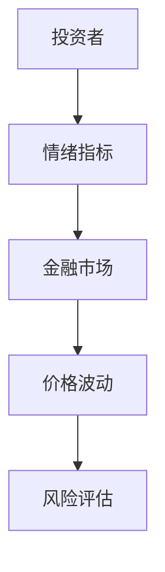
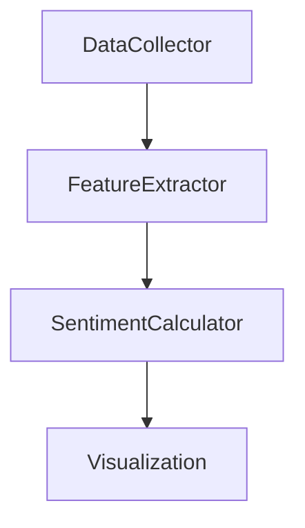

                 


# 投资者情绪指标：市场心理学的量化应用

> **关键词**：投资者情绪、量化应用、市场心理学、情绪指标、算法模型、量化投资、数据可视化

> **摘要**：投资者情绪指标是将市场心理学与量化方法结合的重要工具，通过对投资者情绪的量化分析，可以更好地理解市场波动、预测价格变化并优化投资决策。本文从情绪指标的背景、核心概念、算法原理、系统架构、项目实战和最佳实践等方面，详细探讨投资者情绪指标的量化应用。

---

# 第一部分: 投资者情绪指标概述

## 第1章: 投资者情绪指标的背景与概念

### 1.1 投资者情绪的基本概念

#### 1.1.1 投资者情绪的定义
投资者情绪（Investor Sentiment）是指投资者在金融市场中表现出的心理状态和行为倾向。它反映了投资者对市场未来走势的乐观或悲观态度，通常受到市场波动、经济数据、政策变化等因素的影响。

#### 1.1.2 投资者情绪的影响因素
投资者情绪受多种因素影响，包括：
1. **市场环境**：如市场波动、经济数据（GDP、就业率等）。
2. **政策变化**：如货币政策、财政政策的变化。
3. **新闻事件**：如公司财报、重大并购、国际局势等。
4. **个体差异**：不同投资者的风险偏好和心理特质也会影响情绪。

#### 1.1.3 投资者情绪与市场行为的关系
投资者情绪直接影响市场行为，例如：
- **乐观情绪**：投资者倾向于买入资产，推高市场价格。
- **悲观情绪**：投资者倾向于卖出资产，压低市场价格。

### 1.2 投资者情绪指标的量化意义

#### 1.2.1 情绪指标在金融市场的应用
投资者情绪指标可以用于：
- **市场预测**：通过分析情绪指标的变化，预测市场短期走势。
- **风险管理**：识别市场过度乐观或悲观的情况，避免投资决策失误。
- **资产配置**：根据情绪指标调整投资组合，优化风险收益比。

#### 1.2.2 情绪指标与资产定价的关系
情绪指标可以通过影响市场参与者的心理预期，间接影响资产定价。例如，当市场情绪过于乐观时，资产价格可能被高估；当市场情绪过于悲观时，资产价格可能被低估。

#### 1.2.3 情绪指标在风险管理中的作用
情绪指标可以帮助投资者识别市场情绪的极端值，从而提前采取风险管理措施，避免因情绪波动导致的重大损失。

### 1.3 投资者情绪指标的历史发展

#### 1.3.1 早期情绪指标的研究
早期的情绪指标研究主要依赖于市场参与者的调查和访谈，例如通过问卷调查收集投资者对市场的看法。

#### 1.3.2 现代情绪指标的演变
随着技术的进步，现代情绪指标逐渐从定性分析转向量化分析，结合大数据和人工智能技术，开发出更精确的情绪指标模型。

#### 1.3.3 当前情绪指标的应用现状
目前，情绪指标已在金融市场的多个领域得到广泛应用，包括股票交易、外汇交易、加密货币交易等。

---

## 第2章: 投资者情绪指标的核心概念与联系

### 2.1 投资者情绪指标的定义与属性

#### 2.1.1 情绪指标的定义
投资者情绪指标是通过量化方法，将投资者情绪转化为可量化的指标，用于分析市场行为和预测市场走势。

#### 2.1.2 情绪指标的核心属性
- **实时性**：情绪指标通常基于最新的市场数据计算，具有较强的实时性。
- **可量化性**：情绪指标通过数学模型量化投资者情绪，便于计算机处理和分析。
- **预测性**：情绪指标可以用于预测市场走势，帮助投资者做出决策。

#### 2.1.3 情绪指标的分类
投资者情绪指标可以分为以下几类：
- **基于文本的情绪指标**：通过分析新闻、社交媒体等文本数据，计算情绪强度。
- **基于价格的情绪指标**：通过分析价格波动和交易量，计算情绪指标。
- **基于调查的情绪指标**：通过投资者问卷调查，计算情绪指标。

### 2.2 情绪指标与相关概念的对比

#### 2.2.1 情绪指标与恐慌指数（VIX）的对比
- **恐慌指数（VIX）**：反映市场波动性的指标，通常被称为“恐慌指数”。
- **情绪指标**：反映投资者情绪的指标，可以是乐观或悲观的综合指标。

#### 2.2.2 情绪指标与市场情绪指数的对比
- **市场情绪指数**：通常基于市场参与者的调查，反映市场情绪的整体状况。
- **情绪指标**：基于实时数据计算，反映市场情绪的动态变化。

#### 2.2.3 情绪指标与投资者心理模型的对比
- **投资者心理模型**：反映投资者对市场的认知和预期。
- **情绪指标**：通过量化方法，将投资者情绪转化为可量化的指标。

### 2.3 情绪指标的实体关系图



---

## 第3章: 投资者情绪指标的算法原理

### 3.1 情绪指标的计算方法

#### 3.1.1 基于文本挖掘的情绪分析算法

- **文本挖掘**：从新闻、社交媒体等文本数据中提取情绪信息。
- **情感分析**：通过自然语言处理技术，分析文本中的情绪倾向。

#### 3.1.2 基于情感分析的指标计算

- **情感分析模型**：使用文本挖掘和机器学习技术，计算文本中的情绪强度。
- **情绪指标计算**：将情绪强度标准化，得到情绪指标。

#### 3.1.3 基于统计套利的情绪指标模型

- **统计套利**：通过分析历史数据，寻找情绪指标与市场走势之间的统计关系。
- **情绪指标模型**：基于统计套利模型，计算情绪指标。

### 3.2 情绪指标的数学模型

#### 3.2.1 情绪强度的量化公式

$$ \text{情绪强度} = \frac{\sum_{i=1}^{n} w_i \cdot s_i}{\sum_{i=1}^{n} w_i} $$

其中，\( w_i \) 是第 \( i \) 个文本的情绪权重，\( s_i \) 是第 \( i \) 个文本的情绪强度。

#### 3.2.2 情绪趋势的预测模型

$$ \text{预测情绪} = \alpha \cdot \text{当前情绪} + (1-\alpha) \cdot \text{历史情绪} $$

其中，\( \alpha \) 是模型的平滑参数，\( 0 < \alpha < 1 \)。

### 3.3 情绪指标的实现代码

```python
def calculate_sentiment(sentences):
    from textblob import TextBlob
    sentiment_scores = []
    for sentence in sentences:
        blob = TextBlob(sentence)
        sentiment = blob.sentiment.polarity
        sentiment_scores.append(sentiment)
    return sentiment_scores
```

---

## 第4章: 投资者情绪指标的系统架构设计

### 4.1 系统功能设计

#### 4.1.1 数据采集模块
- **功能**：采集市场数据，包括新闻、社交媒体、交易数据等。
- **输入**：原始市场数据。
- **输出**：结构化的数据，用于后续分析。

#### 4.1.2 特征提取模块
- **功能**：从数据中提取特征，包括情绪特征、价格特征等。
- **输入**：结构化数据。
- **输出**：特征向量。

#### 4.1.3 情绪指标计算模块
- **功能**：基于特征向量，计算情绪指标。
- **输入**：特征向量。
- **输出**：情绪指标。

#### 4.1.4 情绪指标可视化模块
- **功能**：将情绪指标可视化，便于投资者观察市场情绪。
- **输入**：情绪指标。
- **输出**：可视化图表。

### 4.2 系统架构设计



---

## 第5章: 投资者情绪指标的项目实战

### 5.1 项目背景

#### 5.1.1 项目介绍
本项目旨在开发一个投资者情绪指标系统，利用大数据和人工智能技术，分析市场情绪，预测市场走势。

### 5.2 系统实现

#### 5.2.1 数据采集
- **工具**：使用爬虫技术采集新闻、社交媒体数据。
- **数据来源**：新闻网站、社交媒体平台。

#### 5.2.2 特征提取
- **工具**：使用自然语言处理技术提取情绪特征。
- **算法**：使用TF-IDF、Word2Vec等技术。

#### 5.2.3 情绪指标计算
- **工具**：使用机器学习算法计算情绪指标。
- **算法**：使用支持向量机（SVM）、随机森林（Random Forest）等算法。

#### 5.2.4 情绪指标可视化
- **工具**：使用可视化工具（如Matplotlib、Tableau）展示情绪指标。

### 5.3 实验结果

#### 5.3.1 数据分析
- **分析结果**：展示情绪指标与市场走势的相关性。
- **图表展示**：使用折线图、柱状图等展示情绪指标的变化趋势。

#### 5.3.2 结果解读
- **解读**：分析情绪指标对市场走势的预测能力。

### 5.4 项目小结

- **总结**：投资者情绪指标系统能够有效反映市场情绪，帮助投资者做出更明智的投资决策。
- **优化方向**：进一步优化算法，提高情绪指标的预测精度。

---

## 第6章: 投资者情绪指标的最佳实践

### 6.1 小结

- **小结**：投资者情绪指标是市场心理学与量化方法结合的重要工具，能够帮助投资者更好地理解市场情绪，优化投资决策。

### 6.2 注意事项

- **数据质量**：情绪指标的准确性依赖于高质量的数据，需要注意数据清洗和特征提取。
- **模型调优**：情绪指标模型需要根据市场变化不断调优，以提高预测能力。
- **风险管理**：投资者情绪指标只是辅助工具，投资决策需要结合其他因素。

### 6.3 拓展阅读

- **推荐书籍**：
  - 《量化交易：算法进阶》
  - 《行为金融学》
- **推荐博客**：
  - 量化投资博客
  - 数据挖掘与机器学习博客

---

**作者**：AI天才研究院/AI Genius Institute & 禅与计算机程序设计艺术 /Zen And The Art of Computer Programming

