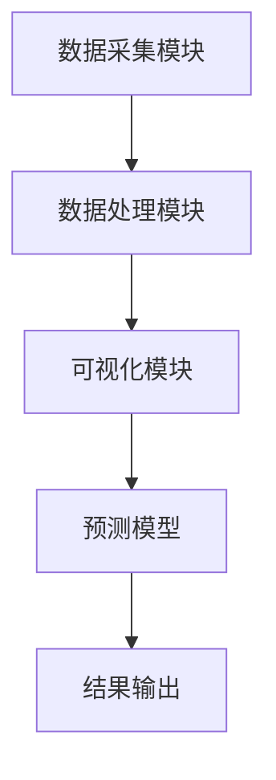

                 


# 收益率曲线分析：预测经济走向的工具

## 关键词：收益率曲线、经济预测、利率分析、金融工具、投资策略

## 摘要：收益率曲线是金融市场中预测经济走向的重要工具。本文将从收益率曲线的基本概念出发，分析其在经济预测中的作用，探讨其构建方法，并通过实际案例展示其在投资决策中的应用。通过本文，读者将掌握如何利用收益率曲线预测经济趋势，优化投资策略。

---

## 第一部分: 收益率曲线分析基础

## 第1章: 收益率曲线概述

### 1.1 什么是收益率曲线
#### 1.1.1 利息收益率的基本概念
收益率曲线是指不同期限的债券收益率之间的关系曲线，反映了市场对未来利率走势的预期。它通常以期限为横轴，收益率为纵轴绘制。

#### 1.1.2 收益率曲线的定义与作用
收益率曲线是金融市场的核心工具之一，用于分析和预测经济周期、货币政策和通货膨胀。它反映了市场对未来利率的预期，是制定投资策略的重要依据。

#### 1.1.3 收益率曲线的类型与特点
- **上升型收益率曲线（Normal Curve）**：短期利率低，长期利率高，表明市场预期未来利率将上升。
- **下降型收益率曲线（Inverse Curve）**：短期利率高，长期利率低，表明市场预期未来利率将下降。
- **平坦型收益率曲线（Flat Curve）**：短期和长期利率接近，表明市场对未来利率走势不确定。
- **曲折型收益率曲线（Humped Curve）**：曲线在某段期限内出现波动，可能反映市场对特定风险的预期。

### 1.2 收益率曲线的形状与经济周期
#### 1.2.1 上升型收益率曲线
- 经济处于复苏期，市场预期未来利率将上升。
- 通常出现在经济增长预期较强时。

#### 1.2.2 下降型收益率曲线
- 经济处于衰退期，市场预期未来利率将下降。
- 通常出现在经济增长乏力时。

#### 1.2.3 平坦型收益率曲线
- 经济处于过渡期，市场对未来利率走势不确定。
- 通常出现在政策不确定或市场波动较大时。

#### 1.2.4 曲折型收益率曲线
- 反映市场对特定风险或事件的预期，如通胀预期上升或政策变化。

### 1.3 收益率曲线的构建与应用
#### 1.3.1 收益率曲线的构建方法
- 数据收集：收集不同期限的债券收益率数据。
- 计算：计算各期限的平均收益率，绘制曲线。

#### 1.3.2 收益率曲线在经济预测中的应用
- 预测利率走势：曲线形状反映市场对未来利率的预期。
- 预测经济周期：上升型曲线通常对应经济复苏，下降型曲线对应经济衰退。

#### 1.3.3 收益率曲线在投资决策中的作用
- 制定投资策略：根据曲线形状选择投资品种和期限。
- 风险管理：利用曲线预测市场波动，优化资产配置。

### 1.4 本章小结
#### 1.4.1 收益率曲线的核心概念
- 收益率曲线是不同期限债券收益率的关系曲线，反映市场对未来利率预期。

#### 1.4.2 收益率曲线的经济意义
- 通过曲线形状预测经济周期和货币政策，帮助投资者制定策略。

#### 1.4.3 收益率曲线分析的基本方法
- 数据收集、计算、绘制和解读。

---

## 第二部分: 收益率曲线的理论基础

## 第2章: 收益率曲线的理论基础

### 2.1 利率期限结构理论
#### 2.1.1 利率期限结构的定义
利率期限结构是指不同期限债券的利率之间的关系，通常用收益率曲线表示。

#### 2.1.2 利率期限结构的影响因素
- 通货膨胀预期：市场对未来通胀的预期影响长期利率。
- 经济增长预期：预期未来经济增长将推高利率。
- 货币政策：央行的货币政策影响短期利率，进而影响曲线形状。

#### 2.1.3 利率期限结构的理论模型
- **市场预期理论**：长期利率是未来短期利率的平均预期。
- **流动性偏好理论**：投资者偏好流动性，要求流动性溢价，导致长期利率高于短期利率。
- **市场分割理论**：不同期限的债券市场相互独立，影响各自利率。

### 2.2 收益率曲线的形成机制
#### 2.2.1 市场预期理论
- 长期利率是未来短期利率的平均预期，曲线形状反映市场对未来利率的预期。

#### 2.2.2 流动性偏好理论
- 投资者偏好短期投资，要求流动性溢价，导致长期利率高于短期利率。

#### 2.2.3 市场分割理论
- 不同期限的债券市场相互独立，影响各自利率，导致曲线形状复杂。

### 2.3 收益率曲线与宏观经济的关系
#### 2.3.1 收益率曲线与通货膨胀的关系
- 高通胀预期导致长期利率上升，曲线趋陡。

#### 2.3.2 收益率曲线与经济增长的关系
- 经济增长预期强时，曲线通常上升；经济增长预期弱时，曲线趋平或下降。

#### 2.3.3 收益率曲线与货币政策的关系
- 中央银行的货币政策直接影响短期利率，间接影响长期利率。

### 2.4 本章小结
#### 2.4.1 收益率曲线的理论基础
- 利率期限结构理论解释了曲线的形成机制。

#### 2.4.2 收益率曲线与宏观经济的联系
- 曲线形状反映经济周期、通胀预期和货币政策。

#### 2.4.3 收益率曲线分析的理论框架
- 市场预期、流动性偏好和市场分割理论共同解释曲线变化。

---

## 第三部分: 收益率曲线的分析与预测

## 第3章: 收益率曲线的分析与预测方法

### 3.1 收益率曲线的分析指标
#### 3.1.1 收益率曲线的斜率
- 斜率反映短期和长期利率的差异，斜率上升表示长期利率高于短期利率。

#### 3.1.2 曲线的曲率
- 曲率反映曲线的弯曲程度，通常用于检测市场对特定风险的预期。

#### 3.1.3 收益率差（Yield Spread）
- 长期利率减去短期利率，用于预测未来经济走势。

### 3.2 收益率曲线的预测模型
#### 3.2.1 时间序列分析
- 使用ARIMA模型预测未来利率走势。

#### 3.2.2 统计套利模型
- 利用收益率曲线的形态进行套利交易。

#### 3.2.3 机器学习模型
- 使用神经网络等方法预测曲线形状。

### 3.3 收益率曲线预测的实际应用
#### 3.3.1 预测经济周期
- 曲线形状变化通常预示经济周期变化。

#### 3.3.2 预测通货膨胀
- 收益率曲线反映市场对通胀的预期。

#### 3.3.3 制定投资策略
- 根据曲线形状选择投资品种和期限。

### 3.4 本章小结
#### 3.4.1 收益率曲线分析的核心指标
- 斜率、曲率和收益率差是分析曲线形状的关键指标。

#### 3.4.2 收益率曲线预测的常用方法
- 时间序列分析、统计套利和机器学习模型。

#### 3.4.3 收益率曲线预测的实际意义
- 帮助投资者预测经济趋势，优化资产配置。

---

## 第四部分: 收益率曲线分析的系统实现与项目实战

## 第4章: 收益率曲线分析的系统实现

### 4.1 系统架构设计
#### 4.1.1 系统功能模块
- 数据采集模块：获取不同期限的债券收益率数据。
- 数据处理模块：计算收益率差和曲线形态指标。
- 可视化模块：绘制收益率曲线和预测结果。

#### 4.1.2 系统架构图


### 4.2 系统实现步骤
#### 4.2.1 数据采集
- 使用网络爬虫或API获取债券收益率数据。

#### 4.2.2 数据处理
- 计算各期限的平均收益率，绘制曲线。

#### 4.2.3 可视化
- 使用Matplotlib绘制收益率曲线和预测结果。

#### 4.2.4 预测模型
- 使用时间序列模型预测未来利率走势。

### 4.3 项目实战
#### 4.3.1 项目背景
- 假设我们有一个包含不同期限债券收益率的数据集。

#### 4.3.2 数据获取与处理
```python
import pandas as pd
import numpy as np

# 示例数据：不同期限的债券收益率
data = {
    '期限': [1, 2, 3, 4, 5, 6, 7, 8, 9, 10],
    '收益率': [2.0, 2.2, 2.5, 2.8, 3.0, 3.2, 3.5, 3.7, 4.0, 4.2]
}

df = pd.DataFrame(data)
print(df)
```

#### 4.3.3 可视化
```python
import matplotlib.pyplot as plt

plt.plot(df['期限'], df['收益率'])
plt.title('收益率曲线')
plt.xlabel('期限（年）')
plt.ylabel('收益率（%）')
plt.show()
```

#### 4.3.4 预测模型实现
```python
from statsmodels.tsa.arima_model import ARIMA

# 使用ARIMA模型预测未来利率
model = ARIMA(df['收益率'], order=(1, 1, 1))
model_fit = model.fit()

# 预测未来1步的利率
 forecast = model_fit.forecast(steps=1)
 print('预测未来利率:', forecast[0][0])
```

### 4.4 本章小结
#### 4.4.1 系统架构设计
- 分模块实现数据采集、处理、可视化和预测。

#### 4.4.2 项目实战经验
- 使用Python和相关库实现收益率曲线分析，验证模型的有效性。

#### 4.4.3 注意事项
- 数据质量影响预测结果，需注意数据清洗和处理。

---

## 第五部分: 收益率曲线分析的最佳实践与总结

## 第5章: 收益率曲线分析的最佳实践

### 5.1 最佳实践
#### 5.1.1 数据选择
- 确保数据来源可靠，覆盖足够期限。

#### 5.1.2 模型选择
- 根据具体情况选择合适的时间序列模型或机器学习模型。

#### 5.1.3 结果验证
- 使用历史数据验证模型的准确性，调整参数优化预测效果。

### 5.2 小结
#### 5.2.1 收益率曲线分析的核心内容
- 理解曲线形状的经济意义，掌握分析方法和预测模型。

#### 5.2.2 收益率曲线分析的实际应用
- 预测经济趋势，优化投资策略，管理市场风险。

#### 5.2.3 未来研究方向
- 结合更多经济指标，探索更复杂的预测模型。

---

## 作者：AI天才研究院/AI Genius Institute & 禅与计算机程序设计艺术 /Zen And The Art of Computer Programming

---

通过本文，读者可以全面了解收益率曲线的分析方法和实际应用，掌握利用收益率曲线预测经济走向的工具和技巧。

