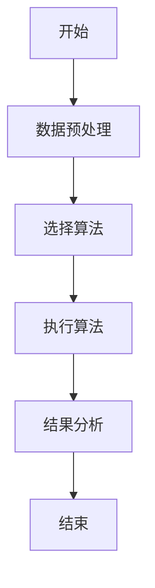
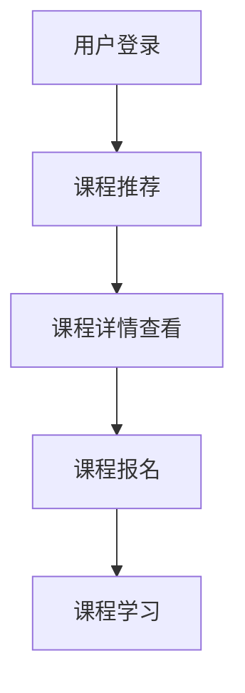

                 


# 教育科技（EdTech）的发展前景与投资价值

---

## 关键词：
教育科技，人工智能，投资价值，技术发展，教育创新

---

## 摘要：
教育科技（EdTech）作为技术与教育深度融合的产物，正在改变全球教育模式。随着人工智能、大数据、区块链等技术的快速发展，教育科技在提升学习效率、实现教育公平、个性化教学等方面展现出巨大潜力。本文从教育科技的核心概念、技术基础、算法原理、系统架构、投资价值等多个维度展开分析，探讨其发展前景与投资价值。

---

## 第1章：教育科技的定义与核心概念

### 1.1 教育科技的定义与背景
教育科技（EdTech）是指利用技术手段优化教育过程、提升教育质量和效率的新兴领域。其核心目标是通过技术手段解决传统教育中的痛点，如教育资源分配不均、学习效率低下等问题。

#### 1.1.1 教育科技的定义
教育科技是技术与教育的结合，通过数字化工具、人工智能、大数据等技术手段，实现教育资源的高效分配、教学过程的智能化管理以及学习体验的个性化提升。

#### 1.1.2 教育科技的发展背景
随着互联网技术的普及、人工智能的快速发展以及全球范围内对教育创新的需求增加，教育科技逐渐成为推动教育变革的重要力量。

#### 1.1.3 教育科技的核心要素
- **技术基础**：人工智能、大数据、区块链等。
- **教育场景**：K-12教育、高等教育、职业教育等。
- **用户群体**：学生、教师、教育机构等。

### 1.2 教育科技的现状与趋势
#### 1.2.1 全球教育科技的发展现状
- **市场规模**：全球教育科技市场规模持续增长，预计未来几年年增长率将超过10%。
- **技术应用**：人工智能、大数据等技术在教育领域的应用逐渐普及。
- **区域分布**：北美、欧洲和亚太地区是教育科技的主要市场。

#### 1.2.2 中国教育科技的市场特点
- **政策支持**：中国政府积极推动“互联网+教育”战略，鼓励技术与教育的深度融合。
- **市场潜力**：中国拥有庞大的学生群体和不断增长的教育需求，为教育科技的发展提供了广阔空间。

#### 1.2.3 未来教育科技的发展趋势
- **个性化学习**：通过人工智能技术实现精准教学，满足学生的个性化学习需求。
- **教育公平**：利用技术手段缩小教育资源分配的差距，推动教育公平。
- **终身学习**：教育科技将推动终身学习模式的普及，满足人们持续学习的需求。

### 1.3 教育科技的社会价值与经济价值
#### 1.3.1 教育科技的社会价值
- **教育公平**：通过技术手段将优质教育资源输送到偏远地区，缩小教育差距。
- **学习效率提升**：通过智能化工具优化学习过程，提高学习效率。

#### 1.3.2 教育科技的经济价值
- **市场规模**：教育科技市场潜力巨大，吸引了大量资本进入。
- **投资回报**：成功的教育科技项目能够实现较高的投资回报率。

---

## 第2章：教育科技的核心概念与联系

### 2.1 核心概念的原理分析
教育科技的核心概念包括技术与教育的深度融合，其原理主要体现在以下几个方面：

#### 2.1.1 技术与教育的融合
- **人工智能**：通过自然语言处理、机器学习等技术实现智能化教学。
- **大数据**：通过数据采集与分析优化教学过程。
- **区块链**：用于教育数据的安全存储与共享。

#### 2.1.2 教育场景的数字化转型
- **在线教育**：通过互联网平台实现远程教学。
- **智能课堂**：利用智能设备优化课堂教学体验。

### 2.2 核心概念的属性特征对比
下表对比了教育科技中几种核心技术的属性特征：

| 技术领域   | 核心能力           | 应用场景               | 优缺点分析               |
|------------|--------------------|------------------------|--------------------------|
| 人工智能   | 智能化、自动化     | 个性化教学、智能推荐   | 高效但需要大量数据支持   |
| 大数据     | 数据采集与分析     | 教学效果评估、学生画像 | 数据处理复杂度高         |
| 区块链     | 数据安全、去中心化 | 教育证书管理、资源共享 | 技术实现复杂度较高       |

### 2.3 ER实体关系图架构
以下是教育科技系统的核心实体关系图：

```mermaid
erDiagram
    student {
        id : integer
        name : string
        email : string
        enrolled_courses : integer
    }
    teacher {
        id : integer
        name : string
        subject : string
        students Taught : integer
    }
    course {
        id : integer
        name : string
        level : string
        enrolled_students : integer
    }
    enrollment {
        student_id : integer
        course_id : integer
        enrollment_date : date
    }
    interaction {
        student_id : integer
        teacher_id : integer
        interaction_date : date
        content : string
    }
    student --> enrollment
    enrollment --> course
    student --> interaction
    interaction --> teacher
    teacher --> course
```

---

## 第3章：教育科技的算法原理讲解

### 3.1 数据挖掘算法
#### 3.1.1 数据挖掘的基本概念
数据挖掘是从大量数据中提取有价值信息的过程，常用算法包括决策树、聚类分析等。

#### 3.1.2 常见数据挖掘算法
- **决策树**：用于分类和回归分析。
- **聚类分析**：用于将数据分成相似的群体。

#### 3.1.3 算法实现的流程图
以下是数据挖掘算法的流程图：



#### 3.1.4 数据挖掘算法的Python代码示例
以下是一个决策树算法的Python代码示例：

```python
from sklearn.tree import DecisionTreeClassifier
import pandas as pd

# 数据加载
data = pd.read_csv('data.csv')
X = data.drop('target', axis=1)
y = data['target']

# 模型训练
model = DecisionTreeClassifier()
model.fit(X, y)

# 预测
predictions = model.predict(X)
```

---

## 第4章：教育科技的数学模型与公式

### 4.1 数据挖掘模型
#### 4.1.1 数据挖掘模型的数学公式
以下是一个简单的线性回归模型公式：

$$ y = \beta_0 + \beta_1x + \epsilon $$

其中，$y$ 是目标变量，$x$ 是自变量，$\beta_0$ 是截距，$\beta_1$ 是回归系数，$\epsilon$ 是误差项。

#### 4.1.2 数据挖掘模型的实现步骤
1. 数据预处理。
2. 选择算法。
3. 模型训练。
4. 模型评估。

---

## 第5章：教育科技的系统架构设计

### 5.1 系统功能设计
#### 5.1.1 系统功能模块
- **用户管理模块**：学生、教师注册与登录。
- **课程管理模块**：课程信息发布、课程推荐。
- **教学管理模块**：教学过程监控、教学效果评估。

#### 5.1.2 系统功能流程图
以下是系统功能的流程图：



### 5.2 系统架构设计
以下是系统架构设计的Mermaid图：


---

## 第6章：教育科技的项目实战

### 6.1 项目背景
本项目旨在开发一个智能学习平台，利用人工智能技术实现个性化教学。

### 6.2 项目实现
#### 6.2.1 环境安装
- 安装Python和相关库：`pip install numpy pandas scikit-learn`

#### 6.2.2 核心代码实现
以下是一个推荐系统的Python代码示例：

```python
from sklearn.metrics.pairwise import cosine_similarity

# 数据加载
data = pd.read_csv('courses.csv')

# 计算相似性
similarity_matrix = cosine_similarity(data)

# 根据用户兴趣推荐课程
def recommend_courses(user_interest):
    # 找出与用户兴趣最相似的课程
    recommendations = similarity_matrix[user_interest]
    return recommendations.argsort()[-5:][::-1]
```

### 6.3 项目分析
#### 6.3.1 项目分析
通过分析用户数据和课程数据，可以发现用户的学习偏好，并为他们推荐合适的课程。

#### 6.3.2 项目总结
本项目展示了教育科技在个性化教学中的应用潜力。

---

## 第7章：教育科技的投资策略

### 7.1 教育科技的投资价值
#### 7.1.1 市场分析
教育科技市场规模庞大，未来几年将保持快速增长。

#### 7.1.2 项目评估
在选择投资项目时，需考虑团队能力、市场定位、技术优势等因素。

### 7.2 投资风险管理
#### 7.2.1 风险分析
- **技术风险**：技术实现难度大。
- **市场风险**：市场竞争激烈。

#### 7.2.2 风险控制
- **技术储备**：加强技术团队建设。
- **市场策略**：制定差异化竞争策略。

### 7.3 未来趋势
随着人工智能、大数据等技术的进一步发展，教育科技将迎来更多创新机会。

---

## 第8章：结论与展望

教育科技作为技术与教育深度融合的产物，正在深刻改变传统的教育模式。通过技术手段实现教育资源的优化配置、教学过程的智能化管理以及学习体验的个性化提升，教育科技具有广阔的发展前景和巨大的投资价值。未来，随着技术的不断进步和市场的进一步发展，教育科技将在全球范围内发挥更大的作用。

---

## 作者：AI天才研究院（AI Genius Institute） & 禅与计算机程序设计艺术（Zen And The Art of Computer Programming）

