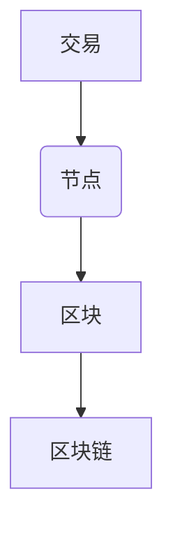

                 

# 数字货币发展对金融体系的影响及投资策略

## 关键词：数字货币，区块链，金融体系，投资策略，风险管理

## 摘要：数字货币的兴起对传统金融体系产生了深远的影响，改变了支付、银行、证券和监管等多个领域。本文分析数字货币的技术原理、其对金融体系的具体影响，并提供科学的投资策略和风险管理方法，帮助读者抓住数字货币带来的投资机会，同时规避潜在风险。

---

## 第一章：数字货币的背景与发展

### 1.1 数字货币的定义与核心概念

#### 1.1.1 传统货币与数字货币的对比

传统货币包括纸币和硬币，由中央银行发行，依赖于物理形态和信任体系。而数字货币是基于区块链技术的虚拟货币，具有去中心化、可追溯和匿名性等特点。

| 特性 | 传统货币 | 数字货币 |
|------|----------|----------|
| 发行机构 | 中央银行 | 区块链网络 |
| 交易速度 | 较慢 | 较快 |
| 成本 | 较高 | 较低 |
| 安全性 | 高 | 高（依赖技术） |

#### 1.1.2 数字货币的核心特征

1. **去中心化**：基于区块链技术，不依赖于中央机构。
2. **可追溯性**：每笔交易都有记录，便于追踪。
3. **匿名性**：交易通过地址进行，保护用户隐私。
4. **分割性**：可分割至小数点后多位，提升灵活性。

#### 1.1.3 数字货币的分类与应用场景

1. **比特币（Bitcoin）**：第一个数字货币，主要用于投资和支付。
2. **以太坊（Ethereum）**：支持智能合约，扩展应用场景。
3. **稳定币（Stablecoin）**：与法定货币挂钩，降低波动性。

### 1.2 数字货币的发展历程

#### 1.2.1 数字货币的起源与演变

从1998年的“B-money”概念到2009年比特币的诞生，数字货币经历了从理论到实践的演变。

#### 1.2.2 区块链技术的出现与数字货币的崛起

区块链技术为数字货币提供了安全、透明的底层架构，推动了其快速发展。

#### 1.2.3 数字货币的现状与未来趋势

当前，数字货币市场呈现多元化，未来可能成为主流支付方式之一。

### 1.3 区块链技术在数字货币中的作用

#### 1.3.1 区块链的基本原理

区块链是一种分布式账本技术，通过去中心化和共识机制确保数据的安全性。

#### 1.3.2 区块链的核心技术特点

1. **去中心化**：无单点故障。
2. **不可篡改**：数据一旦写入，无法修改。
3. **透明性**：所有交易公开可查。

#### 1.3.3 区块链与数字货币的结合

通过区块链，数字货币实现了无需信任的点对点交易，降低了交易成本。

---

## 第二章：数字货币对传统金融体系的冲击

### 2.1 支付体系的变革

#### 2.1.1 数字货币对跨境支付的影响

数字货币降低了跨境支付的成本和时间，提高了效率。

#### 2.1.2 数字货币对传统支付机构的挑战

传统支付机构面临数字货币带来的竞争压力。

#### 2.1.3 数字货币支付的效率与成本优势

相比传统支付，数字货币支付更快、更便宜。

### 2.2 银行体系的转型

#### 2.2.1 数字货币对传统银行的冲击

数字货币可能削弱银行在支付领域的地位。

#### 2.2.2 数字银行的概念与发展趋势

数字银行通过数字化服务，提升用户体验。

#### 2.2.3 银行与数字货币的融合

银行开始探索数字货币的发行和应用。

### 2.3 证券与投资领域的变化

#### 2.3.1 数字货币对传统证券市场的挑战

数字货币提供了新的投资渠道，影响传统证券市场。

#### 2.3.2 数字证券与传统证券的对比

数字证券基于区块链技术，具有更高的透明度和效率。

#### 2.3.3 数字货币对投资策略的影响

投资者需要调整策略，适应数字货币市场的波动性。

### 2.4 金融监管的重构

#### 2.4.1 数字货币对金融监管的挑战

监管机构需要应对去中心化和跨境流动的挑战。

#### 2.4.2 新型监管框架的构建

各国正在制定数字货币监管政策，以确保市场稳定。

#### 2.4.3 监管机构的角色转变

从传统的监管者转变为数字货币市场的参与者和监督者。

### 2.5 本章小结

数字货币正在重塑金融体系，支付、银行、证券和监管等领域都将发生重大变化。

---

## 第三章：数字货币的投资策略与风险管理

### 3.1 数字货币投资的基本原则

#### 3.1.1 投资者心理与决策

投资者需理性分析，避免情绪化决策。

#### 3.1.2 风险偏好与收益目标的平衡

根据自身风险承受能力选择合适的投资标的。

#### 3.1.3 长期与短期投资策略的选择

长期投资注重项目基本面，短期投资关注市场波动。

### 3.2 数字货币的技术分析

#### 3.2.1 K线图与价格走势分析

通过K线图识别价格趋势和支撑阻力位。

#### 3.2.2 技术指标的应用

常用技术指标包括RSI、MACD等。

#### 3.2.3 市场情绪与成交量分析

市场情绪和成交量是判断市场走向的重要指标。

### 3.3 数字货币的基本面分析

#### 3.3.1 项目背景与团队实力

团队背景和项目规划影响数字货币的长期价值。

#### 3.3.2 技术创新与应用场景

技术先进性和应用场景广泛性决定项目的市场潜力。

#### 3.3.3 市场容量与竞争环境

市场规模和竞争状况影响项目的市场表现。

### 3.4 数字货币投资组合的构建

#### 3.4.1 资产分配与风险分散

通过分散投资降低风险，平衡收益。

#### 3.4.2 不同阶段的投资策略

根据市场周期调整投资策略，如牛市中重仓优质币种，熊市中选择避险资产。

#### 3.4.3 定期调整与优化

根据市场变化和项目进展，及时调整投资组合。

### 3.5 数字货币投资中的风险管理

#### 3.5.1 风险识别与评估

识别市场风险、技术风险和监管风险。

#### 3.5.2 风险控制工具与策略

使用止损订单、分散投资等工具控制风险。

---

## 第四章：未来展望与投资机会

### 4.1 数字货币的未来发展趋势

#### 4.1.1 技术创新推动行业发展

AI、5G等技术将推动数字货币进一步发展。

#### 4.1.2 去中心化金融（DeFi）的崛起

DeFi通过智能合约重新定义金融服务。

#### 4.1.3 数字货币与实体经济的深度融合

数字货币将与实体经济结合，推动经济数字化转型。

### 4.2 投资者如何抓住数字货币的未来机会

#### 4.2.1 关注技术创新和应用场景

投资具备创新技术和广泛应用场景的项目。

#### 4.2.2 选择优质数字资产

关注有强大团队支持和良好生态系统的数字货币。

#### 4.2.3 长期持有优质资产

避免短期波动，长期持有优质数字资产。

### 4.3 风险提示与投资建议

#### 4.3.1 注意市场波动风险

数字货币市场波动剧烈，投资者需谨慎操作。

#### 4.3.2 提高自身认知水平

持续学习，提升对数字货币市场的理解和分析能力。

#### 4.3.3 合理配置资产

根据自身风险承受能力，合理配置数字货币资产。

---

## 作者：AI天才研究院/AI Genius Institute & 禅与计算机程序设计艺术 /Zen And The Art of Computer Programming

