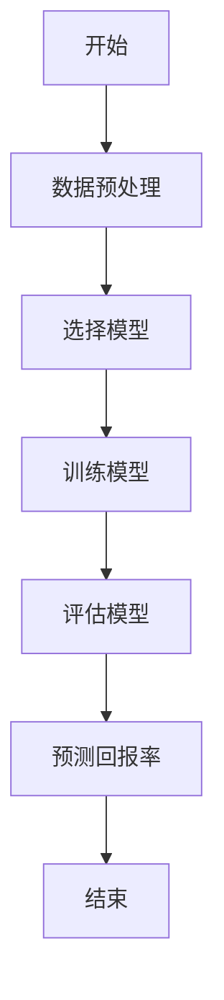
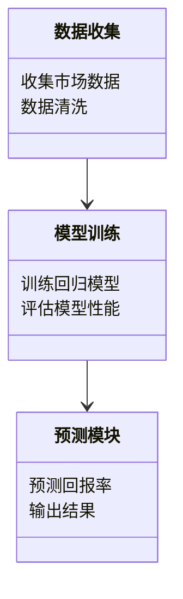
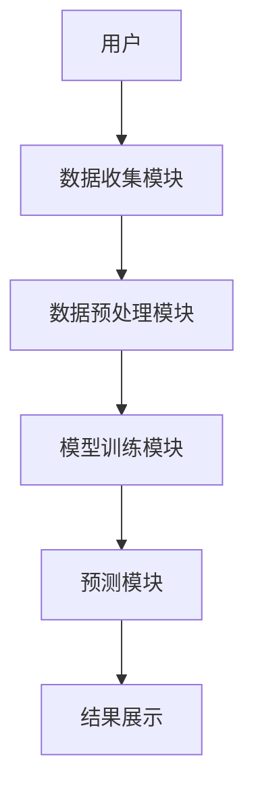

                 


# 新兴市场与发达市场未来回报率预测的差异

## 关键词：新兴市场，发达市场，回报率预测，投资机会，风险分析

## 摘要：本文深入分析新兴市场和发达市场在回报率预测方面的差异，探讨其投资机会和风险因素，结合数学模型和算法原理，为投资者提供科学的决策依据。

---

# 第一部分：新兴市场与发达市场概述

## 第1章：新兴市场与发达市场的定义与特点

### 1.1 新兴市场的定义与特点

#### 1.1.1 新兴市场的定义
新兴市场是指那些经济快速发展但尚未完全成熟的国家，如中国、印度等。

#### 1.1.2 新兴市场的经济结构
- 制造业主导，经济增长依赖出口。
- 基础设施正在完善，市场潜力大。

#### 1.1.3 新兴市场的优势与劣势
- 优势：高增长潜力，资源丰富。
- 劣势：政治风险高，市场波动大。

### 1.2 发达市场的定义与特点

#### 1.2.1 发达市场的定义
发达市场是指经济成熟、市场完善的国家，如美国、日本等。

#### 1.2.2 发达市场的经济结构
- 第三产业发达，金融市场成熟。
- 创新能力强，技术领先。

#### 1.2.3 发达市场的优势与劣势
- 优势：市场稳定，法律完善。
- 劣势：增长缓慢，竞争激烈。

## 第2章：新兴市场与发达市场的对比

### 2.1 经济规模对比

#### 2.1.1 新兴市场与发达市场的GDP对比
- 新兴市场GDP增长快，但总量较小。
- 发达市场GDP总量大，但增速慢。

#### 2.1.2 人均GDP对比
- 新兴市场人均GDP低，但增长潜力大。
- 发达市场人均GDP高，但增速稳定。

### 2.2 市场成熟度对比

#### 2.2.1 新兴市场的市场成熟度
- 市场机制不完善，存在垄断现象。
- 投资者信心不足，波动性大。

#### 2.2.2 发达市场的市场成熟度
- 市场机制完善，信息公开透明。
- 投资者信心强，市场波动小。

### 2.3 投资环境对比

#### 2.3.1 新兴市场与发达市场的投资政策对比
- 新兴市场政策变化大，税收不稳定。
- 发达市场政策透明，税收稳定。

#### 2.3.2 新兴市场与发达市场的风险因素对比
- 新兴市场风险因素多，如政治风险和汇率风险。
- 发达市场风险因素少，但经济周期波动影响大。

## 第3章：新兴市场与发达市场的投资机会与风险

### 3.1 新兴市场与发达市场的投资机会

#### 3.1.1 新兴市场的高增长潜力
- 制造业和服务业增长迅速，带来投资机会。
- 新兴市场科技发展快，创新能力强。

#### 3.1.2 发达市场的稳定性和成熟性
- 市场规模大，消费能力强。
- 企业治理规范，风险可控。

### 3.2 新兴市场与发达市场的投资风险

#### 3.2.1 新兴市场的政治风险
- 政治不稳定，政策变化大，影响投资。
- 汇率波动大，影响投资收益。

#### 3.2.2 发达市场的经济周期风险
- 经济周期波动影响企业利润和股价。
- 利率和货币政策变化影响投资回报。

---

# 第二部分：回报率预测的理论与方法

## 第4章：回报率预测的核心概念与理论基础

### 4.1 回报率预测的基本概念

#### 4.1.1 回报率的定义
回报率是指投资在一定时期内的收益与投资成本的比率。

#### 4.1.2 回报率的计算方法
- 简单回报率：$$回报率 = \frac{最终价值 - 初始价值}{初始价值}$$
- 年化回报率：$$年化回报率 = \left(1 + 回报率\right)^{1/T} - 1$$

### 4.2 回报率预测的理论基础

#### 4.2.1 马科维茨投资组合理论
马科维茨提出，通过分散投资可以降低风险，优化投资组合回报。

#### 4.2.2 CAPM模型
CAPM模型用于计算资产的预期回报率，公式为：
$$E(R_i) = R_f + \beta_i (E(R_m) - R_f)$$
其中，$$R_f$$是无风险利率，$$\beta_i$$是资产的贝塔系数，$$E(R_m)$$是市场预期回报率。

#### 4.2.3 布朗模型
布朗模型通过时间序列分析预测资产价格，假设价格服从随机游走。

## 第5章：新兴市场与发达市场回报率预测的差异

### 5.1 新兴市场回报率预测的特殊性

#### 5.1.1 新兴市场的高波动性
新兴市场回报率波动大，难以预测。

#### 5.1.2 新兴市场的政策影响
政府政策变化对市场回报率影响显著。

### 5.2 发达市场回报率预测的特殊性

#### 5.2.1 发达市场的低波动性
发达市场回报率波动小，预测相对稳定。

#### 5.2.2 发达市场的市场效率
发达市场信息透明，价格反映所有信息，预测难度较低。

## 第6章：回报率预测的数学模型与公式

### 6.1 回报率预测的常用模型

#### 6.1.1 线性回归模型
线性回归模型用于预测回报率与影响因素的关系：
$$y = \beta_0 + \beta_1 x_1 + \beta_2 x_2 + \cdots + \beta_n x_n + \epsilon$$

#### 6.1.2 时间序列模型
ARIMA模型用于预测时间序列数据：
$$\phi(B)P_t = \theta(B)W_t$$

#### 6.1.3 非线性回归模型
非线性回归模型适用于复杂关系的预测：
$$y = f(x)$$
其中，$$f(x)$$是非线性函数。

---

# 第三部分：算法与系统设计

## 第7章：算法原理讲解

### 7.1 算法流程图（使用 Mermaid）



### 7.2 Python实现代码

```python
import pandas as pd
from sklearn.linear_model import LinearRegression

# 数据预处理
data = pd.read_csv('market_data.csv')
X = data[['GDP', '失业率', '通胀率']]
y = data['回报率']

# 训练模型
model = LinearRegression()
model.fit(X, y)

# 预测回报率
y_pred = model.predict(X)
print('预测回报率:', y_pred)
```

### 7.3 数学模型

线性回归模型的损失函数为：
$$L = \frac{1}{2m} \sum_{i=1}^{m} (y_i - (w x_i + b))^2$$

优化目标是最小化损失函数，使用梯度下降法：
$$w := w - \alpha \frac{\partial L}{\partial w}$$
$$b := b - \alpha \frac{\partial L}{\partial b}$$

---

## 第8章：系统架构设计

### 8.1 问题场景介绍

设计一个预测新兴市场和发达市场回报率的系统，帮助投资者做出决策。

### 8.2 系统功能设计



### 8.3 系统架构设计



---

## 第9章：项目实战

### 9.1 环境安装

安装Python和必要的库：
```bash
pip install numpy pandas scikit-learn
```

### 9.2 核心代码实现

```python
import pandas as pd
from sklearn.model_selection import train_test_split
from sklearn.metrics import mean_squared_error

# 数据加载
data = pd.read_csv('market_data.csv')
X = data.drop('回报率', axis=1)
y = data['回报率']

# 数据分割
X_train, X_test, y_train, y_test = train_test_split(X, y, test_size=0.2)

# 模型训练
model = LinearRegression()
model.fit(X_train, y_train)

# 模型预测
y_pred = model.predict(X_test)

# 评估模型
mse = mean_squared_error(y_test, y_pred)
print('均方误差:', mse)
```

### 9.3 案例分析

以新兴市场为例，预测未来回报率：
```python
# 输入新兴市场特征数据
new_data = pd.DataFrame({'GDP': [5000], '失业率': [6], '通胀率': [3]})
print('预测回报率:', model.predict(new_data))
```

---

## 第10章：最佳实践

### 10.1 小结

新兴市场和发达市场的回报率预测差异显著，新兴市场波动大，风险高，但增长潜力大；发达市场波动小，风险低，但增长稳定。

### 10.2 注意事项

- 数据质量：确保数据准确，避免偏差。
- 模型选择：根据市场特点选择合适的模型。
- 风险管理：制定有效的风险管理策略。

### 10.3 拓展阅读

- 《投资学》
- 《金融市场与投资组合管理》

---

# 作者：AI天才研究院/AI Genius Institute & 禅与计算机程序设计艺术/Zen And The Art of Computer Programming

---

以上是《新兴市场与发达市场未来回报率预测的差异》的完整目录和内容框架，涵盖背景、理论、算法、系统设计和项目实战，旨在为投资者提供科学的决策支持。

