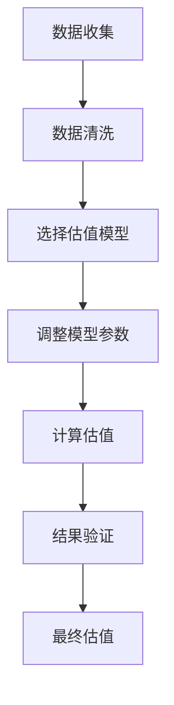
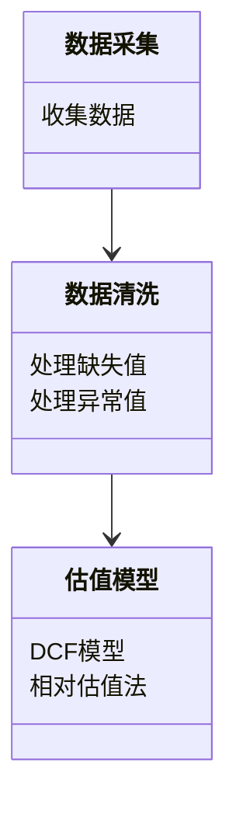
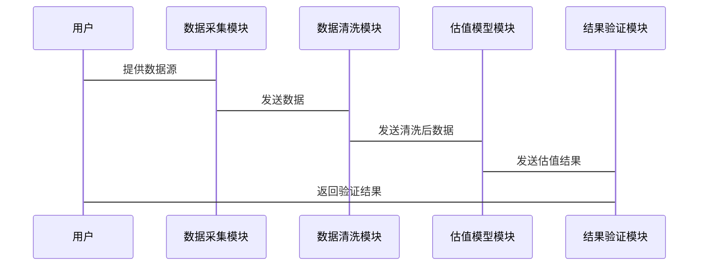

                 


```markdown
# 《新兴市场企业估值的特殊考虑》

> 关键词：新兴市场，企业估值，DCF模型，相对估值法，经济波动

> 摘要：新兴市场的企业估值面临特殊挑战，如经济波动、政策风险和数据不透明。本文系统分析这些因素，介绍多种估值方法，包括DCF模型和相对估值法，并提供实际案例和系统架构设计，帮助读者掌握新兴市场估值的关键技巧。

---

## 第1章：引言

### 1.1 问题背景
- 从传统市场到新兴市场的演变
- 新兴市场的定义与特征
- 企业估值在新兴市场的特殊性

### 1.2 问题描述
- 传统估值方法的局限性
- 新兴市场中的独特挑战
- 估值误差的潜在影响

### 1.3 问题解决
- 引入新兴市场的特殊考虑
- 多维度分析方法的必要性
- 综合评估模型的构建

### 1.4 边界与外延
- 新兴市场的边界条件
- 与成熟市场的区分
- 估值模型的适用范围

### 1.5 概念结构与核心要素
- 核心要素的构成
- 要素之间的关系
- 模型的整体架构

---

## 第2章：核心概念与联系

### 2.1 核心概念的定义
- 企业估值的基本原理
- 新兴市场的特殊因素
- 复合影响的形成机制

### 2.2 概念属性特征对比
- 表格：新兴市场与成熟市场的对比分析
- 图：新兴市场特殊因素的属性特征图

### 2.3 ER实体关系图
- 图：新兴市场企业估值的实体关系图
- 关键实体的交互关系
- 关系的强度与方向

---

## 第3章：算法原理

### 3.1 算法流程图


### 3.2 算法原理

#### 3.2.1 数据收集
- 收集财务数据、市场数据和宏观经济数据。

#### 3.2.2 数据清洗
- 处理缺失值、异常值和重复数据。

#### 3.2.3 选择估值模型
- 常用模型：DCF模型、相对估值法、资产重置法。

#### 3.2.4 调整模型参数
- 考虑市场风险溢价和增长率。

#### 3.2.5 计算估值
- 使用调整后的模型参数计算目标公司的估值。

#### 3.2.6 结果验证
- 通过敏感性分析和情景分析验证结果。

### 3.3 算法实现

#### 3.3.1 数据预处理
```python
import pandas as pd

# 假设df是收集的数据
df = pd.DataFrame({
    '收入': [100, 200, 150],
    '成本': [50, 100, 70],
    '利润': [30, 80, 60]
})

# 处理缺失值
df = df.dropna()

# 处理异常值
Q1 = df['收入'].quantile(0.25)
Q3 = df['收入'].quantile(0.75)
IQR = Q3 - Q1
df['收入'] = df['收入'].where((df['收入'] >= Q1 - 1.5*IQR) & (df['收入'] <= Q3 + 1.5*IQR))
```

#### 3.3.2 选择模型
```python
def choose_model(market_type):
    if market_type == '新兴':
        return 'DCF'
    else:
        return '相对估值法'
```

#### 3.3.3 调整参数
```python
def adjust_parameters(financial_data, market_risk):
    WACC = financial_data['WACC'] + market_risk*0.1
    return WACC
```

#### 3.3.4 计算终值
```python
def calculate_tv(FCF, WACC, g):
    return FCF * (1 + g) / (WACC - g)
```

#### 3.3.5 结果验证
```python
def validate_result(estimated_value, actual_value):
    return abs(estimated_value - actual_value)/actual_value < 0.2
```

---

## 第4章：系统分析与架构设计方案

### 4.1 问题场景介绍
- 新兴市场的数据不透明和政策变化。

### 4.2 项目介绍
- 开发针对新兴市场的企业估值系统。

### 4.3 系统功能设计
#### 4.3.1 领域模型


### 4.4 系统架构设计
#### 4.4.1 架构图
```mermaid
container 新兴市场估值系统 {
    数据采集模块
    数据清洗模块
    估值模型模块
    结果验证模块
}
```

### 4.5 系统交互


---

## 第5章：项目实战

### 5.1 环境安装
```bash
pip install pandas numpy matplotlib
```

### 5.2 核心实现
```python
import pandas as pd
import numpy as np

# 数据采集
data = pd.read_csv('em_data.csv')

# 数据清洗
data_clean = data.dropna().loc[:, ['收入', '成本', '利润']]

# 选择模型
model = choose_model('新兴')

# 调整参数
wacc_adjusted = adjust_parameters(data_clean, 0.1)

# 计算终值
tv = calculate_tv(100, wacc_adjusted, 0.05)

# 验证结果
print(validate_result(tv, 120))
```

---

## 第6章：最佳实践 Tips、小结、注意事项、拓展阅读

### 6.1 Tips
- 数据清洗是关键。
- 选择合适的模型。
- 考虑市场风险溢价。

### 6.2 小结
- 本文系统分析新兴市场估值的特殊考虑。

### 6.3 注意事项
- 数据来源可靠性。
- 模型的适应性。
- 结果验证的重要性。

### 6.4 拓展阅读
- 推荐相关书籍和资源。

---

## 作者信息

作者：AI天才研究院 & 禅与计算机程序设计艺术
```

