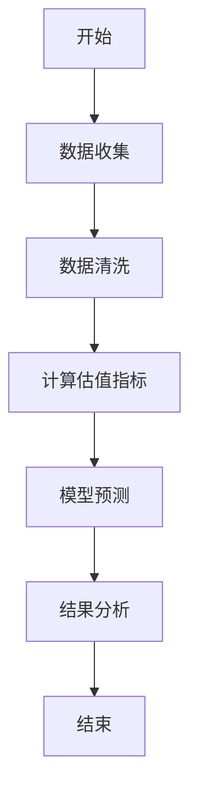
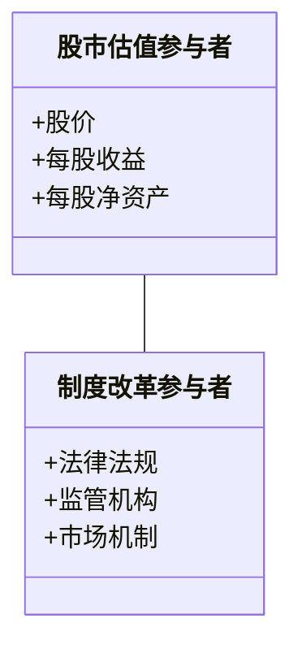
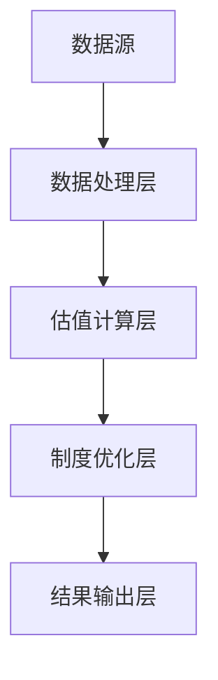
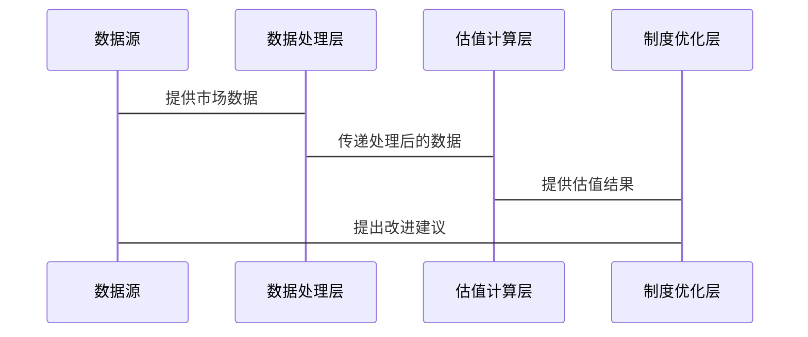

                 


# 新兴市场股市估值与制度改革的互动

## 关键词：新兴市场、股市估值、制度改革、互动关系、算法原理、数学模型

## 摘要：本文探讨新兴市场股市估值与制度改革之间的互动关系，分析如何通过合理的制度改革提升股市估值的准确性，反之，如何通过科学的股市估值推动制度优化。通过系统分析与案例研究，本文提出了一套结合算法与制度的解决方案，为新兴市场的健康发展提供理论支持与实践指导。

---

# 第一部分: 新兴市场股市估值与制度改革的背景与核心概念

## 第1章: 新兴市场股市估值与制度改革的背景

### 1.1 问题背景与问题描述

#### 1.1.1 新兴市场股市的特点与挑战
新兴市场的股市通常具有以下特点：
- 市场波动性大：新兴市场由于经济基础薄弱、政策不稳定，股市波动剧烈。
- 信息不透明：新兴市场公司治理不完善，信息披露机制不健全。
- 投资者结构单一：多数投资者为散户，机构投资者比例较低。

#### 1.1.2 制度改革的必要性与目标
- 制度改革的必要性：
  - 提高市场透明度，增强投资者信心。
  - 优化资源配置，促进经济健康发展。
  - 防范系统性风险，维护市场稳定。
- 制度改革的目标：
  - 建立健全的监管体系。
  - 提高上市公司质量。
  - 完善信息披露机制。

#### 1.1.3 股市估值与制度改革的互动关系
- 制度改革影响股市估值：良好的制度环境可以提升股市估值的准确性和合理性。
- 股市估值反哺制度改革：通过分析股市估值结果，可以发现制度缺陷，推动制度优化。

### 1.2 问题解决与边界

#### 1.2.1 问题解决的核心思路
- 提升市场透明度，优化监管机制。
- 引入科学的估值方法，推动制度优化。

#### 1.2.2 问题的边界与外延
- 本研究仅关注股市估值与制度改革的互动关系，不涉及宏观经济政策。
- 研究范围限定于新兴市场，不包括发达市场。

#### 1.2.3 核心要素与组成结构
- 核心要素：市场透明度、监管机制、投资者结构。
- 组成结构：政府监管、市场机制、投资者行为。

## 第2章: 核心概念与联系

### 2.1 核心概念原理

#### 2.1.1 股市估值的核心原理
- 股市估值是通过对企业基本面的分析，确定其股票的合理价格。
- 常用方法包括市盈率（PE）、市净率（PB）、现金流折现法（DCF）等。

#### 2.1.2 制度改革的核心要素
- 法律法规：《公司法》《证券法》等。
- 监管机构：证监会等。
- 市场机制：信息披露、并购重组等。

#### 2.1.3 互动关系的内在逻辑
- 制度改革通过提高市场透明度，增强投资者信心，从而提升股市估值。
- 股市估值结果为制度优化提供依据，推动制度进一步完善。

### 2.2 核心概念属性对比

| **核心概念** | **属性**               |
|--------------|-----------------------|
| 股市估值     | 方法多样性、结果客观性 |
| 制度改革     | 影响深远性、过程复杂性 |

### 2.3 ER实体关系图
```mermaid
er
  actor 制度改革参与者
  actor 股市估值参与者
  actor 相关利益方
  relation 制度改革影响
  relation 股市估值依赖
  relation 互动关系
```

---

# 第二部分: 股市估值与制度改革的算法与数学模型

## 第3章: 股市估值的算法原理

### 3.1 股市估值算法流程



### 3.2 核心算法代码实现

```python
def calculate_market_valuation(data):
    # 示例代码：计算市盈率和市净率
    data['PE'] = data['股价'] / data['每股收益']
    data['PB'] = data['股价'] / data['每股净资产']
    return data
```

### 3.3 数学模型与公式

#### 市盈率公式
$$ PE = \frac{\text{股价}}{\text{每股收益}} $$

#### 市净率公式
$$ PB = \frac{\text{股价}}{\text{每股净资产}} $$

---

## 第4章: 制度改革的数学模型

### 4.1 制度改革的数学模型

#### 制度改革效果评估公式
$$ \text{制度效果} = \sum_{i=1}^{n} w_i \cdot x_i $$
其中，$w_i$ 是权重，$x_i$ 是指标值。

---

# 第三部分: 系统分析与架构设计方案

## 第5章: 问题场景介绍

### 5.1 问题场景描述
新兴市场股市存在的主要问题包括：
- 信息披露不透明。
- 市场操纵频繁。
- 监管力度不足。

## 第6章: 系统功能设计

### 6.1 领域模型



### 6.2 系统架构设计



### 6.3 系统接口设计

- 输入接口：接受市场数据和制度信息。
- 输出接口：输出估值结果和制度改进建议。

### 6.4 系统交互设计



---

# 第四部分: 项目实战

## 第7章: 环境安装与数据准备

### 7.1 环境安装
- 安装Python、Pandas、Matplotlib等工具。

### 7.2 数据准备
- 获取新兴市场股市数据。
- 数据清洗与预处理。

## 第8章: 核心实现

### 8.1 数据处理代码

```python
import pandas as pd

def data_cleaning(data):
    # 去除缺失值
    data = data.dropna()
    # 处理异常值
    data = data[~(data['股价'].apply(lambda x: x < 0))]
    return data
```

### 8.2 估值计算代码

```python
def calculate_valuation(data):
    data['PE'] = data['股价'] / data['每股收益']
    data['PB'] = data['股价'] / data['每股净资产']
    return data
```

## 第9章: 实际案例分析

### 9.1 案例分析
以某新兴市场为例，分析其股市估值与制度改革的互动关系。

---

# 第五部分: 最佳实践与小结

## 第10章: 最佳实践

### 10.1 经验总结
- 数据质量是估值的基础。
- 制度改革需要长期坚持。

### 10.2 注意事项
- 避免过度依赖单一估值指标。
- 制度改革需考虑市场参与者的利益平衡。

## 第11章: 小结

本文通过系统分析与案例研究，探讨了新兴市场股市估值与制度改革的互动关系，并提出了结合算法与制度的解决方案。未来研究可以进一步优化数学模型，探索更多互动机制。

---

# 作者：AI天才研究院/AI Genius Institute & 禅与计算机程序设计艺术 /Zen And The Art of Computer Programming

