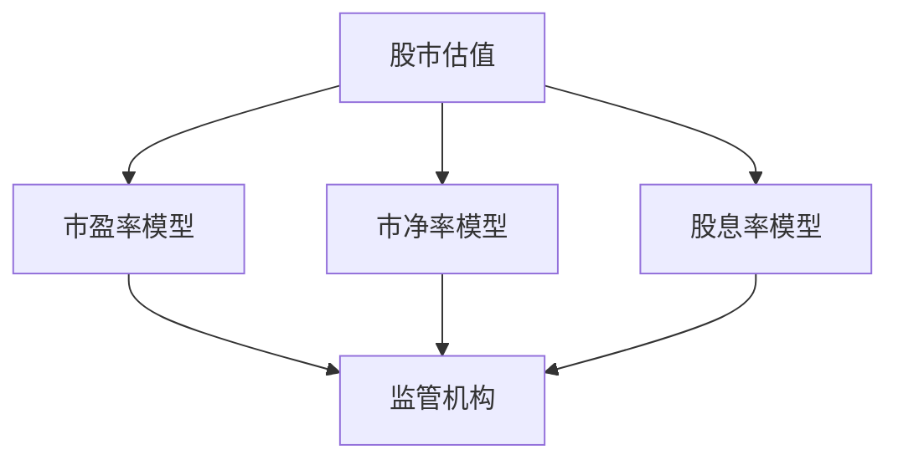
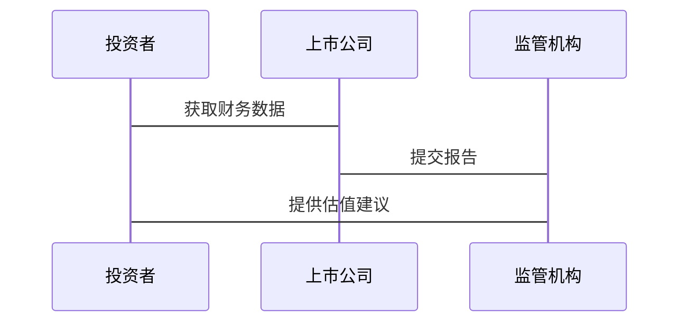

                 


# 新兴市场股市估值与制度改革的相关性

> 关键词：新兴市场，股市估值，制度改革，相关性，金融市场，经济政策

> 摘要：本文探讨了新兴市场股市估值与制度改革的相关性，从背景介绍、核心概念、算法原理、系统分析、项目实战到最佳实践，全面分析了两者之间的关系，并提出了改进建议。通过详细讲解和实际案例分析，本文为读者提供了深入的理解和实践指导。

---

## 第1章：问题背景与研究意义

### 1.1 新兴市场股市的特点

#### 1.1.1 新兴市场的定义与特征
新兴市场是指那些经济增长迅速、但市场机制尚未完全成熟的国家或地区的金融市场。这些市场通常具有以下特征：
- 经济增长快，但波动性较大。
- 市场机制不完善，监管力度不足。
- 投资者结构以散户为主，机构投资者比例较低。

#### 1.1.2 新兴市场股市的独特性
新兴市场股市的独特性主要体现在以下方面：
- 市场流动性较低，交易量不稳定。
- 信息不对称问题严重，投资者获取信息的渠道有限。
- 市场波动较大，容易受到外部经济环境的影响。

### 1.2 股市估值的基本概念

#### 1.2.1 股市估值的定义
股市估值是指通过对上市公司的财务数据、市场环境和宏观经济指标等进行分析，对股票的内在价值进行评估的过程。

#### 1.2.2 股市估值的主要方法
常用的股市估值方法包括：
- 市盈率（P/E）：市盈率=股价/每股收益。
- 市净率（P/B）：市净率=股价/每股净资产。
- 股息率：股息率=每股股息/股价。

### 1.3 制度改革的重要性

#### 1.3.1 制度改革的定义
制度改革是指通过改善市场机制、加强监管力度、优化政策环境等方式，提高市场效率和公平性的过程。

#### 1.3.2 制度改革对股市的影响
制度改革对股市的影响主要体现在以下方面：
- 提高市场透明度，减少信息不对称。
- 增强投资者信心，吸引更多资金流入市场。
- 优化市场结构，促进市场长期健康发展。

### 1.4 研究意义

#### 1.4.1 理论意义
- 探讨新兴市场股市估值与制度改革的相关性，有助于丰富金融市场理论的研究。
- 为制度经济学提供新的研究视角。

#### 1.4.2 实践意义
- 为新兴市场国家提供制度改进建议，促进市场健康发展。
- 为投资者提供更准确的股市估值方法，帮助其做出更明智的投资决策。

---

## 第2章：问题描述与研究目标

### 2.1 新兴市场股市估值的主要问题

#### 2.1.1 信息不对称问题
- 新兴市场信息透明度低，投资者难以获取准确的公司信息。
- 公司管理层与投资者之间的信息不对称导致市场效率下降。

#### 2.1.2 市场波动性大
- 新兴市场股市波动性较大，容易受到外部环境的影响。
- 投资者情绪化交易加剧市场波动。

#### 2.1.3 制度不完善的影响
- 市场监管力度不足，容易出现操纵市场等行为。
- 制度不完善导致投资者信心不足，市场流动性较低。

### 2.2 制度改革与股市估值的关系

#### 2.2.1 制度改革如何影响股市估值
- 制度改革可以提高市场透明度，降低信息不对称，从而提高股市估值的准确性。
- 制度改革可以增强投资者信心，吸引更多资金流入市场，从而提高股市估值。

#### 2.2.2 制度改革对市场效率的作用
- 制度改革可以优化市场结构，提高市场效率。
- 制度改革可以减少市场波动，促进市场长期健康发展。

### 2.3 研究目标

#### 2.3.1 探讨制度与估值的关系
- 探讨制度改革如何影响股市估值。
- 分析制度改革对市场效率的作用。

#### 2.3.2 提出改进建议
- 提出制度改进建议，以提高市场透明度和效率。
- 提供股市估值方法的优化建议。

---

## 第3章：核心概念与联系

### 3.1 核心概念原理

#### 3.1.1 股市估值模型
股市估值模型包括以下几种：
- 市盈率模型：$$ P/E = \frac{股价}{每股收益} $$
- 市净率模型：$$ P/B = \frac{股价}{每股净资产} $$
- 股息率模型：$$ 股息率 = \frac{每股股息}{股价} $$

#### 3.1.2 制度改革措施
制度改革措施包括：
- 完善市场监管体系。
- 提高市场透明度。
- 优化投资者保护机制。

### 3.2 概念属性对比

| 概念         | 属性               | 详细说明                                                                 |
|--------------|--------------------|--------------------------------------------------------------------------|
| 股市估值     | 方法               | 包括市盈率、市净率、股息率等多种方法。                                       |
| 制度改革     | 目标               | 提高市场透明度、增强投资者信心、优化市场结构。                               |

### 3.3 ER实体关系图

```mermaid
er
    项目：市场
    实体：投资者、上市公司、监管机构
    关系：投资者与上市公司之间存在交易关系；上市公司与监管机构之间存在监管关系；投资者与监管机构之间存在监督关系。
```

---

## 第4章：算法原理讲解

### 4.1 算法原理

#### 4.1.1 市盈率模型
市盈率模型的计算公式为：$$ P/E = \frac{股价}{每股收益} $$

#### 4.1.2 市净率模型
市净率模型的计算公式为：$$ P/B = \frac{股价}{每股净资产} $$

#### 4.1.3 股息率模型
股息率模型的计算公式为：$$ 股息率 = \frac{每股股息}{股价} $$

### 4.2 算法流程图

```mermaid
graph TD
    A[开始] -> B[选择估值方法]
    B -> C[市盈率模型]
    C -> D[计算市盈率]
    D -> E[判断市盈率是否合理]
    E -> F[合理，结束]
    E -> G[不合理，调整参数]
    G -> B[重新选择估值方法]
```

---

## 第5章：系统分析与架构设计方案

### 5.1 问题场景介绍

#### 5.1.1 问题背景
新兴市场股市估值与制度改革的相关性研究需要构建一个分析框架，以便更好地理解两者之间的关系。

#### 5.1.2 项目介绍
本项目旨在通过分析新兴市场股市估值与制度改革的相关性，提出改进建议。

### 5.2 系统功能设计

#### 5.2.1 领域模型
领域模型包括以下部分：
- 股市估值模块：包括市盈率、市净率、股息率等估值方法。
- 制度改革模块：包括监管体系、透明度、投资者保护等改革措施。

#### 5.2.2 系统架构设计



### 5.3 系统接口设计

#### 5.3.1 接口描述
- 输入：股票代码、财务数据、市场数据。
- 输出：股票估值、制度改进建议。

#### 5.3.2 系统交互流程图



---

## 第6章：项目实战

### 6.1 环境安装

#### 6.1.1 安装Python
安装Python 3.x版本，确保环境配置正确。

#### 6.1.2 安装相关库
安装必要的库，如pandas、numpy、scipy等。

### 6.2 核心实现

#### 6.2.1 数据收集
收集新兴市场股市数据，包括股票价格、财务数据等。

#### 6.2.2 数据处理
使用pandas对数据进行清洗和处理。

#### 6.2.3 模型实现
实现市盈率、市净率等估值模型。

### 6.3 代码解读与分析

#### 6.3.1 Python代码示例
```python
import pandas as pd

# 数据加载
data = pd.read_csv('data.csv')

# 市盈率计算
data['PE'] = data['股价'] / data['每股收益']

# 市净率计算
data['PB'] = data['股价'] / data['每股净资产']

# 股息率计算
data['股息率'] = data['每股股息'] / data['股价']
```

#### 6.3.2 代码解读
上述代码展示了如何使用Python进行股市估值计算，包括市盈率、市净率和股息率的计算。

### 6.4 案例分析

#### 6.4.1 案例背景
以某新兴市场为例，分析其股市估值与制度改革的相关性。

#### 6.4.2 数据分析
通过对该市场数据的分析，得出制度改进建议。

### 6.5 项目小结
总结项目实现过程中的关键点和经验教训。

---

## 第7章：结论与建议

### 7.1 研究发现

#### 7.1.1 制度改革对股市估值的影响
制度改革可以提高市场透明度，降低信息不对称，从而提高股市估值的准确性。

#### 7.1.2 制度改革对市场效率的作用
制度改革可以优化市场结构，减少市场波动，促进市场长期健康发展。

### 7.2 政策建议

#### 7.2.1 提高市场透明度
- 加强信息披露监管，确保信息真实、准确、及时。
- 建立统一的信息披露标准，提高信息可比性。

#### 7.2.2 优化投资者保护机制
- 加强投资者教育，提高投资者风险意识。
- 建立投资者保护基金，保护中小投资者利益。

### 7.3 小结
总结全文，重申研究发现和政策建议。

### 7.4 注意事项
- 数据收集和处理过程中要注意数据的准确性和完整性。
- 模型应用时要结合实际情况，避免机械套用。

### 7.5 拓展阅读
推荐相关书籍和文献，供读者进一步阅读。

---

## 作者：AI天才研究院/AI Genius Institute & 禅与计算机程序设计艺术 /Zen And The Art of Computer Programming

---

以上是《新兴市场股市估值与制度改革的相关性》的目录大纲和具体内容的详细说明。

