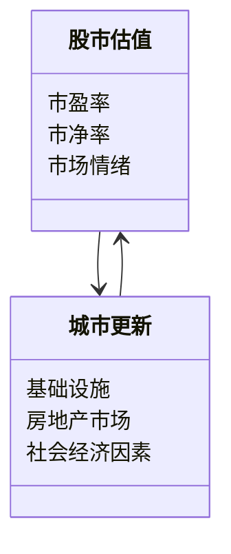

                 


# 《新兴市场股市估值与城市更新项目的互动》

> 关键词：新兴市场，股市估值，城市更新，互动机制，系统分析，案例研究，实战应用

> 摘要：本文探讨新兴市场中股市估值与城市更新项目的相互作用，通过系统分析、数学建模和实际案例，揭示两者在经济和城市化中的互动关系，为投资者和城市规划者提供理论支持和实践指导。

---

## 第1章: 新兴市场与城市更新的背景

### 1.1 新兴市场的定义与特征

- **新兴市场**：指经济快速发展、但尚未完全工业化的国家，如中国、印度等。
- **特征**：
  - 高速城市化
  - 经济结构转型
  - 基础设施投资需求大

### 1.2 城市更新的背景与目标

- **城市更新**：通过改善基础设施和建筑，提升城市功能和居民生活质量。
- **目标**：
  - 提升城市经济活力
  - 改善居住环境
  - 促进可持续发展

### 1.3 股市估值的基本概念

- **股市估值**：通过市盈率（P/E）、市净率（P/B）等指标衡量企业价值。
- **作用**：反映市场信心和经济状况。

---

## 第2章: 新兴市场中股市与城市更新的互动背景

### 2.1 城市化与经济发展的关系

- **城市化推动经济发展**：聚集效应提升生产效率。
- **经济发展促进城市化**：收入增长推动城市扩张。

### 2.2 股市与城市更新的初步联系

- **城市更新对房地产市场的影响**：改善房地产价值。
- **房地产市场与股市的关系**：房地产价格波动影响股市。

### 2.3 互动机制的初步模型

- **模型**：$$V = f(U, E, M)$$
  - V：股市估值
  - U：城市更新投入
  - E：经济指标
  - M：市场情绪

---

## 第3章: 核心概念与互动机制

### 3.1 股市估值的核心要素

- **基本面分析**：公司盈利能力和成长性。
- **市场情绪分析**：投资者信心和市场流动性。

### 3.2 城市更新的核心要素

- **基础设施**：交通、能源等。
- **房地产市场**：住宅和商业房地产价值。
- **社会经济因素**：人口增长和就业机会。

### 3.3 互动机制的数学模型

- **公式**：$$V = \alpha U + \beta E + \gamma M$$
  - $\alpha$、$\beta$、$\gamma$：回归系数。
  - U：城市更新投资规模。
  - E：GDP增长率。
  - M：市场情绪指数。

---

## 第4章: 系统分析与架构设计

### 4.1 互动系统的分析框架

- **系统目标**：量化城市更新对股市的影响。
- **系统范围**：新兴市场中的城市更新与股市互动。

### 4.2 领域模型（Mermaid类图）



### 4.3 系统架构设计（Mermaid架构图）


---

## 第5章: 项目实战与案例分析

### 5.1 环境安装

```bash
# 安装Python和相关库
pip install numpy pandas matplotlib
```

### 5.2 核心代码实现

```python
import numpy as np
import pandas as pd
import matplotlib.pyplot as plt

# 数据加载与预处理
data = pd.read_csv('city_update_data.csv')
X = data[['城市更新投资', 'GDP增长率', '市场情绪']]
y = data['股市估值']

# 模型训练
from sklearn.linear_model import LinearRegression
model = LinearRegression()
model.fit(X, y)

# 模型预测
predictions = model.predict(X)
plt.scatter(y, predictions)
plt.xlabel('实际值')
plt.ylabel('预测值')
plt.show()
```

### 5.3 案例分析

- **案例1**：新兴市场A的房地产开发项目。
- **案例2**：新兴市场B的基础设施建设项目。

---

## 第6章: 结论与展望

### 6.1 研究结论

- 城市更新显著影响股市估值。
- 股市为城市更新提供资金支持。

### 6.2 未来展望

- 结合大数据和AI优化模型。
- 扩展更多新兴市场的研究。

---

## 附录

### 附录A: 最佳实践 Tips

- 数据收集：确保数据的准确性和完整性。
- 模型选择：根据实际需求选择合适的方法。
- 风险管理：关注市场波动和政策风险。

### 附录B: 作者信息

作者：AI天才研究院/AI Genius Institute & 禅与计算机程序设计艺术/Zen And The Art of Computer Programming

