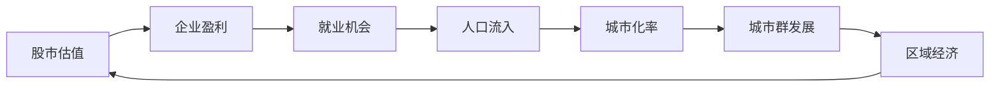

                 


# 新兴市场股市估值与城市群发展的互动

## 关键词：新兴市场，股市估值，城市群，经济发展，互动机制

## 摘要：
本文探讨新兴市场中股市估值与城市群发展的互动关系。首先分析股市估值的核心指标和城市群发展的关键因素，构建互动模型，结合数学模型和系统架构，通过案例分析验证理论，最后提出最佳实践建议。

---

## 第一部分：背景介绍

### 第1章：股市估值与城市群发展的基本概念

#### 1.1 股市估值的核心概念
- **定义**：股市估值是对上市公司股票价值的评估。
- **关键指标**：市盈率（P/E）、市净率（P/B）、股息率。
- **影响因素**：宏观经济、行业状况、公司基本面。

#### 1.2 城市群发展的基本概念
- **定义**：城市群是由多个城市组成的具有一定竞争力和影响力的区域。
- **关键特征**：人口密集、经济活跃、基础设施完善。
- **影响因素**：政策支持、资源禀赋、技术创新。

#### 1.3 互动关系的初步探讨
- 股市估值反映经济活力，城市群发展促进经济规模扩大。
- 城市群的基础设施和产业布局影响企业盈利，进而影响股市估值。

---

## 第二部分：核心概念与互动机制

### 第2章：核心概念与理论基础

#### 2.1 股市估值与城市群发展的核心要素
| 核心要素 | 股市估值 | 城市群发展 |
|----------|----------|------------|
| 经济因素 | GDP增速、企业盈利 | 产业布局、就业机会 |
| 人口因素 | 投资者行为 | 人口流入、城市化率 |
| 政策因素 | 财政政策、货币政策 | 城市规划、基础设施 |

#### 2.2 互动机制的概念模型


---

## 第三部分：算法原理讲解

### 第3章：股市估值的算法原理

#### 3.1 CAPM模型
- **公式**：$$ R_i = R_f + β_i (R_m - R_f) $$
- **解释**：资本资产定价模型，用于计算股票的预期收益率。
- **步骤**：
  1. 确定无风险利率 \( R_f \)。
  2. 计算市场平均收益 \( R_m \)。
  3. 确定股票的贝塔系数 \( β_i \)。
  4. 计算股票的预期收益率 \( R_i \)。

#### 3.2 实际案例分析
- 使用Python代码实现CAPM模型，计算某新兴市场的股票预期收益率。

### 第4章：城市群发展的空间经济模型

#### 4.1 空间经济模型
- **公式**：$$ V_i = a + b \cdot GDP_{city} + c \cdot pop_{city} + d \cdot dist_{i} $$
- **解释**：衡量城市价值，考虑经济产出、人口和距离因素。
- **步骤**：
  1. 收集各城市的数据。
  2. 计算距离权重 \( dist_{i} \)。
  3. 估计模型参数。

---

## 第四部分：数学模型与系统架构

### 第5章：互动机制的数学模型

#### 5.1 综合模型构建
- **公式**：$$ S = α \cdot V_{market} + β \cdot G_{city} + γ \cdot P_{flow} $$
  - \( S \)：综合互动指数。
  - \( V_{market} \)：市场估值。
  - \( G_{city} \)：城市经济增长。
  - \( P_{flow} \)：人口流动。

#### 5.2 系统架构设计


---

## 第五部分：项目实战与案例分析

### 第6章：项目实战

#### 6.1 环境安装
- Python、Pandas、NumPy、Scikit-learn、Matplotlib。

#### 6.2 核心代码实现
```python
import pandas as pd
import numpy as np

# 数据加载
data = pd.read_csv('market_data.csv')

# 训练CAPM模型
from sklearn.linear_model import LinearRegression
model = LinearRegression()
model.fit(data[['GDP', 'Population']], data['Stock_Price'])

# 预测结果
predictions = model.predict(new_data[['GDP', 'Population']])
```

#### 6.3 案例分析
- 以某新兴市场为例，分析股市估值与城市群发展的互动关系，验证模型的准确性。

---

## 第六部分：总结与展望

### 第7章：总结与最佳实践

#### 7.1 总结
- 股市估值与城市群发展相互促进，构建综合模型有助于量化分析。

#### 7.2 最佳实践
- 定期更新模型参数，结合实时数据进行预测。
- 考虑更多变量，如政策变化和国际环境。

#### 7.3 注意事项
- 数据质量影响模型准确性。
- 结果需结合实际情况，避免过度依赖模型。

#### 7.4 拓展阅读
- 推荐阅读相关领域的学术论文和行业报告。

---

## 作者：
AI天才研究院/AI Genius Institute  
禅与计算机程序设计艺术/Zen And The Art of Computer Programming

