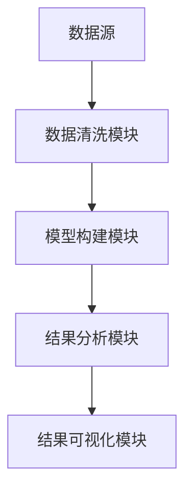

                 

# 新兴市场股市估值与基础设施投资的关联

## 关键词：新兴市场、股市估值、基础设施投资、经济影响、投资策略

## 摘要：本文探讨新兴市场中股市估值与基础设施投资之间的关联，分析基础设施投资如何影响股市估值，以及两者之间的互动机制。通过数学模型和案例分析，揭示基础设施投资对股市估值的直接和间接影响，并提出投资策略建议。

---

## 第一部分：新兴市场股市估值与基础设施投资的关联概述

### 第1章：新兴市场的定义与特点

#### 1.1 新兴市场的定义
新兴市场是指那些经济快速增长、但尚未完全发达的国家或地区，包括中国、印度、东南亚国家等。这些市场具有较高的增长潜力，但也伴随着较高的风险。

#### 1.2 新兴市场的经济特征
- 经济结构多元化，但以制造业和服务业为主。
- 人口年轻，消费市场潜力巨大。
- 政府投资在基础设施和教育方面的力度较大。

#### 1.3 新兴市场的股市特点
- 市场波动性较大。
- 市值增长迅速，但估值可能偏高。
- 投资者结构多元化，包括散户和机构投资者。

#### 1.4 新兴市场的基础设施现状
- 基础设施投资需求旺盛。
- 政府和社会资本合作（PPP）模式逐渐普及。
- 基础设施投资对经济增长的推动作用显著。

---

### 第2章：股市估值的基本概念

#### 2.1 股市估值的定义
股市估值是指对上市公司股票价格进行合理评估的过程，通常基于公司基本面、市场情绪和宏观经济指标。

#### 2.2 股市估值的主要方法
- 市盈率（P/E）：市价与每股收益的比率。
- 市净率（P/B）：市价与每股净资产的比率。
- 股息率：股息与股价的比率。

#### 2.3 影响股市估值的主要因素
- 公司盈利能力。
- 宏观经济环境。
- 市场情绪。
- 政策因素。

#### 2.4 新兴市场股市估值的特殊性
- 波动性大，容易受外部因素影响。
- 市场参与者结构不均衡，散户占比高。
- 政策变化对估值影响显著。

---

### 第3章：基础设施投资的基本概念

#### 3.1 基础设施投资的定义
基础设施投资是指对交通、能源、通信等公共设施的投资，通常由政府或社会资本合作完成。

#### 3.2 基础设施投资的主要领域
- 交通：公路、铁路、机场。
- 能源：电力、天然气管道。
- 通信：互联网、数据中心。
- 水利：供水、污水处理。

#### 3.3 基础设施投资的影响因素
- 经济发展水平。
- 政府财政能力。
- 私人资本参与度。

#### 3.4 新兴市场基础设施投资的特点
- 投资需求大，但资金缺口显著。
- 政府主导，但社会资本逐渐增加。
- 投资周期长，回报见效慢。

---

## 第二部分：新兴市场股市估值与基础设施投资的关联机制

### 第4章：新兴市场股市估值与基础设施投资的关联分析

#### 4.1 经济增长与股市估值的关系
经济增长是股市估值的基础。当经济快速增长时，企业盈利增加，股市估值上升。

#### 4.2 基础设施投资对经济增长的促进作用
基础设施投资通过改善物流、降低企业成本、提升效率，促进经济增长。

#### 4.3 基础设施投资对股市估值的直接影响
- 基础设施投资增加企业盈利，提升股价。
- 基础设施投资改善市场预期，吸引更多资金流入股市。

#### 4.4 基础设施投资对股市估值的间接影响
- 基础设施投资推动相关行业（如建筑、材料）发展，带动整体股市表现。
- 基础设施投资提升国家信用评级，降低融资成本，间接利好股市。

---

### 第5章：新兴市场中基础设施投资与股市估值的互动关系

#### 5.1 基础设施投资对股市估值的长期影响
长期来看，基础设施投资是股市估值的稳定器，通过持续推动经济增长，支撑股市长期向好。

#### 5.2 股市估值对基础设施投资的反馈作用
股市估值的上升会吸引更多资本进入基础设施领域，形成正反馈。

#### 5.3 基础设施投资与股市估值的协同效应
基础设施投资与股市估值相互促进，形成良性循环。

#### 5.4 基础设施投资与股市估值的动态平衡
在新兴市场，基础设施投资和股市估值的动态平衡需要政策引导和市场机制的共同作用。

---

### 第6章：新兴市场中基础设施投资与股市估值的关联模型

#### 6.1 模型构建的基本思路
通过回归分析，建立基础设施投资与股市估值之间的量化关系。

#### 6.2 模型的变量选择
- 自变量：基础设施投资指数。
- 因变量：股市估值指数（如市盈率）。
- 控制变量：GDP增长率、通货膨胀率、政策变量。

#### 6.3 模型的假设条件
- 数据可得性：选择具有代表性的新兴市场国家数据。
- 时间跨度：至少5年以上的面板数据。

#### 6.4 模型的数学表达
$$ Y = \beta_0 + \beta_1 X_1 + \beta_2 X_2 + \epsilon $$
其中，$Y$ 表示股市估值指数，$X_1$ 表示基础设施投资指数，$X_2$ 表示控制变量，$\epsilon$ 表示误差项。

---

## 第三部分：新兴市场中基础设施投资与股市估值的系统分析

### 第7章：新兴市场中基础设施投资与股市估值的系统架构

#### 7.1 系统架构的总体设计
- 数据采集：收集新兴市场的基础设施投资和股市估值数据。
- 模型构建：建立基础设施投资与股市估值的回归模型。
- 结果分析：验证模型的显著性和合理性。

#### 7.2 系统功能模块划分
- 数据清洗模块：处理缺失值和异常值。
- 模型构建模块：实现回归分析。
- 结果可视化模块：生成图表展示结果。

#### 7.3 系统数据流图

---

### 第8章：新兴市场中基础设施投资与股市估值的系统实现

#### 8.1 数据采集与处理
使用Python的Pandas库清洗数据，处理缺失值和异常值。

#### 8.2 模型实现
使用-statsmodels库建立回归模型，并输出回归系数和显著性检验结果。

#### 8.3 系统测试与优化
通过交叉验证和网格搜索优化模型参数。

#### 8.4 系统部署与应用
将模型部署到在线平台，供投资者实时查询基础设施投资与股市估值的关系。

---

## 第四部分：新兴市场中基础设施投资与股市估值的案例分析

### 第9章：新兴市场中基础设施投资与股市估值的典型案例

#### 9.1 中国基础设施投资与股市估值的案例
- 中国基础设施投资巨大，推动了股市估值的长期上升。
- 例如，高铁建设和5G网络投资对相关行业股票有显著提振作用。

#### 9.2 印度基础设施投资与股市估值的案例
- 印度政府加大基础设施投资，推动股市估值上升。
- 公路和港口建设项目对建筑板块股票有明显带动作用。

#### 9.3 东南亚国家基础设施投资与股市估值的案例
- 新加坡和马来西亚通过基础设施投资吸引外资，推动股市估值上升。
- 电力和通信基础设施投资对相关行业股票有显著影响。

---

## 第五部分：总结与展望

### 第10章：总结与展望

#### 10.1 总结
本文分析了新兴市场中基础设施投资与股市估值的关联机制，提出了数学模型和案例分析，揭示了两者之间的互动关系。

#### 10.2 展望
未来研究可以进一步探索基础设施投资对股市估值的区域差异、行业差异以及政策影响。

---

## 作者：AI天才研究院/AI Genius Institute & 禅与计算机程序设计艺术 /Zen And The Art of Computer Programming

